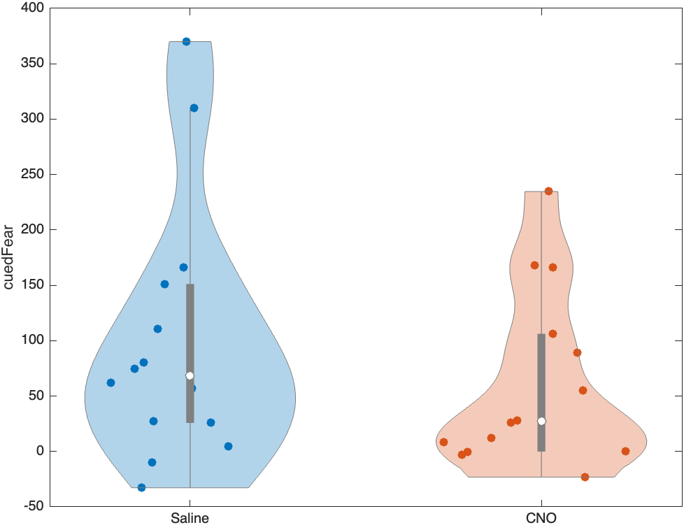

# Francesconi et al (2025) Tutorial: Getting Started

This is a tutorial to view the electrophysiology and behavioral data which relates to:

> Francesconi W, Olivera-Pasilio V, Berton F, Olson SL, Chudoba R, Monroy LM, Krabichler Q, Grinvech V, Dabrowska J (2025). Vasopressin and oxytocin excite BNST neurons via oxytocin receptors, which reduce anxious arousal. *Cell Reports* **44**(6): 115768. DOI: [10.1016/j.celrep.2025.115768](https://doi.org/10.1016/j.celrep.2025.115768).

> Francesconi W, Olivera-Pasilio V, Berton F, Olson SL, Chudoba R, Monroy LM, Krabichler Q, Grinvech V, Dabrowska J (2025). Dataset: vasopressin and oxytocin excite BNST neurons via oxytocin receptors, which reduce anxious arousal. *NDI Cloud*. DOI: [10.63884/ndic.2025.jyxfer8m](https://doi.org/10.63884/ndic.2025.jyxfer8m).

<a href="./src/ndi/docs/NDI-matlab/tutorials/datasets/Francesconi_et_al_2025/1_getting_started.md" download>Click here to download this tutorial in MATLAB</a>

## Table of Contents
1. [Download NDI](#NDI)
2. [Import the NDI dataset](#import)
	- [Download or load the NDI dataset](#dataset)
	- [Retrieve the NDI session](#session)
3. [View subjects, probes and epochs](#metadata)
	- [View subject summary table](#subjects)
        - [Filter subjects](#filterSubjects)
    - [View probe and epoch summary tables](#probes)
    - [Combine metadata tables](#combine)
        - [Filter epochs](#filterEpochs)
4. [Plot electrophysiology data](#electrophysiology)
5. [Plot Elevated Plus Maze data](#EPM)
6. [Plot Fear-Potentiated Startle data](#FPS)

## Download NDI <a name="NDI"></a>
In order to view the dataset, you will need access to the NDI platform. If you haven't already downloaded NDI, follow the [installation instructions](https://vh-lab.github.io/NDI-matlab/NDI-matlab/installation/) to download NDI and gain access to the suite of tools we have created! You can find more information and tutorials on the [NDI website](https://vh-lab.github.io/NDI-matlab/NDI-matlab/).

## Import the NDI dataset <a name="import"></a>
Define the dataset path and id.

*Type this into MATLAB:*
```matlab
% Choose the folder where the dataset is (or will be) stored
% (e.g. /Users/myusername/Documents/MATLAB/Datasets)
dataPath = [userpath filesep 'Datasets'];
cloudDatasetId = '67f723d574f5f79c6062389d';
datasetPath = fullfile(dataPath,cloudDatasetId);
```

### Download or load the NDI dataset <a name="dataset"></a>
The first time you try to access the data, it needs to be downloaded from NDI-cloud. This may take a few minutes. Once you have the **dataset** downloaded, every other time you examine the data you can just load it.

*Type this into MATLAB:*
```matlab
if isfolder(datasetPath)
    % Load if already downloaded
    dataset = ndi.dataset.dir(datasetPath);
else
    % Download
    if ~isfolder(dataPath), mkdir(dataPath); end
    dataset = ndi.cloud.downloadDataset(cloudDatasetId,dataPath);
end
```

### Retrieve the NDI session <a name="session"></a>
A dataset can have multiple **sessions**, but this **dataset** has only one. We must retrieve it in order to access the accompanying experimental **probes** (i.e. a virtual or physical instrument that makes a measurement of or produces a stimulus for a **subject**).

*Type this into MATLAB:*
```matlab
% Retrieve the session from this dataset
[session_ref_list,session_list] = dataset.session_list();
session = dataset.open_session(session_list{1});
```

## View subjects, probes and epochs <a name="metadata"></a>

### View subject summary table <a name="subjects"></a>
Each individual animal is referred to as a **subject** and has a unique alphanumeric `SubjectDocumentIdentifier` along with a `SubjectLocalIdentifier` which contains references to the animal's strain, species, genotype, experiment date, and cell type. Our database contains documents which store metadata about each subject including their species, strain, genetic strain type, and biological sex which are linked to well-defined ontologies such as [NCBI](https://www.ncbi.nlm.nih.gov/Taxonomy/Browser/wwwtax.cgi?mode=Info&id=10116&lvl=3&lin=f&keep=1&srchmode=1&unlock), [RRID](https://rgd.mcw.edu/rgdweb/report/strain/main.html?id=13508588), [PATO](https://www.ebi.ac.uk/ols4/ontologies/pato/classes/http%253A%252F%252Fpurl.obolibrary.org%252Fobo%252FPATO_0000384), and [UBERON](https://www.ebi.ac.uk/ols4/ontologies/uberon/classes/http%253A%252F%252Fpurl.obolibrary.org%252Fobo%252FUBERON_0001880). Additionally, metadata about any **treatments** that a **subject** received such as the location of optogenetic stimulation are stored. A summary table showing the metadata for each **subject**) can be viewed below.

*Type this into MATLAB:*
```matlab
% View summary table of all subject metadata
subjectSummary = ndi.fun.docTable.subject(dataset)
```

*You will see a table that looks like:*

| SubjectDocumentIdentifier | SubjectLocalIdentifier | StrainName | StrainOntology | BackgroundStrainName | BackgroundStrainOntology | GeneticStrainTypeName | SpeciesName | SpeciesOntology | BiologicalSexName | BiologicalSexOntology | OptogeneticTetanusStimulationTargetLocationName | OptogeneticTetanusStimulationTargetLocationOntology |
| :--- | :--- | :--- | :--- | :--- | :--- | :--- | :--- | :--- | :--- | :--- | :--- | :--- |
| 412693bb0b2a75c8_c0dc4139300a673e | `wi_rat_CRFCre_210818_BNST@dabrowska-lab.rosalindfranklin.edu` | CRF-Cre | | WI | RRID:RGD_13508588 | knockin | Rattus norvegicus | NCBITaxon:10116 | male | PATO:0000384 | | |
| 412693bb0b2b7e0f_40d1f45f9e51dc8b | `sd_rat_OTRCre_220214_BNST@dabrowska-lab.rosalindfranklin.edu` | OTR-IRES-Cre | | SD | RRID:RGD_70508 | knockin | Rattus norvegicus | NCBITaxon:10116 | male | PATO:0000384 | | |
| 412693bb0b2cf772_c0d06cadbb168eb5 | `sd_rat_WT_210401_BNSTIII@dabrowska-lab.rosalindfranklin.edu` | SD | RRID:RGD_70508 | | | wildtype | Rattus norvegicus | NCBITaxon:10116 | male | PATO:0000384 | | |
| 412693bb0b344f5e_c0d0f30bef37dab8 | `sd_rat_AVPCre_240425_BNSTI_PVN@dabrowska-lab.rosalindfranklin.edu` | AVP-Cre | | SD | RRID:RGD_70508 | knockin | Rattus norvegicus | NCBITaxon:10116 | male | PATO:0000384 | paraventricular nucleus of hypothalamus | UBERON:0001930 |
| 412693bb0b359d16_40d3e5ebc2d9a521 | `sd_rat_AVPCre_221202_BNSTIII_SCN@dabrowska-lab.rosalindfranklin.edu` |  AVP-Cre| | SD | RRID:RGD_70508 | knockin | Rattus norvegicus | NCBITaxon:10116 | male | PATO:0000384 | suprachiasmatic nucleus | UBERON:0002034 |
| 412693bb0b367f65_c0c1ae36954547f5 | `sd_rat_AVPCre_221205_BNSTI_SON@dabrowska-lab.rosalindfranklin.edu` | AVP-Cre | | SD | RRID:RGD_70508 | knockin | Rattus norvegicus | NCBITaxon:10116 | male | PATO:0000384 | supraoptic nucleus | UBERON:0001929 |
| 412693bb0ebeaa0d_c09caf14c3d790a7 | `sd_rat_OTRCre_220819_175@dabrowska-lab.rosalindfranklin.edu` | OTR-IRES-Cre | | SD | RRID:RGD_70508 | knockin | Rattus norvegicus | NCBITaxon:10116 | male | PATO:0000384 | | |

#### Filter subjects <a name="filterSubjects"></a>
We have created tools to filter a table by its values. Try finding **subjects** matching a given criterion.

Examples:

| columnName | dataValue |
| :--- | :--- |
| StrainName | AVP-Cre |
| StrainName | SD |

*Type this into MATLAB:*
```matlab
% Search for subjects
columnName = 'StrainName'; % select a column name from the subjectSummary table
dataValue = 'AVP-Cre'; % select a value to search for
rowInd = ndi.fun.table.identifyMatchingRows(subjectSummary,...
    columnName,dataValue,'stringMatch','contains');
filteredSubjects = subjectSummary(rowInd,:)
```

### View probe and epoch summary tables <a name="probes"></a>
In the NDI framework, a **probe** is an instrument that makes a measurement of or produces a stimulus for a **subject**. Probes are part of a broader class of experiment items that we term **elements**. In these experiments, there are 3 probe types:
1. stimulator
2. patch-Vm
3. patch-I
Each subject is linked to a unique set of probes. The **stimulator** probe is connected to any information about stimuli that the subject received such as electrophysiological bath conditions or experimental approaches (e.g. optogenetic tetanus). The **patch-Vm** and **patch-I** are probes of type **mfdaq** (multifunction data acquisition system) which means that they contain data linked to an acquisition system that stored measurements (i.e. voltage and current) for a set of experimental **epochs**. Each **epoch** corresponds to one of the original `.mat` files.

*Type this into MATLAB:*
```matlab
% View summary table of all probe metadata
probeSummary = ndi.fun.docTable.probe(dataset)
```

*You will see a table that looks like:*

| SubjectDocumentIdentifier | ProbeDocumentIdentifier | ProbeName | ProbeType | ProbeReference | ProbeLocationName | ProbeLocationOntology | CellTypeName | CellTypeOntology |
| :--- | :--- | :--- | :--- | :--- | :--- | :--- | :--- | :--- |
| 412693bb0b2cf772_c0d06cadbb168eb5 | 412693bb0bf98cde_40ce5a2a60a82dd2 | bath_210401_BNSTIII_a | stimulator | [1] | | | | |
| 412693bb0b2cf772_c0d06cadbb168eb5 | 412693bb0bf99bbe_c0cb88b37570afba | Vm_210401_BNSTIII_a | patch-Vm | [1] | bed nucleus of stria terminalis (BNST) | UBERON:0001880 | Type III BNST neuron | EMPTY:00000170 |
| 412693bb0b2cf772_c0d06cadbb168eb5 | 412693bb0bf9aa56_40ca24db9ac1470d | I_210401_BNSTIII_a | patch-I | [1] | bed nucleus of stria terminalis (BNST) | UBERON:0001880 | Type III BNST neuron | EMPTY:00000170 |

*Type this into MATLAB:*
```matlab
% View summary table of all epoch metadata for each probe
epochSummary = ndi.fun.docTable.epoch(session) % this will take several minutes
```

*You will see a table that looks like:*

| EpochNumber | EpochDocumentIdentifier | ProbeDocumentIdentifier | SubjectDocumentIdentifier | local_t0 | local_t1 | global_t0 | global_t1 | MixtureName | MixtureOntology | ApproachName | ApproachOntology |
| :--- | :--- | :--- | :--- | :--- | :--- | :--- | :--- | :--- | :--- | :--- | :--- |
| 1 | epoch_412693bb00b3b7b2_4087375d5b7ef613 | 412693bb0bf4b173_40d91734313482e2 | 412693bb0b2a75c8_c0dc4139300a673e | 0 | 76.9805 | 18-Aug-2021 15:29:59 | 18-Aug-2021 15:31:16 | arginine-vasopressin | NCIm:C1098706 | | |
| 2 | epoch_412693bb00b3b844_c0da15457eb12ac4 | 412693bb0bf4b173_40d91734313482e2 | 412693bb0b2a75c8_c0dc4139300a673e | 0 | 76.9388 | 18-Aug-2021 15:31:25 | 18-Aug-2021 15:32:42 | arginine-vasopressin | NCIm:C1098706 | | |
| 3 | epoch_412693bb00b3b88e_c0d9cb8072143524 | 412693bb0bf4b173_40d91734313482e2 | 412693bb0b2a75c8_c0dc4139300a673e | 0 | 76.9419 | 18-Aug-2021 15:32:50 | 18-Aug-2021 15:34:07 | arginine-vasopressin | NCIm:C1098706 | | |
| 4 | epoch_412693bb00b3b8cb_40d23dd40a9bc8c5 | 412693bb0bf4b173_40d91734313482e2 | 412693bb0b2a75c8_c0dc4139300a673e | 0 | 76.9453 | 18-Aug-2021 15:43:48 | 18-Aug-2021 15:45:05 | sodium chloride,potassium chloride,sodium bicarbonate,sodium phosphate, monobasic, anhydrous,calcium chloride dihydrate,D-glucose,magnesium chloride hexahydrate,pH,carbogen,osm | NCIm:C0037494,NCIm:C0032825,NCIm:C0074722,NCIm:C1165377,CHEBI:86158,NCIm:C0017725,NCIm:C0724622,NCIm:C4048290,NCIm:CL1445492,NCIm:C0439186 | | |
| 5 | epoch_412693bb00b3b902_c0a16ccb923181df | 412693bb0bf4b173_40d91734313482e2 | 412693bb0b2a75c8_c0dc4139300a673e | 0 | 76.9333 | 18-Aug-2021 15:22:55 | 18-Aug-2021 15:24:12 | sodium chloride,potassium chloride,sodium bicarbonate,sodium phosphate, monobasic, anhydrous,calcium chloride dihydrate,D-glucose,magnesium chloride hexahydrate,pH,carbogen,osm | NCIm:C0037494,NCIm:C0032825,NCIm:C0074722,NCIm:C1165377,CHEBI:86158,NCIm:C0017725,NCIm:C0724622,NCIm:C4048290,NCIm:CL1445492,NCIm:C0439186 | | |
| 6 | epoch_412693bb00b3b93f_c0d772aceb6a808d | 412693bb0bf4b173_40d91734313482e2 | 412693bb0b2a75c8_c0dc4139300a673e | 0 | 76.9298 | 18-Aug-2021 15:24:17 | 18-Aug-2021 15:25:34 | sodium chloride,potassium chloride,sodium bicarbonate,sodium phosphate, monobasic, anhydrous,calcium chloride dihydrate,D-glucose,magnesium chloride hexahydrate,pH,carbogen,osm | NCIm:C0037494,NCIm:C0032825,NCIm:C0074722,NCIm:C1165377,CHEBI:86158,NCIm:C0017725,NCIm:C0724622,NCIm:C4048290,NCIm:CL1445492,NCIm:C0439186 | | |
| 7 | epoch_412693bb00b3b974_c0d54f2d1e92c305 | 412693bb0bf4b173_40d91734313482e2 | 412693bb0b2a75c8_c0dc4139300a673e | 0 | 76.9375 | 18-Aug-2021 15:25:43 | 18-Aug-2021 15:27:00 | sodium chloride,potassium chloride,sodium bicarbonate,sodium phosphate, monobasic, anhydrous,calcium chloride dihydrate,D-glucose,magnesium chloride hexahydrate,pH,carbogen,osm | NCIm:C0037494,NCIm:C0032825,NCIm:C0074722,NCIm:C1165377,CHEBI:86158,NCIm:C0017725,NCIm:C0724622,NCIm:C4048290,NCIm:CL1445492,NCIm:C0439186 | | |

### Combine metadata tables <a name="combine"></a>
Let's combine all metadata so that there is one row per **epoch**.

*Type this into MATLAB:*
```matlab
% Combine all metadata into one table
combinedSummary = ndi.fun.table.join({subjectSummary,probeSummary,epochSummary},...
    'uniqueVariables','EpochDocumentIdentifier');
combinedSummary = ndi.fun.table.moveColumnsLeft(combinedSummary,...
    {'SubjectLocalIdentifier','EpochNumber'})
```

*You will see a table that looks like:*

| SubjectLocalIdentifier | EpochNumber | EpochDocumentIdentifier | SubjectDocumentIdentifier | SpeciesName | SpeciesOntology | StrainName | StrainOntology | GeneticStrainTypeName | BiologicalSexName | BiologicalSexOntology | OptogeneticTetanusStimulationTargetLocationName | OptogeneticTetanusStimulationTargetLocationOntology | ProbeDocumentIdentifier | ProbeName | ProbeType | ProbeReference | ProbeLocationName | ProbeLocationOntology | cellTypeName | cellTypeOntology | local_t0 | local_t1 | global_t0 | global_t1 | MixtureName | MixtureOntology | ApproachName | ApproachOntology |
| :--- | :--- | :--- | :--- | :--- | :--- | :--- | :--- | :--- | :--- | :--- | :--- | :--- | :--- | :--- | :--- | :--- | :--- | :--- | :--- | :--- | :--- | :--- | :--- | :--- | :--- | :--- | :--- | :--- |
| `wi_rat_CRFCre_210818_BNST@dabrowska-lab.rosalindfranklin.edu` | 1 | epoch_412693bb00b3b7b2_4087375d5b7ef613 | 412693bb0b2a75c8_c0dc4139300a673e | Rattus norvegicus | NCBITaxon:10116 | CRF-Cre, WI | RRID:RGD_13508588 | wildtype, knockin | male | PATO:0000384 | | | 412693bb0bf4b173_40d91734313482e2,412693bb0bf4df3a_c0d30c9167e204ef,412693bb0bf4f693_40c45799b1c5e963 | bath_210818_BNST_a,Vm_210818_BNST_a,I_210818_BNST_a | stimulator,patch-Vm,patch-I | [1] | bed nucleus of stria terminalis (BNST) | UBERON:0001880 | | | 0 | 76.9805 | 18-Aug-2021 15:29:59 | 18-Aug-2021 15:31:16 | arginine-vasopressin | NCIm:C1098706 | | |
| `wi_rat_CRFCre_210818_BNST@dabrowska-lab.rosalindfranklin.edu` | 2 | epoch_412693bb00b3b844_c0da15457eb12ac4 | 412693bb0b2a75c8_c0dc4139300a673e | Rattus norvegicus | NCBITaxon:10116 | CRF-Cre, WI | RRID:RGD_13508588 | wildtype, knockin | male | PATO:0000384 | | | 412693bb0bf4b173_40d91734313482e2,412693bb0bf4df3a_c0d30c9167e204ef,412693bb0bf4f693_40c45799b1c5e963 | bath_210818_BNST_a,Vm_210818_BNST_a,I_210818_BNST_a | stimulator,patch-Vm,patch-I | [1] | bed nucleus of stria terminalis (BNST) | UBERON:0001880 | | | 0 | 76.9388 | 18-Aug-2021 15:31:25 | 18-Aug-2021 15:32:42 | arginine-vasopressin | NCIm:C1098706 | | |
| `wi_rat_CRFCre_210818_BNST@dabrowska-lab.rosalindfranklin.edu` | 3 | epoch_412693bb00b3b88e_c0d9cb8072143524 | 412693bb0b2a75c8_c0dc4139300a673e | Rattus norvegicus | NCBITaxon:10116 | CRF-Cre, WI | RRID:RGD_13508588 | wildtype, knockin | male | PATO:0000384 | | | 412693bb0bf4b173_40d91734313482e2,412693bb0bf4df3a_c0d30c9167e204ef,412693bb0bf4f693_40c45799b1c5e963 | bath_210818_BNST_a,Vm_210818_BNST_a,I_210818_BNST_a | stimulator,patch-Vm,patch-I | [1] | bed nucleus of stria terminalis (BNST) | UBERON:0001880 | | | 0 | 76.9419 | 18-Aug-2021 15:32:50 | 18-Aug-2021 15:34:07 | arginine-vasopressin | NCIm:C1098706 | | |
| `wi_rat_CRFCre_210818_BNST@dabrowska-lab.rosalindfranklin.edu` | 4 | epoch_412693bb00b3b8cb_40d23dd40a9bc8c5 | 412693bb0b2a75c8_c0dc4139300a673e | Rattus norvegicus | NCBITaxon:10116 | CRF-Cre, WI | RRID:RGD_13508588 | wildtype, knockin | male | PATO:0000384 | | | 412693bb0bf4b173_40d91734313482e2,412693bb0bf4df3a_c0d30c9167e204ef,412693bb0bf4f693_40c45799b1c5e963 | bath_210818_BNST_a,Vm_210818_BNST_a,I_210818_BNST_a | stimulator,patch-Vm,patch-I | [1] | bed nucleus of stria terminalis (BNST) | UBERON:0001880 | | | 0 | 76.9453 | 18-Aug-2021 15:43:48 | 18-Aug-2021 15:45:05 | sodium chloride,potassium chloride,sodium bicarbonate,sodium phosphate, monobasic, anhydrous,calcium chloride dihydrate,D-glucose,magnesium chloride hexahydrate,pH,carbogen,osm | NCIm:C0037494,NCIm:C0032825,NCIm:C0074722,NCIm:C1165377,CHEBI:86158,NCIm:C0017725,NCIm:C0724622,NCIm:C4048290,NCIm:CL1445492,NCIm:C0439186 | | |
| `wi_rat_CRFCre_210818_BNST@dabrowska-lab.rosalindfranklin.edu` | 5 | epoch_412693bb00b3b902_c0a16ccb923181df | 412693bb0b2a75c8_c0dc4139300a673e | Rattus norvegicus | NCBITaxon:10116 | CRF-Cre, WI | RRID:RGD_13508588 | wildtype, knockin | male | PATO:0000384 | | | 412693bb0bf4b173_40d91734313482e2,412693bb0bf4df3a_c0d30c9167e204ef,412693bb0bf4f693_40c45799b1c5e963 | bath_210818_BNST_a,Vm_210818_BNST_a,I_210818_BNST_a | stimulator,patch-Vm,patch-I | [1] | bed nucleus of stria terminalis (BNST) | UBERON:0001880 | | | 0 | 76.9333 | 18-Aug-2021 15:22:55 | 18-Aug-2021 15:24:12 | sodium chloride,potassium chloride,sodium bicarbonate,sodium phosphate, monobasic, anhydrous,calcium chloride dihydrate,D-glucose,magnesium chloride hexahydrate,pH,carbogen,osm | NCIm:C0037494,NCIm:C0032825,NCIm:C0074722,NCIm:C1165377,CHEBI:86158,NCIm:C0017725,NCIm:C0724622,NCIm:C4048290,NCIm:CL1445492,NCIm:C0439186 | | |
| `wi_rat_CRFCre_210818_BNST@dabrowska-lab.rosalindfranklin.edu` | 6 | epoch_412693bb00b3b93f_c0d772aceb6a808d | 412693bb0b2a75c8_c0dc4139300a673e | Rattus norvegicus | NCBITaxon:10116 | CRF-Cre, WI | RRID:RGD_13508588 | wildtype, knockin | male | PATO:0000384 | | | 412693bb0bf4b173_40d91734313482e2,412693bb0bf4df3a_c0d30c9167e204ef,412693bb0bf4f693_40c45799b1c5e963 | bath_210818_BNST_a,Vm_210818_BNST_a,I_210818_BNST_a | stimulator,patch-Vm,patch-I | [1] | bed nucleus of stria terminalis (BNST) | UBERON:0001880 | | | 0 | 76.9298 | 18-Aug-2021 15:24:17 | 18-Aug-2021 15:25:34 | sodium chloride,potassium chloride,sodium bicarbonate,sodium phosphate, monobasic, anhydrous,calcium chloride dihydrate,D-glucose,magnesium chloride hexahydrate,pH,carbogen,osm | NCIm:C0037494,NCIm:C0032825,NCIm:C0074722,NCIm:C1165377,CHEBI:86158,NCIm:C0017725,NCIm:C0724622,NCIm:C4048290,NCIm:CL1445492,NCIm:C0439186 | | |
| `wi_rat_CRFCre_210818_BNST@dabrowska-lab.rosalindfranklin.edu` | 7 | epoch_412693bb00b3b974_c0d54f2d1e92c305 | 412693bb0b2a75c8_c0dc4139300a673e | Rattus norvegicus | NCBITaxon:10116 | CRF-Cre, WI | RRID:RGD_13508588 | wildtype, knockin | male | PATO:0000384 | | | 412693bb0bf4b173_40d91734313482e2,412693bb0bf4df3a_c0d30c9167e204ef,412693bb0bf4f693_40c45799b1c5e963 | bath_210818_BNST_a,Vm_210818_BNST_a,I_210818_BNST_a | stimulator,patch-Vm,patch-I | [1] | bed nucleus of stria terminalis (BNST) | UBERON:0001880 | | | 0 | 76.9375 | 18-Aug-2021 15:25:43 | 18-Aug-2021 15:27:00 | sodium chloride,potassium chloride,sodium bicarbonate,sodium phosphate, monobasic, anhydrous,calcium chloride dihydrate,D-glucose,magnesium chloride hexahydrate,pH,carbogen,osm | NCIm:C0037494,NCIm:C0032825,NCIm:C0074722,NCIm:C1165377,CHEBI:86158,NCIm:C0017725,NCIm:C0724622,NCIm:C4048290,NCIm:CL1445492,NCIm:C0439186 | | |

#### Filter epochs <a name="filterEpochs"></a>
Try finding epochs matching a given criterion.
Examples:

| columnName | dataValue | stringMatch |
| :--- | :--- | :--- |
| ApproachName | optogenetic | contains |
| MixtureName | FE201874 | contains |
| CellTypeName | Type I BNST neuron | identical |
| global_t0 | Jun-2023 | contains |

*Type this into MATLAB:*
```matlab
% Search for epochs
columnName = 'ApproachName';
dataValue = 'optogenetic';
stringMatch = 'contains';
rowInd = ndi.fun.table.identifyMatchingRows(combinedSummary,...
    columnName,dataValue,'stringMatch',stringMatch);
filteredEpochs = combinedSummary(rowInd,:)
```

## Plot electrophysiology data <a name="electrophysiology"></a>
Each **subject** is associated with a set of experimental **epochs**. One **epoch** corresponds to one of the original `.mat` files. Select a **subject** to view that subject's **epochs** and the associated stimulus conditions for each epoch. This may take a minute to load.

*Type this into MATLAB:*
```matlab
% Select a subject
subjectName = 'sd_rat_AVPCre_230706_BNSTIII_SON@dabrowska-lab.rosalindfranklin.edu'; % select a subject
subjectID = subjectSummary.SubjectDocumentIdentifier;
subjectNames = subjectSummary.SubjectLocalIdentifier;
subjectIndex = strcmpi(subjectNames,subjectName);
epochIndex = ndi.fun.table.identifyMatchingRows(combinedSummary,...
    'SubjectDocumentIdentifier',subjectID{subjectIndex});

% Check that the subject has epochs
if ~any(epochIndex)
    error(['This subject is part of the behavioral dataset. ' ...
        'Please select a subject in the electrophysiology dataset.'])
end

% Get the patch-Vm probe
patchVm = session.getprobes('subject_id',subjectID{subjectIndex},...
    'type','patch-Vm');
patchVm = patchVm{1};

% Get the patch-I probe
patchI = session.getprobes('subject_id',subjectID{subjectIndex},...
    'type','patch-I');
patchI = patchI{1};

% View summary table of epochs for this subject
epochConditions = combinedSummary(epochIndex,:)
```

Select an **epoch** to view the associated electrophysiology traces. This may take a minute to load.

*Type this into MATLAB:*
```matlab
% Select an epoch
epochNum = 3; % select an epoch

% Read the patch-Vm timeseries
[dataVm,time] = patchVm.readtimeseries(epochNum,-inf,inf);

% Read the patch-I timeseries
[dataI,~] = patchI.readtimeseries(epochNum,-inf,inf);

% Find indices where traces start and end
traceStarts = find(diff([1;isnan(dataI)]) == -1);
traceEnds = find(diff([isnan(dataI);0]) == 1);

% Get number of current steps and number of timepoints per step
numSteps = numel(traceStarts);
numTimepoints = max(traceEnds - traceStarts) + 1;

% Reformat data into a matrix (time x steps)
timeMatrix = time(1:numTimepoints);
dataVmMatrix = nan(numTimepoints,numSteps);
dataIMatrix = nan(numTimepoints,numSteps);
for i = 1:numSteps
    dataVmMatrix(:,i) = dataVm(traceStarts(i):traceEnds(i));
    dataIMatrix(:,i) = dataI(traceStarts(i):traceEnds(i));
end

% Get current step values
[~,rowInd] = max(abs(dataIMatrix));
colInd = 1:size(dataIMatrix,2);
ind = sub2ind(size(dataIMatrix),rowInd,colInd);
currentSteps = dataIMatrix(ind);

% Plot reformatted traces
figure; hold on; ax = gca;
colormap(ax, turbo); clim(ax, [min(currentSteps) max(currentSteps)]);
colors = turbo(max(currentSteps) - min(currentSteps) + 1);
for i = 1:size(dataVmMatrix, 2) % Iterate through each column of dataVmMatrix
    colorInd = currentSteps(i) - min(currentSteps) + 1;
    plot(ax,timeMatrix, dataVmMatrix(:, i), 'Color', colors(colorInd, :));
end
xlabel('Time (s)'); ylabel('Voltage (mV)')
cb = colorbar(ax); cb.Label.String = 'Current (pA)';
```

*You will see a plot that looks like:*


## Plot Elevated Plus Maze data <a name="EPM"></a>

*Type this into MATLAB:*
```matlab
% Get Elevated Plus Maze documents/table
query = ndi.query('ontologyTableRow.names','contains_string','Elevated Plus Maze');
docsEPM = session.database_search(query);
tableEPM = ndi.fun.doc.ontologyTableRowDoc2Table(docsEPM); tableEPM = tableEPM{1};
varEPM = tableEPM.Properties.VariableNames;

% Get list of all variables
[fullNames,shortNames,ontologyNodes] = ...
    ndi.fun.doc.ontologyTableRowVars(session);

% Reorganize table variables
tableEPM = ndi.fun.table.moveColumnsLeft(tableEPM,{'SubjectLocalIdentifier',...
    'Treatment_CNOOrSalineAdministration','ExperimentalGroupCode',...
    'ElevatedPlusMaze_TestIdentifier','DataExclusionFlag'})
```

*You will see a table that looks like:*

| SubjectLocalIdentifier | Treatment_CNOOrSalineAdministration | ExperimentalGroupCode | ElevatedPlusMaze_TestIdentifier | DataExclusionFlag | ElevatedPlusMaze_OpenArmNorth_Entries | ElevatedPlusMaze_OpenArmSouth_Entries | ElevatedPlusMaze_OpenArmTotalEntries | ElevatedPlusMaze_OpenArmNorth_HeadEntries | ElevatedPlusMaze_OpenArmSouth_HeadEntries | ElevatedPlusMaze_OpenArmTotalHeadEntries | ElevatedPlusMaze_OpenArmNorth_Time | ElevatedPlusMaze_OpenArmSouth_Time | ElevatedPlusMaze_OpenArmTotalTime | ElevatedPlusMaze_OpenArmTotal_PercentTimeDuringTestDuration | ElevatedPlusMaze_OpenArmNorth_LatencyToFirstEntry | ElevatedPlusMaze_OpenArmSouth_LatencyToFirstEntry | ElevatedPlusMaze_OpenArmTotalLatencyToFirstEntry | ElevatedPlusMaze_OpenArmNorth_TimeMovingTowards | ElevatedPlusMaze_OpenArmSouth_TimeMovingTowards | ElevatedPlusMaze_OpenArmTotalTimeMovingTowards | ElevatedPlusMaze_OpenArmNorth_TimeFreezing | ElevatedPlusMaze_OpenArmSouth_TimeFreezing | ElevatedPlusMaze_OpenArmTotalTimeFreezing | ElevatedPlusMaze_ClosedArmWest_Entries | ElevatedPlusMaze_ClosedArmEast_Entries | ElevatedPlusMaze_ClosedArmTotalEntries | ElevatedPlusMaze_ClosedArmWest_HeadEntries | ElevatedPlusMaze_ClosedArmEast_HeadEntries | ElevatedPlusMaze_ClosedArmTotalHeadEntries | ElevatedPlusMaze_ClosedArmWest_Time | ElevatedPlusMaze_ClosedArmEast_Time | ElevatedPlusMaze_ClosedArmTotalTime | ElevatedPlusMaze_ClosedArmTotal_PercentTimeDuringTestDuration | ElevatedPlusMaze_ClosedArmWest_LatencyToFirstEntry | ElevatedPlusMaze_ClosedArmEast_LatencyToFirstEntry | ElevatedPlusMaze_ClosedArmTotalLatencyToFirstEntry | ElevatedPlusMaze_ClosedArmWest_TimeMovingTowards | ElevatedPlusMaze_ClosedArmEast_TimeMovingTowards | ElevatedPlusMaze_ClosedArmTotalTimeMovingTowards | ElevatedPlusMaze_ClosedArmWest_TimeFreezing | ElevatedPlusMaze_ClosedArmEast_TimeFreezing | ElevatedPlusMaze_ClosedArmTotalTimeFreezing | ElevatedPlusMaze_Center_Entries | ElevatedPlusMaze_Center_HeadEntries | ElevatedPlusMaze_Center_Time | ElevatedPlusMaze_Center_PercentTimeDuringTestDuration | ElevatedPlusMaze_Center_LatencyToFirstEntry | ElevatedPlusMaze_Center_TimeMovingTowards | ElevatedPlusMaze_Center_TimeFreezing | ElevatedPlusMaze_TestDuration |
| :--- | :--- | :--- | :--- | :--- | :--- | :--- | :--- | :--- | :--- | :--- | :--- | :--- | :--- | :--- | :--- | :--- | :--- | :--- | :--- | :--- | :--- | :--- | :--- | :--- | :--- | :--- | :--- | :--- | :--- | :--- | :--- | :--- | :--- | :--- | :--- | :--- | :--- | :--- | :--- | :--- | :--- | :--- | :--- | :--- | :--- | :--- | :--- | :--- | :--- | :--- |
| `sd_rat_OTRCre_220819_175@dabrowska-lab.rosalindfranklin.edu` | Saline | 1 | 18 | false | 4 | 5 | 9 | 13 | 12 | 25 | 46.3 | 59.9 | 106.2 | 35.4000 | 0 | 18.4000 | 18.4 | 101.8 | 90.4 | 192.2 | 2.3 | 7 | 9.3 | 7 | 11 | 18 | 9 | 14 | 23 | 52.6 | 73.4 | 126 | 42 | 49.5 | 39.3 | 88.8 | 99.4 | 94.1 | 193.5 | 0 | 9.3 | 9.3 | 26 | 46 | 67.9000 | 22.6333 | 14.4000 | 188.9000 | 1.5000 | 300 |
| `sd_rat_OTRCre_220819_180@dabrowska-lab.rosalindfranklin.edu` | Saline | 1 | 19 | false | 3 | 3 | 6 | 11 | 12 | 23 | 52.3 | 65.3 | 117.6 | 39.2000 | 0 | 37.3000 | 37.3 | 94.8 | 96.1 | 190.9 | 0 | 13.3 | 13.3 | 4 | 5 | 9 | 8 | 9 | 17 | 62.6 | 39 | 101.6 | 33.8667 | 53.9 | 22.2 | 76.1 | 99.8 | 80.5 | 180.3 | 0 | 0 | 0 | 15 | 40 | 80.8000 | 26.9333 | 18.4000 | 221.7000 | 7.4000 | 300 |
| `sd_rat_OTRCre_220819_181@dabrowska-lab.rosalindfranklin.edu` | CNO | 1 | 26 | false | 4 | 0 | 4 | 9 | 22 | 31 | 8.2 | 0 | 8.2 | 2.7333 | 46.9000 | | 46.9 | 80.3 | 89.4 | 169.7 | 1.3 | 0 | 1.3 | 10 | 15 | 25 | 7 | 19 | 26 | 73.6 | 124.5 | 198.1 | 66.0333 | 9.9 | 1.2 | 11.1 | 128.5 | 100.5 | 229 | 6.8 | 15.1 | 21.9 | 29 | 54 | 93.6000 | 31.2000 | 0 | 254.3000 | 6.6000 | 300 |
| `sd_rat_OTRCre_220819_183@dabrowska-lab.rosalindfranklin.edu` | CNO | 1 | 13 | false | 6 | 4 | 10 | 8 | 13 | 21 | 37.2 | 67.9 | 105.1 | 35.0333 | 0 | 26.7000 | 26.7 | 95.6 | 71.9 | 167.5 | 0 | 7.3 | 7.3 | 4 | 8 | 12 | 11 | 9 | 20 | 59.4 | 68.4 | 127.8 | 42.6000 | 84.4 | 65.2 | 149.6 | 112 | 77.6 | 189.6 | 9 | 3.5 | 12.5 | 22 | 37 | 67.1000 | | 22.9000 | 199 | 10.3000 | 300 |
| `sd_rat_OTRCre_220819_195@dabrowska-lab.rosalindfranklin.edu` | Saline | 1 | 22 | false | 4 | 9 | 13 | 7 | 30 | 37 | 34.5 | 111.2 | 145.7 | 48.5667 | 30.9000 | 45.7000 | 76.6 | 82.9 | 59.3 | 142.2 | 1.9 | 18.3 | 20.2 | 4 | 3 | 7 | 7 | 8 | 15 | 26.4 | 26.3 | 52.7 | 17.5667 | 15.3 | 1.6 | 16.9 | 23.1 | 68.7 | 91.8 | 0 | 0 | 0 | 21 | 46 | 101.6000 | 33.8667 | 0 | 169.1000 | 16.9000 | 300 |

Select a variable to view it's definition and plot the data.

*Type this into MATLAB:*
```matlab
% Define grouping and plotting variables
groupingVariable = 'Treatment_CNOOrSalineAdministration';
plottingVariable = 'ElevatedPlusMaze_OpenArmNorth_Entries'; % select a variable to plot

% Look up the variable in the ontology
termIndex = strcmpi(shortNames,plottingVariable);
termID = ontologyNodes{termIndex};
[id,name,prefix,definition,synonyms,shortName] = ...
    ndi.ontology.lookup(termID);

% Get valid row indices
validationFunc = @(x) isnumeric(x) && isscalar(x) && ~isnan(x);
validRows = ~tableEPM.DataExclusionFlag; % missing mCherry expression
if iscell(tableEPM.(plottingVariable)) % missing data points
    validRows = validRows & cellfun(validationFunc,tableEPM.(plottingVariable)); 
else
    validRows = validRows & arrayfun(validationFunc,tableEPM.(plottingVariable));
end

% Display the variable's id, name, definition, and short name
termInfo = cell2table({id,name,definition,shortName}',...
    'RowNames',{'id','name','definition','shortName'},...
    'VariableNames',{'value'})
```

*You will see a table that looks like:*

| Property | Value |
| :--- | :--- |
| id | EMPTY:00000100 |
| name | Elevated Plus Maze: open arm (north) - entries |
| definition | In the Elevated Plus Maze task, this counts the number of times the animal's body (typically defined by its center point or a significant portion) fully enters the user-defined zone designated as 'Open Arm (North)'. The 'Open Arm (North)' is one of the two open arms, distinguished by its assigned 'north' orientation or designation in the experimental setup. Unit of measure: count |
| shortName | ElevatedPlusMaze_OpenArmNorth_Entries |

*Type this into MATLAB:*
```matlab
% Plot data
x = categorical(tableEPM{validRows,groupingVariable});
y = tableEPM{validRows,plottingVariable}; if iscell(y), y = cell2mat(y); end
figure; violinplot(y,x,'GroupOrder',{'Saline','CNO'});
ylabel(fullNames{termIndex})
```

*You will see a plot that looks like:*


## Plot Fear-Potentiated Startle data <a name="FPS"></a>

*Type this into MATLAB:*
```matlab
% Get Fear-Potentiated documents/table
query = ndi.query('ontologyTableRow.names','contains_string','Fear-Potentiated Startle');
docsFPS = session.database_search(query);
tableFPS = ndi.fun.doc.ontologyTableRowDoc2Table(docsFPS); tableFPS = tableFPS{1};

% Reorganize table variables
tableFPS = ndi.fun.table.moveColumnsLeft(tableFPS,{'Fear_potentiatedStartle_ExperimentalPhaseOrTestName',...
    'SubjectLocalIdentifier'})
```

*You will see a table that looks like:*

| Fear_potentiatedStartle_ExperimentalPhaseOrTestName | SubjectLocalIdentifier | ExperimentalTrialNumber | Fear_potentiatedStartle_TrialTypeIdentifier | Fear_potentiatedStartle_ApparatusChamberIdentifier | ExperimentalGroupCode | AcousticStartleResponse_NumberOfSamples | AcousticStartleResponse_SamplingRate | AcousticStartleResponse_StartleWindowOnsetAmplitude | AcousticStartleResponse_MaximumAmplitude | AcousticStartleResponse_TimeToMaximumAmplitude | AcousticStartleResponse_AverageAmplitude | ExperimentTrialExecutionTimestamp |
| :--- | :--- | :--- | :--- | :--- | :--- | :--- | :--- | :--- | :--- | :--- | :--- | :--- |
| Pre-test 1 | `sd_rat_OTRCre_220819_175@dabrowska-lab.rosalindfranklin.edu` | 1 | Startle 95 dB Trial | 1 | 3 | 200 | 1000 | 2 | 18 | 64 | 5 | 8/19/2022 10:27:46 AM |
| Pre-test 1 | `sd_rat_OTRCre_220819_175@dabrowska-lab.rosalindfranklin.edu` | 2 | Startle 95 dB Trial | 1 | 3 | 200 | 1000 | 2 | 27 | 45 | 6 | 8/19/2022 10:28:19 AM |
| Pre-test 1 | `sd_rat_OTRCre_220819_175@dabrowska-lab.rosalindfranklin.edu` | 3 | Startle 95 dB Trial | 1 | 3 | 200 | 1000 | 2 | 21 | 47 | 4 | 8/19/2022 10:28:52 AM |
| Pre-test 1 | `sd_rat_OTRCre_220819_175@dabrowska-lab.rosalindfranklin.edu` | 4 | Startle 95 dB Trial | 1 | 3 | 200 | 1000 | 4 | 21 | 104 | 6 | 8/19/2022 10:29:24 AM |
| Pre-test 1 | `sd_rat_OTRCre_220819_175@dabrowska-lab.rosalindfranklin.edu` | 5 | Startle 95 dB Trial | 1 | 3 | 200 | 1000 | 62 | 66 | 2 | 13 | 8/19/2022 10:29:57 AM |

We can reanalyze this data to get the values reported in the paper (e.g. % of cued and non-cued fear).

*Type this into MATLAB:*
```matlab
% Get list of all variables
[fullNames,shortNames,ontologyNodes] = ...
    ndi.fun.doc.ontologyTableRowVars(session);

% Get average startle amplitude for each context, subject, and trial
tableStartleAmplitude = groupsummary(tableFPS,...
    {'Fear_potentiatedStartle_ExperimentalPhaseOrTestName','SubjectLocalIdentifier',...
    'Fear_potentiatedStartle_TrialTypeIdentifier'},...
    'mean','AcousticStartleResponse_MaximumAmplitude');
experimentalPhases = unique(tableStartleAmplitude.Fear_potentiatedStartle_ExperimentalPhaseOrTestName);
experimentalPhases = experimentalPhases(contains(experimentalPhases,'Cue test'));

% Get row indices corresponding to each trial type
lightNoiseRows = strcmpi(tableStartleAmplitude.Fear_potentiatedStartle_TrialTypeIdentifier,'FPS (L+N) Testing Trial');
noiseOnlyRows = strcmpi(tableStartleAmplitude.Fear_potentiatedStartle_TrialTypeIdentifier,'FPS (N) Testing Trial');
startleRows = strcmpi(tableStartleAmplitude.Fear_potentiatedStartle_TrialTypeIdentifier,'Startle 95 dB Trial');

% Get tables of startle amplitude for each trial type
tableLightNoise = tableStartleAmplitude(lightNoiseRows,...
    {'Fear_potentiatedStartle_ExperimentalPhaseOrTestName','SubjectLocalIdentifier','mean_AcousticStartleResponse_MaximumAmplitude'});
tableNoiseOnly = tableStartleAmplitude(noiseOnlyRows,...
    {'Fear_potentiatedStartle_ExperimentalPhaseOrTestName','SubjectLocalIdentifier','mean_AcousticStartleResponse_MaximumAmplitude'});
tableStartle = tableStartleAmplitude(startleRows,...
    {'Fear_potentiatedStartle_ExperimentalPhaseOrTestName','SubjectLocalIdentifier','mean_AcousticStartleResponse_MaximumAmplitude'});

% Rename startle amplitude variable
tableLightNoise = renamevars(tableLightNoise,'mean_AcousticStartleResponse_MaximumAmplitude','startleAmplitudeLightNoise');
tableNoiseOnly = renamevars(tableNoiseOnly,'mean_AcousticStartleResponse_MaximumAmplitude','startleAmplitudeNoiseOnly');
tableStartle = renamevars(tableStartle,'mean_AcousticStartleResponse_MaximumAmplitude','startleAmplitudeStartle');

% Join trial type tables
tableCueTest = join(tableLightNoise,tableNoiseOnly,...
    'Keys',{'Fear_potentiatedStartle_ExperimentalPhaseOrTestName','SubjectLocalIdentifier'});
tableCueTest = join(tableCueTest,tableStartle,...
    'Keys',{'Fear_potentiatedStartle_ExperimentalPhaseOrTestName','SubjectLocalIdentifier'});

% Calculate cued fear %
tableCueTest.cuedFear = 100*(tableCueTest.startleAmplitudeLightNoise - ...
    tableCueTest.startleAmplitudeNoiseOnly)./...
    tableCueTest.startleAmplitudeNoiseOnly; % 100*(LN - N)/N

% Calculate non-cued fear %
tableCueTest.nonCuedFear = 100*(tableCueTest.startleAmplitudeNoiseOnly - ...
    tableCueTest.startleAmplitudeStartle)./...
    tableCueTest.startleAmplitudeStartle; % 100*(N - S)/S

varFPS = tableCueTest.Properties.VariableNames;

% Display table
tableCueTest
```

*You will see a table that looks like:*

| Fear_potentiatedStartle_ExperimentalPhaseOrTestName | SubjectLocalIdentifier | startleAmplitudeLightNoise | startleAmplitudeNoiseOnly | startleAmplitudeStartle | cuedFear | nonCuedFear |
| :--- | :--- | :--- | :--- | :--- | :--- | :--- |
| Cue test 1 | `sd_rat_OTRCre_220819_175@dabrowska-lab.rosalindfranklin.edu` | 38.7 | 28.4 | 22.1 | 36.268 | 28.507 |
| Cue test 1 | `sd_rat_OTRCre_220819_180@dabrowska-lab.rosalindfranklin.edu` | 91.5 | 46.1 | 22.5 | 98.482 | 104.89 |
| Cue test 1 | `sd_rat_OTRCre_220819_181@dabrowska-lab.rosalindfranklin.edu` | 87 | 13.8 | 11.5 | 530.43 | 20 |
| Cue test 1 | `sd_rat_OTRCre_220819_183@dabrowska-lab.rosalindfranklin.edu` | 104.5 | 85.9 | 26.8 | 21.653 | 220.52 |
| Cue test 1 | `sd_rat_OTRCre_220819_195@dabrowska-lab.rosalindfranklin.edu` | 214.1 | 36.2 | 53.8 | 491.44 | -32.714 |

Select an experimental phase and plotting variable to plot the data.

*Type this into MATLAB:*
```matlab
% Choose an experimental phase
experimentalPhase = 'Cue test 2'; % select experimental phase

% Define grouping and plotting variables
groupingVariable = 'Treatment_CNOOrSalineAdministration';
plottingVariable = 'cuedFear'; % select variable to plot
plottingVariable = plottingVariable{1};

% Add grouping variable info from EPM table
tableCueTest = join(tableCueTest,tableEPM(:,{'SubjectLocalIdentifier',groupingVariable}));

% Get row indices corresponding to the experimental phase
phaseRows = strcmpi(tableCueTest.Fear_potentiatedStartle_ExperimentalPhaseOrTestName,experimentalPhase{1});

% Plot data
x = categorical(tableCueTest{phaseRows,groupingVariable});
y = tableCueTest{phaseRows,plottingVariable};
figure; violinplot(y,x,'GroupOrder',{'Saline','CNO'});
ylabel(plottingVariable)
```

*You will see a plot that looks like:*


