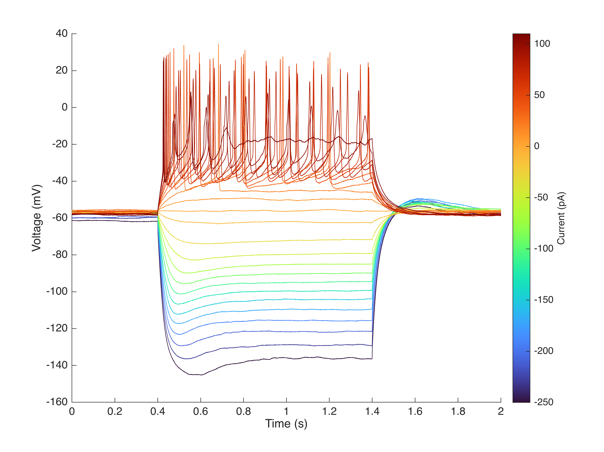
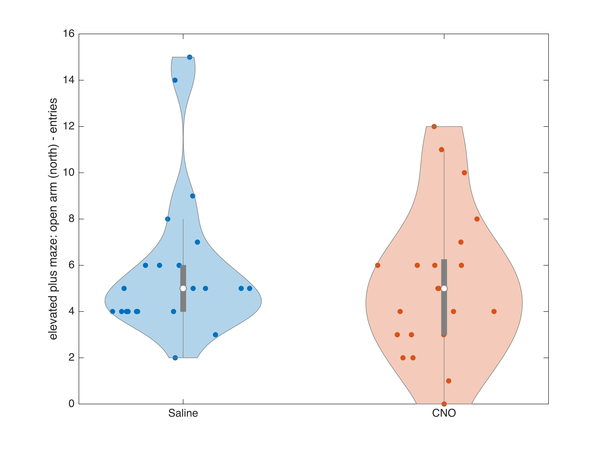
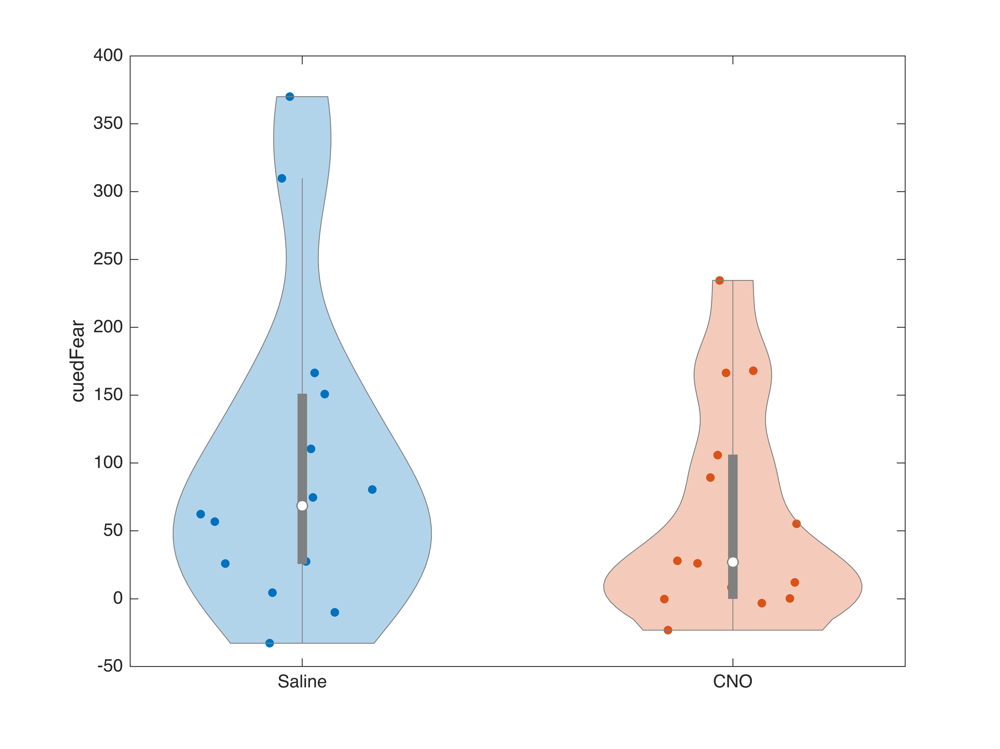

# **Dabrowska Data Tutorial (Getting Started)**

Below, you will find a quick tutorial to view the electrophysiology and behavioral data which relates to:

-  Paper: [https://doi.org/10.1016/j.celrep.2025.115768](https://doi.org/10.1016/j.celrep.2025.115768) 
-  Dataset: [https://doi.org/10.63884/ndic.2025.jyxfer8m](https://doi.org/10.63884/ndic.2025.jyxfer8m) 
<a name="beginToc"></a>

## Table of Contents
&emsp;[Download NDI](#download-ndi)
 
&emsp;[Import the NDI dataset](#import-the-ndi-dataset)
 
&emsp;&emsp;[Download or load the NDI dataset](#download-or-load-the-ndi-dataset)
 
&emsp;&emsp;[Retrieve the NDI session](#retrieve-the-ndi-session)
 
&emsp;[View subjects, probes and epochs](#view-subjects-probes-and-epochs)
 
&emsp;&emsp;[View subject summary table](#view-subject-summary-table)
 
&emsp;&emsp;&emsp;[Filter subjects](#filter-subjects)
 
&emsp;&emsp;[View probe and epoch summary tables](#view-probe-and-epoch-summary-tables)
 
&emsp;&emsp;[Combine metadata tables](#combine-metadata-tables)
 
&emsp;&emsp;&emsp;[Filter epochs](#filter-epochs)
 
&emsp;[Plot electrophysiology data](#plot-electrophysiology-data)
 
&emsp;[Plot Elevated Plus Maze data](#plot-elevated-plus-maze-data)
 
&emsp;[Plot Fear\-Potentiated Startle data](#plot-fear-potentiated-startle-data)
 
<a name="endToc"></a>

# Download NDI

In order to view the dataset, you will need access to the NDI platform. Follow the instructions found at [https://vh\-lab.github.io/NDI\-matlab/NDI\-matlab/installation/](https://vh-lab.github.io/NDI-matlab/NDI-matlab/installation/) to download NDI and gain access to the suite of tools we have created!

# Import the NDI dataset

Define the dataset path and id.

```matlab
% Choose the folder where the dataset is (or will be) stored
% (e.g. /Users/myusername/Documents/MATLAB/Datasets)
dataPath = [userpath filesep 'Datasets'];
cloudDatasetId = '67f723d574f5f79c6062389d';
datasetPath = fullfile(dataPath,cloudDatasetId);
```

## Download or load the NDI dataset 

The first time you try to access the data, it needs to be downloaded from NDI\-cloud. This may take a few minutes. Once you have the dataset downloaded, every other time you examine the data you can just load it.

```matlab
if isfolder(datasetPath)
    % Load if already downloaded
    dataset = ndi.dataset.dir(datasetPath);
else
    % Download
    if ~isfolder(dataPath), mkdir(dataPath); end
    dataset = ndi.cloud.downloadDataset(cloudDatasetId,dataPath);
end
```

## Retrieve the NDI session

A dataset can have multiple sessions, but this dataset has only one. We must retrieve it in order to access the accompanying experimental **probes** (i.e. a virtual or physical instrument that makes a measurement of or produces a stimulus for a **subject**).

```matlab
% Retrieve the session from this dataset
[session_ref_list,session_list] = dataset.session_list();
session = dataset.open_session(session_list{1});
```

# View subjects, probes and epochs
## View subject summary table

Each individual animal is referred to as a **subject** and has a unique alphanumeric `subject_id` along with a `subject_name` which contains references to the animal's strain, species, genotype, experiment date, and cell type. Our database contains documents which store metadata about each **subject** including their species, strain, genetic strain type, and biological sex which are linked to well\-defined ontologies such as [NCBI](https://www.ncbi.nlm.nih.gov/Taxonomy/Browser/wwwtax.cgi?mode=Info&id=10116&lvl=3&lin=f&keep=1&srchmode=1&unlock), [RRID](https://rgd.mcw.edu/rgdweb/report/strain/main.html?id=13508588), and [PATO](https://www.ebi.ac.uk/ols4/ontologies/pato/classes/http%253A%252F%252Fpurl.obolibrary.org%252Fobo%252FPATO_0000384). Additionally, metadata about any **treatments** that a **subject** received such as the location of optogenetic stimulation are stored. A summary table showing the metadata for each **subject** can be viewed below.

```matlab
% View summary table of all subject metadata
subjectSummary = ndi.fun.docTable.subject(dataset)
```
| |SubjectDocumentIdentifier|SubjectLocalIdentifier|StrainName|StrainOntology|BackgroundStrainName|BackgroundStrainOntology|GeneticStrainTypeName|SpeciesName|SpeciesOntology|BiologicalSexName|BiologicalSexOntology|OptogeneticTetanusStimulationTargetLocationName|OptogeneticTetanusStimulationTargetLocationOntology|
|:--:|:--:|:--:|:--:|:--:|:--:|:--:|:--:|:--:|:--:|:--:|:--:|:--:|:--:|
|1|'4126945ae99ad3d8_40b0e8fc07857b27'|'wi_rat_CRFCre_210818_BNSTIII@dabrowska-lab.rosalindfranklin.edu'|'CRF-Cre'|''|'WI'|'RRID:RGD_13508588'|'knockin'|'Rattus norvegicus'|'NCBITaxon:10116'|'male'|'PATO:0000384'|''|''|
|2|'4126945ae99b0be0_40c293809848f24d'|'wi_rat_CRFCre_210618_BNSTIII@dabrowska-lab.rosalindfranklin.edu'|'CRF-Cre'|''|'WI'|'RRID:RGD_13508588'|'knockin'|'Rattus norvegicus'|'NCBITaxon:10116'|'male'|'PATO:0000384'|''|''|
|3|'4126945ae99b3290_c0df542da0bbce78'|'wi_rat_CRFCre_210621_BNSTIII@dabrowska-lab.rosalindfranklin.edu'|'CRF-Cre'|''|'WI'|'RRID:RGD_13508588'|'knockin'|'Rattus norvegicus'|'NCBITaxon:10116'|'male'|'PATO:0000384'|''|''|
|4|'4126945ae99b4e23_c0bc14cf3e090a43'|'wi_rat_CRFCre_210622_BNSTIII@dabrowska-lab.rosalindfranklin.edu'|'CRF-Cre'|''|'WI'|'RRID:RGD_13508588'|'knockin'|'Rattus norvegicus'|'NCBITaxon:10116'|'male'|'PATO:0000384'|''|''|
|5|'4126945ae99b6635_c0c3a0d23e720243'|'wi_rat_CRFCre_210623_BNSTIII@dabrowska-lab.rosalindfranklin.edu'|'CRF-Cre'|''|'WI'|'RRID:RGD_13508588'|'knockin'|'Rattus norvegicus'|'NCBITaxon:10116'|'male'|'PATO:0000384'|''|''|
|6|'4126945ae99b7717_c0c70309fd27725f'|'sd_rat_OTRCre_220214_BNSTIII@dabrowska-lab.rosalindfranklin.edu'|'OTR-IRES-Cre'|''|'SD'|'RRID:RGD_70508'|'knockin'|'Rattus norvegicus'|'NCBITaxon:10116'|'male'|'PATO:0000384'|''|''|
|7|'4126945ae99b860d_40cb5d4c3b370fbd'|'sd_rat_OTRCre_220216_BNSTIII@dabrowska-lab.rosalindfranklin.edu'|'OTR-IRES-Cre'|''|'SD'|'RRID:RGD_70508'|'knockin'|'Rattus norvegicus'|'NCBITaxon:10116'|'male'|'PATO:0000384'|''|''|
|8|'4126945ae99b9329_40b5d9d3d2176b0c'|'sd_rat_OTRCre_220209_BNSTIII@dabrowska-lab.rosalindfranklin.edu'|'OTR-IRES-Cre'|''|'SD'|'RRID:RGD_70508'|'knockin'|'Rattus norvegicus'|'NCBITaxon:10116'|'male'|'PATO:0000384'|''|''|
|9|'4126945ae99b9fd1_c0ce0b5ee46211a8'|'sd_rat_OTRCre_230110_BNSTIII@dabrowska-lab.rosalindfranklin.edu'|'OTR-IRES-Cre'|''|'SD'|'RRID:RGD_70508'|'knockin'|'Rattus norvegicus'|'NCBITaxon:10116'|'male'|'PATO:0000384'|''|''|
|10|'4126945ae99bac22_40c5f873db1eb8f6'|'sd_rat_OTRCre_230111_BNSTIII@dabrowska-lab.rosalindfranklin.edu'|'OTR-IRES-Cre'|''|'SD'|'RRID:RGD_70508'|'knockin'|'Rattus norvegicus'|'NCBITaxon:10116'|'male'|'PATO:0000384'|''|''|
|11|'4126945ae99bb800_c0d9de504fe3ec6d'|'sd_rat_OTRCre_230117_BNSTIII@dabrowska-lab.rosalindfranklin.edu'|'OTR-IRES-Cre'|''|'SD'|'RRID:RGD_70508'|'knockin'|'Rattus norvegicus'|'NCBITaxon:10116'|'male'|'PATO:0000384'|''|''|
|12|'4126945ae99bc4b7_c0c603ab2ac8198f'|'sd_rat_OTRCre_230118_BNSTIII@dabrowska-lab.rosalindfranklin.edu'|'OTR-IRES-Cre'|''|'SD'|'RRID:RGD_70508'|'knockin'|'Rattus norvegicus'|'NCBITaxon:10116'|'male'|'PATO:0000384'|''|''|
|13|'4126945ae99bd19b_40cf32176f086593'|'sd_rat_OTRCre_230612_BNSTIII@dabrowska-lab.rosalindfranklin.edu'|'OTR-IRES-Cre'|''|'SD'|'RRID:RGD_70508'|'knockin'|'Rattus norvegicus'|'NCBITaxon:10116'|'male'|'PATO:0000384'|''|''|
|14|'4126945ae99be30e_c0ce94e78ca712f2'|'sd_rat_OTRCre_230613_BNSTIII@dabrowska-lab.rosalindfranklin.edu'|'OTR-IRES-Cre'|''|'SD'|'RRID:RGD_70508'|'knockin'|'Rattus norvegicus'|'NCBITaxon:10116'|'male'|'PATO:0000384'|''|''|
|15|'4126945ae99bef1f_40de91ab16802248'|'sd_rat_OTRCre_230616_BNSTIII@dabrowska-lab.rosalindfranklin.edu'|'OTR-IRES-Cre'|''|'SD'|'RRID:RGD_70508'|'knockin'|'Rattus norvegicus'|'NCBITaxon:10116'|'male'|'PATO:0000384'|''|''|
|16|'4126945ae99bfc4d_40db7129b23f2957'|'sd_rat_OTRCre_230620_BNSTIII@dabrowska-lab.rosalindfranklin.edu'|'OTR-IRES-Cre'|''|'SD'|'RRID:RGD_70508'|'knockin'|'Rattus norvegicus'|'NCBITaxon:10116'|'male'|'PATO:0000384'|''|''|
|17|'4126945ae99c0933_c0c7fc31e9476dc5'|'wi_rat_CRFCre_230213_BNSTIII@dabrowska-lab.rosalindfranklin.edu'|'CRF-Cre'|''|'WI'|'RRID:RGD_13508588'|'knockin'|'Rattus norvegicus'|'NCBITaxon:10116'|'male'|'PATO:0000384'|''|''|
|18|'4126945ae99c1613_c0be1c911067c0dd'|'wi_rat_CRFCre_230214_BNSTIII@dabrowska-lab.rosalindfranklin.edu'|'CRF-Cre'|''|'WI'|'RRID:RGD_13508588'|'knockin'|'Rattus norvegicus'|'NCBITaxon:10116'|'male'|'PATO:0000384'|''|''|
|19|'4126945ae99c21c0_40d7bba00be8680c'|'wi_rat_CRFCre_230224_BNSTIII@dabrowska-lab.rosalindfranklin.edu'|'CRF-Cre'|''|'WI'|'RRID:RGD_13508588'|'knockin'|'Rattus norvegicus'|'NCBITaxon:10116'|'male'|'PATO:0000384'|''|''|
|20|'4126945ae99c2e04_c0d35b9e981ef6bd'|'wi_rat_CRFCre_230628_BNSTIII@dabrowska-lab.rosalindfranklin.edu'|'CRF-Cre'|''|'WI'|'RRID:RGD_13508588'|'knockin'|'Rattus norvegicus'|'NCBITaxon:10116'|'male'|'PATO:0000384'|''|''|
|21|'4126945ae99c39d1_40d1cbacf8e0e426'|'wi_rat_CRFCre_230629_BNSTIII@dabrowska-lab.rosalindfranklin.edu'|'CRF-Cre'|''|'WI'|'RRID:RGD_13508588'|'knockin'|'Rattus norvegicus'|'NCBITaxon:10116'|'male'|'PATO:0000384'|''|''|
|22|'4126945ae99c463b_40d0fe77ec8bd9b5'|'sd_rat_WT_210401_BNSTIII@dabrowska-lab.rosalindfranklin.edu'|'SD'|'RRID:RGD_70508'|' '|' '|'wildtype'|'Rattus norvegicus'|'NCBITaxon:10116'|'male'|'PATO:0000384'|''|''|
|23|'4126945ae99c5207_40d8c8cfd736541a'|'sd_rat_WT_210406_BNSTIII@dabrowska-lab.rosalindfranklin.edu'|'SD'|'RRID:RGD_70508'|' '|' '|'wildtype'|'Rattus norvegicus'|'NCBITaxon:10116'|'male'|'PATO:0000384'|''|''|
|24|'4126945ae99c5ab8_40d0f1202f948341'|'sd_rat_WT_201214_BNSTIII@dabrowska-lab.rosalindfranklin.edu'|'SD'|'RRID:RGD_70508'|' '|' '|'wildtype'|'Rattus norvegicus'|'NCBITaxon:10116'|'male'|'PATO:0000384'|''|''|
|25|'4126945ae99c62cc_c0da70186768ea22'|'sd_rat_WT_201215_BNSTIII@dabrowska-lab.rosalindfranklin.edu'|'SD'|'RRID:RGD_70508'|' '|' '|'wildtype'|'Rattus norvegicus'|'NCBITaxon:10116'|'male'|'PATO:0000384'|''|''|
|26|'4126945ae99c6b07_c0cdaf2968f0b02d'|'sd_rat_WT_201217_BNSTIII@dabrowska-lab.rosalindfranklin.edu'|'SD'|'RRID:RGD_70508'|' '|' '|'wildtype'|'Rattus norvegicus'|'NCBITaxon:10116'|'male'|'PATO:0000384'|''|''|
|27|'4126945ae99c7410_c0a2b585dce3440e'|'sd_rat_WT_201221_BNSTIII@dabrowska-lab.rosalindfranklin.edu'|'SD'|'RRID:RGD_70508'|' '|' '|'wildtype'|'Rattus norvegicus'|'NCBITaxon:10116'|'male'|'PATO:0000384'|''|''|
|28|'4126945ae99c7d5b_40dfea6364015f80'|'sd_rat_WT_210315_BNSTIII@dabrowska-lab.rosalindfranklin.edu'|'SD'|'RRID:RGD_70508'|' '|' '|'wildtype'|'Rattus norvegicus'|'NCBITaxon:10116'|'male'|'PATO:0000384'|''|''|
|29|'4126945ae99c87aa_c0a2d6fb1428e63d'|'sd_rat_WT_210324_BNSTIII@dabrowska-lab.rosalindfranklin.edu'|'SD'|'RRID:RGD_70508'|' '|' '|'wildtype'|'Rattus norvegicus'|'NCBITaxon:10116'|'male'|'PATO:0000384'|''|''|
|30|'4126945ae99c90e0_40d159daea6abb20'|'sd_rat_WT_201210_BNSTIII@dabrowska-lab.rosalindfranklin.edu'|'SD'|'RRID:RGD_70508'|' '|' '|'wildtype'|'Rattus norvegicus'|'NCBITaxon:10116'|'male'|'PATO:0000384'|''|''|
|31|'4126945ae99c999d_c0c3b6efe49bf768'|'sd_rat_WT_220125_BNSTIII@dabrowska-lab.rosalindfranklin.edu'|'SD'|'RRID:RGD_70508'|' '|' '|'wildtype'|'Rattus norvegicus'|'NCBITaxon:10116'|'male'|'PATO:0000384'|''|''|
|32|'4126945ae99ca223_40a15b456951ec02'|'sd_rat_WT_230616_BNSTIII@dabrowska-lab.rosalindfranklin.edu'|'SD'|'RRID:RGD_70508'|' '|' '|'wildtype'|'Rattus norvegicus'|'NCBITaxon:10116'|'male'|'PATO:0000384'|''|''|
|33|'4126945ae99caa04_40d218b4ff3cda90'|'sd_rat_WT_230620_BNSTIII@dabrowska-lab.rosalindfranklin.edu'|'SD'|'RRID:RGD_70508'|' '|' '|'wildtype'|'Rattus norvegicus'|'NCBITaxon:10116'|'male'|'PATO:0000384'|''|''|
|34|'4126945ae99cb27b_c0d0ef8ef3f68855'|'sd_rat_WT_201110_BNSTIII@dabrowska-lab.rosalindfranklin.edu'|'SD'|'RRID:RGD_70508'|' '|' '|'wildtype'|'Rattus norvegicus'|'NCBITaxon:10116'|'male'|'PATO:0000384'|''|''|
|35|'4126945ae99cbbab_40a8a8163db606bf'|'sd_rat_WT_201103_BNSTIII@dabrowska-lab.rosalindfranklin.edu'|'SD'|'RRID:RGD_70508'|' '|' '|'wildtype'|'Rattus norvegicus'|'NCBITaxon:10116'|'male'|'PATO:0000384'|''|''|
|36|'4126945ae99cc478_c0894c5d6b3084a3'|'sd_rat_WT_201006_BNSTIII@dabrowska-lab.rosalindfranklin.edu'|'SD'|'RRID:RGD_70508'|' '|' '|'wildtype'|'Rattus norvegicus'|'NCBITaxon:10116'|'male'|'PATO:0000384'|''|''|
|37|'4126945ae99cce19_40b271c9b14b2305'|'sd_rat_WT_220921_BNSTIII@dabrowska-lab.rosalindfranklin.edu'|'SD'|'RRID:RGD_70508'|' '|' '|'wildtype'|'Rattus norvegicus'|'NCBITaxon:10116'|'male'|'PATO:0000384'|''|''|
|38|'4126945ae99cd6e9_c0bdd7f75b520bbd'|'sd_rat_WT_220928_BNSTIII@dabrowska-lab.rosalindfranklin.edu'|'SD'|'RRID:RGD_70508'|' '|' '|'wildtype'|'Rattus norvegicus'|'NCBITaxon:10116'|'male'|'PATO:0000384'|''|''|
|39|'4126945ae99ce07b_40c012a0c2af6170'|'sd_rat_WT_201110_BNSTII@dabrowska-lab.rosalindfranklin.edu'|'SD'|'RRID:RGD_70508'|' '|' '|'wildtype'|'Rattus norvegicus'|'NCBITaxon:10116'|'male'|'PATO:0000384'|''|''|
|40|'4126945ae99ce988_c0b00ad7ae36fe84'|'sd_rat_WT_201102_BNSTII@dabrowska-lab.rosalindfranklin.edu'|'SD'|'RRID:RGD_70508'|' '|' '|'wildtype'|'Rattus norvegicus'|'NCBITaxon:10116'|'male'|'PATO:0000384'|''|''|
|41|'4126945ae99cf1b9_40db30bbc733af9f'|'sd_rat_WT_201104_BNSTII@dabrowska-lab.rosalindfranklin.edu'|'SD'|'RRID:RGD_70508'|' '|' '|'wildtype'|'Rattus norvegicus'|'NCBITaxon:10116'|'male'|'PATO:0000384'|''|''|
|42|'4126945ae99cfa04_40cb909ba1b6c9cb'|'sd_rat_WT_201109_BNSTII@dabrowska-lab.rosalindfranklin.edu'|'SD'|'RRID:RGD_70508'|' '|' '|'wildtype'|'Rattus norvegicus'|'NCBITaxon:10116'|'male'|'PATO:0000384'|''|''|
|43|'4126945ae99d0239_40d33eb1dd3eed5d'|'sd_rat_WT_201026_BNSTII@dabrowska-lab.rosalindfranklin.edu'|'SD'|'RRID:RGD_70508'|' '|' '|'wildtype'|'Rattus norvegicus'|'NCBITaxon:10116'|'male'|'PATO:0000384'|''|''|
|44|'4126945ae99d0a84_c0d2a614707bec73'|'sd_rat_WT_201005_BNSTII@dabrowska-lab.rosalindfranklin.edu'|'SD'|'RRID:RGD_70508'|' '|' '|'wildtype'|'Rattus norvegicus'|'NCBITaxon:10116'|'male'|'PATO:0000384'|''|''|
|45|'4126945ae99d12a0_c0b0624e17218069'|'sd_rat_WT_201007_BNSTII@dabrowska-lab.rosalindfranklin.edu'|'SD'|'RRID:RGD_70508'|' '|' '|'wildtype'|'Rattus norvegicus'|'NCBITaxon:10116'|'male'|'PATO:0000384'|''|''|
|46|'4126945ae99d1ae7_40c25c2f269feb9f'|'sd_rat_WT_201103_BNSTI@dabrowska-lab.rosalindfranklin.edu'|'SD'|'RRID:RGD_70508'|' '|' '|'wildtype'|'Rattus norvegicus'|'NCBITaxon:10116'|'male'|'PATO:0000384'|''|''|
|47|'4126945ae99d2350_c0b4a29c9597f80e'|'sd_rat_WT_201109_BNSTI@dabrowska-lab.rosalindfranklin.edu'|'SD'|'RRID:RGD_70508'|' '|' '|'wildtype'|'Rattus norvegicus'|'NCBITaxon:10116'|'male'|'PATO:0000384'|''|''|
|48|'4126945ae99d2c3f_c0cbe9aa43896900'|'sd_rat_WT_201119_BNSTI@dabrowska-lab.rosalindfranklin.edu'|'SD'|'RRID:RGD_70508'|' '|' '|'wildtype'|'Rattus norvegicus'|'NCBITaxon:10116'|'male'|'PATO:0000384'|''|''|
|49|'4126945ae99d3486_c0b6ffa866d503cb'|'sd_rat_WT_201026_BNSTI@dabrowska-lab.rosalindfranklin.edu'|'SD'|'RRID:RGD_70508'|' '|' '|'wildtype'|'Rattus norvegicus'|'NCBITaxon:10116'|'male'|'PATO:0000384'|''|''|
|50|'4126945ae99d3d3a_40ce5422bc2e05c7'|'sd_rat_WT_201027_BNSTI@dabrowska-lab.rosalindfranklin.edu'|'SD'|'RRID:RGD_70508'|' '|' '|'wildtype'|'Rattus norvegicus'|'NCBITaxon:10116'|'male'|'PATO:0000384'|''|''|
|51|'4126945ae99d4592_c0d0835540c71ab8'|'sd_rat_WT_201028_BNSTI@dabrowska-lab.rosalindfranklin.edu'|'SD'|'RRID:RGD_70508'|' '|' '|'wildtype'|'Rattus norvegicus'|'NCBITaxon:10116'|'male'|'PATO:0000384'|''|''|
|52|'4126945ae99d4e80_c0da2a09f0ad8d37'|'sd_rat_WT_201005_BNSTI@dabrowska-lab.rosalindfranklin.edu'|'SD'|'RRID:RGD_70508'|' '|' '|'wildtype'|'Rattus norvegicus'|'NCBITaxon:10116'|'male'|'PATO:0000384'|''|''|
|53|'4126945ae99d56cb_40bc68270c0c5915'|'sd_rat_WT_201006_BNSTI@dabrowska-lab.rosalindfranklin.edu'|'SD'|'RRID:RGD_70508'|' '|' '|'wildtype'|'Rattus norvegicus'|'NCBITaxon:10116'|'male'|'PATO:0000384'|''|''|
|54|'4126945ae99d5f35_c0d308b6b67c90f2'|'sd_rat_WT_230425_BNSTIII@dabrowska-lab.rosalindfranklin.edu'|'SD'|'RRID:RGD_70508'|' '|' '|'wildtype'|'Rattus norvegicus'|'NCBITaxon:10116'|'male'|'PATO:0000384'|''|''|
|55|'4126945ae99d677c_40d7119062d5f6a6'|'sd_rat_WT_230426_BNSTIII@dabrowska-lab.rosalindfranklin.edu'|'SD'|'RRID:RGD_70508'|' '|' '|'wildtype'|'Rattus norvegicus'|'NCBITaxon:10116'|'male'|'PATO:0000384'|''|''|
|56|'4126945ae99d7122_40d7cbb04db80cac'|'sd_rat_WT_221220_BNSTIII@dabrowska-lab.rosalindfranklin.edu'|'SD'|'RRID:RGD_70508'|' '|' '|'wildtype'|'Rattus norvegicus'|'NCBITaxon:10116'|'male'|'PATO:0000384'|''|''|
|57|'4126945ae99d7a3c_c093581ef50aeb6b'|'sd_rat_WT_221221_BNSTIII@dabrowska-lab.rosalindfranklin.edu'|'SD'|'RRID:RGD_70508'|' '|' '|'wildtype'|'Rattus norvegicus'|'NCBITaxon:10116'|'male'|'PATO:0000384'|''|''|
|58|'4126945ae99d8294_4091517def5eb469'|'sd_rat_WT_230105_BNSTIII@dabrowska-lab.rosalindfranklin.edu'|'SD'|'RRID:RGD_70508'|' '|' '|'wildtype'|'Rattus norvegicus'|'NCBITaxon:10116'|'male'|'PATO:0000384'|''|''|
|59|'4126945ae99d8bb0_408094c34efdc65a'|'sd_rat_WT_221011_BNSTIII@dabrowska-lab.rosalindfranklin.edu'|'SD'|'RRID:RGD_70508'|' '|' '|'wildtype'|'Rattus norvegicus'|'NCBITaxon:10116'|'male'|'PATO:0000384'|''|''|
|60|'4126945ae99d9426_c0adfafa7b358d02'|'sd_rat_WT_221012_BNSTIII@dabrowska-lab.rosalindfranklin.edu'|'SD'|'RRID:RGD_70508'|' '|' '|'wildtype'|'Rattus norvegicus'|'NCBITaxon:10116'|'male'|'PATO:0000384'|''|''|
|61|'4126945ae99d9d49_c0cdad41f7ed972b'|'sd_rat_WT_221026_BNSTIII@dabrowska-lab.rosalindfranklin.edu'|'SD'|'RRID:RGD_70508'|' '|' '|'wildtype'|'Rattus norvegicus'|'NCBITaxon:10116'|'male'|'PATO:0000384'|''|''|
|62|'4126945ae99da5c7_40d1b1c3bb71ceb4'|'sd_rat_WT_230815_BNSTIII@dabrowska-lab.rosalindfranklin.edu'|'SD'|'RRID:RGD_70508'|' '|' '|'wildtype'|'Rattus norvegicus'|'NCBITaxon:10116'|'male'|'PATO:0000384'|''|''|
|63|'4126945ae99dada1_c0d82ab7fb1b17e5'|'sd_rat_WT_230626_BNSTIII@dabrowska-lab.rosalindfranklin.edu'|'SD'|'RRID:RGD_70508'|' '|' '|'wildtype'|'Rattus norvegicus'|'NCBITaxon:10116'|'male'|'PATO:0000384'|''|''|
|64|'4126945ae99db5f4_c0dba0960e21f459'|'sd_rat_WT_231024_BNSTIII@dabrowska-lab.rosalindfranklin.edu'|'SD'|'RRID:RGD_70508'|' '|' '|'wildtype'|'Rattus norvegicus'|'NCBITaxon:10116'|'male'|'PATO:0000384'|''|''|
|65|'4126945ae99dbfe8_40c1f777ea5ddc91'|'sd_rat_WT_231025_BNSTIII@dabrowska-lab.rosalindfranklin.edu'|'SD'|'RRID:RGD_70508'|' '|' '|'wildtype'|'Rattus norvegicus'|'NCBITaxon:10116'|'male'|'PATO:0000384'|''|''|
|66|'4126945ae99dc877_40c96c51cf0ca579'|'sd_rat_WT_231026_BNSTIII@dabrowska-lab.rosalindfranklin.edu'|'SD'|'RRID:RGD_70508'|' '|' '|'wildtype'|'Rattus norvegicus'|'NCBITaxon:10116'|'male'|'PATO:0000384'|''|''|
|67|'4126945ae99dd08b_c0d9d2f5c6acd789'|'sd_rat_WT_230911_BNSTIII@dabrowska-lab.rosalindfranklin.edu'|'SD'|'RRID:RGD_70508'|' '|' '|'wildtype'|'Rattus norvegicus'|'NCBITaxon:10116'|'male'|'PATO:0000384'|''|''|
|68|'4126945ae99dd85a_c08919eed2480935'|'sd_rat_WT_230912_BNSTIII@dabrowska-lab.rosalindfranklin.edu'|'SD'|'RRID:RGD_70508'|' '|' '|'wildtype'|'Rattus norvegicus'|'NCBITaxon:10116'|'male'|'PATO:0000384'|''|''|
|69|'4126945ae99de01e_40d22fdddb236408'|'sd_rat_WT_230814_BNSTI@dabrowska-lab.rosalindfranklin.edu'|'SD'|'RRID:RGD_70508'|' '|' '|'wildtype'|'Rattus norvegicus'|'NCBITaxon:10116'|'male'|'PATO:0000384'|''|''|
|70|'4126945ae99de802_40de6f81897e1691'|'sd_rat_WT_230815_BNSTI@dabrowska-lab.rosalindfranklin.edu'|'SD'|'RRID:RGD_70508'|' '|' '|'wildtype'|'Rattus norvegicus'|'NCBITaxon:10116'|'male'|'PATO:0000384'|''|''|
|71|'4126945ae99defce_40b14c56f54b438c'|'sd_rat_WT_230816_BNSTI@dabrowska-lab.rosalindfranklin.edu'|'SD'|'RRID:RGD_70508'|' '|' '|'wildtype'|'Rattus norvegicus'|'NCBITaxon:10116'|'male'|'PATO:0000384'|''|''|
|72|'4126945ae99df87e_c0d29e0f67aa611d'|'sd_rat_WT_230818_BNSTI@dabrowska-lab.rosalindfranklin.edu'|'SD'|'RRID:RGD_70508'|' '|' '|'wildtype'|'Rattus norvegicus'|'NCBITaxon:10116'|'male'|'PATO:0000384'|''|''|
|73|'4126945ae99e00d4_c0dca632c1ee9a2c'|'sd_rat_WT_230821_BNSTI@dabrowska-lab.rosalindfranklin.edu'|'SD'|'RRID:RGD_70508'|' '|' '|'wildtype'|'Rattus norvegicus'|'NCBITaxon:10116'|'male'|'PATO:0000384'|''|''|
|74|'4126945ae99e085e_c0b9a466cf368254'|'sd_rat_WT_230822_BNSTI@dabrowska-lab.rosalindfranklin.edu'|'SD'|'RRID:RGD_70508'|' '|' '|'wildtype'|'Rattus norvegicus'|'NCBITaxon:10116'|'male'|'PATO:0000384'|''|''|
|75|'4126945ae99e1111_c0b6519de81d89bb'|'sd_rat_WT_230823_BNSTI@dabrowska-lab.rosalindfranklin.edu'|'SD'|'RRID:RGD_70508'|' '|' '|'wildtype'|'Rattus norvegicus'|'NCBITaxon:10116'|'male'|'PATO:0000384'|''|''|
|76|'4126945ae99e18f2_c0dcf98ef23c45d4'|'sd_rat_WT_230627_BNSTI@dabrowska-lab.rosalindfranklin.edu'|'SD'|'RRID:RGD_70508'|' '|' '|'wildtype'|'Rattus norvegicus'|'NCBITaxon:10116'|'male'|'PATO:0000384'|''|''|
|77|'4126945ae99e20b9_c0d56064427a4f47'|'sd_rat_WT_230831_BNSTIII@dabrowska-lab.rosalindfranklin.edu'|'SD'|'RRID:RGD_70508'|' '|' '|'wildtype'|'Rattus norvegicus'|'NCBITaxon:10116'|'male'|'PATO:0000384'|''|''|
|78|'4126945ae99e294a_40acf8dd57322cd1'|'sd_rat_WT_220120_BNSTIII@dabrowska-lab.rosalindfranklin.edu'|'SD'|'RRID:RGD_70508'|' '|' '|'wildtype'|'Rattus norvegicus'|'NCBITaxon:10116'|'male'|'PATO:0000384'|''|''|
|79|'4126945ae99e32d8_40c6bc18719e39bc'|'sd_rat_WT_220126_BNSTIII@dabrowska-lab.rosalindfranklin.edu'|'SD'|'RRID:RGD_70508'|' '|' '|'wildtype'|'Rattus norvegicus'|'NCBITaxon:10116'|'male'|'PATO:0000384'|''|''|
|80|'4126945ae99e3b38_40c447833549d357'|'sd_rat_WT_220315_BNSTIII@dabrowska-lab.rosalindfranklin.edu'|'SD'|'RRID:RGD_70508'|' '|' '|'wildtype'|'Rattus norvegicus'|'NCBITaxon:10116'|'male'|'PATO:0000384'|''|''|
|81|'4126945ae99e43b7_40c41618eaefba01'|'sd_rat_WT_211109_BNSTIII@dabrowska-lab.rosalindfranklin.edu'|'SD'|'RRID:RGD_70508'|' '|' '|'wildtype'|'Rattus norvegicus'|'NCBITaxon:10116'|'male'|'PATO:0000384'|''|''|
|82|'4126945ae99e4c64_40a591ad2448824f'|'sd_rat_WT_210930_BNSTIII@dabrowska-lab.rosalindfranklin.edu'|'SD'|'RRID:RGD_70508'|' '|' '|'wildtype'|'Rattus norvegicus'|'NCBITaxon:10116'|'male'|'PATO:0000384'|''|''|
|83|'4126945ae99e558f_c0bb7c62e67af307'|'sd_rat_WT_201207_BNSTI@dabrowska-lab.rosalindfranklin.edu'|'SD'|'RRID:RGD_70508'|' '|' '|'wildtype'|'Rattus norvegicus'|'NCBITaxon:10116'|'male'|'PATO:0000384'|''|''|
|84|'4126945ae99e5ea1_40db19e866b07ad6'|'sd_rat_WT_201209_BNSTI@dabrowska-lab.rosalindfranklin.edu'|'SD'|'RRID:RGD_70508'|' '|' '|'wildtype'|'Rattus norvegicus'|'NCBITaxon:10116'|'male'|'PATO:0000384'|''|''|
|85|'4126945ae99e677b_40d2a8d299763553'|'sd_rat_WT_201214_BNSTI@dabrowska-lab.rosalindfranklin.edu'|'SD'|'RRID:RGD_70508'|' '|' '|'wildtype'|'Rattus norvegicus'|'NCBITaxon:10116'|'male'|'PATO:0000384'|''|''|
|86|'4126945ae99e6f0e_40c541835f7de97e'|'sd_rat_WT_201215_BNSTI@dabrowska-lab.rosalindfranklin.edu'|'SD'|'RRID:RGD_70508'|' '|' '|'wildtype'|'Rattus norvegicus'|'NCBITaxon:10116'|'male'|'PATO:0000384'|''|''|
|87|'4126945ae99e767a_40bbeddb6e69e1f6'|'sd_rat_WT_240207_BNSTI@dabrowska-lab.rosalindfranklin.edu'|'SD'|'RRID:RGD_70508'|' '|' '|'wildtype'|'Rattus norvegicus'|'NCBITaxon:10116'|'male'|'PATO:0000384'|''|''|
|88|'4126945ae99e7ddd_40931f4cc9ffddbd'|'sd_rat_WT_240212_BNSTI@dabrowska-lab.rosalindfranklin.edu'|'SD'|'RRID:RGD_70508'|' '|' '|'wildtype'|'Rattus norvegicus'|'NCBITaxon:10116'|'male'|'PATO:0000384'|''|''|
|89|'4126945ae99e86f7_40da59a5b52230f2'|'sd_rat_WT_240213_BNSTI@dabrowska-lab.rosalindfranklin.edu'|'SD'|'RRID:RGD_70508'|' '|' '|'wildtype'|'Rattus norvegicus'|'NCBITaxon:10116'|'male'|'PATO:0000384'|''|''|
|90|'4126945ae99e8f25_c0dc34fad7bd8268'|'sd_rat_WT_240227_BNSTI@dabrowska-lab.rosalindfranklin.edu'|'SD'|'RRID:RGD_70508'|' '|' '|'wildtype'|'Rattus norvegicus'|'NCBITaxon:10116'|'male'|'PATO:0000384'|''|''|
|91|'4126945ae99e972f_40c4852e65d23641'|'sd_rat_WT_220711_BNSTIII@dabrowska-lab.rosalindfranklin.edu'|'SD'|'RRID:RGD_70508'|' '|' '|'wildtype'|'Rattus norvegicus'|'NCBITaxon:10116'|'male'|'PATO:0000384'|''|''|
|92|'4126945ae99e9f2f_40d3cf62310b3cdb'|'sd_rat_WT_220712_BNSTIII@dabrowska-lab.rosalindfranklin.edu'|'SD'|'RRID:RGD_70508'|' '|' '|'wildtype'|'Rattus norvegicus'|'NCBITaxon:10116'|'male'|'PATO:0000384'|''|''|
|93|'4126945ae99ea9a8_c084048b402a4bde'|'sd_rat_WT_220713_BNSTIII@dabrowska-lab.rosalindfranklin.edu'|'SD'|'RRID:RGD_70508'|' '|' '|'wildtype'|'Rattus norvegicus'|'NCBITaxon:10116'|'male'|'PATO:0000384'|''|''|
|94|'4126945ae99eb418_40d42d46eb9c5c72'|'sd_rat_WT_220714_BNSTIII@dabrowska-lab.rosalindfranklin.edu'|'SD'|'RRID:RGD_70508'|' '|' '|'wildtype'|'Rattus norvegicus'|'NCBITaxon:10116'|'male'|'PATO:0000384'|''|''|
|95|'4126945ae99ebd6c_c0ca9aa677cc83da'|'sd_rat_WT_220726_BNSTIII@dabrowska-lab.rosalindfranklin.edu'|'SD'|'RRID:RGD_70508'|' '|' '|'wildtype'|'Rattus norvegicus'|'NCBITaxon:10116'|'male'|'PATO:0000384'|''|''|
|96|'4126945ae99ec636_c0dd5cf477ba459c'|'sd_rat_WT_220727_BNSTIII@dabrowska-lab.rosalindfranklin.edu'|'SD'|'RRID:RGD_70508'|' '|' '|'wildtype'|'Rattus norvegicus'|'NCBITaxon:10116'|'male'|'PATO:0000384'|''|''|
|97|'4126945ae99ece80_c0d1f5d60ac90bb9'|'sd_rat_WT_220705_BNSTIII@dabrowska-lab.rosalindfranklin.edu'|'SD'|'RRID:RGD_70508'|' '|' '|'wildtype'|'Rattus norvegicus'|'NCBITaxon:10116'|'male'|'PATO:0000384'|''|''|
|98|'4126945ae99ed6e0_40c2db8beea0f331'|'sd_rat_WT_220531_BNSTIII@dabrowska-lab.rosalindfranklin.edu'|'SD'|'RRID:RGD_70508'|' '|' '|'wildtype'|'Rattus norvegicus'|'NCBITaxon:10116'|'male'|'PATO:0000384'|''|''|
|99|'4126945ae99ee037_c0b9d6c8c92270fb'|'sd_rat_WT_211222_BNSTIII@dabrowska-lab.rosalindfranklin.edu'|'SD'|'RRID:RGD_70508'|' '|' '|'wildtype'|'Rattus norvegicus'|'NCBITaxon:10116'|'male'|'PATO:0000384'|''|''|
|100|'4126945ae99eeaec_40dd0d5eaffeee9c'|'sd_rat_WT_211207_BNSTIII@dabrowska-lab.rosalindfranklin.edu'|'SD'|'RRID:RGD_70508'|' '|' '|'wildtype'|'Rattus norvegicus'|'NCBITaxon:10116'|'male'|'PATO:0000384'|''|''|

### Filter subjects

We have created tools to filter a table by its values. Try finding **subjects** matching a given criterion.


Examples:

1.  `columnName = StrainName          dataValue = AVP-Cre`
2. `columnName = StrainName          dataValue = SD`
```matlab
% Search for subjects
columnNamesSubject = subjectSummary.Properties.VariableNames;
columnName = columnNamesSubject(3);
dataValue = "AVP-Cre";
rowInd = ndi.fun.table.identifyMatchingRows(subjectSummary,...
    columnName{1},dataValue,'stringMatch','contains');
filteredSubjects = subjectSummary(rowInd,:)
```
| |SubjectDocumentIdentifier|SubjectLocalIdentifier|StrainName|StrainOntology|BackgroundStrainName|BackgroundStrainOntology|GeneticStrainTypeName|SpeciesName|SpeciesOntology|BiologicalSexName|BiologicalSexOntology|OptogeneticTetanusStimulationTargetLocationName|OptogeneticTetanusStimulationTargetLocationOntology|
|:--:|:--:|:--:|:--:|:--:|:--:|:--:|:--:|:--:|:--:|:--:|:--:|:--:|:--:|
|1|'4126945ae99f9d5c_c0a3f8445ccbf8db'|'sd_rat_AVPCre_240425_BNSTI_PVN@dabrowska-lab.rosalindfranklin.edu'|'AVP-Cre'|''|'SD'|'RRID:RGD_70508'|'knockin'|'Rattus norvegicus'|'NCBITaxon:10116'|'male'|'PATO:0000384'|'paraventricular nucleus of hypothalamus'|'UBERON:0001930'|
|2|'4126945ae99fa9f2_c0d1c0ed8848a22b'|'sd_rat_AVPCre_240123_BNSTI_PVN@dabrowska-lab.rosalindfranklin.edu'|'AVP-Cre'|''|'SD'|'RRID:RGD_70508'|'knockin'|'Rattus norvegicus'|'NCBITaxon:10116'|'male'|'PATO:0000384'|'paraventricular nucleus of hypothalamus'|'UBERON:0001930'|
|3|'4126945ae99fb728_40d20250d2b8f4f3'|'sd_rat_AVPCre_240124_BNSTI_PVN@dabrowska-lab.rosalindfranklin.edu'|'AVP-Cre'|''|'SD'|'RRID:RGD_70508'|'knockin'|'Rattus norvegicus'|'NCBITaxon:10116'|'male'|'PATO:0000384'|'paraventricular nucleus of hypothalamus'|'UBERON:0001930'|
|4|'4126945ae99fc41f_40d5d8ee1a90f7f7'|'sd_rat_AVPCre_240326_BNSTI_PVN@dabrowska-lab.rosalindfranklin.edu'|'AVP-Cre'|''|'SD'|'RRID:RGD_70508'|'knockin'|'Rattus norvegicus'|'NCBITaxon:10116'|'male'|'PATO:0000384'|'paraventricular nucleus of hypothalamus'|'UBERON:0001930'|
|5|'4126945ae99fd1ee_40d78ca0a0b9bbd0'|'sd_rat_AVPCre_230309_BNSTI_PVN@dabrowska-lab.rosalindfranklin.edu'|'AVP-Cre'|''|'SD'|'RRID:RGD_70508'|'knockin'|'Rattus norvegicus'|'NCBITaxon:10116'|'male'|'PATO:0000384'|'paraventricular nucleus of hypothalamus'|'UBERON:0001930'|
|6|'4126945ae99fe00b_40b85c6986b9376f'|'sd_rat_AVPCre_240123_BNSTIII_PVN@dabrowska-lab.rosalindfranklin.edu'|'AVP-Cre'|''|'SD'|'RRID:RGD_70508'|'knockin'|'Rattus norvegicus'|'NCBITaxon:10116'|'male'|'PATO:0000384'|'paraventricular nucleus of hypothalamus'|'UBERON:0001930'|
|7|'4126945ae99fedc9_c0d7fcb4e12ff97e'|'sd_rat_AVPCre_240124_BNSTIII_PVN@dabrowska-lab.rosalindfranklin.edu'|'AVP-Cre'|''|'SD'|'RRID:RGD_70508'|'knockin'|'Rattus norvegicus'|'NCBITaxon:10116'|'male'|'PATO:0000384'|'paraventricular nucleus of hypothalamus'|'UBERON:0001930'|
|8|'4126945ae99ffa06_c0d9ebd80e6a746d'|'sd_rat_AVPCre_240326_BNSTIII_PVN@dabrowska-lab.rosalindfranklin.edu'|'AVP-Cre'|''|'SD'|'RRID:RGD_70508'|'knockin'|'Rattus norvegicus'|'NCBITaxon:10116'|'male'|'PATO:0000384'|'paraventricular nucleus of hypothalamus'|'UBERON:0001930'|
|9|'4126945ae9a008d0_40c482f0d125844d'|'sd_rat_AVPCre_230309_BNSTIII_PVN@dabrowska-lab.rosalindfranklin.edu'|'AVP-Cre'|''|'SD'|'RRID:RGD_70508'|'knockin'|'Rattus norvegicus'|'NCBITaxon:10116'|'male'|'PATO:0000384'|'paraventricular nucleus of hypothalamus'|'UBERON:0001930'|
|10|'4126945ae9a01600_40df891969718fd5'|'sd_rat_AVPCre_250203_BNSTI_PVN@dabrowska-lab.rosalindfranklin.edu'|'AVP-Cre'|''|'SD'|'RRID:RGD_70508'|'knockin'|'Rattus norvegicus'|'NCBITaxon:10116'|'male'|'PATO:0000384'|'paraventricular nucleus of hypothalamus'|'UBERON:0001930'|
|11|'4126945ae9a02289_408dfefed03a894a'|'sd_rat_AVPCre_250129_BNSTI_PVN@dabrowska-lab.rosalindfranklin.edu'|'AVP-Cre'|''|'SD'|'RRID:RGD_70508'|'knockin'|'Rattus norvegicus'|'NCBITaxon:10116'|'male'|'PATO:0000384'|'paraventricular nucleus of hypothalamus'|'UBERON:0001930'|
|12|'4126945ae9a02ef7_c0d0bf8af990acb3'|'sd_rat_AVPCre_250130_BNSTI_PVN@dabrowska-lab.rosalindfranklin.edu'|'AVP-Cre'|''|'SD'|'RRID:RGD_70508'|'knockin'|'Rattus norvegicus'|'NCBITaxon:10116'|'male'|'PATO:0000384'|'paraventricular nucleus of hypothalamus'|'UBERON:0001930'|
|13|'4126945ae9a03b93_c0c0e23a627d93f3'|'sd_rat_AVPCre_250203_BNSTIII_PVN@dabrowska-lab.rosalindfranklin.edu'|'AVP-Cre'|''|'SD'|'RRID:RGD_70508'|'knockin'|'Rattus norvegicus'|'NCBITaxon:10116'|'male'|'PATO:0000384'|'paraventricular nucleus of hypothalamus'|'UBERON:0001930'|
|14|'4126945ae9a047d1_40c430054e198b12'|'sd_rat_AVPCre_250129_BNSTIII_PVN@dabrowska-lab.rosalindfranklin.edu'|'AVP-Cre'|''|'SD'|'RRID:RGD_70508'|'knockin'|'Rattus norvegicus'|'NCBITaxon:10116'|'male'|'PATO:0000384'|'paraventricular nucleus of hypothalamus'|'UBERON:0001930'|
|15|'4126945ae9a053f7_40978494380d919c'|'sd_rat_AVPCre_250130_BNSTIII_PVN@dabrowska-lab.rosalindfranklin.edu'|'AVP-Cre'|''|'SD'|'RRID:RGD_70508'|'knockin'|'Rattus norvegicus'|'NCBITaxon:10116'|'male'|'PATO:0000384'|'paraventricular nucleus of hypothalamus'|'UBERON:0001930'|
|16|'4126945ae9a06076_40b729314d4c022e'|'sd_rat_AVPCre_221202_BNSTI_SCN@dabrowska-lab.rosalindfranklin.edu'|'AVP-Cre'|''|'SD'|'RRID:RGD_70508'|'knockin'|'Rattus norvegicus'|'NCBITaxon:10116'|'male'|'PATO:0000384'|'suprachiasmatic nucleus'|'UBERON:0002034'|
|17|'4126945ae9a06c5a_40ba0efa3c43de06'|'sd_rat_AVPCre_230201_BNSTI_SCN@dabrowska-lab.rosalindfranklin.edu'|'AVP-Cre'|''|'SD'|'RRID:RGD_70508'|'knockin'|'Rattus norvegicus'|'NCBITaxon:10116'|'male'|'PATO:0000384'|'suprachiasmatic nucleus'|'UBERON:0002034'|
|18|'4126945ae9a07905_c0d66979d43c7642'|'sd_rat_AVPCre_230206_BNSTI_SCN@dabrowska-lab.rosalindfranklin.edu'|'AVP-Cre'|''|'SD'|'RRID:RGD_70508'|'knockin'|'Rattus norvegicus'|'NCBITaxon:10116'|'male'|'PATO:0000384'|'suprachiasmatic nucleus'|'UBERON:0002034'|
|19|'4126945ae9a084de_40dee96433f5af5d'|'sd_rat_AVPCre_230306_BNSTI_SCN@dabrowska-lab.rosalindfranklin.edu'|'AVP-Cre'|''|'SD'|'RRID:RGD_70508'|'knockin'|'Rattus norvegicus'|'NCBITaxon:10116'|'male'|'PATO:0000384'|'suprachiasmatic nucleus'|'UBERON:0002034'|
|20|'4126945ae9a09361_c0dac140f209f0e0'|'sd_rat_AVPCre_230308_BNSTI_SCN@dabrowska-lab.rosalindfranklin.edu'|'AVP-Cre'|''|'SD'|'RRID:RGD_70508'|'knockin'|'Rattus norvegicus'|'NCBITaxon:10116'|'male'|'PATO:0000384'|'suprachiasmatic nucleus'|'UBERON:0002034'|
|21|'4126945ae9a0a0ab_c09f3c3da8f9b40e'|'sd_rat_AVPCre_230309_BNSTI_SCN@dabrowska-lab.rosalindfranklin.edu'|'AVP-Cre'|''|'SD'|'RRID:RGD_70508'|'knockin'|'Rattus norvegicus'|'NCBITaxon:10116'|'male'|'PATO:0000384'|'suprachiasmatic nucleus'|'UBERON:0002034'|
|22|'4126945ae9a0af05_c0d7b2e25710eacd'|'sd_rat_AVPCre_230313_BNSTI_SCN@dabrowska-lab.rosalindfranklin.edu'|'AVP-Cre'|''|'SD'|'RRID:RGD_70508'|'knockin'|'Rattus norvegicus'|'NCBITaxon:10116'|'male'|'PATO:0000384'|'suprachiasmatic nucleus'|'UBERON:0002034'|
|23|'4126945ae9a0bce0_c0c5000a7af80010'|'sd_rat_AVPCre_230314_BNSTI_SCN@dabrowska-lab.rosalindfranklin.edu'|'AVP-Cre'|''|'SD'|'RRID:RGD_70508'|'knockin'|'Rattus norvegicus'|'NCBITaxon:10116'|'male'|'PATO:0000384'|'suprachiasmatic nucleus'|'UBERON:0002034'|
|24|'4126945ae9a0ca70_40caa5e809110df3'|'sd_rat_AVPCre_221202_BNSTIII_SCN@dabrowska-lab.rosalindfranklin.edu'|'AVP-Cre'|''|'SD'|'RRID:RGD_70508'|'knockin'|'Rattus norvegicus'|'NCBITaxon:10116'|'male'|'PATO:0000384'|'suprachiasmatic nucleus'|'UBERON:0002034'|
|25|'4126945ae9a0d894_c0949aa7251d1872'|'sd_rat_AVPCre_230306_BNSTIII_SCN@dabrowska-lab.rosalindfranklin.edu'|'AVP-Cre'|''|'SD'|'RRID:RGD_70508'|'knockin'|'Rattus norvegicus'|'NCBITaxon:10116'|'male'|'PATO:0000384'|'suprachiasmatic nucleus'|'UBERON:0002034'|
|26|'4126945ae9a0e464_40d24cdb11801061'|'sd_rat_AVPCre_230308_BNSTIII_SCN@dabrowska-lab.rosalindfranklin.edu'|'AVP-Cre'|''|'SD'|'RRID:RGD_70508'|'knockin'|'Rattus norvegicus'|'NCBITaxon:10116'|'male'|'PATO:0000384'|'suprachiasmatic nucleus'|'UBERON:0002034'|
|27|'4126945ae9a0f1cc_c0d1ccd9d7105091'|'sd_rat_AVPCre_230309_BNSTIII_SCN@dabrowska-lab.rosalindfranklin.edu'|'AVP-Cre'|''|'SD'|'RRID:RGD_70508'|'knockin'|'Rattus norvegicus'|'NCBITaxon:10116'|'male'|'PATO:0000384'|'suprachiasmatic nucleus'|'UBERON:0002034'|
|28|'4126945ae9a0fd6c_c0d10648828a54f5'|'sd_rat_AVPCre_221122_BNSTIII_SCN@dabrowska-lab.rosalindfranklin.edu'|'AVP-Cre'|''|'SD'|'RRID:RGD_70508'|'knockin'|'Rattus norvegicus'|'NCBITaxon:10116'|'male'|'PATO:0000384'|'suprachiasmatic nucleus'|'UBERON:0002034'|
|29|'4126945ae9a10a78_c0dea4087fdec2b8'|'sd_rat_AVPCre_221129_BNSTIII_SCN@dabrowska-lab.rosalindfranklin.edu'|'AVP-Cre'|''|'SD'|'RRID:RGD_70508'|'knockin'|'Rattus norvegicus'|'NCBITaxon:10116'|'male'|'PATO:0000384'|'suprachiasmatic nucleus'|'UBERON:0002034'|
|30|'4126945ae9a11bed_40d80f98392ca3d3'|'sd_rat_AVPCre_230404_BNSTIII_SCN@dabrowska-lab.rosalindfranklin.edu'|'AVP-Cre'|''|'SD'|'RRID:RGD_70508'|'knockin'|'Rattus norvegicus'|'NCBITaxon:10116'|'male'|'PATO:0000384'|'suprachiasmatic nucleus'|'UBERON:0002034'|
|31|'4126945ae9a12b57_40d5ba6ba289824d'|'sd_rat_AVPCre_231211_BNSTIII_SCN@dabrowska-lab.rosalindfranklin.edu'|'AVP-Cre'|''|'SD'|'RRID:RGD_70508'|'knockin'|'Rattus norvegicus'|'NCBITaxon:10116'|'male'|'PATO:0000384'|'suprachiasmatic nucleus'|'UBERON:0002034'|
|32|'4126945ae9a1395e_c0d11ef6329797b0'|'sd_rat_AVPCre_231215_BNSTIII_SCN@dabrowska-lab.rosalindfranklin.edu'|'AVP-Cre'|''|'SD'|'RRID:RGD_70508'|'knockin'|'Rattus norvegicus'|'NCBITaxon:10116'|'male'|'PATO:0000384'|'suprachiasmatic nucleus'|'UBERON:0002034'|
|33|'4126945ae9a1473c_40d9b93378c4daae'|'sd_rat_AVPCre_230525_BNSTIII_SCN@dabrowska-lab.rosalindfranklin.edu'|'AVP-Cre'|''|'SD'|'RRID:RGD_70508'|'knockin'|'Rattus norvegicus'|'NCBITaxon:10116'|'male'|'PATO:0000384'|'suprachiasmatic nucleus'|'UBERON:0002034'|
|34|'4126945ae9a154e9_c0d3e076569c17a6'|'sd_rat_AVPCre_221205_BNSTI_SON@dabrowska-lab.rosalindfranklin.edu'|'AVP-Cre'|''|'SD'|'RRID:RGD_70508'|'knockin'|'Rattus norvegicus'|'NCBITaxon:10116'|'male'|'PATO:0000384'|'supraoptic nucleus'|'UBERON:0001929'|
|35|'4126945ae9a16242_405d07d15ef0b961'|'sd_rat_AVPCre_221207_BNSTI_SON@dabrowska-lab.rosalindfranklin.edu'|'AVP-Cre'|''|'SD'|'RRID:RGD_70508'|'knockin'|'Rattus norvegicus'|'NCBITaxon:10116'|'male'|'PATO:0000384'|'supraoptic nucleus'|'UBERON:0001929'|
|36|'4126945ae9a16f56_40cc3730e2c3b8de'|'sd_rat_AVPCre_230320_BNSTI_SON@dabrowska-lab.rosalindfranklin.edu'|'AVP-Cre'|''|'SD'|'RRID:RGD_70508'|'knockin'|'Rattus norvegicus'|'NCBITaxon:10116'|'male'|'PATO:0000384'|'supraoptic nucleus'|'UBERON:0001929'|
|37|'4126945ae9a17b16_c09b9660674dce93'|'sd_rat_AVPCre_230321_BNSTI_SON@dabrowska-lab.rosalindfranklin.edu'|'AVP-Cre'|''|'SD'|'RRID:RGD_70508'|'knockin'|'Rattus norvegicus'|'NCBITaxon:10116'|'male'|'PATO:0000384'|'supraoptic nucleus'|'UBERON:0001929'|
|38|'4126945ae9a1883d_c0dd8ed6238ea727'|'sd_rat_AVPCre_230327_BNSTI_SON@dabrowska-lab.rosalindfranklin.edu'|'AVP-Cre'|''|'SD'|'RRID:RGD_70508'|'knockin'|'Rattus norvegicus'|'NCBITaxon:10116'|'male'|'PATO:0000384'|'supraoptic nucleus'|'UBERON:0001929'|
|39|'4126945ae9a197ba_c0c1738a97c9914a'|'sd_rat_AVPCre_230316_BNSTIII_SON@dabrowska-lab.rosalindfranklin.edu'|'AVP-Cre'|''|'SD'|'RRID:RGD_70508'|'knockin'|'Rattus norvegicus'|'NCBITaxon:10116'|'male'|'PATO:0000384'|'supraoptic nucleus'|'UBERON:0001929'|
|40|'4126945ae9a1a5d9_c0ccb179d289efcd'|'sd_rat_AVPCre_230320_BNSTIII_SON@dabrowska-lab.rosalindfranklin.edu'|'AVP-Cre'|''|'SD'|'RRID:RGD_70508'|'knockin'|'Rattus norvegicus'|'NCBITaxon:10116'|'male'|'PATO:0000384'|'supraoptic nucleus'|'UBERON:0001929'|
|41|'4126945ae9a1b4a8_c0ccade8441257e8'|'sd_rat_AVPCre_230321_BNSTIII_SON@dabrowska-lab.rosalindfranklin.edu'|'AVP-Cre'|''|'SD'|'RRID:RGD_70508'|'knockin'|'Rattus norvegicus'|'NCBITaxon:10116'|'male'|'PATO:0000384'|'supraoptic nucleus'|'UBERON:0001929'|
|42|'4126945ae9a1c26f_40c82f3c1f42d7fd'|'sd_rat_AVPCre_230322_BNSTIII_SON@dabrowska-lab.rosalindfranklin.edu'|'AVP-Cre'|''|'SD'|'RRID:RGD_70508'|'knockin'|'Rattus norvegicus'|'NCBITaxon:10116'|'male'|'PATO:0000384'|'supraoptic nucleus'|'UBERON:0001929'|
|43|'4126945ae9a1cf7a_40d4592532b0e4af'|'sd_rat_AVPCre_230706_BNSTI_SON@dabrowska-lab.rosalindfranklin.edu'|'AVP-Cre'|''|'SD'|'RRID:RGD_70508'|'knockin'|'Rattus norvegicus'|'NCBITaxon:10116'|'male'|'PATO:0000384'|'supraoptic nucleus'|'UBERON:0001929'|
|44|'4126945ae9a1dcfd_c0bd25afd78753d1'|'sd_rat_AVPCre_230523_BNSTI_SON@dabrowska-lab.rosalindfranklin.edu'|'AVP-Cre'|''|'SD'|'RRID:RGD_70508'|'knockin'|'Rattus norvegicus'|'NCBITaxon:10116'|'male'|'PATO:0000384'|'supraoptic nucleus'|'UBERON:0001929'|
|45|'4126945ae9a1ec3d_40d42b4d47e3ce0a'|'sd_rat_AVPCre_230524_BNSTI_SON@dabrowska-lab.rosalindfranklin.edu'|'AVP-Cre'|''|'SD'|'RRID:RGD_70508'|'knockin'|'Rattus norvegicus'|'NCBITaxon:10116'|'male'|'PATO:0000384'|'supraoptic nucleus'|'UBERON:0001929'|
|46|'4126945ae9a1fa22_40b82ff55e20b4f5'|'sd_rat_AVPCre_231219_BNSTIII_SON@dabrowska-lab.rosalindfranklin.edu'|'AVP-Cre'|''|'SD'|'RRID:RGD_70508'|'knockin'|'Rattus norvegicus'|'NCBITaxon:10116'|'male'|'PATO:0000384'|'supraoptic nucleus'|'UBERON:0001929'|
|47|'4126945ae9a20766_c0b93e6c1149764e'|'sd_rat_AVPCre_230713_BNSTIII_SON@dabrowska-lab.rosalindfranklin.edu'|'AVP-Cre'|''|'SD'|'RRID:RGD_70508'|'knockin'|'Rattus norvegicus'|'NCBITaxon:10116'|'male'|'PATO:0000384'|'supraoptic nucleus'|'UBERON:0001929'|
|48|'4126945ae9a213c7_40ca30595c2fb2f2'|'sd_rat_AVPCre_230705_BNSTIII_SON@dabrowska-lab.rosalindfranklin.edu'|'AVP-Cre'|''|'SD'|'RRID:RGD_70508'|'knockin'|'Rattus norvegicus'|'NCBITaxon:10116'|'male'|'PATO:0000384'|'supraoptic nucleus'|'UBERON:0001929'|
|49|'4126945ae9a21f6a_c0c061f639b65645'|'sd_rat_AVPCre_230706_BNSTIII_SON@dabrowska-lab.rosalindfranklin.edu'|'AVP-Cre'|''|'SD'|'RRID:RGD_70508'|'knockin'|'Rattus norvegicus'|'NCBITaxon:10116'|'male'|'PATO:0000384'|'supraoptic nucleus'|'UBERON:0001929'|

## View probe and epoch summary tables

In the NDI framework, a **probe** is an instrument that makes a measurement of or produces a stimulus for a **subject**. Probes are part of a broader class of experiment items that we term **elements.** In these experiments, there are 3 probe types:

1.  `stimulator`
2. `patch-Vm`
3. `patch-I`

Each subject is linked to a unique set of probes. The **stimulator** probe is connected to any information about stimuli that the subject received such as electrophysiological bath conditions or experimental approaches (e.g. optogenetic tetanus). The **patch\-Vm** and **patch\-I** are probes of type **mfdaq** (multifunction data acquisition system) which means that they contain data linked to an acquisition system that stored measurements (i.e. voltage and current) for a set of experimental **epochs**. Each **epoch** corresponds to one of the original `.mat` files.

```matlab
% View summary table of all probe metadata
probeSummary = ndi.fun.docTable.probe(dataset)
```
| |SubjectDocumentIdentifier|ProbeDocumentIdentifier|ProbeName|ProbeType|ProbeReference|ProbeLocationName|ProbeLocationOntology|CellTypeName|CellTypeOntology|
|:--:|:--:|:--:|:--:|:--:|:--:|:--:|:--:|:--:|:--:|
|1|'4126945ae99ad3d8_40b0e8fc07857b27'|'4126945af216715b_40ddabb43dee3f63'|'bath_210818_BNSTIII_a'|'stimulator'|1|''|''|''|''|
|2|'4126945ae99ad3d8_40b0e8fc07857b27'|'4126945af216a1fe_c0db60835b28c093'|'Vm_210818_BNSTIII_a'|'patch-Vm'|1|'bed nucleus of stria terminalis (BNST)'|'UBERON:0001880'|'type III BNST neuron'|'EMPTY:00000170'|
|3|'4126945ae99ad3d8_40b0e8fc07857b27'|'4126945af216c32b_409aa74925e0f1c1'|'I_210818_BNSTIII_a'|'patch-I'|1|'bed nucleus of stria terminalis (BNST)'|'UBERON:0001880'|'type III BNST neuron'|'EMPTY:00000170'|
|4|'4126945ae99b0be0_40c293809848f24d'|'4126945af216e08f_40d921ddb041a345'|'bath_210618_BNSTIII_a'|'stimulator'|1|''|''|''|''|
|5|'4126945ae99b0be0_40c293809848f24d'|'4126945af216fbea_40d69cf0c74d3835'|'Vm_210618_BNSTIII_a'|'patch-Vm'|1|'bed nucleus of stria terminalis (BNST)'|'UBERON:0001880'|'type III BNST neuron'|'EMPTY:00000170'|
|6|'4126945ae99b0be0_40c293809848f24d'|'4126945af2171754_40a19de8884579b8'|'I_210618_BNSTIII_a'|'patch-I'|1|'bed nucleus of stria terminalis (BNST)'|'UBERON:0001880'|'type III BNST neuron'|'EMPTY:00000170'|
|7|'4126945ae99b3290_c0df542da0bbce78'|'4126945af217313c_40dca510a35b1be7'|'bath_210621_BNSTIII_a'|'stimulator'|1|''|''|''|''|
|8|'4126945ae99b3290_c0df542da0bbce78'|'4126945af2174808_40c8abc26a579a9a'|'Vm_210621_BNSTIII_a'|'patch-Vm'|1|'bed nucleus of stria terminalis (BNST)'|'UBERON:0001880'|'type III BNST neuron'|'EMPTY:00000170'|
|9|'4126945ae99b3290_c0df542da0bbce78'|'4126945af2175bc3_c0cae872bb03c44d'|'I_210621_BNSTIII_a'|'patch-I'|1|'bed nucleus of stria terminalis (BNST)'|'UBERON:0001880'|'type III BNST neuron'|'EMPTY:00000170'|
|10|'4126945ae99b3290_c0df542da0bbce78'|'4126945af2176f33_c0cb9f34ecbbcdf1'|'bath_210621_BNSTIII_b'|'stimulator'|1|''|''|''|''|
|11|'4126945ae99b3290_c0df542da0bbce78'|'4126945af2178232_40a2b81e8bf4583c'|'Vm_210621_BNSTIII_b'|'patch-Vm'|1|'bed nucleus of stria terminalis (BNST)'|'UBERON:0001880'|'type III BNST neuron'|'EMPTY:00000170'|
|12|'4126945ae99b3290_c0df542da0bbce78'|'4126945af21794ef_40dbacc19cb0983b'|'I_210621_BNSTIII_b'|'patch-I'|1|'bed nucleus of stria terminalis (BNST)'|'UBERON:0001880'|'type III BNST neuron'|'EMPTY:00000170'|
|13|'4126945ae99b3290_c0df542da0bbce78'|'4126945af217a66e_c0cfbfd2accbdbd9'|'bath_210621_BNSTIII_c'|'stimulator'|1|''|''|''|''|
|14|'4126945ae99b3290_c0df542da0bbce78'|'4126945af217b7b7_40c33eb91b204d45'|'Vm_210621_BNSTIII_c'|'patch-Vm'|1|'bed nucleus of stria terminalis (BNST)'|'UBERON:0001880'|'type III BNST neuron'|'EMPTY:00000170'|
|15|'4126945ae99b3290_c0df542da0bbce78'|'4126945af217ca63_40da5377d6c1f57f'|'I_210621_BNSTIII_c'|'patch-I'|1|'bed nucleus of stria terminalis (BNST)'|'UBERON:0001880'|'type III BNST neuron'|'EMPTY:00000170'|
|16|'4126945ae99b4e23_c0bc14cf3e090a43'|'4126945af217db67_c0d990fac4f404a0'|'bath_210622_BNSTIII_a'|'stimulator'|1|''|''|''|''|
|17|'4126945ae99b4e23_c0bc14cf3e090a43'|'4126945af217ec19_c0dd739989e29b68'|'Vm_210622_BNSTIII_a'|'patch-Vm'|1|'bed nucleus of stria terminalis (BNST)'|'UBERON:0001880'|'type III BNST neuron'|'EMPTY:00000170'|
|18|'4126945ae99b4e23_c0bc14cf3e090a43'|'4126945af217fd53_c0d1d9dedf74f6c0'|'I_210622_BNSTIII_a'|'patch-I'|1|'bed nucleus of stria terminalis (BNST)'|'UBERON:0001880'|'type III BNST neuron'|'EMPTY:00000170'|
|19|'4126945ae99b6635_c0c3a0d23e720243'|'4126945af2180f11_40750f80c902346b'|'bath_210623_BNSTIII_a'|'stimulator'|1|''|''|''|''|
|20|'4126945ae99b6635_c0c3a0d23e720243'|'4126945af2181fd4_40d24573ecee0616'|'Vm_210623_BNSTIII_a'|'patch-Vm'|1|'bed nucleus of stria terminalis (BNST)'|'UBERON:0001880'|'type III BNST neuron'|'EMPTY:00000170'|
|21|'4126945ae99b6635_c0c3a0d23e720243'|'4126945af218305b_40b44e398660bdff'|'I_210623_BNSTIII_a'|'patch-I'|1|'bed nucleus of stria terminalis (BNST)'|'UBERON:0001880'|'type III BNST neuron'|'EMPTY:00000170'|
|22|'4126945ae99b7717_c0c70309fd27725f'|'4126945af21840c3_4084f5eba076c894'|'bath_220214_BNSTIII_a'|'stimulator'|1|''|''|''|''|
|23|'4126945ae99b7717_c0c70309fd27725f'|'4126945af21850f8_c0caa8c5183fef88'|'Vm_220214_BNSTIII_a'|'patch-Vm'|1|'bed nucleus of stria terminalis (BNST)'|'UBERON:0001880'|'type III BNST neuron'|'EMPTY:00000170'|
|24|'4126945ae99b7717_c0c70309fd27725f'|'4126945af2186137_c0d8c605865ef519'|'I_220214_BNSTIII_a'|'patch-I'|1|'bed nucleus of stria terminalis (BNST)'|'UBERON:0001880'|'type III BNST neuron'|'EMPTY:00000170'|
|25|'4126945ae99b860d_40cb5d4c3b370fbd'|'4126945af21875bf_c08da065b7ce4caa'|'bath_220216_BNSTIII_a'|'stimulator'|1|''|''|''|''|
|26|'4126945ae99b860d_40cb5d4c3b370fbd'|'4126945af21886dc_40d7ad950b84d909'|'Vm_220216_BNSTIII_a'|'patch-Vm'|1|'bed nucleus of stria terminalis (BNST)'|'UBERON:0001880'|'type III BNST neuron'|'EMPTY:00000170'|
|27|'4126945ae99b860d_40cb5d4c3b370fbd'|'4126945af2189797_c0c9cb9825bc96b8'|'I_220216_BNSTIII_a'|'patch-I'|1|'bed nucleus of stria terminalis (BNST)'|'UBERON:0001880'|'type III BNST neuron'|'EMPTY:00000170'|
|28|'4126945ae99b9329_40b5d9d3d2176b0c'|'4126945af218a84f_c0c43b6311fa30bb'|'bath_220209_BNSTIII_a'|'stimulator'|1|''|''|''|''|
|29|'4126945ae99b9329_40b5d9d3d2176b0c'|'4126945af218b964_40c0a2f4b3971f55'|'Vm_220209_BNSTIII_a'|'patch-Vm'|1|'bed nucleus of stria terminalis (BNST)'|'UBERON:0001880'|'type III BNST neuron'|'EMPTY:00000170'|
|30|'4126945ae99b9329_40b5d9d3d2176b0c'|'4126945af218ca21_40c7233771fd9dd6'|'I_220209_BNSTIII_a'|'patch-I'|1|'bed nucleus of stria terminalis (BNST)'|'UBERON:0001880'|'type III BNST neuron'|'EMPTY:00000170'|
|31|'4126945ae99b9fd1_c0ce0b5ee46211a8'|'4126945af218da33_40ddb6aa13796b27'|'bath_230110_BNSTIII_a'|'stimulator'|1|''|''|''|''|
|32|'4126945ae99b9fd1_c0ce0b5ee46211a8'|'4126945af218ea22_c0df8f24e967a84e'|'Vm_230110_BNSTIII_a'|'patch-Vm'|1|'bed nucleus of stria terminalis (BNST)'|'UBERON:0001880'|'type III BNST neuron'|'EMPTY:00000170'|
|33|'4126945ae99b9fd1_c0ce0b5ee46211a8'|'4126945af218fb10_c0d383694e8bdabd'|'I_230110_BNSTIII_a'|'patch-I'|1|'bed nucleus of stria terminalis (BNST)'|'UBERON:0001880'|'type III BNST neuron'|'EMPTY:00000170'|
|34|'4126945ae99bac22_40c5f873db1eb8f6'|'4126945af2190bb4_c0c54ad99514ddeb'|'bath_230111_BNSTIII_a'|'stimulator'|1|''|''|''|''|
|35|'4126945ae99bac22_40c5f873db1eb8f6'|'4126945af2191bff_c0c7c7e04cdd3466'|'Vm_230111_BNSTIII_a'|'patch-Vm'|1|'bed nucleus of stria terminalis (BNST)'|'UBERON:0001880'|'type III BNST neuron'|'EMPTY:00000170'|
|36|'4126945ae99bac22_40c5f873db1eb8f6'|'4126945af2192cb2_c0d95e1f02a4b19d'|'I_230111_BNSTIII_a'|'patch-I'|1|'bed nucleus of stria terminalis (BNST)'|'UBERON:0001880'|'type III BNST neuron'|'EMPTY:00000170'|
|37|'4126945ae99bb800_c0d9de504fe3ec6d'|'4126945af2193d20_40da7ec836d91c95'|'bath_230117_BNSTIII_a'|'stimulator'|1|''|''|''|''|
|38|'4126945ae99bb800_c0d9de504fe3ec6d'|'4126945af2194d8f_40dd277fd47c445c'|'Vm_230117_BNSTIII_a'|'patch-Vm'|1|'bed nucleus of stria terminalis (BNST)'|'UBERON:0001880'|'type III BNST neuron'|'EMPTY:00000170'|
|39|'4126945ae99bb800_c0d9de504fe3ec6d'|'4126945af2195d10_40b733acf7b981e8'|'I_230117_BNSTIII_a'|'patch-I'|1|'bed nucleus of stria terminalis (BNST)'|'UBERON:0001880'|'type III BNST neuron'|'EMPTY:00000170'|
|40|'4126945ae99bc4b7_c0c603ab2ac8198f'|'4126945af2196d58_c09f66000c3990f7'|'bath_230118_BNSTIII_a'|'stimulator'|1|''|''|''|''|
|41|'4126945ae99bc4b7_c0c603ab2ac8198f'|'4126945af2197d49_40cc43b39e9cd085'|'Vm_230118_BNSTIII_a'|'patch-Vm'|1|'bed nucleus of stria terminalis (BNST)'|'UBERON:0001880'|'type III BNST neuron'|'EMPTY:00000170'|
|42|'4126945ae99bc4b7_c0c603ab2ac8198f'|'4126945af219922e_c0d0b25a842ced10'|'I_230118_BNSTIII_a'|'patch-I'|1|'bed nucleus of stria terminalis (BNST)'|'UBERON:0001880'|'type III BNST neuron'|'EMPTY:00000170'|
|43|'4126945ae99bd19b_40cf32176f086593'|'4126945af219a216_40d3736ff2adb8fe'|'bath_230612_BNSTIII_a'|'stimulator'|1|''|''|''|''|
|44|'4126945ae99bd19b_40cf32176f086593'|'4126945af219b304_c0db1e454b9d4386'|'Vm_230612_BNSTIII_a'|'patch-Vm'|1|'bed nucleus of stria terminalis (BNST)'|'UBERON:0001880'|'type III BNST neuron'|'EMPTY:00000170'|
|45|'4126945ae99bd19b_40cf32176f086593'|'4126945af219c307_40d9593b7528b069'|'I_230612_BNSTIII_a'|'patch-I'|1|'bed nucleus of stria terminalis (BNST)'|'UBERON:0001880'|'type III BNST neuron'|'EMPTY:00000170'|
|46|'4126945ae99bd19b_40cf32176f086593'|'4126945af219d2a4_40d2a94987fd5e76'|'bath_230612_BNSTIII_b'|'stimulator'|1|''|''|''|''|
|47|'4126945ae99bd19b_40cf32176f086593'|'4126945af219e286_c0cee67b9789c390'|'Vm_230612_BNSTIII_b'|'patch-Vm'|1|'bed nucleus of stria terminalis (BNST)'|'UBERON:0001880'|'type III BNST neuron'|'EMPTY:00000170'|
|48|'4126945ae99bd19b_40cf32176f086593'|'4126945af219f25b_40cbb1b480883fb3'|'I_230612_BNSTIII_b'|'patch-I'|1|'bed nucleus of stria terminalis (BNST)'|'UBERON:0001880'|'type III BNST neuron'|'EMPTY:00000170'|
|49|'4126945ae99be30e_c0ce94e78ca712f2'|'4126945af21a0292_c0c920a3d96a8952'|'bath_230613_BNSTIII_a'|'stimulator'|1|''|''|''|''|
|50|'4126945ae99be30e_c0ce94e78ca712f2'|'4126945af21a1542_40d8651538cb3540'|'Vm_230613_BNSTIII_a'|'patch-Vm'|1|'bed nucleus of stria terminalis (BNST)'|'UBERON:0001880'|'type III BNST neuron'|'EMPTY:00000170'|
|51|'4126945ae99be30e_c0ce94e78ca712f2'|'4126945af21a2aef_c0b3cd7247396ed7'|'I_230613_BNSTIII_a'|'patch-I'|1|'bed nucleus of stria terminalis (BNST)'|'UBERON:0001880'|'type III BNST neuron'|'EMPTY:00000170'|
|52|'4126945ae99bef1f_40de91ab16802248'|'4126945af21a3e7a_40d49f8f37261e9d'|'bath_230616_BNSTIII_a'|'stimulator'|1|''|''|''|''|
|53|'4126945ae99bef1f_40de91ab16802248'|'4126945af21a51bb_40d5f616b6de8235'|'Vm_230616_BNSTIII_a'|'patch-Vm'|1|'bed nucleus of stria terminalis (BNST)'|'UBERON:0001880'|'type III BNST neuron'|'EMPTY:00000170'|
|54|'4126945ae99bef1f_40de91ab16802248'|'4126945af21a6455_40d99bebd784239d'|'I_230616_BNSTIII_a'|'patch-I'|1|'bed nucleus of stria terminalis (BNST)'|'UBERON:0001880'|'type III BNST neuron'|'EMPTY:00000170'|
|55|'4126945ae99bfc4d_40db7129b23f2957'|'4126945af21a75d9_c0dc8722c8319960'|'bath_230620_BNSTIII_a'|'stimulator'|1|''|''|''|''|
|56|'4126945ae99bfc4d_40db7129b23f2957'|'4126945af21a87d2_c0687505551b2003'|'Vm_230620_BNSTIII_a'|'patch-Vm'|1|'bed nucleus of stria terminalis (BNST)'|'UBERON:0001880'|'type III BNST neuron'|'EMPTY:00000170'|
|57|'4126945ae99bfc4d_40db7129b23f2957'|'4126945af21a9944_c0de7d871fbcc52b'|'I_230620_BNSTIII_a'|'patch-I'|1|'bed nucleus of stria terminalis (BNST)'|'UBERON:0001880'|'type III BNST neuron'|'EMPTY:00000170'|
|58|'4126945ae99c0933_c0c7fc31e9476dc5'|'4126945af21aaaa1_c0da5f38a03f6e2e'|'bath_230213_BNSTIII_a'|'stimulator'|1|''|''|''|''|
|59|'4126945ae99c0933_c0c7fc31e9476dc5'|'4126945af21abbe8_40d01e358b96feb7'|'Vm_230213_BNSTIII_a'|'patch-Vm'|1|'bed nucleus of stria terminalis (BNST)'|'UBERON:0001880'|'type III BNST neuron'|'EMPTY:00000170'|
|60|'4126945ae99c0933_c0c7fc31e9476dc5'|'4126945af21acc6f_40c0bc8df4895252'|'I_230213_BNSTIII_a'|'patch-I'|1|'bed nucleus of stria terminalis (BNST)'|'UBERON:0001880'|'type III BNST neuron'|'EMPTY:00000170'|
|61|'4126945ae99c1613_c0be1c911067c0dd'|'4126945af21add72_40c75ac9f6ad33e5'|'bath_230214_BNSTIII_a'|'stimulator'|1|''|''|''|''|
|62|'4126945ae99c1613_c0be1c911067c0dd'|'4126945af21aee69_40b4ba66e139e240'|'Vm_230214_BNSTIII_a'|'patch-Vm'|1|'bed nucleus of stria terminalis (BNST)'|'UBERON:0001880'|'type III BNST neuron'|'EMPTY:00000170'|
|63|'4126945ae99c1613_c0be1c911067c0dd'|'4126945af21afed9_40d999d240f5ff84'|'I_230214_BNSTIII_a'|'patch-I'|1|'bed nucleus of stria terminalis (BNST)'|'UBERON:0001880'|'type III BNST neuron'|'EMPTY:00000170'|
|64|'4126945ae99c21c0_40d7bba00be8680c'|'4126945af21b0ee3_40d9af571dd838f1'|'bath_230224_BNSTIII_a'|'stimulator'|1|''|''|''|''|
|65|'4126945ae99c21c0_40d7bba00be8680c'|'4126945af21b20ca_c0d07a97864a7c5b'|'Vm_230224_BNSTIII_a'|'patch-Vm'|1|'bed nucleus of stria terminalis (BNST)'|'UBERON:0001880'|'type III BNST neuron'|'EMPTY:00000170'|
|66|'4126945ae99c21c0_40d7bba00be8680c'|'4126945af21b318a_c0d2b59e8af22b5e'|'I_230224_BNSTIII_a'|'patch-I'|1|'bed nucleus of stria terminalis (BNST)'|'UBERON:0001880'|'type III BNST neuron'|'EMPTY:00000170'|
|67|'4126945ae99c21c0_40d7bba00be8680c'|'4126945af21b417d_c0d469bebedbb511'|'bath_230224_BNSTIII_b'|'stimulator'|1|''|''|''|''|
|68|'4126945ae99c21c0_40d7bba00be8680c'|'4126945af21b51d6_c0d8601e1f66ef0f'|'Vm_230224_BNSTIII_b'|'patch-Vm'|1|'bed nucleus of stria terminalis (BNST)'|'UBERON:0001880'|'type III BNST neuron'|'EMPTY:00000170'|
|69|'4126945ae99c21c0_40d7bba00be8680c'|'4126945af21b61e7_c0dc6bd0d7e6313c'|'I_230224_BNSTIII_b'|'patch-I'|1|'bed nucleus of stria terminalis (BNST)'|'UBERON:0001880'|'type III BNST neuron'|'EMPTY:00000170'|
|70|'4126945ae99c2e04_c0d35b9e981ef6bd'|'4126945af21b7252_c0de7f015dfa4203'|'bath_230628_BNSTIII_a'|'stimulator'|1|''|''|''|''|
|71|'4126945ae99c2e04_c0d35b9e981ef6bd'|'4126945af21b82b3_c0c18a237f15be83'|'Vm_230628_BNSTIII_a'|'patch-Vm'|1|'bed nucleus of stria terminalis (BNST)'|'UBERON:0001880'|'type III BNST neuron'|'EMPTY:00000170'|
|72|'4126945ae99c2e04_c0d35b9e981ef6bd'|'4126945af21b932e_c0d2d6bb1aef191c'|'I_230628_BNSTIII_a'|'patch-I'|1|'bed nucleus of stria terminalis (BNST)'|'UBERON:0001880'|'type III BNST neuron'|'EMPTY:00000170'|
|73|'4126945ae99c39d1_40d1cbacf8e0e426'|'4126945af21ba347_c0b551b99a7e2e1b'|'bath_230629_BNSTIII_a'|'stimulator'|1|''|''|''|''|
|74|'4126945ae99c39d1_40d1cbacf8e0e426'|'4126945af21bb324_40d71503b350d391'|'Vm_230629_BNSTIII_a'|'patch-Vm'|1|'bed nucleus of stria terminalis (BNST)'|'UBERON:0001880'|'type III BNST neuron'|'EMPTY:00000170'|
|75|'4126945ae99c39d1_40d1cbacf8e0e426'|'4126945af21bc25e_40d9736bad994a7c'|'I_230629_BNSTIII_a'|'patch-I'|1|'bed nucleus of stria terminalis (BNST)'|'UBERON:0001880'|'type III BNST neuron'|'EMPTY:00000170'|
|76|'4126945ae99c39d1_40d1cbacf8e0e426'|'4126945af21bd21c_c0d2326361ed5d6a'|'bath_230629_BNSTIII_b'|'stimulator'|1|''|''|''|''|
|77|'4126945ae99c39d1_40d1cbacf8e0e426'|'4126945af21be205_c0d420166e6c0667'|'Vm_230629_BNSTIII_b'|'patch-Vm'|1|'bed nucleus of stria terminalis (BNST)'|'UBERON:0001880'|'type III BNST neuron'|'EMPTY:00000170'|
|78|'4126945ae99c39d1_40d1cbacf8e0e426'|'4126945af21bf18f_40c4201f1beacc1b'|'I_230629_BNSTIII_b'|'patch-I'|1|'bed nucleus of stria terminalis (BNST)'|'UBERON:0001880'|'type III BNST neuron'|'EMPTY:00000170'|
|79|'4126945ae99c463b_40d0fe77ec8bd9b5'|'4126945af21c019b_c0d06c74ac535ece'|'bath_210401_BNSTIII_a'|'stimulator'|1|''|''|''|''|
|80|'4126945ae99c463b_40d0fe77ec8bd9b5'|'4126945af21c1180_40c9415c50837b48'|'Vm_210401_BNSTIII_a'|'patch-Vm'|1|'bed nucleus of stria terminalis (BNST)'|'UBERON:0001880'|'type III BNST neuron'|'EMPTY:00000170'|
|81|'4126945ae99c463b_40d0fe77ec8bd9b5'|'4126945af21c21bd_c0da91dcc288bb07'|'I_210401_BNSTIII_a'|'patch-I'|1|'bed nucleus of stria terminalis (BNST)'|'UBERON:0001880'|'type III BNST neuron'|'EMPTY:00000170'|
|82|'4126945ae99c5207_40d8c8cfd736541a'|'4126945af21c31b6_40d0bf3237583bfa'|'bath_210406_BNSTIII_a'|'stimulator'|1|''|''|''|''|
|83|'4126945ae99c5207_40d8c8cfd736541a'|'4126945af21c4251_c0c7ffcfbc81de52'|'Vm_210406_BNSTIII_a'|'patch-Vm'|1|'bed nucleus of stria terminalis (BNST)'|'UBERON:0001880'|'type III BNST neuron'|'EMPTY:00000170'|
|84|'4126945ae99c5207_40d8c8cfd736541a'|'4126945af21c5274_409a44e7cb73712a'|'I_210406_BNSTIII_a'|'patch-I'|1|'bed nucleus of stria terminalis (BNST)'|'UBERON:0001880'|'type III BNST neuron'|'EMPTY:00000170'|
|85|'4126945ae99c5ab8_40d0f1202f948341'|'4126945af21c6249_40d42bd6e0d7ad98'|'bath_201214_BNSTIII_a'|'stimulator'|1|''|''|''|''|
|86|'4126945ae99c5ab8_40d0f1202f948341'|'4126945af21c71c0_40db2b608fc9ea90'|'Vm_201214_BNSTIII_a'|'patch-Vm'|1|'bed nucleus of stria terminalis (BNST)'|'UBERON:0001880'|'type III BNST neuron'|'EMPTY:00000170'|
|87|'4126945ae99c5ab8_40d0f1202f948341'|'4126945af21c813f_c0cdc182a8e02e96'|'I_201214_BNSTIII_a'|'patch-I'|1|'bed nucleus of stria terminalis (BNST)'|'UBERON:0001880'|'type III BNST neuron'|'EMPTY:00000170'|
|88|'4126945ae99c62cc_c0da70186768ea22'|'4126945af21c913a_c0d409bdf00d3610'|'bath_201215_BNSTIII_a'|'stimulator'|1|''|''|''|''|
|89|'4126945ae99c62cc_c0da70186768ea22'|'4126945af21ca058_c0dac4352fc474c7'|'Vm_201215_BNSTIII_a'|'patch-Vm'|1|'bed nucleus of stria terminalis (BNST)'|'UBERON:0001880'|'type III BNST neuron'|'EMPTY:00000170'|
|90|'4126945ae99c62cc_c0da70186768ea22'|'4126945af21cafa1_c0ddb8e8319e4ffc'|'I_201215_BNSTIII_a'|'patch-I'|1|'bed nucleus of stria terminalis (BNST)'|'UBERON:0001880'|'type III BNST neuron'|'EMPTY:00000170'|
|91|'4126945ae99c6b07_c0cdaf2968f0b02d'|'4126945af21cbf4d_c0de426fa2232e60'|'bath_201217_BNSTIII_a'|'stimulator'|1|''|''|''|''|
|92|'4126945ae99c6b07_c0cdaf2968f0b02d'|'4126945af21ccef6_40b69be9d3dfea26'|'Vm_201217_BNSTIII_a'|'patch-Vm'|1|'bed nucleus of stria terminalis (BNST)'|'UBERON:0001880'|'type III BNST neuron'|'EMPTY:00000170'|
|93|'4126945ae99c6b07_c0cdaf2968f0b02d'|'4126945af21cde73_40d5b62830b06e88'|'I_201217_BNSTIII_a'|'patch-I'|1|'bed nucleus of stria terminalis (BNST)'|'UBERON:0001880'|'type III BNST neuron'|'EMPTY:00000170'|
|94|'4126945ae99c7410_c0a2b585dce3440e'|'4126945af21ced78_40b91924ba9ad54d'|'bath_201221_BNSTIII_a'|'stimulator'|1|''|''|''|''|
|95|'4126945ae99c7410_c0a2b585dce3440e'|'4126945af21cfd35_c0d550461d46e7b1'|'Vm_201221_BNSTIII_a'|'patch-Vm'|1|'bed nucleus of stria terminalis (BNST)'|'UBERON:0001880'|'type III BNST neuron'|'EMPTY:00000170'|
|96|'4126945ae99c7410_c0a2b585dce3440e'|'4126945af21d0ce6_40dd937efd4c6a0b'|'I_201221_BNSTIII_a'|'patch-I'|1|'bed nucleus of stria terminalis (BNST)'|'UBERON:0001880'|'type III BNST neuron'|'EMPTY:00000170'|
|97|'4126945ae99c7d5b_40dfea6364015f80'|'4126945af21d1c81_40dcc8c61d593e5d'|'bath_210315_BNSTIII_a'|'stimulator'|1|''|''|''|''|
|98|'4126945ae99c7d5b_40dfea6364015f80'|'4126945af21d2bdd_c0bf5a9647ef83d4'|'Vm_210315_BNSTIII_a'|'patch-Vm'|1|'bed nucleus of stria terminalis (BNST)'|'UBERON:0001880'|'type III BNST neuron'|'EMPTY:00000170'|
|99|'4126945ae99c7d5b_40dfea6364015f80'|'4126945af21d3b91_c0da5a3a2d376cea'|'I_210315_BNSTIII_a'|'patch-I'|1|'bed nucleus of stria terminalis (BNST)'|'UBERON:0001880'|'type III BNST neuron'|'EMPTY:00000170'|
|100|'4126945ae99c87aa_c0a2d6fb1428e63d'|'4126945af21d4bbe_40d455b00b3e456e'|'bath_210324_BNSTIII_a'|'stimulator'|1|''|''|''|''|

```matlab
% View summary table of all epoch metadata for each probe
epochSummary = ndi.fun.docTable.epoch(session) % this will take several minutes (first time only)
```
| |EpochNumber|EpochDocumentIdentifier|ProbeDocumentIdentifier|SubjectDocumentIdentifier|local_t0|local_t1|global_t0|global_t1|MixtureName|MixtureOntology|ApproachName|ApproachOntology|
|:--:|:--:|:--:|:--:|:--:|:--:|:--:|:--:|:--:|:--:|:--:|:--:|:--:|
|1|1|'epoch_4126945aee7edc15_c0da6f9ad31883b3'|'41269468cca9e8ad_c0cd8e00ef73f8cd'|'4126945ae99ca223_40a15b456951ec02'|0|156.9195|16-Jun-2023 14:53:09|16-Jun-2023 14:55:46|'arginine-vasopressin'|'NCIm:C1098706'|''|''|
|2|2|'epoch_4126945aee7f504b_40df468c29a89ddb'|'41269468cca9e8ad_c0cd8e00ef73f8cd'|'4126945ae99ca223_40a15b456951ec02'|0|156.9388|16-Jun-2023 14:55:52|16-Jun-2023 14:58:29|'arginine-vasopressin'|'NCIm:C1098706'|''|''|
|3|3|'epoch_4126945aee7fc2b6_40c816043898f51e'|'41269468cca9e8ad_c0cd8e00ef73f8cd'|'4126945ae99ca223_40a15b456951ec02'|0|156.9593|16-Jun-2023 14:59:01|16-Jun-2023 15:01:38|'arginine-vasopressin'|'NCIm:C1098706'|''|''|
|4|4|'epoch_4126945aee8033aa_c0d24a288d37b9ae'|'41269468cca9e8ad_c0cd8e00ef73f8cd'|'4126945ae99ca223_40a15b456951ec02'|0|156.9478|16-Jun-2023 15:12:47|16-Jun-2023 15:15:24|'sodium chloride,potassium chloride,sodium bicarbonate,sodium phosphate, monobasic, anhydrous,calcium chloride dihydrate,D-glucose,magnesium chloride hexahydrate,pH,carbogen,osm'|'NCIm:C0037494,NCIm:C0032825,NCIm:C0074722,NCIm:C1165377,CHEBI:86158,NCIm:C0017725,NCIm:C0724622,NCIm:C4048290,NCIm:CL1445492,NCIm:C0439186'|''|''|
|5|5|'epoch_4126945aee80a528_c0c77813e035bcd5'|'41269468cca9e8ad_c0cd8e00ef73f8cd'|'4126945ae99ca223_40a15b456951ec02'|0|156.9526|16-Jun-2023 15:28:39|16-Jun-2023 15:31:16|'sodium chloride,potassium chloride,sodium bicarbonate,sodium phosphate, monobasic, anhydrous,calcium chloride dihydrate,D-glucose,magnesium chloride hexahydrate,pH,carbogen,osm'|'NCIm:C0037494,NCIm:C0032825,NCIm:C0074722,NCIm:C1165377,CHEBI:86158,NCIm:C0017725,NCIm:C0724622,NCIm:C4048290,NCIm:CL1445492,NCIm:C0439186'|''|''|
|6|6|'epoch_4126945aee81175b_40b3e778789c474a'|'41269468cca9e8ad_c0cd8e00ef73f8cd'|'4126945ae99ca223_40a15b456951ec02'|0|156.9536|16-Jun-2023 14:41:21|16-Jun-2023 14:43:58|'sodium chloride,potassium chloride,sodium bicarbonate,sodium phosphate, monobasic, anhydrous,calcium chloride dihydrate,D-glucose,magnesium chloride hexahydrate,pH,carbogen,osm'|'NCIm:C0037494,NCIm:C0032825,NCIm:C0074722,NCIm:C1165377,CHEBI:86158,NCIm:C0017725,NCIm:C0724622,NCIm:C4048290,NCIm:CL1445492,NCIm:C0439186'|''|''|
|7|7|'epoch_4126945aee8189a6_c0baf957c87f5d58'|'41269468cca9e8ad_c0cd8e00ef73f8cd'|'4126945ae99ca223_40a15b456951ec02'|0|156.9269|16-Jun-2023 14:44:24|16-Jun-2023 14:47:00|'sodium chloride,potassium chloride,sodium bicarbonate,sodium phosphate, monobasic, anhydrous,calcium chloride dihydrate,D-glucose,magnesium chloride hexahydrate,pH,carbogen,osm'|'NCIm:C0037494,NCIm:C0032825,NCIm:C0074722,NCIm:C1165377,CHEBI:86158,NCIm:C0017725,NCIm:C0724622,NCIm:C4048290,NCIm:CL1445492,NCIm:C0439186'|''|''|
|8|8|'epoch_4126945aeebb3771_40d99406e4560e9f'|'41269468cca9e8ad_c0cd8e00ef73f8cd'|'4126945ae99ca223_40a15b456951ec02'|0|156.9062|16-Jun-2023 14:50:14|16-Jun-2023 14:52:51|'arginine-vasopressin'|'NCIm:C1098706'|''|''|
|9|9|'epoch_4126945aeebb8a15_40de5cdb1689ad34'|'41269468cca9e8ad_c0cd8e00ef73f8cd'|'4126945ae99ca223_40a15b456951ec02'|0|156.9195|16-Jun-2023 14:53:09|16-Jun-2023 14:55:46|'arginine-vasopressin'|'NCIm:C1098706'|''|''|
|10|10|'epoch_4126945aeebbdd3a_c0bff958200e7699'|'41269468cca9e8ad_c0cd8e00ef73f8cd'|'4126945ae99ca223_40a15b456951ec02'|0|156.9478|16-Jun-2023 15:12:47|16-Jun-2023 15:15:24|'sodium chloride,potassium chloride,sodium bicarbonate,sodium phosphate, monobasic, anhydrous,calcium chloride dihydrate,D-glucose,magnesium chloride hexahydrate,pH,carbogen,osm'|'NCIm:C0037494,NCIm:C0032825,NCIm:C0074722,NCIm:C1165377,CHEBI:86158,NCIm:C0017725,NCIm:C0724622,NCIm:C4048290,NCIm:CL1445492,NCIm:C0439186'|''|''|
|11|11|'epoch_4126945aeebc2eb5_40bf70b6a74b53a6'|'41269468cca9e8ad_c0cd8e00ef73f8cd'|'4126945ae99ca223_40a15b456951ec02'|0|156.9526|16-Jun-2023 15:28:39|16-Jun-2023 15:31:16|'sodium chloride,potassium chloride,sodium bicarbonate,sodium phosphate, monobasic, anhydrous,calcium chloride dihydrate,D-glucose,magnesium chloride hexahydrate,pH,carbogen,osm'|'NCIm:C0037494,NCIm:C0032825,NCIm:C0074722,NCIm:C1165377,CHEBI:86158,NCIm:C0017725,NCIm:C0724622,NCIm:C4048290,NCIm:CL1445492,NCIm:C0439186'|''|''|
|12|12|'epoch_4126945aeebc8101_40aff8325b4a1d96'|'41269468cca9e8ad_c0cd8e00ef73f8cd'|'4126945ae99ca223_40a15b456951ec02'|0|156.9536|16-Jun-2023 14:41:21|16-Jun-2023 14:43:58|'sodium chloride,potassium chloride,sodium bicarbonate,sodium phosphate, monobasic, anhydrous,calcium chloride dihydrate,D-glucose,magnesium chloride hexahydrate,pH,carbogen,osm'|'NCIm:C0037494,NCIm:C0032825,NCIm:C0074722,NCIm:C1165377,CHEBI:86158,NCIm:C0017725,NCIm:C0724622,NCIm:C4048290,NCIm:CL1445492,NCIm:C0439186'|''|''|
|13|13|'epoch_4126945aeebcd2d5_c0de35dac76dd331'|'41269468cca9e8ad_c0cd8e00ef73f8cd'|'4126945ae99ca223_40a15b456951ec02'|0|156.9269|16-Jun-2023 14:44:24|16-Jun-2023 14:47:00|'sodium chloride,potassium chloride,sodium bicarbonate,sodium phosphate, monobasic, anhydrous,calcium chloride dihydrate,D-glucose,magnesium chloride hexahydrate,pH,carbogen,osm'|'NCIm:C0037494,NCIm:C0032825,NCIm:C0074722,NCIm:C1165377,CHEBI:86158,NCIm:C0017725,NCIm:C0724622,NCIm:C4048290,NCIm:CL1445492,NCIm:C0439186'|''|''|
|14|1|'epoch_4126945aee7edc15_c0da6f9ad31883b3'|'41269468ccaaa26d_c0dc2e9cbab303b3'|'4126945ae99ca223_40a15b456951ec02'|0|156.9195|16-Jun-2023 14:53:09|16-Jun-2023 14:55:46|'arginine-vasopressin'|'NCIm:C1098706'|''|''|
|15|2|'epoch_4126945aee7f504b_40df468c29a89ddb'|'41269468ccaaa26d_c0dc2e9cbab303b3'|'4126945ae99ca223_40a15b456951ec02'|0|156.9388|16-Jun-2023 14:55:52|16-Jun-2023 14:58:29|'arginine-vasopressin'|'NCIm:C1098706'|''|''|
|16|3|'epoch_4126945aee7fc2b6_40c816043898f51e'|'41269468ccaaa26d_c0dc2e9cbab303b3'|'4126945ae99ca223_40a15b456951ec02'|0|156.9593|16-Jun-2023 14:59:01|16-Jun-2023 15:01:38|'arginine-vasopressin'|'NCIm:C1098706'|''|''|
|17|4|'epoch_4126945aee8033aa_c0d24a288d37b9ae'|'41269468ccaaa26d_c0dc2e9cbab303b3'|'4126945ae99ca223_40a15b456951ec02'|0|156.9478|16-Jun-2023 15:12:47|16-Jun-2023 15:15:24|'sodium chloride,potassium chloride,sodium bicarbonate,sodium phosphate, monobasic, anhydrous,calcium chloride dihydrate,D-glucose,magnesium chloride hexahydrate,pH,carbogen,osm'|'NCIm:C0037494,NCIm:C0032825,NCIm:C0074722,NCIm:C1165377,CHEBI:86158,NCIm:C0017725,NCIm:C0724622,NCIm:C4048290,NCIm:CL1445492,NCIm:C0439186'|''|''|
|18|5|'epoch_4126945aee80a528_c0c77813e035bcd5'|'41269468ccaaa26d_c0dc2e9cbab303b3'|'4126945ae99ca223_40a15b456951ec02'|0|156.9526|16-Jun-2023 15:28:39|16-Jun-2023 15:31:16|'sodium chloride,potassium chloride,sodium bicarbonate,sodium phosphate, monobasic, anhydrous,calcium chloride dihydrate,D-glucose,magnesium chloride hexahydrate,pH,carbogen,osm'|'NCIm:C0037494,NCIm:C0032825,NCIm:C0074722,NCIm:C1165377,CHEBI:86158,NCIm:C0017725,NCIm:C0724622,NCIm:C4048290,NCIm:CL1445492,NCIm:C0439186'|''|''|
|19|6|'epoch_4126945aee81175b_40b3e778789c474a'|'41269468ccaaa26d_c0dc2e9cbab303b3'|'4126945ae99ca223_40a15b456951ec02'|0|156.9536|16-Jun-2023 14:41:21|16-Jun-2023 14:43:58|'sodium chloride,potassium chloride,sodium bicarbonate,sodium phosphate, monobasic, anhydrous,calcium chloride dihydrate,D-glucose,magnesium chloride hexahydrate,pH,carbogen,osm'|'NCIm:C0037494,NCIm:C0032825,NCIm:C0074722,NCIm:C1165377,CHEBI:86158,NCIm:C0017725,NCIm:C0724622,NCIm:C4048290,NCIm:CL1445492,NCIm:C0439186'|''|''|
|20|7|'epoch_4126945aee8189a6_c0baf957c87f5d58'|'41269468ccaaa26d_c0dc2e9cbab303b3'|'4126945ae99ca223_40a15b456951ec02'|0|156.9269|16-Jun-2023 14:44:24|16-Jun-2023 14:47:00|'sodium chloride,potassium chloride,sodium bicarbonate,sodium phosphate, monobasic, anhydrous,calcium chloride dihydrate,D-glucose,magnesium chloride hexahydrate,pH,carbogen,osm'|'NCIm:C0037494,NCIm:C0032825,NCIm:C0074722,NCIm:C1165377,CHEBI:86158,NCIm:C0017725,NCIm:C0724622,NCIm:C4048290,NCIm:CL1445492,NCIm:C0439186'|''|''|
|21|8|'epoch_4126945aeebb3771_40d99406e4560e9f'|'41269468ccaaa26d_c0dc2e9cbab303b3'|'4126945ae99ca223_40a15b456951ec02'|0|156.9062|16-Jun-2023 14:50:14|16-Jun-2023 14:52:51|'arginine-vasopressin'|'NCIm:C1098706'|''|''|
|22|9|'epoch_4126945aeebb8a15_40de5cdb1689ad34'|'41269468ccaaa26d_c0dc2e9cbab303b3'|'4126945ae99ca223_40a15b456951ec02'|0|156.9195|16-Jun-2023 14:53:09|16-Jun-2023 14:55:46|'arginine-vasopressin'|'NCIm:C1098706'|''|''|
|23|10|'epoch_4126945aeebbdd3a_c0bff958200e7699'|'41269468ccaaa26d_c0dc2e9cbab303b3'|'4126945ae99ca223_40a15b456951ec02'|0|156.9478|16-Jun-2023 15:12:47|16-Jun-2023 15:15:24|'sodium chloride,potassium chloride,sodium bicarbonate,sodium phosphate, monobasic, anhydrous,calcium chloride dihydrate,D-glucose,magnesium chloride hexahydrate,pH,carbogen,osm'|'NCIm:C0037494,NCIm:C0032825,NCIm:C0074722,NCIm:C1165377,CHEBI:86158,NCIm:C0017725,NCIm:C0724622,NCIm:C4048290,NCIm:CL1445492,NCIm:C0439186'|''|''|
|24|11|'epoch_4126945aeebc2eb5_40bf70b6a74b53a6'|'41269468ccaaa26d_c0dc2e9cbab303b3'|'4126945ae99ca223_40a15b456951ec02'|0|156.9526|16-Jun-2023 15:28:39|16-Jun-2023 15:31:16|'sodium chloride,potassium chloride,sodium bicarbonate,sodium phosphate, monobasic, anhydrous,calcium chloride dihydrate,D-glucose,magnesium chloride hexahydrate,pH,carbogen,osm'|'NCIm:C0037494,NCIm:C0032825,NCIm:C0074722,NCIm:C1165377,CHEBI:86158,NCIm:C0017725,NCIm:C0724622,NCIm:C4048290,NCIm:CL1445492,NCIm:C0439186'|''|''|
|25|12|'epoch_4126945aeebc8101_40aff8325b4a1d96'|'41269468ccaaa26d_c0dc2e9cbab303b3'|'4126945ae99ca223_40a15b456951ec02'|0|156.9536|16-Jun-2023 14:41:21|16-Jun-2023 14:43:58|'sodium chloride,potassium chloride,sodium bicarbonate,sodium phosphate, monobasic, anhydrous,calcium chloride dihydrate,D-glucose,magnesium chloride hexahydrate,pH,carbogen,osm'|'NCIm:C0037494,NCIm:C0032825,NCIm:C0074722,NCIm:C1165377,CHEBI:86158,NCIm:C0017725,NCIm:C0724622,NCIm:C4048290,NCIm:CL1445492,NCIm:C0439186'|''|''|
|26|13|'epoch_4126945aeebcd2d5_c0de35dac76dd331'|'41269468ccaaa26d_c0dc2e9cbab303b3'|'4126945ae99ca223_40a15b456951ec02'|0|156.9269|16-Jun-2023 14:44:24|16-Jun-2023 14:47:00|'sodium chloride,potassium chloride,sodium bicarbonate,sodium phosphate, monobasic, anhydrous,calcium chloride dihydrate,D-glucose,magnesium chloride hexahydrate,pH,carbogen,osm'|'NCIm:C0037494,NCIm:C0032825,NCIm:C0074722,NCIm:C1165377,CHEBI:86158,NCIm:C0017725,NCIm:C0724622,NCIm:C4048290,NCIm:CL1445492,NCIm:C0439186'|''|''|
|27|1|'epoch_4126945aee7edc15_c0da6f9ad31883b3'|'41269468ccab5851_40a38680c608bf04'|'4126945ae99ca223_40a15b456951ec02'|0|156.9195|16-Jun-2023 14:53:09|16-Jun-2023 14:55:46|'arginine-vasopressin'|'NCIm:C1098706'|''|''|
|28|2|'epoch_4126945aee7f504b_40df468c29a89ddb'|'41269468ccab5851_40a38680c608bf04'|'4126945ae99ca223_40a15b456951ec02'|0|156.9388|16-Jun-2023 14:55:52|16-Jun-2023 14:58:29|'arginine-vasopressin'|'NCIm:C1098706'|''|''|
|29|3|'epoch_4126945aee7fc2b6_40c816043898f51e'|'41269468ccab5851_40a38680c608bf04'|'4126945ae99ca223_40a15b456951ec02'|0|156.9593|16-Jun-2023 14:59:01|16-Jun-2023 15:01:38|'arginine-vasopressin'|'NCIm:C1098706'|''|''|
|30|4|'epoch_4126945aee8033aa_c0d24a288d37b9ae'|'41269468ccab5851_40a38680c608bf04'|'4126945ae99ca223_40a15b456951ec02'|0|156.9478|16-Jun-2023 15:12:47|16-Jun-2023 15:15:24|'sodium chloride,potassium chloride,sodium bicarbonate,sodium phosphate, monobasic, anhydrous,calcium chloride dihydrate,D-glucose,magnesium chloride hexahydrate,pH,carbogen,osm'|'NCIm:C0037494,NCIm:C0032825,NCIm:C0074722,NCIm:C1165377,CHEBI:86158,NCIm:C0017725,NCIm:C0724622,NCIm:C4048290,NCIm:CL1445492,NCIm:C0439186'|''|''|
|31|5|'epoch_4126945aee80a528_c0c77813e035bcd5'|'41269468ccab5851_40a38680c608bf04'|'4126945ae99ca223_40a15b456951ec02'|0|156.9526|16-Jun-2023 15:28:39|16-Jun-2023 15:31:16|'sodium chloride,potassium chloride,sodium bicarbonate,sodium phosphate, monobasic, anhydrous,calcium chloride dihydrate,D-glucose,magnesium chloride hexahydrate,pH,carbogen,osm'|'NCIm:C0037494,NCIm:C0032825,NCIm:C0074722,NCIm:C1165377,CHEBI:86158,NCIm:C0017725,NCIm:C0724622,NCIm:C4048290,NCIm:CL1445492,NCIm:C0439186'|''|''|
|32|6|'epoch_4126945aee81175b_40b3e778789c474a'|'41269468ccab5851_40a38680c608bf04'|'4126945ae99ca223_40a15b456951ec02'|0|156.9536|16-Jun-2023 14:41:21|16-Jun-2023 14:43:58|'sodium chloride,potassium chloride,sodium bicarbonate,sodium phosphate, monobasic, anhydrous,calcium chloride dihydrate,D-glucose,magnesium chloride hexahydrate,pH,carbogen,osm'|'NCIm:C0037494,NCIm:C0032825,NCIm:C0074722,NCIm:C1165377,CHEBI:86158,NCIm:C0017725,NCIm:C0724622,NCIm:C4048290,NCIm:CL1445492,NCIm:C0439186'|''|''|
|33|7|'epoch_4126945aee8189a6_c0baf957c87f5d58'|'41269468ccab5851_40a38680c608bf04'|'4126945ae99ca223_40a15b456951ec02'|0|156.9269|16-Jun-2023 14:44:24|16-Jun-2023 14:47:00|'sodium chloride,potassium chloride,sodium bicarbonate,sodium phosphate, monobasic, anhydrous,calcium chloride dihydrate,D-glucose,magnesium chloride hexahydrate,pH,carbogen,osm'|'NCIm:C0037494,NCIm:C0032825,NCIm:C0074722,NCIm:C1165377,CHEBI:86158,NCIm:C0017725,NCIm:C0724622,NCIm:C4048290,NCIm:CL1445492,NCIm:C0439186'|''|''|
|34|8|'epoch_4126945aeebb3771_40d99406e4560e9f'|'41269468ccab5851_40a38680c608bf04'|'4126945ae99ca223_40a15b456951ec02'|0|156.9062|16-Jun-2023 14:50:14|16-Jun-2023 14:52:51|'arginine-vasopressin'|'NCIm:C1098706'|''|''|
|35|9|'epoch_4126945aeebb8a15_40de5cdb1689ad34'|'41269468ccab5851_40a38680c608bf04'|'4126945ae99ca223_40a15b456951ec02'|0|156.9195|16-Jun-2023 14:53:09|16-Jun-2023 14:55:46|'arginine-vasopressin'|'NCIm:C1098706'|''|''|
|36|10|'epoch_4126945aeebbdd3a_c0bff958200e7699'|'41269468ccab5851_40a38680c608bf04'|'4126945ae99ca223_40a15b456951ec02'|0|156.9478|16-Jun-2023 15:12:47|16-Jun-2023 15:15:24|'sodium chloride,potassium chloride,sodium bicarbonate,sodium phosphate, monobasic, anhydrous,calcium chloride dihydrate,D-glucose,magnesium chloride hexahydrate,pH,carbogen,osm'|'NCIm:C0037494,NCIm:C0032825,NCIm:C0074722,NCIm:C1165377,CHEBI:86158,NCIm:C0017725,NCIm:C0724622,NCIm:C4048290,NCIm:CL1445492,NCIm:C0439186'|''|''|
|37|11|'epoch_4126945aeebc2eb5_40bf70b6a74b53a6'|'41269468ccab5851_40a38680c608bf04'|'4126945ae99ca223_40a15b456951ec02'|0|156.9526|16-Jun-2023 15:28:39|16-Jun-2023 15:31:16|'sodium chloride,potassium chloride,sodium bicarbonate,sodium phosphate, monobasic, anhydrous,calcium chloride dihydrate,D-glucose,magnesium chloride hexahydrate,pH,carbogen,osm'|'NCIm:C0037494,NCIm:C0032825,NCIm:C0074722,NCIm:C1165377,CHEBI:86158,NCIm:C0017725,NCIm:C0724622,NCIm:C4048290,NCIm:CL1445492,NCIm:C0439186'|''|''|
|38|12|'epoch_4126945aeebc8101_40aff8325b4a1d96'|'41269468ccab5851_40a38680c608bf04'|'4126945ae99ca223_40a15b456951ec02'|0|156.9536|16-Jun-2023 14:41:21|16-Jun-2023 14:43:58|'sodium chloride,potassium chloride,sodium bicarbonate,sodium phosphate, monobasic, anhydrous,calcium chloride dihydrate,D-glucose,magnesium chloride hexahydrate,pH,carbogen,osm'|'NCIm:C0037494,NCIm:C0032825,NCIm:C0074722,NCIm:C1165377,CHEBI:86158,NCIm:C0017725,NCIm:C0724622,NCIm:C4048290,NCIm:CL1445492,NCIm:C0439186'|''|''|
|39|13|'epoch_4126945aeebcd2d5_c0de35dac76dd331'|'41269468ccab5851_40a38680c608bf04'|'4126945ae99ca223_40a15b456951ec02'|0|156.9269|16-Jun-2023 14:44:24|16-Jun-2023 14:47:00|'sodium chloride,potassium chloride,sodium bicarbonate,sodium phosphate, monobasic, anhydrous,calcium chloride dihydrate,D-glucose,magnesium chloride hexahydrate,pH,carbogen,osm'|'NCIm:C0037494,NCIm:C0032825,NCIm:C0074722,NCIm:C1165377,CHEBI:86158,NCIm:C0017725,NCIm:C0724622,NCIm:C4048290,NCIm:CL1445492,NCIm:C0439186'|''|''|
|40|1|'epoch_4126945aee820b6e_c0d75d624cf41a33'|'41269468ccac0d16_c0c900c1930ced95'|'4126945ae99caa04_40d218b4ff3cda90'|0|156.9419|20-Jun-2023 17:09:18|20-Jun-2023 17:11:54|'arginine-vasopressin'|'NCIm:C1098706'|''|''|
|41|2|'epoch_4126945aee827c70_c0cf4b28af7a7bbd'|'41269468ccac0d16_c0c900c1930ced95'|'4126945ae99caa04_40d218b4ff3cda90'|0|156.9449|20-Jun-2023 17:12:08|20-Jun-2023 17:14:45|'arginine-vasopressin'|'NCIm:C1098706'|''|''|
|42|3|'epoch_4126945aee82ecc4_40db42f20bb885db'|'41269468ccac0d16_c0c900c1930ced95'|'4126945ae99caa04_40d218b4ff3cda90'|0|156.9573|20-Jun-2023 17:34:48|20-Jun-2023 17:37:25|'sodium chloride,potassium chloride,sodium bicarbonate,sodium phosphate, monobasic, anhydrous,calcium chloride dihydrate,D-glucose,magnesium chloride hexahydrate,pH,carbogen,osm'|'NCIm:C0037494,NCIm:C0032825,NCIm:C0074722,NCIm:C1165377,CHEBI:86158,NCIm:C0017725,NCIm:C0724622,NCIm:C4048290,NCIm:CL1445492,NCIm:C0439186'|''|''|
|43|4|'epoch_4126945aee835f66_c0a1e8d0e80faf1a'|'41269468ccac0d16_c0c900c1930ced95'|'4126945ae99caa04_40d218b4ff3cda90'|0|156.9706|20-Jun-2023 17:37:27|20-Jun-2023 17:40:04|'sodium chloride,potassium chloride,sodium bicarbonate,sodium phosphate, monobasic, anhydrous,calcium chloride dihydrate,D-glucose,magnesium chloride hexahydrate,pH,carbogen,osm'|'NCIm:C0037494,NCIm:C0032825,NCIm:C0074722,NCIm:C1165377,CHEBI:86158,NCIm:C0017725,NCIm:C0724622,NCIm:C4048290,NCIm:CL1445492,NCIm:C0439186'|''|''|
|44|5|'epoch_4126945aee83d06b_c0c2fb75bc9b447f'|'41269468ccac0d16_c0c900c1930ced95'|'4126945ae99caa04_40d218b4ff3cda90'|0|156.9273|20-Jun-2023 16:54:03|20-Jun-2023 16:56:39|'sodium chloride,potassium chloride,sodium bicarbonate,sodium phosphate, monobasic, anhydrous,calcium chloride dihydrate,D-glucose,magnesium chloride hexahydrate,pH,carbogen,osm'|'NCIm:C0037494,NCIm:C0032825,NCIm:C0074722,NCIm:C1165377,CHEBI:86158,NCIm:C0017725,NCIm:C0724622,NCIm:C4048290,NCIm:CL1445492,NCIm:C0439186'|''|''|
|45|6|'epoch_4126945aee8441d4_c0d38d25b7f40bf4'|'41269468ccac0d16_c0c900c1930ced95'|'4126945ae99caa04_40d218b4ff3cda90'|0|156.9485|20-Jun-2023 16:57:24|20-Jun-2023 17:00:01|'sodium chloride,potassium chloride,sodium bicarbonate,sodium phosphate, monobasic, anhydrous,calcium chloride dihydrate,D-glucose,magnesium chloride hexahydrate,pH,carbogen,osm'|'NCIm:C0037494,NCIm:C0032825,NCIm:C0074722,NCIm:C1165377,CHEBI:86158,NCIm:C0017725,NCIm:C0724622,NCIm:C4048290,NCIm:CL1445492,NCIm:C0439186'|''|''|
|46|7|'epoch_4126945aeebd25c7_40da6db8af3e9ec1'|'41269468ccac0d16_c0c900c1930ced95'|'4126945ae99caa04_40d218b4ff3cda90'|0|156.9419|20-Jun-2023 17:09:18|20-Jun-2023 17:11:54|'arginine-vasopressin'|'NCIm:C1098706'|''|''|
|47|8|'epoch_4126945aeebd790b_40df3476c637843a'|'41269468ccac0d16_c0c900c1930ced95'|'4126945ae99caa04_40d218b4ff3cda90'|0|156.9449|20-Jun-2023 17:12:08|20-Jun-2023 17:14:45|'arginine-vasopressin'|'NCIm:C1098706'|''|''|
|48|9|'epoch_4126945aeebdcd09_40d1f4dffb93e06a'|'41269468ccac0d16_c0c900c1930ced95'|'4126945ae99caa04_40d218b4ff3cda90'|0|156.9306|20-Jun-2023 17:14:58|20-Jun-2023 17:17:35|'arginine-vasopressin'|'NCIm:C1098706'|''|''|
|49|10|'epoch_4126945aeebe200c_c0c29bb667bcdd58'|'41269468ccac0d16_c0c900c1930ced95'|'4126945ae99caa04_40d218b4ff3cda90'|0|156.9706|20-Jun-2023 17:37:27|20-Jun-2023 17:40:04|'sodium chloride,potassium chloride,sodium bicarbonate,sodium phosphate, monobasic, anhydrous,calcium chloride dihydrate,D-glucose,magnesium chloride hexahydrate,pH,carbogen,osm'|'NCIm:C0037494,NCIm:C0032825,NCIm:C0074722,NCIm:C1165377,CHEBI:86158,NCIm:C0017725,NCIm:C0724622,NCIm:C4048290,NCIm:CL1445492,NCIm:C0439186'|''|''|
|50|11|'epoch_4126945aeebe7392_40a4bb4606bcfb10'|'41269468ccac0d16_c0c900c1930ced95'|'4126945ae99caa04_40d218b4ff3cda90'|0|156.9273|20-Jun-2023 16:54:03|20-Jun-2023 16:56:39|'sodium chloride,potassium chloride,sodium bicarbonate,sodium phosphate, monobasic, anhydrous,calcium chloride dihydrate,D-glucose,magnesium chloride hexahydrate,pH,carbogen,osm'|'NCIm:C0037494,NCIm:C0032825,NCIm:C0074722,NCIm:C1165377,CHEBI:86158,NCIm:C0017725,NCIm:C0724622,NCIm:C4048290,NCIm:CL1445492,NCIm:C0439186'|''|''|
|51|12|'epoch_4126945aeebec71a_40d8b9c7c4cd2f6b'|'41269468ccac0d16_c0c900c1930ced95'|'4126945ae99caa04_40d218b4ff3cda90'|0|156.9485|20-Jun-2023 16:57:24|20-Jun-2023 17:00:01|'sodium chloride,potassium chloride,sodium bicarbonate,sodium phosphate, monobasic, anhydrous,calcium chloride dihydrate,D-glucose,magnesium chloride hexahydrate,pH,carbogen,osm'|'NCIm:C0037494,NCIm:C0032825,NCIm:C0074722,NCIm:C1165377,CHEBI:86158,NCIm:C0017725,NCIm:C0724622,NCIm:C4048290,NCIm:CL1445492,NCIm:C0439186'|''|''|
|52|1|'epoch_4126945aee820b6e_c0d75d624cf41a33'|'41269468ccacc69a_c0c42fedf6a2130a'|'4126945ae99caa04_40d218b4ff3cda90'|0|156.9419|20-Jun-2023 17:09:18|20-Jun-2023 17:11:54|'arginine-vasopressin'|'NCIm:C1098706'|''|''|
|53|2|'epoch_4126945aee827c70_c0cf4b28af7a7bbd'|'41269468ccacc69a_c0c42fedf6a2130a'|'4126945ae99caa04_40d218b4ff3cda90'|0|156.9449|20-Jun-2023 17:12:08|20-Jun-2023 17:14:45|'arginine-vasopressin'|'NCIm:C1098706'|''|''|
|54|3|'epoch_4126945aee82ecc4_40db42f20bb885db'|'41269468ccacc69a_c0c42fedf6a2130a'|'4126945ae99caa04_40d218b4ff3cda90'|0|156.9573|20-Jun-2023 17:34:48|20-Jun-2023 17:37:25|'sodium chloride,potassium chloride,sodium bicarbonate,sodium phosphate, monobasic, anhydrous,calcium chloride dihydrate,D-glucose,magnesium chloride hexahydrate,pH,carbogen,osm'|'NCIm:C0037494,NCIm:C0032825,NCIm:C0074722,NCIm:C1165377,CHEBI:86158,NCIm:C0017725,NCIm:C0724622,NCIm:C4048290,NCIm:CL1445492,NCIm:C0439186'|''|''|
|55|4|'epoch_4126945aee835f66_c0a1e8d0e80faf1a'|'41269468ccacc69a_c0c42fedf6a2130a'|'4126945ae99caa04_40d218b4ff3cda90'|0|156.9706|20-Jun-2023 17:37:27|20-Jun-2023 17:40:04|'sodium chloride,potassium chloride,sodium bicarbonate,sodium phosphate, monobasic, anhydrous,calcium chloride dihydrate,D-glucose,magnesium chloride hexahydrate,pH,carbogen,osm'|'NCIm:C0037494,NCIm:C0032825,NCIm:C0074722,NCIm:C1165377,CHEBI:86158,NCIm:C0017725,NCIm:C0724622,NCIm:C4048290,NCIm:CL1445492,NCIm:C0439186'|''|''|
|56|5|'epoch_4126945aee83d06b_c0c2fb75bc9b447f'|'41269468ccacc69a_c0c42fedf6a2130a'|'4126945ae99caa04_40d218b4ff3cda90'|0|156.9273|20-Jun-2023 16:54:03|20-Jun-2023 16:56:39|'sodium chloride,potassium chloride,sodium bicarbonate,sodium phosphate, monobasic, anhydrous,calcium chloride dihydrate,D-glucose,magnesium chloride hexahydrate,pH,carbogen,osm'|'NCIm:C0037494,NCIm:C0032825,NCIm:C0074722,NCIm:C1165377,CHEBI:86158,NCIm:C0017725,NCIm:C0724622,NCIm:C4048290,NCIm:CL1445492,NCIm:C0439186'|''|''|
|57|6|'epoch_4126945aee8441d4_c0d38d25b7f40bf4'|'41269468ccacc69a_c0c42fedf6a2130a'|'4126945ae99caa04_40d218b4ff3cda90'|0|156.9485|20-Jun-2023 16:57:24|20-Jun-2023 17:00:01|'sodium chloride,potassium chloride,sodium bicarbonate,sodium phosphate, monobasic, anhydrous,calcium chloride dihydrate,D-glucose,magnesium chloride hexahydrate,pH,carbogen,osm'|'NCIm:C0037494,NCIm:C0032825,NCIm:C0074722,NCIm:C1165377,CHEBI:86158,NCIm:C0017725,NCIm:C0724622,NCIm:C4048290,NCIm:CL1445492,NCIm:C0439186'|''|''|
|58|7|'epoch_4126945aeebd25c7_40da6db8af3e9ec1'|'41269468ccacc69a_c0c42fedf6a2130a'|'4126945ae99caa04_40d218b4ff3cda90'|0|156.9419|20-Jun-2023 17:09:18|20-Jun-2023 17:11:54|'arginine-vasopressin'|'NCIm:C1098706'|''|''|
|59|8|'epoch_4126945aeebd790b_40df3476c637843a'|'41269468ccacc69a_c0c42fedf6a2130a'|'4126945ae99caa04_40d218b4ff3cda90'|0|156.9449|20-Jun-2023 17:12:08|20-Jun-2023 17:14:45|'arginine-vasopressin'|'NCIm:C1098706'|''|''|
|60|9|'epoch_4126945aeebdcd09_40d1f4dffb93e06a'|'41269468ccacc69a_c0c42fedf6a2130a'|'4126945ae99caa04_40d218b4ff3cda90'|0|156.9306|20-Jun-2023 17:14:58|20-Jun-2023 17:17:35|'arginine-vasopressin'|'NCIm:C1098706'|''|''|
|61|10|'epoch_4126945aeebe200c_c0c29bb667bcdd58'|'41269468ccacc69a_c0c42fedf6a2130a'|'4126945ae99caa04_40d218b4ff3cda90'|0|156.9706|20-Jun-2023 17:37:27|20-Jun-2023 17:40:04|'sodium chloride,potassium chloride,sodium bicarbonate,sodium phosphate, monobasic, anhydrous,calcium chloride dihydrate,D-glucose,magnesium chloride hexahydrate,pH,carbogen,osm'|'NCIm:C0037494,NCIm:C0032825,NCIm:C0074722,NCIm:C1165377,CHEBI:86158,NCIm:C0017725,NCIm:C0724622,NCIm:C4048290,NCIm:CL1445492,NCIm:C0439186'|''|''|
|62|11|'epoch_4126945aeebe7392_40a4bb4606bcfb10'|'41269468ccacc69a_c0c42fedf6a2130a'|'4126945ae99caa04_40d218b4ff3cda90'|0|156.9273|20-Jun-2023 16:54:03|20-Jun-2023 16:56:39|'sodium chloride,potassium chloride,sodium bicarbonate,sodium phosphate, monobasic, anhydrous,calcium chloride dihydrate,D-glucose,magnesium chloride hexahydrate,pH,carbogen,osm'|'NCIm:C0037494,NCIm:C0032825,NCIm:C0074722,NCIm:C1165377,CHEBI:86158,NCIm:C0017725,NCIm:C0724622,NCIm:C4048290,NCIm:CL1445492,NCIm:C0439186'|''|''|
|63|12|'epoch_4126945aeebec71a_40d8b9c7c4cd2f6b'|'41269468ccacc69a_c0c42fedf6a2130a'|'4126945ae99caa04_40d218b4ff3cda90'|0|156.9485|20-Jun-2023 16:57:24|20-Jun-2023 17:00:01|'sodium chloride,potassium chloride,sodium bicarbonate,sodium phosphate, monobasic, anhydrous,calcium chloride dihydrate,D-glucose,magnesium chloride hexahydrate,pH,carbogen,osm'|'NCIm:C0037494,NCIm:C0032825,NCIm:C0074722,NCIm:C1165377,CHEBI:86158,NCIm:C0017725,NCIm:C0724622,NCIm:C4048290,NCIm:CL1445492,NCIm:C0439186'|''|''|
|64|1|'epoch_4126945aee820b6e_c0d75d624cf41a33'|'41269468ccad7a22_40c09deb659f08b7'|'4126945ae99caa04_40d218b4ff3cda90'|0|156.9419|20-Jun-2023 17:09:18|20-Jun-2023 17:11:54|'arginine-vasopressin'|'NCIm:C1098706'|''|''|
|65|2|'epoch_4126945aee827c70_c0cf4b28af7a7bbd'|'41269468ccad7a22_40c09deb659f08b7'|'4126945ae99caa04_40d218b4ff3cda90'|0|156.9449|20-Jun-2023 17:12:08|20-Jun-2023 17:14:45|'arginine-vasopressin'|'NCIm:C1098706'|''|''|
|66|3|'epoch_4126945aee82ecc4_40db42f20bb885db'|'41269468ccad7a22_40c09deb659f08b7'|'4126945ae99caa04_40d218b4ff3cda90'|0|156.9573|20-Jun-2023 17:34:48|20-Jun-2023 17:37:25|'sodium chloride,potassium chloride,sodium bicarbonate,sodium phosphate, monobasic, anhydrous,calcium chloride dihydrate,D-glucose,magnesium chloride hexahydrate,pH,carbogen,osm'|'NCIm:C0037494,NCIm:C0032825,NCIm:C0074722,NCIm:C1165377,CHEBI:86158,NCIm:C0017725,NCIm:C0724622,NCIm:C4048290,NCIm:CL1445492,NCIm:C0439186'|''|''|
|67|4|'epoch_4126945aee835f66_c0a1e8d0e80faf1a'|'41269468ccad7a22_40c09deb659f08b7'|'4126945ae99caa04_40d218b4ff3cda90'|0|156.9706|20-Jun-2023 17:37:27|20-Jun-2023 17:40:04|'sodium chloride,potassium chloride,sodium bicarbonate,sodium phosphate, monobasic, anhydrous,calcium chloride dihydrate,D-glucose,magnesium chloride hexahydrate,pH,carbogen,osm'|'NCIm:C0037494,NCIm:C0032825,NCIm:C0074722,NCIm:C1165377,CHEBI:86158,NCIm:C0017725,NCIm:C0724622,NCIm:C4048290,NCIm:CL1445492,NCIm:C0439186'|''|''|
|68|5|'epoch_4126945aee83d06b_c0c2fb75bc9b447f'|'41269468ccad7a22_40c09deb659f08b7'|'4126945ae99caa04_40d218b4ff3cda90'|0|156.9273|20-Jun-2023 16:54:03|20-Jun-2023 16:56:39|'sodium chloride,potassium chloride,sodium bicarbonate,sodium phosphate, monobasic, anhydrous,calcium chloride dihydrate,D-glucose,magnesium chloride hexahydrate,pH,carbogen,osm'|'NCIm:C0037494,NCIm:C0032825,NCIm:C0074722,NCIm:C1165377,CHEBI:86158,NCIm:C0017725,NCIm:C0724622,NCIm:C4048290,NCIm:CL1445492,NCIm:C0439186'|''|''|
|69|6|'epoch_4126945aee8441d4_c0d38d25b7f40bf4'|'41269468ccad7a22_40c09deb659f08b7'|'4126945ae99caa04_40d218b4ff3cda90'|0|156.9485|20-Jun-2023 16:57:24|20-Jun-2023 17:00:01|'sodium chloride,potassium chloride,sodium bicarbonate,sodium phosphate, monobasic, anhydrous,calcium chloride dihydrate,D-glucose,magnesium chloride hexahydrate,pH,carbogen,osm'|'NCIm:C0037494,NCIm:C0032825,NCIm:C0074722,NCIm:C1165377,CHEBI:86158,NCIm:C0017725,NCIm:C0724622,NCIm:C4048290,NCIm:CL1445492,NCIm:C0439186'|''|''|
|70|7|'epoch_4126945aeebd25c7_40da6db8af3e9ec1'|'41269468ccad7a22_40c09deb659f08b7'|'4126945ae99caa04_40d218b4ff3cda90'|0|156.9419|20-Jun-2023 17:09:18|20-Jun-2023 17:11:54|'arginine-vasopressin'|'NCIm:C1098706'|''|''|
|71|8|'epoch_4126945aeebd790b_40df3476c637843a'|'41269468ccad7a22_40c09deb659f08b7'|'4126945ae99caa04_40d218b4ff3cda90'|0|156.9449|20-Jun-2023 17:12:08|20-Jun-2023 17:14:45|'arginine-vasopressin'|'NCIm:C1098706'|''|''|
|72|9|'epoch_4126945aeebdcd09_40d1f4dffb93e06a'|'41269468ccad7a22_40c09deb659f08b7'|'4126945ae99caa04_40d218b4ff3cda90'|0|156.9306|20-Jun-2023 17:14:58|20-Jun-2023 17:17:35|'arginine-vasopressin'|'NCIm:C1098706'|''|''|
|73|10|'epoch_4126945aeebe200c_c0c29bb667bcdd58'|'41269468ccad7a22_40c09deb659f08b7'|'4126945ae99caa04_40d218b4ff3cda90'|0|156.9706|20-Jun-2023 17:37:27|20-Jun-2023 17:40:04|'sodium chloride,potassium chloride,sodium bicarbonate,sodium phosphate, monobasic, anhydrous,calcium chloride dihydrate,D-glucose,magnesium chloride hexahydrate,pH,carbogen,osm'|'NCIm:C0037494,NCIm:C0032825,NCIm:C0074722,NCIm:C1165377,CHEBI:86158,NCIm:C0017725,NCIm:C0724622,NCIm:C4048290,NCIm:CL1445492,NCIm:C0439186'|''|''|
|74|11|'epoch_4126945aeebe7392_40a4bb4606bcfb10'|'41269468ccad7a22_40c09deb659f08b7'|'4126945ae99caa04_40d218b4ff3cda90'|0|156.9273|20-Jun-2023 16:54:03|20-Jun-2023 16:56:39|'sodium chloride,potassium chloride,sodium bicarbonate,sodium phosphate, monobasic, anhydrous,calcium chloride dihydrate,D-glucose,magnesium chloride hexahydrate,pH,carbogen,osm'|'NCIm:C0037494,NCIm:C0032825,NCIm:C0074722,NCIm:C1165377,CHEBI:86158,NCIm:C0017725,NCIm:C0724622,NCIm:C4048290,NCIm:CL1445492,NCIm:C0439186'|''|''|
|75|12|'epoch_4126945aeebec71a_40d8b9c7c4cd2f6b'|'41269468ccad7a22_40c09deb659f08b7'|'4126945ae99caa04_40d218b4ff3cda90'|0|156.9485|20-Jun-2023 16:57:24|20-Jun-2023 17:00:01|'sodium chloride,potassium chloride,sodium bicarbonate,sodium phosphate, monobasic, anhydrous,calcium chloride dihydrate,D-glucose,magnesium chloride hexahydrate,pH,carbogen,osm'|'NCIm:C0037494,NCIm:C0032825,NCIm:C0074722,NCIm:C1165377,CHEBI:86158,NCIm:C0017725,NCIm:C0724622,NCIm:C4048290,NCIm:CL1445492,NCIm:C0439186'|''|''|
|76|1|'epoch_4126945aee4e93b1_40d01af895f1e3f6'|'4126945af216715b_40ddabb43dee3f63'|'4126945ae99ad3d8_40b0e8fc07857b27'|0|76.9805|18-Aug-2021 15:29:59|18-Aug-2021 15:31:16|'arginine-vasopressin'|'NCIm:C1098706'|''|''|
|77|2|'epoch_4126945aee4f1cae_c0cefa6f7fc0f957'|'4126945af216715b_40ddabb43dee3f63'|'4126945ae99ad3d8_40b0e8fc07857b27'|0|76.9388|18-Aug-2021 15:31:25|18-Aug-2021 15:32:42|'arginine-vasopressin'|'NCIm:C1098706'|''|''|
|78|3|'epoch_4126945aee4fa654_c0d51e5ff6f520d0'|'4126945af216715b_40ddabb43dee3f63'|'4126945ae99ad3d8_40b0e8fc07857b27'|0|76.9419|18-Aug-2021 15:32:50|18-Aug-2021 15:34:07|'arginine-vasopressin'|'NCIm:C1098706'|''|''|
|79|4|'epoch_4126945aee502579_40ca9a3121243358'|'4126945af216715b_40ddabb43dee3f63'|'4126945ae99ad3d8_40b0e8fc07857b27'|0|76.9453|18-Aug-2021 15:43:48|18-Aug-2021 15:45:05|'sodium chloride,potassium chloride,sodium bicarbonate,sodium phosphate, monobasic, anhydrous,calcium chloride dihydrate,D-glucose,magnesium chloride hexahydrate,pH,carbogen,osm'|'NCIm:C0037494,NCIm:C0032825,NCIm:C0074722,NCIm:C1165377,CHEBI:86158,NCIm:C0017725,NCIm:C0724622,NCIm:C4048290,NCIm:CL1445492,NCIm:C0439186'|''|''|
|80|5|'epoch_4126945aee509db1_c0db45bd5dbafe25'|'4126945af216715b_40ddabb43dee3f63'|'4126945ae99ad3d8_40b0e8fc07857b27'|0|76.9333|18-Aug-2021 15:22:55|18-Aug-2021 15:24:12|'sodium chloride,potassium chloride,sodium bicarbonate,sodium phosphate, monobasic, anhydrous,calcium chloride dihydrate,D-glucose,magnesium chloride hexahydrate,pH,carbogen,osm'|'NCIm:C0037494,NCIm:C0032825,NCIm:C0074722,NCIm:C1165377,CHEBI:86158,NCIm:C0017725,NCIm:C0724622,NCIm:C4048290,NCIm:CL1445492,NCIm:C0439186'|''|''|
|81|6|'epoch_4126945aee5113ed_c0dc2e3e3bbbf1c7'|'4126945af216715b_40ddabb43dee3f63'|'4126945ae99ad3d8_40b0e8fc07857b27'|0|76.9298|18-Aug-2021 15:24:17|18-Aug-2021 15:25:34|'sodium chloride,potassium chloride,sodium bicarbonate,sodium phosphate, monobasic, anhydrous,calcium chloride dihydrate,D-glucose,magnesium chloride hexahydrate,pH,carbogen,osm'|'NCIm:C0037494,NCIm:C0032825,NCIm:C0074722,NCIm:C1165377,CHEBI:86158,NCIm:C0017725,NCIm:C0724622,NCIm:C4048290,NCIm:CL1445492,NCIm:C0439186'|''|''|
|82|7|'epoch_4126945aee51898a_c0dcf566ea8fd4a7'|'4126945af216715b_40ddabb43dee3f63'|'4126945ae99ad3d8_40b0e8fc07857b27'|0|76.9375|18-Aug-2021 15:25:43|18-Aug-2021 15:27:00|'sodium chloride,potassium chloride,sodium bicarbonate,sodium phosphate, monobasic, anhydrous,calcium chloride dihydrate,D-glucose,magnesium chloride hexahydrate,pH,carbogen,osm'|'NCIm:C0037494,NCIm:C0032825,NCIm:C0074722,NCIm:C1165377,CHEBI:86158,NCIm:C0017725,NCIm:C0724622,NCIm:C4048290,NCIm:CL1445492,NCIm:C0439186'|''|''|
|83|1|'epoch_4126945aee4e93b1_40d01af895f1e3f6'|'4126945af216a1fe_c0db60835b28c093'|'4126945ae99ad3d8_40b0e8fc07857b27'|0|76.9805|18-Aug-2021 15:29:59|18-Aug-2021 15:31:16|'arginine-vasopressin'|'NCIm:C1098706'|''|''|
|84|2|'epoch_4126945aee4f1cae_c0cefa6f7fc0f957'|'4126945af216a1fe_c0db60835b28c093'|'4126945ae99ad3d8_40b0e8fc07857b27'|0|76.9388|18-Aug-2021 15:31:25|18-Aug-2021 15:32:42|'arginine-vasopressin'|'NCIm:C1098706'|''|''|
|85|3|'epoch_4126945aee4fa654_c0d51e5ff6f520d0'|'4126945af216a1fe_c0db60835b28c093'|'4126945ae99ad3d8_40b0e8fc07857b27'|0|76.9419|18-Aug-2021 15:32:50|18-Aug-2021 15:34:07|'arginine-vasopressin'|'NCIm:C1098706'|''|''|
|86|4|'epoch_4126945aee502579_40ca9a3121243358'|'4126945af216a1fe_c0db60835b28c093'|'4126945ae99ad3d8_40b0e8fc07857b27'|0|76.9453|18-Aug-2021 15:43:48|18-Aug-2021 15:45:05|'sodium chloride,potassium chloride,sodium bicarbonate,sodium phosphate, monobasic, anhydrous,calcium chloride dihydrate,D-glucose,magnesium chloride hexahydrate,pH,carbogen,osm'|'NCIm:C0037494,NCIm:C0032825,NCIm:C0074722,NCIm:C1165377,CHEBI:86158,NCIm:C0017725,NCIm:C0724622,NCIm:C4048290,NCIm:CL1445492,NCIm:C0439186'|''|''|
|87|5|'epoch_4126945aee509db1_c0db45bd5dbafe25'|'4126945af216a1fe_c0db60835b28c093'|'4126945ae99ad3d8_40b0e8fc07857b27'|0|76.9333|18-Aug-2021 15:22:55|18-Aug-2021 15:24:12|'sodium chloride,potassium chloride,sodium bicarbonate,sodium phosphate, monobasic, anhydrous,calcium chloride dihydrate,D-glucose,magnesium chloride hexahydrate,pH,carbogen,osm'|'NCIm:C0037494,NCIm:C0032825,NCIm:C0074722,NCIm:C1165377,CHEBI:86158,NCIm:C0017725,NCIm:C0724622,NCIm:C4048290,NCIm:CL1445492,NCIm:C0439186'|''|''|
|88|6|'epoch_4126945aee5113ed_c0dc2e3e3bbbf1c7'|'4126945af216a1fe_c0db60835b28c093'|'4126945ae99ad3d8_40b0e8fc07857b27'|0|76.9298|18-Aug-2021 15:24:17|18-Aug-2021 15:25:34|'sodium chloride,potassium chloride,sodium bicarbonate,sodium phosphate, monobasic, anhydrous,calcium chloride dihydrate,D-glucose,magnesium chloride hexahydrate,pH,carbogen,osm'|'NCIm:C0037494,NCIm:C0032825,NCIm:C0074722,NCIm:C1165377,CHEBI:86158,NCIm:C0017725,NCIm:C0724622,NCIm:C4048290,NCIm:CL1445492,NCIm:C0439186'|''|''|
|89|7|'epoch_4126945aee51898a_c0dcf566ea8fd4a7'|'4126945af216a1fe_c0db60835b28c093'|'4126945ae99ad3d8_40b0e8fc07857b27'|0|76.9375|18-Aug-2021 15:25:43|18-Aug-2021 15:27:00|'sodium chloride,potassium chloride,sodium bicarbonate,sodium phosphate, monobasic, anhydrous,calcium chloride dihydrate,D-glucose,magnesium chloride hexahydrate,pH,carbogen,osm'|'NCIm:C0037494,NCIm:C0032825,NCIm:C0074722,NCIm:C1165377,CHEBI:86158,NCIm:C0017725,NCIm:C0724622,NCIm:C4048290,NCIm:CL1445492,NCIm:C0439186'|''|''|
|90|1|'epoch_4126945aee4e93b1_40d01af895f1e3f6'|'4126945af216c32b_409aa74925e0f1c1'|'4126945ae99ad3d8_40b0e8fc07857b27'|0|76.9805|18-Aug-2021 15:29:59|18-Aug-2021 15:31:16|'arginine-vasopressin'|'NCIm:C1098706'|''|''|
|91|2|'epoch_4126945aee4f1cae_c0cefa6f7fc0f957'|'4126945af216c32b_409aa74925e0f1c1'|'4126945ae99ad3d8_40b0e8fc07857b27'|0|76.9388|18-Aug-2021 15:31:25|18-Aug-2021 15:32:42|'arginine-vasopressin'|'NCIm:C1098706'|''|''|
|92|3|'epoch_4126945aee4fa654_c0d51e5ff6f520d0'|'4126945af216c32b_409aa74925e0f1c1'|'4126945ae99ad3d8_40b0e8fc07857b27'|0|76.9419|18-Aug-2021 15:32:50|18-Aug-2021 15:34:07|'arginine-vasopressin'|'NCIm:C1098706'|''|''|
|93|4|'epoch_4126945aee502579_40ca9a3121243358'|'4126945af216c32b_409aa74925e0f1c1'|'4126945ae99ad3d8_40b0e8fc07857b27'|0|76.9453|18-Aug-2021 15:43:48|18-Aug-2021 15:45:05|'sodium chloride,potassium chloride,sodium bicarbonate,sodium phosphate, monobasic, anhydrous,calcium chloride dihydrate,D-glucose,magnesium chloride hexahydrate,pH,carbogen,osm'|'NCIm:C0037494,NCIm:C0032825,NCIm:C0074722,NCIm:C1165377,CHEBI:86158,NCIm:C0017725,NCIm:C0724622,NCIm:C4048290,NCIm:CL1445492,NCIm:C0439186'|''|''|
|94|5|'epoch_4126945aee509db1_c0db45bd5dbafe25'|'4126945af216c32b_409aa74925e0f1c1'|'4126945ae99ad3d8_40b0e8fc07857b27'|0|76.9333|18-Aug-2021 15:22:55|18-Aug-2021 15:24:12|'sodium chloride,potassium chloride,sodium bicarbonate,sodium phosphate, monobasic, anhydrous,calcium chloride dihydrate,D-glucose,magnesium chloride hexahydrate,pH,carbogen,osm'|'NCIm:C0037494,NCIm:C0032825,NCIm:C0074722,NCIm:C1165377,CHEBI:86158,NCIm:C0017725,NCIm:C0724622,NCIm:C4048290,NCIm:CL1445492,NCIm:C0439186'|''|''|
|95|6|'epoch_4126945aee5113ed_c0dc2e3e3bbbf1c7'|'4126945af216c32b_409aa74925e0f1c1'|'4126945ae99ad3d8_40b0e8fc07857b27'|0|76.9298|18-Aug-2021 15:24:17|18-Aug-2021 15:25:34|'sodium chloride,potassium chloride,sodium bicarbonate,sodium phosphate, monobasic, anhydrous,calcium chloride dihydrate,D-glucose,magnesium chloride hexahydrate,pH,carbogen,osm'|'NCIm:C0037494,NCIm:C0032825,NCIm:C0074722,NCIm:C1165377,CHEBI:86158,NCIm:C0017725,NCIm:C0724622,NCIm:C4048290,NCIm:CL1445492,NCIm:C0439186'|''|''|
|96|7|'epoch_4126945aee51898a_c0dcf566ea8fd4a7'|'4126945af216c32b_409aa74925e0f1c1'|'4126945ae99ad3d8_40b0e8fc07857b27'|0|76.9375|18-Aug-2021 15:25:43|18-Aug-2021 15:27:00|'sodium chloride,potassium chloride,sodium bicarbonate,sodium phosphate, monobasic, anhydrous,calcium chloride dihydrate,D-glucose,magnesium chloride hexahydrate,pH,carbogen,osm'|'NCIm:C0037494,NCIm:C0032825,NCIm:C0074722,NCIm:C1165377,CHEBI:86158,NCIm:C0017725,NCIm:C0724622,NCIm:C4048290,NCIm:CL1445492,NCIm:C0439186'|''|''|
|97|1|'epoch_4126945aee51fc0b_40de70603d228fef'|'4126945af216e08f_40d921ddb041a345'|'4126945ae99b0be0_40c293809848f24d'|0|76.9155|18-Jun-2021 19:05:55|18-Jun-2021 19:07:12|'arginine-vasopressin'|'NCIm:C1098706'|''|''|
|98|2|'epoch_4126945aee5272a9_c0d72ab23f5b414f'|'4126945af216e08f_40d921ddb041a345'|'4126945ae99b0be0_40c293809848f24d'|0|76.9155|18-Jun-2021 19:07:18|18-Jun-2021 19:08:35|'arginine-vasopressin'|'NCIm:C1098706'|''|''|
|99|3|'epoch_4126945aee52e5d0_c0d611475002d8f0'|'4126945af216e08f_40d921ddb041a345'|'4126945ae99b0be0_40c293809848f24d'|0|76.9053|18-Jun-2021 19:12:57|18-Jun-2021 19:14:13|'sodium chloride,potassium chloride,sodium bicarbonate,sodium phosphate, monobasic, anhydrous,calcium chloride dihydrate,D-glucose,magnesium chloride hexahydrate,pH,carbogen,osm'|'NCIm:C0037494,NCIm:C0032825,NCIm:C0074722,NCIm:C1165377,CHEBI:86158,NCIm:C0017725,NCIm:C0724622,NCIm:C4048290,NCIm:CL1445492,NCIm:C0439186'|''|''|
|100|4|'epoch_4126945aee5360b0_c0d38570022e5897'|'4126945af216e08f_40d921ddb041a345'|'4126945ae99b0be0_40c293809848f24d'|0|76.9350|18-Jun-2021 18:51:45|18-Jun-2021 18:53:02|'sodium chloride,potassium chloride,sodium bicarbonate,sodium phosphate, monobasic, anhydrous,calcium chloride dihydrate,D-glucose,magnesium chloride hexahydrate,pH,carbogen,osm'|'NCIm:C0037494,NCIm:C0032825,NCIm:C0074722,NCIm:C1165377,CHEBI:86158,NCIm:C0017725,NCIm:C0724622,NCIm:C4048290,NCIm:CL1445492,NCIm:C0439186'|''|''|

## Combine metadata tables

Let's combine all metadata so that there is one row per **epoch**.

```matlab
% Combine all metadata into one table
combinedSummary = ndi.fun.table.join({subjectSummary,probeSummary,epochSummary},...
    'uniqueVariables','EpochDocumentIdentifier');
combinedSummary = ndi.fun.table.moveColumnsLeft(combinedSummary,...
    {'SubjectLocalIdentifier','EpochNumber'})
```
| |SubjectLocalIdentifier|EpochNumber|EpochDocumentIdentifier|SubjectDocumentIdentifier|StrainName|StrainOntology|BackgroundStrainName|BackgroundStrainOntology|GeneticStrainTypeName|SpeciesName|SpeciesOntology|BiologicalSexName|BiologicalSexOntology|OptogeneticTetanusStimulationTargetLocationName|OptogeneticTetanusStimulationTargetLocationOntology|ProbeDocumentIdentifier|ProbeName|ProbeType|ProbeReference|ProbeLocationName|ProbeLocationOntology|CellTypeName|CellTypeOntology|local_t0|local_t1|global_t0|global_t1|MixtureName|MixtureOntology|ApproachName|ApproachOntology|
|:--:|:--:|:--:|:--:|:--:|:--:|:--:|:--:|:--:|:--:|:--:|:--:|:--:|:--:|:--:|:--:|:--:|:--:|:--:|:--:|:--:|:--:|:--:|:--:|:--:|:--:|:--:|:--:|:--:|:--:|:--:|:--:|
|1|'wi_rat_CRFCre_210818_BNSTIII@dabrowska-lab.rosalindfranklin.edu'|1|'epoch_4126945aee4e93b1_40d01af895f1e3f6'|'4126945ae99ad3d8_40b0e8fc07857b27'|'CRF-Cre'|''|'WI'|'RRID:RGD_13508588'|'knockin'|'Rattus norvegicus'|'NCBITaxon:10116'|'male'|'PATO:0000384'|''|''|'4126945af216715b_40ddabb43dee3f63,4126945af216a1fe_c0db60835b28c093,4126945af216c32b_409aa74925e0f1c1'|'bath_210818_BNSTIII_a,Vm_210818_BNSTIII_a,I_210818_BNSTIII_a'|'stimulator,patch-Vm,patch-I'|1|'bed nucleus of stria terminalis (BNST)'|'UBERON:0001880'|'type III BNST neuron'|'EMPTY:00000170'|0|76.9805|'18-Aug-2021 15:29:59'|'18-Aug-2021 15:31:16'|'arginine-vasopressin'|'NCIm:C1098706'|''|''|
|2|'wi_rat_CRFCre_210818_BNSTIII@dabrowska-lab.rosalindfranklin.edu'|2|'epoch_4126945aee4f1cae_c0cefa6f7fc0f957'|'4126945ae99ad3d8_40b0e8fc07857b27'|'CRF-Cre'|''|'WI'|'RRID:RGD_13508588'|'knockin'|'Rattus norvegicus'|'NCBITaxon:10116'|'male'|'PATO:0000384'|''|''|'4126945af216715b_40ddabb43dee3f63,4126945af216a1fe_c0db60835b28c093,4126945af216c32b_409aa74925e0f1c1'|'bath_210818_BNSTIII_a,Vm_210818_BNSTIII_a,I_210818_BNSTIII_a'|'stimulator,patch-Vm,patch-I'|1|'bed nucleus of stria terminalis (BNST)'|'UBERON:0001880'|'type III BNST neuron'|'EMPTY:00000170'|0|76.9388|'18-Aug-2021 15:31:25'|'18-Aug-2021 15:32:42'|'arginine-vasopressin'|'NCIm:C1098706'|''|''|
|3|'wi_rat_CRFCre_210818_BNSTIII@dabrowska-lab.rosalindfranklin.edu'|3|'epoch_4126945aee4fa654_c0d51e5ff6f520d0'|'4126945ae99ad3d8_40b0e8fc07857b27'|'CRF-Cre'|''|'WI'|'RRID:RGD_13508588'|'knockin'|'Rattus norvegicus'|'NCBITaxon:10116'|'male'|'PATO:0000384'|''|''|'4126945af216715b_40ddabb43dee3f63,4126945af216a1fe_c0db60835b28c093,4126945af216c32b_409aa74925e0f1c1'|'bath_210818_BNSTIII_a,Vm_210818_BNSTIII_a,I_210818_BNSTIII_a'|'stimulator,patch-Vm,patch-I'|1|'bed nucleus of stria terminalis (BNST)'|'UBERON:0001880'|'type III BNST neuron'|'EMPTY:00000170'|0|76.9419|'18-Aug-2021 15:32:50'|'18-Aug-2021 15:34:07'|'arginine-vasopressin'|'NCIm:C1098706'|''|''|
|4|'wi_rat_CRFCre_210818_BNSTIII@dabrowska-lab.rosalindfranklin.edu'|4|'epoch_4126945aee502579_40ca9a3121243358'|'4126945ae99ad3d8_40b0e8fc07857b27'|'CRF-Cre'|''|'WI'|'RRID:RGD_13508588'|'knockin'|'Rattus norvegicus'|'NCBITaxon:10116'|'male'|'PATO:0000384'|''|''|'4126945af216715b_40ddabb43dee3f63,4126945af216a1fe_c0db60835b28c093,4126945af216c32b_409aa74925e0f1c1'|'bath_210818_BNSTIII_a,Vm_210818_BNSTIII_a,I_210818_BNSTIII_a'|'stimulator,patch-Vm,patch-I'|1|'bed nucleus of stria terminalis (BNST)'|'UBERON:0001880'|'type III BNST neuron'|'EMPTY:00000170'|0|76.9453|'18-Aug-2021 15:43:48'|'18-Aug-2021 15:45:05'|'sodium chloride,potassium chloride,sodium bicarbonate,sodium phosphate, monobasic, anhydrous,calcium chloride dihydrate,D-glucose,magnesium chloride hexahydrate,pH,carbogen,osm'|'NCIm:C0037494,NCIm:C0032825,NCIm:C0074722,NCIm:C1165377,CHEBI:86158,NCIm:C0017725,NCIm:C0724622,NCIm:C4048290,NCIm:CL1445492,NCIm:C0439186'|''|''|
|5|'wi_rat_CRFCre_210818_BNSTIII@dabrowska-lab.rosalindfranklin.edu'|5|'epoch_4126945aee509db1_c0db45bd5dbafe25'|'4126945ae99ad3d8_40b0e8fc07857b27'|'CRF-Cre'|''|'WI'|'RRID:RGD_13508588'|'knockin'|'Rattus norvegicus'|'NCBITaxon:10116'|'male'|'PATO:0000384'|''|''|'4126945af216715b_40ddabb43dee3f63,4126945af216a1fe_c0db60835b28c093,4126945af216c32b_409aa74925e0f1c1'|'bath_210818_BNSTIII_a,Vm_210818_BNSTIII_a,I_210818_BNSTIII_a'|'stimulator,patch-Vm,patch-I'|1|'bed nucleus of stria terminalis (BNST)'|'UBERON:0001880'|'type III BNST neuron'|'EMPTY:00000170'|0|76.9333|'18-Aug-2021 15:22:55'|'18-Aug-2021 15:24:12'|'sodium chloride,potassium chloride,sodium bicarbonate,sodium phosphate, monobasic, anhydrous,calcium chloride dihydrate,D-glucose,magnesium chloride hexahydrate,pH,carbogen,osm'|'NCIm:C0037494,NCIm:C0032825,NCIm:C0074722,NCIm:C1165377,CHEBI:86158,NCIm:C0017725,NCIm:C0724622,NCIm:C4048290,NCIm:CL1445492,NCIm:C0439186'|''|''|
|6|'wi_rat_CRFCre_210818_BNSTIII@dabrowska-lab.rosalindfranklin.edu'|6|'epoch_4126945aee5113ed_c0dc2e3e3bbbf1c7'|'4126945ae99ad3d8_40b0e8fc07857b27'|'CRF-Cre'|''|'WI'|'RRID:RGD_13508588'|'knockin'|'Rattus norvegicus'|'NCBITaxon:10116'|'male'|'PATO:0000384'|''|''|'4126945af216715b_40ddabb43dee3f63,4126945af216a1fe_c0db60835b28c093,4126945af216c32b_409aa74925e0f1c1'|'bath_210818_BNSTIII_a,Vm_210818_BNSTIII_a,I_210818_BNSTIII_a'|'stimulator,patch-Vm,patch-I'|1|'bed nucleus of stria terminalis (BNST)'|'UBERON:0001880'|'type III BNST neuron'|'EMPTY:00000170'|0|76.9298|'18-Aug-2021 15:24:17'|'18-Aug-2021 15:25:34'|'sodium chloride,potassium chloride,sodium bicarbonate,sodium phosphate, monobasic, anhydrous,calcium chloride dihydrate,D-glucose,magnesium chloride hexahydrate,pH,carbogen,osm'|'NCIm:C0037494,NCIm:C0032825,NCIm:C0074722,NCIm:C1165377,CHEBI:86158,NCIm:C0017725,NCIm:C0724622,NCIm:C4048290,NCIm:CL1445492,NCIm:C0439186'|''|''|
|7|'wi_rat_CRFCre_210818_BNSTIII@dabrowska-lab.rosalindfranklin.edu'|7|'epoch_4126945aee51898a_c0dcf566ea8fd4a7'|'4126945ae99ad3d8_40b0e8fc07857b27'|'CRF-Cre'|''|'WI'|'RRID:RGD_13508588'|'knockin'|'Rattus norvegicus'|'NCBITaxon:10116'|'male'|'PATO:0000384'|''|''|'4126945af216715b_40ddabb43dee3f63,4126945af216a1fe_c0db60835b28c093,4126945af216c32b_409aa74925e0f1c1'|'bath_210818_BNSTIII_a,Vm_210818_BNSTIII_a,I_210818_BNSTIII_a'|'stimulator,patch-Vm,patch-I'|1|'bed nucleus of stria terminalis (BNST)'|'UBERON:0001880'|'type III BNST neuron'|'EMPTY:00000170'|0|76.9375|'18-Aug-2021 15:25:43'|'18-Aug-2021 15:27:00'|'sodium chloride,potassium chloride,sodium bicarbonate,sodium phosphate, monobasic, anhydrous,calcium chloride dihydrate,D-glucose,magnesium chloride hexahydrate,pH,carbogen,osm'|'NCIm:C0037494,NCIm:C0032825,NCIm:C0074722,NCIm:C1165377,CHEBI:86158,NCIm:C0017725,NCIm:C0724622,NCIm:C4048290,NCIm:CL1445492,NCIm:C0439186'|''|''|
|8|'wi_rat_CRFCre_210618_BNSTIII@dabrowska-lab.rosalindfranklin.edu'|1|'epoch_4126945aee51fc0b_40de70603d228fef'|'4126945ae99b0be0_40c293809848f24d'|'CRF-Cre'|''|'WI'|'RRID:RGD_13508588'|'knockin'|'Rattus norvegicus'|'NCBITaxon:10116'|'male'|'PATO:0000384'|''|''|'4126945af216e08f_40d921ddb041a345,4126945af216fbea_40d69cf0c74d3835,4126945af2171754_40a19de8884579b8'|'bath_210618_BNSTIII_a,Vm_210618_BNSTIII_a,I_210618_BNSTIII_a'|'stimulator,patch-Vm,patch-I'|1|'bed nucleus of stria terminalis (BNST)'|'UBERON:0001880'|'type III BNST neuron'|'EMPTY:00000170'|0|76.9155|'18-Jun-2021 19:05:55'|'18-Jun-2021 19:07:12'|'arginine-vasopressin'|'NCIm:C1098706'|''|''|
|9|'wi_rat_CRFCre_210618_BNSTIII@dabrowska-lab.rosalindfranklin.edu'|2|'epoch_4126945aee5272a9_c0d72ab23f5b414f'|'4126945ae99b0be0_40c293809848f24d'|'CRF-Cre'|''|'WI'|'RRID:RGD_13508588'|'knockin'|'Rattus norvegicus'|'NCBITaxon:10116'|'male'|'PATO:0000384'|''|''|'4126945af216e08f_40d921ddb041a345,4126945af216fbea_40d69cf0c74d3835,4126945af2171754_40a19de8884579b8'|'bath_210618_BNSTIII_a,Vm_210618_BNSTIII_a,I_210618_BNSTIII_a'|'stimulator,patch-Vm,patch-I'|1|'bed nucleus of stria terminalis (BNST)'|'UBERON:0001880'|'type III BNST neuron'|'EMPTY:00000170'|0|76.9155|'18-Jun-2021 19:07:18'|'18-Jun-2021 19:08:35'|'arginine-vasopressin'|'NCIm:C1098706'|''|''|
|10|'wi_rat_CRFCre_210618_BNSTIII@dabrowska-lab.rosalindfranklin.edu'|3|'epoch_4126945aee52e5d0_c0d611475002d8f0'|'4126945ae99b0be0_40c293809848f24d'|'CRF-Cre'|''|'WI'|'RRID:RGD_13508588'|'knockin'|'Rattus norvegicus'|'NCBITaxon:10116'|'male'|'PATO:0000384'|''|''|'4126945af216e08f_40d921ddb041a345,4126945af216fbea_40d69cf0c74d3835,4126945af2171754_40a19de8884579b8'|'bath_210618_BNSTIII_a,Vm_210618_BNSTIII_a,I_210618_BNSTIII_a'|'stimulator,patch-Vm,patch-I'|1|'bed nucleus of stria terminalis (BNST)'|'UBERON:0001880'|'type III BNST neuron'|'EMPTY:00000170'|0|76.9053|'18-Jun-2021 19:12:57'|'18-Jun-2021 19:14:13'|'sodium chloride,potassium chloride,sodium bicarbonate,sodium phosphate, monobasic, anhydrous,calcium chloride dihydrate,D-glucose,magnesium chloride hexahydrate,pH,carbogen,osm'|'NCIm:C0037494,NCIm:C0032825,NCIm:C0074722,NCIm:C1165377,CHEBI:86158,NCIm:C0017725,NCIm:C0724622,NCIm:C4048290,NCIm:CL1445492,NCIm:C0439186'|''|''|
|11|'wi_rat_CRFCre_210618_BNSTIII@dabrowska-lab.rosalindfranklin.edu'|4|'epoch_4126945aee5360b0_c0d38570022e5897'|'4126945ae99b0be0_40c293809848f24d'|'CRF-Cre'|''|'WI'|'RRID:RGD_13508588'|'knockin'|'Rattus norvegicus'|'NCBITaxon:10116'|'male'|'PATO:0000384'|''|''|'4126945af216e08f_40d921ddb041a345,4126945af216fbea_40d69cf0c74d3835,4126945af2171754_40a19de8884579b8'|'bath_210618_BNSTIII_a,Vm_210618_BNSTIII_a,I_210618_BNSTIII_a'|'stimulator,patch-Vm,patch-I'|1|'bed nucleus of stria terminalis (BNST)'|'UBERON:0001880'|'type III BNST neuron'|'EMPTY:00000170'|0|76.9350|'18-Jun-2021 18:51:45'|'18-Jun-2021 18:53:02'|'sodium chloride,potassium chloride,sodium bicarbonate,sodium phosphate, monobasic, anhydrous,calcium chloride dihydrate,D-glucose,magnesium chloride hexahydrate,pH,carbogen,osm'|'NCIm:C0037494,NCIm:C0032825,NCIm:C0074722,NCIm:C1165377,CHEBI:86158,NCIm:C0017725,NCIm:C0724622,NCIm:C4048290,NCIm:CL1445492,NCIm:C0439186'|''|''|
|12|'wi_rat_CRFCre_210618_BNSTIII@dabrowska-lab.rosalindfranklin.edu'|5|'epoch_4126945aee53d2cb_40c670c662fac118'|'4126945ae99b0be0_40c293809848f24d'|'CRF-Cre'|''|'WI'|'RRID:RGD_13508588'|'knockin'|'Rattus norvegicus'|'NCBITaxon:10116'|'male'|'PATO:0000384'|''|''|'4126945af216e08f_40d921ddb041a345,4126945af216fbea_40d69cf0c74d3835,4126945af2171754_40a19de8884579b8'|'bath_210618_BNSTIII_a,Vm_210618_BNSTIII_a,I_210618_BNSTIII_a'|'stimulator,patch-Vm,patch-I'|1|'bed nucleus of stria terminalis (BNST)'|'UBERON:0001880'|'type III BNST neuron'|'EMPTY:00000170'|0|76.9249|'18-Jun-2021 18:53:10'|'18-Jun-2021 18:54:27'|'sodium chloride,potassium chloride,sodium bicarbonate,sodium phosphate, monobasic, anhydrous,calcium chloride dihydrate,D-glucose,magnesium chloride hexahydrate,pH,carbogen,osm'|'NCIm:C0037494,NCIm:C0032825,NCIm:C0074722,NCIm:C1165377,CHEBI:86158,NCIm:C0017725,NCIm:C0724622,NCIm:C4048290,NCIm:CL1445492,NCIm:C0439186'|''|''|
|13|'wi_rat_CRFCre_210618_BNSTIII@dabrowska-lab.rosalindfranklin.edu'|6|'epoch_4126945aee5443c7_40d389ee4df379cf'|'4126945ae99b0be0_40c293809848f24d'|'CRF-Cre'|''|'WI'|'RRID:RGD_13508588'|'knockin'|'Rattus norvegicus'|'NCBITaxon:10116'|'male'|'PATO:0000384'|''|''|'4126945af216e08f_40d921ddb041a345,4126945af216fbea_40d69cf0c74d3835,4126945af2171754_40a19de8884579b8'|'bath_210618_BNSTIII_a,Vm_210618_BNSTIII_a,I_210618_BNSTIII_a'|'stimulator,patch-Vm,patch-I'|1|'bed nucleus of stria terminalis (BNST)'|'UBERON:0001880'|'type III BNST neuron'|'EMPTY:00000170'|0|76.9032|'18-Jun-2021 18:54:35'|'18-Jun-2021 18:55:52'|'sodium chloride,potassium chloride,sodium bicarbonate,sodium phosphate, monobasic, anhydrous,calcium chloride dihydrate,D-glucose,magnesium chloride hexahydrate,pH,carbogen,osm'|'NCIm:C0037494,NCIm:C0032825,NCIm:C0074722,NCIm:C1165377,CHEBI:86158,NCIm:C0017725,NCIm:C0724622,NCIm:C4048290,NCIm:CL1445492,NCIm:C0439186'|''|''|
|14|'wi_rat_CRFCre_210618_BNSTIII@dabrowska-lab.rosalindfranklin.edu'|7|'epoch_4126945aee54b5b8_40cf24863036a5e1'|'4126945ae99b0be0_40c293809848f24d'|'CRF-Cre'|''|'WI'|'RRID:RGD_13508588'|'knockin'|'Rattus norvegicus'|'NCBITaxon:10116'|'male'|'PATO:0000384'|''|''|'4126945af216e08f_40d921ddb041a345,4126945af216fbea_40d69cf0c74d3835,4126945af2171754_40a19de8884579b8'|'bath_210618_BNSTIII_a,Vm_210618_BNSTIII_a,I_210618_BNSTIII_a'|'stimulator,patch-Vm,patch-I'|1|'bed nucleus of stria terminalis (BNST)'|'UBERON:0001880'|'type III BNST neuron'|'EMPTY:00000170'|0|76.9080|'18-Jun-2021 18:56:00'|'18-Jun-2021 18:57:17'|'sodium chloride,potassium chloride,sodium bicarbonate,sodium phosphate, monobasic, anhydrous,calcium chloride dihydrate,D-glucose,magnesium chloride hexahydrate,pH,carbogen,osm'|'NCIm:C0037494,NCIm:C0032825,NCIm:C0074722,NCIm:C1165377,CHEBI:86158,NCIm:C0017725,NCIm:C0724622,NCIm:C4048290,NCIm:CL1445492,NCIm:C0439186'|''|''|
|15|'wi_rat_CRFCre_210618_BNSTIII@dabrowska-lab.rosalindfranklin.edu'|8|'epoch_4126945aee5525f0_c0df0113fced5804'|'4126945ae99b0be0_40c293809848f24d'|'CRF-Cre'|''|'WI'|'RRID:RGD_13508588'|'knockin'|'Rattus norvegicus'|'NCBITaxon:10116'|'male'|'PATO:0000384'|''|''|'4126945af216e08f_40d921ddb041a345,4126945af216fbea_40d69cf0c74d3835,4126945af2171754_40a19de8884579b8'|'bath_210618_BNSTIII_a,Vm_210618_BNSTIII_a,I_210618_BNSTIII_a'|'stimulator,patch-Vm,patch-I'|1|'bed nucleus of stria terminalis (BNST)'|'UBERON:0001880'|'type III BNST neuron'|'EMPTY:00000170'|0|76.9196|'18-Jun-2021 18:57:24'|'18-Jun-2021 18:58:41'|'sodium chloride,potassium chloride,sodium bicarbonate,sodium phosphate, monobasic, anhydrous,calcium chloride dihydrate,D-glucose,magnesium chloride hexahydrate,pH,carbogen,osm'|'NCIm:C0037494,NCIm:C0032825,NCIm:C0074722,NCIm:C1165377,CHEBI:86158,NCIm:C0017725,NCIm:C0724622,NCIm:C4048290,NCIm:CL1445492,NCIm:C0439186'|''|''|
|16|'wi_rat_CRFCre_210621_BNSTIII@dabrowska-lab.rosalindfranklin.edu'|1|'epoch_4126945aee559702_40d3ddab595d0b04'|'4126945ae99b3290_c0df542da0bbce78'|'CRF-Cre'|''|'WI'|'RRID:RGD_13508588'|'knockin'|'Rattus norvegicus'|'NCBITaxon:10116'|'male'|'PATO:0000384'|''|''|'4126945af217313c_40dca510a35b1be7,4126945af2174808_40c8abc26a579a9a,4126945af2175bc3_c0cae872bb03c44d'|'bath_210621_BNSTIII_a,Vm_210621_BNSTIII_a,I_210621_BNSTIII_a'|'stimulator,patch-Vm,patch-I'|1|'bed nucleus of stria terminalis (BNST)'|'UBERON:0001880'|'type III BNST neuron'|'EMPTY:00000170'|0|79.9511|'21-Jun-2021 15:29:00'|'21-Jun-2021 15:30:20'|'arginine-vasopressin'|'NCIm:C1098706'|''|''|
|17|'wi_rat_CRFCre_210621_BNSTIII@dabrowska-lab.rosalindfranklin.edu'|2|'epoch_4126945aee56068f_40a2cc8f2febe645'|'4126945ae99b3290_c0df542da0bbce78'|'CRF-Cre'|''|'WI'|'RRID:RGD_13508588'|'knockin'|'Rattus norvegicus'|'NCBITaxon:10116'|'male'|'PATO:0000384'|''|''|'4126945af217313c_40dca510a35b1be7,4126945af2174808_40c8abc26a579a9a,4126945af2175bc3_c0cae872bb03c44d'|'bath_210621_BNSTIII_a,Vm_210621_BNSTIII_a,I_210621_BNSTIII_a'|'stimulator,patch-Vm,patch-I'|1|'bed nucleus of stria terminalis (BNST)'|'UBERON:0001880'|'type III BNST neuron'|'EMPTY:00000170'|0|79.9595|'21-Jun-2021 15:30:36'|'21-Jun-2021 15:31:56'|'arginine-vasopressin'|'NCIm:C1098706'|''|''|
|18|'wi_rat_CRFCre_210621_BNSTIII@dabrowska-lab.rosalindfranklin.edu'|3|'epoch_4126945aee5678c8_c0d03ccf03000ca2'|'4126945ae99b3290_c0df542da0bbce78'|'CRF-Cre'|''|'WI'|'RRID:RGD_13508588'|'knockin'|'Rattus norvegicus'|'NCBITaxon:10116'|'male'|'PATO:0000384'|''|''|'4126945af217313c_40dca510a35b1be7,4126945af2174808_40c8abc26a579a9a,4126945af2175bc3_c0cae872bb03c44d'|'bath_210621_BNSTIII_a,Vm_210621_BNSTIII_a,I_210621_BNSTIII_a'|'stimulator,patch-Vm,patch-I'|1|'bed nucleus of stria terminalis (BNST)'|'UBERON:0001880'|'type III BNST neuron'|'EMPTY:00000170'|0|79.9404|'21-Jun-2021 15:32:18'|'21-Jun-2021 15:33:37'|'sodium chloride,potassium chloride,sodium bicarbonate,sodium phosphate, monobasic, anhydrous,calcium chloride dihydrate,D-glucose,magnesium chloride hexahydrate,pH,carbogen,osm'|'NCIm:C0037494,NCIm:C0032825,NCIm:C0074722,NCIm:C1165377,CHEBI:86158,NCIm:C0017725,NCIm:C0724622,NCIm:C4048290,NCIm:CL1445492,NCIm:C0439186'|''|''|
|19|'wi_rat_CRFCre_210621_BNSTIII@dabrowska-lab.rosalindfranklin.edu'|4|'epoch_4126945aee56e9ca_c0d7d6522c67d310'|'4126945ae99b3290_c0df542da0bbce78'|'CRF-Cre'|''|'WI'|'RRID:RGD_13508588'|'knockin'|'Rattus norvegicus'|'NCBITaxon:10116'|'male'|'PATO:0000384'|''|''|'4126945af217313c_40dca510a35b1be7,4126945af2174808_40c8abc26a579a9a,4126945af2175bc3_c0cae872bb03c44d'|'bath_210621_BNSTIII_a,Vm_210621_BNSTIII_a,I_210621_BNSTIII_a'|'stimulator,patch-Vm,patch-I'|1|'bed nucleus of stria terminalis (BNST)'|'UBERON:0001880'|'type III BNST neuron'|'EMPTY:00000170'|0|79.9455|'21-Jun-2021 15:16:57'|'21-Jun-2021 15:18:17'|'sodium chloride,potassium chloride,sodium bicarbonate,sodium phosphate, monobasic, anhydrous,calcium chloride dihydrate,D-glucose,magnesium chloride hexahydrate,pH,carbogen,osm'|'NCIm:C0037494,NCIm:C0032825,NCIm:C0074722,NCIm:C1165377,CHEBI:86158,NCIm:C0017725,NCIm:C0724622,NCIm:C4048290,NCIm:CL1445492,NCIm:C0439186'|''|''|
|20|'wi_rat_CRFCre_210621_BNSTIII@dabrowska-lab.rosalindfranklin.edu'|5|'epoch_4126945aee5759c8_40d89a0c82755730'|'4126945ae99b3290_c0df542da0bbce78'|'CRF-Cre'|''|'WI'|'RRID:RGD_13508588'|'knockin'|'Rattus norvegicus'|'NCBITaxon:10116'|'male'|'PATO:0000384'|''|''|'4126945af217313c_40dca510a35b1be7,4126945af2174808_40c8abc26a579a9a,4126945af2175bc3_c0cae872bb03c44d'|'bath_210621_BNSTIII_a,Vm_210621_BNSTIII_a,I_210621_BNSTIII_a'|'stimulator,patch-Vm,patch-I'|1|'bed nucleus of stria terminalis (BNST)'|'UBERON:0001880'|'type III BNST neuron'|'EMPTY:00000170'|0|79.9440|'21-Jun-2021 15:18:26'|'21-Jun-2021 15:19:46'|'sodium chloride,potassium chloride,sodium bicarbonate,sodium phosphate, monobasic, anhydrous,calcium chloride dihydrate,D-glucose,magnesium chloride hexahydrate,pH,carbogen,osm'|'NCIm:C0037494,NCIm:C0032825,NCIm:C0074722,NCIm:C1165377,CHEBI:86158,NCIm:C0017725,NCIm:C0724622,NCIm:C4048290,NCIm:CL1445492,NCIm:C0439186'|''|''|
|21|'wi_rat_CRFCre_210621_BNSTIII@dabrowska-lab.rosalindfranklin.edu'|6|'epoch_4126945aee57cab5_c09c5b08d53656ed'|'4126945ae99b3290_c0df542da0bbce78'|'CRF-Cre'|''|'WI'|'RRID:RGD_13508588'|'knockin'|'Rattus norvegicus'|'NCBITaxon:10116'|'male'|'PATO:0000384'|''|''|'4126945af217313c_40dca510a35b1be7,4126945af2174808_40c8abc26a579a9a,4126945af2175bc3_c0cae872bb03c44d'|'bath_210621_BNSTIII_a,Vm_210621_BNSTIII_a,I_210621_BNSTIII_a'|'stimulator,patch-Vm,patch-I'|1|'bed nucleus of stria terminalis (BNST)'|'UBERON:0001880'|'type III BNST neuron'|'EMPTY:00000170'|0|79.9461|'21-Jun-2021 15:19:59'|'21-Jun-2021 15:21:19'|'sodium chloride,potassium chloride,sodium bicarbonate,sodium phosphate, monobasic, anhydrous,calcium chloride dihydrate,D-glucose,magnesium chloride hexahydrate,pH,carbogen,osm'|'NCIm:C0037494,NCIm:C0032825,NCIm:C0074722,NCIm:C1165377,CHEBI:86158,NCIm:C0017725,NCIm:C0724622,NCIm:C4048290,NCIm:CL1445492,NCIm:C0439186'|''|''|
|22|'wi_rat_CRFCre_210621_BNSTIII@dabrowska-lab.rosalindfranklin.edu'|7|'epoch_4126945aee583e01_c0db57e0bb95982b'|'4126945ae99b3290_c0df542da0bbce78'|'CRF-Cre'|''|'WI'|'RRID:RGD_13508588'|'knockin'|'Rattus norvegicus'|'NCBITaxon:10116'|'male'|'PATO:0000384'|''|''|'4126945af217313c_40dca510a35b1be7,4126945af2174808_40c8abc26a579a9a,4126945af2175bc3_c0cae872bb03c44d'|'bath_210621_BNSTIII_a,Vm_210621_BNSTIII_a,I_210621_BNSTIII_a'|'stimulator,patch-Vm,patch-I'|1|'bed nucleus of stria terminalis (BNST)'|'UBERON:0001880'|'type III BNST neuron'|'EMPTY:00000170'|0|79.9434|'21-Jun-2021 15:21:31'|'21-Jun-2021 15:22:51'|'sodium chloride,potassium chloride,sodium bicarbonate,sodium phosphate, monobasic, anhydrous,calcium chloride dihydrate,D-glucose,magnesium chloride hexahydrate,pH,carbogen,osm'|'NCIm:C0037494,NCIm:C0032825,NCIm:C0074722,NCIm:C1165377,CHEBI:86158,NCIm:C0017725,NCIm:C0724622,NCIm:C4048290,NCIm:CL1445492,NCIm:C0439186'|''|''|
|23|'wi_rat_CRFCre_210621_BNSTIII@dabrowska-lab.rosalindfranklin.edu'|1|'epoch_4126945aee58af98_40ce71828fb71a08'|'4126945ae99b3290_c0df542da0bbce78'|'CRF-Cre'|''|'WI'|'RRID:RGD_13508588'|'knockin'|'Rattus norvegicus'|'NCBITaxon:10116'|'male'|'PATO:0000384'|''|''|'4126945af2176f33_c0cb9f34ecbbcdf1,4126945af2178232_40a2b81e8bf4583c,4126945af21794ef_40dbacc19cb0983b'|'bath_210621_BNSTIII_b,Vm_210621_BNSTIII_b,I_210621_BNSTIII_b'|'stimulator,patch-Vm,patch-I'|1|'bed nucleus of stria terminalis (BNST)'|'UBERON:0001880'|'type III BNST neuron'|'EMPTY:00000170'|0|91.9356|'21-Jun-2021 16:44:38'|'21-Jun-2021 16:46:10'|'arginine-vasopressin'|'NCIm:C1098706'|''|''|
|24|'wi_rat_CRFCre_210621_BNSTIII@dabrowska-lab.rosalindfranklin.edu'|2|'epoch_4126945aee5920c7_40d6d0f0cba27256'|'4126945ae99b3290_c0df542da0bbce78'|'CRF-Cre'|''|'WI'|'RRID:RGD_13508588'|'knockin'|'Rattus norvegicus'|'NCBITaxon:10116'|'male'|'PATO:0000384'|''|''|'4126945af2176f33_c0cb9f34ecbbcdf1,4126945af2178232_40a2b81e8bf4583c,4126945af21794ef_40dbacc19cb0983b'|'bath_210621_BNSTIII_b,Vm_210621_BNSTIII_b,I_210621_BNSTIII_b'|'stimulator,patch-Vm,patch-I'|1|'bed nucleus of stria terminalis (BNST)'|'UBERON:0001880'|'type III BNST neuron'|'EMPTY:00000170'|0|91.9391|'21-Jun-2021 16:46:20'|'21-Jun-2021 16:47:52'|'arginine-vasopressin'|'NCIm:C1098706'|''|''|
|25|'wi_rat_CRFCre_210621_BNSTIII@dabrowska-lab.rosalindfranklin.edu'|3|'epoch_4126945aee59964d_40daf835e97d7e97'|'4126945ae99b3290_c0df542da0bbce78'|'CRF-Cre'|''|'WI'|'RRID:RGD_13508588'|'knockin'|'Rattus norvegicus'|'NCBITaxon:10116'|'male'|'PATO:0000384'|''|''|'4126945af2176f33_c0cb9f34ecbbcdf1,4126945af2178232_40a2b81e8bf4583c,4126945af21794ef_40dbacc19cb0983b'|'bath_210621_BNSTIII_b,Vm_210621_BNSTIII_b,I_210621_BNSTIII_b'|'stimulator,patch-Vm,patch-I'|1|'bed nucleus of stria terminalis (BNST)'|'UBERON:0001880'|'type III BNST neuron'|'EMPTY:00000170'|0|91.9402|'21-Jun-2021 16:48:08'|'21-Jun-2021 16:49:40'|'arginine-vasopressin'|'NCIm:C1098706'|''|''|
|26|'wi_rat_CRFCre_210621_BNSTIII@dabrowska-lab.rosalindfranklin.edu'|4|'epoch_4126945aee5a0963_c0cdc78f5522f8c9'|'4126945ae99b3290_c0df542da0bbce78'|'CRF-Cre'|''|'WI'|'RRID:RGD_13508588'|'knockin'|'Rattus norvegicus'|'NCBITaxon:10116'|'male'|'PATO:0000384'|''|''|'4126945af2176f33_c0cb9f34ecbbcdf1,4126945af2178232_40a2b81e8bf4583c,4126945af21794ef_40dbacc19cb0983b'|'bath_210621_BNSTIII_b,Vm_210621_BNSTIII_b,I_210621_BNSTIII_b'|'stimulator,patch-Vm,patch-I'|1|'bed nucleus of stria terminalis (BNST)'|'UBERON:0001880'|'type III BNST neuron'|'EMPTY:00000170'|0|91.9410|'21-Jun-2021 16:51:57'|'21-Jun-2021 16:53:29'|'sodium chloride,potassium chloride,sodium bicarbonate,sodium phosphate, monobasic, anhydrous,calcium chloride dihydrate,D-glucose,magnesium chloride hexahydrate,pH,carbogen,osm'|'NCIm:C0037494,NCIm:C0032825,NCIm:C0074722,NCIm:C1165377,CHEBI:86158,NCIm:C0017725,NCIm:C0724622,NCIm:C4048290,NCIm:CL1445492,NCIm:C0439186'|''|''|
|27|'wi_rat_CRFCre_210621_BNSTIII@dabrowska-lab.rosalindfranklin.edu'|5|'epoch_4126945aee5a7ad9_40dd75536b93855f'|'4126945ae99b3290_c0df542da0bbce78'|'CRF-Cre'|''|'WI'|'RRID:RGD_13508588'|'knockin'|'Rattus norvegicus'|'NCBITaxon:10116'|'male'|'PATO:0000384'|''|''|'4126945af2176f33_c0cb9f34ecbbcdf1,4126945af2178232_40a2b81e8bf4583c,4126945af21794ef_40dbacc19cb0983b'|'bath_210621_BNSTIII_b,Vm_210621_BNSTIII_b,I_210621_BNSTIII_b'|'stimulator,patch-Vm,patch-I'|1|'bed nucleus of stria terminalis (BNST)'|'UBERON:0001880'|'type III BNST neuron'|'EMPTY:00000170'|0|103.9373|'21-Jun-2021 16:32:17'|'21-Jun-2021 16:34:01'|'sodium chloride,potassium chloride,sodium bicarbonate,sodium phosphate, monobasic, anhydrous,calcium chloride dihydrate,D-glucose,magnesium chloride hexahydrate,pH,carbogen,osm'|'NCIm:C0037494,NCIm:C0032825,NCIm:C0074722,NCIm:C1165377,CHEBI:86158,NCIm:C0017725,NCIm:C0724622,NCIm:C4048290,NCIm:CL1445492,NCIm:C0439186'|''|''|
|28|'wi_rat_CRFCre_210621_BNSTIII@dabrowska-lab.rosalindfranklin.edu'|6|'epoch_4126945aee5aec94_40b5bd8d698be82e'|'4126945ae99b3290_c0df542da0bbce78'|'CRF-Cre'|''|'WI'|'RRID:RGD_13508588'|'knockin'|'Rattus norvegicus'|'NCBITaxon:10116'|'male'|'PATO:0000384'|''|''|'4126945af2176f33_c0cb9f34ecbbcdf1,4126945af2178232_40a2b81e8bf4583c,4126945af21794ef_40dbacc19cb0983b'|'bath_210621_BNSTIII_b,Vm_210621_BNSTIII_b,I_210621_BNSTIII_b'|'stimulator,patch-Vm,patch-I'|1|'bed nucleus of stria terminalis (BNST)'|'UBERON:0001880'|'type III BNST neuron'|'EMPTY:00000170'|0|91.9432|'21-Jun-2021 16:36:07'|'21-Jun-2021 16:37:39'|'sodium chloride,potassium chloride,sodium bicarbonate,sodium phosphate, monobasic, anhydrous,calcium chloride dihydrate,D-glucose,magnesium chloride hexahydrate,pH,carbogen,osm'|'NCIm:C0037494,NCIm:C0032825,NCIm:C0074722,NCIm:C1165377,CHEBI:86158,NCIm:C0017725,NCIm:C0724622,NCIm:C4048290,NCIm:CL1445492,NCIm:C0439186'|''|''|
|29|'wi_rat_CRFCre_210621_BNSTIII@dabrowska-lab.rosalindfranklin.edu'|7|'epoch_4126945aee5b5f92_40dccdc4c0909d76'|'4126945ae99b3290_c0df542da0bbce78'|'CRF-Cre'|''|'WI'|'RRID:RGD_13508588'|'knockin'|'Rattus norvegicus'|'NCBITaxon:10116'|'male'|'PATO:0000384'|''|''|'4126945af2176f33_c0cb9f34ecbbcdf1,4126945af2178232_40a2b81e8bf4583c,4126945af21794ef_40dbacc19cb0983b'|'bath_210621_BNSTIII_b,Vm_210621_BNSTIII_b,I_210621_BNSTIII_b'|'stimulator,patch-Vm,patch-I'|1|'bed nucleus of stria terminalis (BNST)'|'UBERON:0001880'|'type III BNST neuron'|'EMPTY:00000170'|0|91.9368|'21-Jun-2021 16:37:50'|'21-Jun-2021 16:39:22'|'sodium chloride,potassium chloride,sodium bicarbonate,sodium phosphate, monobasic, anhydrous,calcium chloride dihydrate,D-glucose,magnesium chloride hexahydrate,pH,carbogen,osm'|'NCIm:C0037494,NCIm:C0032825,NCIm:C0074722,NCIm:C1165377,CHEBI:86158,NCIm:C0017725,NCIm:C0724622,NCIm:C4048290,NCIm:CL1445492,NCIm:C0439186'|''|''|
|30|'wi_rat_CRFCre_210621_BNSTIII@dabrowska-lab.rosalindfranklin.edu'|1|'epoch_4126945aee5bd4a2_c0c83fb3c8ef931c'|'4126945ae99b3290_c0df542da0bbce78'|'CRF-Cre'|''|'WI'|'RRID:RGD_13508588'|'knockin'|'Rattus norvegicus'|'NCBITaxon:10116'|'male'|'PATO:0000384'|''|''|'4126945af217a66e_c0cfbfd2accbdbd9,4126945af217b7b7_40c33eb91b204d45,4126945af217ca63_40da5377d6c1f57f'|'bath_210621_BNSTIII_c,Vm_210621_BNSTIII_c,I_210621_BNSTIII_c'|'stimulator,patch-Vm,patch-I'|1|'bed nucleus of stria terminalis (BNST)'|'UBERON:0001880'|'type III BNST neuron'|'EMPTY:00000170'|0|76.9429|'21-Jun-2021 18:10:39'|'21-Jun-2021 18:11:56'|'arginine-vasopressin'|'NCIm:C1098706'|''|''|
|31|'wi_rat_CRFCre_210621_BNSTIII@dabrowska-lab.rosalindfranklin.edu'|2|'epoch_4126945aee5c4651_40dd69389a27aee4'|'4126945ae99b3290_c0df542da0bbce78'|'CRF-Cre'|''|'WI'|'RRID:RGD_13508588'|'knockin'|'Rattus norvegicus'|'NCBITaxon:10116'|'male'|'PATO:0000384'|''|''|'4126945af217a66e_c0cfbfd2accbdbd9,4126945af217b7b7_40c33eb91b204d45,4126945af217ca63_40da5377d6c1f57f'|'bath_210621_BNSTIII_c,Vm_210621_BNSTIII_c,I_210621_BNSTIII_c'|'stimulator,patch-Vm,patch-I'|1|'bed nucleus of stria terminalis (BNST)'|'UBERON:0001880'|'type III BNST neuron'|'EMPTY:00000170'|0|76.9386|'21-Jun-2021 18:12:11'|'21-Jun-2021 18:13:27'|'arginine-vasopressin'|'NCIm:C1098706'|''|''|
|32|'wi_rat_CRFCre_210621_BNSTIII@dabrowska-lab.rosalindfranklin.edu'|3|'epoch_4126945aee5cbb65_c0de49d6fadca84b'|'4126945ae99b3290_c0df542da0bbce78'|'CRF-Cre'|''|'WI'|'RRID:RGD_13508588'|'knockin'|'Rattus norvegicus'|'NCBITaxon:10116'|'male'|'PATO:0000384'|''|''|'4126945af217a66e_c0cfbfd2accbdbd9,4126945af217b7b7_40c33eb91b204d45,4126945af217ca63_40da5377d6c1f57f'|'bath_210621_BNSTIII_c,Vm_210621_BNSTIII_c,I_210621_BNSTIII_c'|'stimulator,patch-Vm,patch-I'|1|'bed nucleus of stria terminalis (BNST)'|'UBERON:0001880'|'type III BNST neuron'|'EMPTY:00000170'|0|76.9497|'21-Jun-2021 18:15:27'|'21-Jun-2021 18:16:44'|'sodium chloride,potassium chloride,sodium bicarbonate,sodium phosphate, monobasic, anhydrous,calcium chloride dihydrate,D-glucose,magnesium chloride hexahydrate,pH,carbogen,osm'|'NCIm:C0037494,NCIm:C0032825,NCIm:C0074722,NCIm:C1165377,CHEBI:86158,NCIm:C0017725,NCIm:C0724622,NCIm:C4048290,NCIm:CL1445492,NCIm:C0439186'|''|''|
|33|'wi_rat_CRFCre_210621_BNSTIII@dabrowska-lab.rosalindfranklin.edu'|4|'epoch_4126945aee5d2fec_c0c442c2b9f52cb3'|'4126945ae99b3290_c0df542da0bbce78'|'CRF-Cre'|''|'WI'|'RRID:RGD_13508588'|'knockin'|'Rattus norvegicus'|'NCBITaxon:10116'|'male'|'PATO:0000384'|''|''|'4126945af217a66e_c0cfbfd2accbdbd9,4126945af217b7b7_40c33eb91b204d45,4126945af217ca63_40da5377d6c1f57f'|'bath_210621_BNSTIII_c,Vm_210621_BNSTIII_c,I_210621_BNSTIII_c'|'stimulator,patch-Vm,patch-I'|1|'bed nucleus of stria terminalis (BNST)'|'UBERON:0001880'|'type III BNST neuron'|'EMPTY:00000170'|0|76.9540|'21-Jun-2021 18:01:47'|'21-Jun-2021 18:03:04'|'sodium chloride,potassium chloride,sodium bicarbonate,sodium phosphate, monobasic, anhydrous,calcium chloride dihydrate,D-glucose,magnesium chloride hexahydrate,pH,carbogen,osm'|'NCIm:C0037494,NCIm:C0032825,NCIm:C0074722,NCIm:C1165377,CHEBI:86158,NCIm:C0017725,NCIm:C0724622,NCIm:C4048290,NCIm:CL1445492,NCIm:C0439186'|''|''|
|34|'wi_rat_CRFCre_210621_BNSTIII@dabrowska-lab.rosalindfranklin.edu'|5|'epoch_4126945aee5da266_c0cb38cfd488bfa6'|'4126945ae99b3290_c0df542da0bbce78'|'CRF-Cre'|''|'WI'|'RRID:RGD_13508588'|'knockin'|'Rattus norvegicus'|'NCBITaxon:10116'|'male'|'PATO:0000384'|''|''|'4126945af217a66e_c0cfbfd2accbdbd9,4126945af217b7b7_40c33eb91b204d45,4126945af217ca63_40da5377d6c1f57f'|'bath_210621_BNSTIII_c,Vm_210621_BNSTIII_c,I_210621_BNSTIII_c'|'stimulator,patch-Vm,patch-I'|1|'bed nucleus of stria terminalis (BNST)'|'UBERON:0001880'|'type III BNST neuron'|'EMPTY:00000170'|0|76.9408|'21-Jun-2021 18:03:18'|'21-Jun-2021 18:04:35'|'sodium chloride,potassium chloride,sodium bicarbonate,sodium phosphate, monobasic, anhydrous,calcium chloride dihydrate,D-glucose,magnesium chloride hexahydrate,pH,carbogen,osm'|'NCIm:C0037494,NCIm:C0032825,NCIm:C0074722,NCIm:C1165377,CHEBI:86158,NCIm:C0017725,NCIm:C0724622,NCIm:C4048290,NCIm:CL1445492,NCIm:C0439186'|''|''|
|35|'wi_rat_CRFCre_210621_BNSTIII@dabrowska-lab.rosalindfranklin.edu'|6|'epoch_4126945aee5e14bb_40a63e3e074b36fe'|'4126945ae99b3290_c0df542da0bbce78'|'CRF-Cre'|''|'WI'|'RRID:RGD_13508588'|'knockin'|'Rattus norvegicus'|'NCBITaxon:10116'|'male'|'PATO:0000384'|''|''|'4126945af217a66e_c0cfbfd2accbdbd9,4126945af217b7b7_40c33eb91b204d45,4126945af217ca63_40da5377d6c1f57f'|'bath_210621_BNSTIII_c,Vm_210621_BNSTIII_c,I_210621_BNSTIII_c'|'stimulator,patch-Vm,patch-I'|1|'bed nucleus of stria terminalis (BNST)'|'UBERON:0001880'|'type III BNST neuron'|'EMPTY:00000170'|0|76.9366|'21-Jun-2021 18:04:47'|'21-Jun-2021 18:06:04'|'sodium chloride,potassium chloride,sodium bicarbonate,sodium phosphate, monobasic, anhydrous,calcium chloride dihydrate,D-glucose,magnesium chloride hexahydrate,pH,carbogen,osm'|'NCIm:C0037494,NCIm:C0032825,NCIm:C0074722,NCIm:C1165377,CHEBI:86158,NCIm:C0017725,NCIm:C0724622,NCIm:C4048290,NCIm:CL1445492,NCIm:C0439186'|''|''|
|36|'wi_rat_CRFCre_210622_BNSTIII@dabrowska-lab.rosalindfranklin.edu'|1|'epoch_4126945aee5e8583_40a96e84ce43c820'|'4126945ae99b4e23_c0bc14cf3e090a43'|'CRF-Cre'|''|'WI'|'RRID:RGD_13508588'|'knockin'|'Rattus norvegicus'|'NCBITaxon:10116'|'male'|'PATO:0000384'|''|''|'4126945af217db67_c0d990fac4f404a0,4126945af217ec19_c0dd739989e29b68,4126945af217fd53_c0d1d9dedf74f6c0'|'bath_210622_BNSTIII_a,Vm_210622_BNSTIII_a,I_210622_BNSTIII_a'|'stimulator,patch-Vm,patch-I'|1|'bed nucleus of stria terminalis (BNST)'|'UBERON:0001880'|'type III BNST neuron'|'EMPTY:00000170'|0|70.9573|'22-Jun-2021 17:03:15'|'22-Jun-2021 17:04:25'|'arginine-vasopressin'|'NCIm:C1098706'|''|''|
|37|'wi_rat_CRFCre_210622_BNSTIII@dabrowska-lab.rosalindfranklin.edu'|2|'epoch_4126945aee5ef76d_c0cf436d6dfcaefe'|'4126945ae99b4e23_c0bc14cf3e090a43'|'CRF-Cre'|''|'WI'|'RRID:RGD_13508588'|'knockin'|'Rattus norvegicus'|'NCBITaxon:10116'|'male'|'PATO:0000384'|''|''|'4126945af217db67_c0d990fac4f404a0,4126945af217ec19_c0dd739989e29b68,4126945af217fd53_c0d1d9dedf74f6c0'|'bath_210622_BNSTIII_a,Vm_210622_BNSTIII_a,I_210622_BNSTIII_a'|'stimulator,patch-Vm,patch-I'|1|'bed nucleus of stria terminalis (BNST)'|'UBERON:0001880'|'type III BNST neuron'|'EMPTY:00000170'|0|70.9363|'22-Jun-2021 17:04:53'|'22-Jun-2021 17:06:04'|'arginine-vasopressin'|'NCIm:C1098706'|''|''|
|38|'wi_rat_CRFCre_210622_BNSTIII@dabrowska-lab.rosalindfranklin.edu'|3|'epoch_4126945aee5f6a9d_c0c67b89eeb8577f'|'4126945ae99b4e23_c0bc14cf3e090a43'|'CRF-Cre'|''|'WI'|'RRID:RGD_13508588'|'knockin'|'Rattus norvegicus'|'NCBITaxon:10116'|'male'|'PATO:0000384'|''|''|'4126945af217db67_c0d990fac4f404a0,4126945af217ec19_c0dd739989e29b68,4126945af217fd53_c0d1d9dedf74f6c0'|'bath_210622_BNSTIII_a,Vm_210622_BNSTIII_a,I_210622_BNSTIII_a'|'stimulator,patch-Vm,patch-I'|1|'bed nucleus of stria terminalis (BNST)'|'UBERON:0001880'|'type III BNST neuron'|'EMPTY:00000170'|0|70.9394|'22-Jun-2021 17:06:20'|'22-Jun-2021 17:07:31'|'arginine-vasopressin'|'NCIm:C1098706'|''|''|
|39|'wi_rat_CRFCre_210622_BNSTIII@dabrowska-lab.rosalindfranklin.edu'|4|'epoch_4126945aee5fdc33_40d41668ce006367'|'4126945ae99b4e23_c0bc14cf3e090a43'|'CRF-Cre'|''|'WI'|'RRID:RGD_13508588'|'knockin'|'Rattus norvegicus'|'NCBITaxon:10116'|'male'|'PATO:0000384'|''|''|'4126945af217db67_c0d990fac4f404a0,4126945af217ec19_c0dd739989e29b68,4126945af217fd53_c0d1d9dedf74f6c0'|'bath_210622_BNSTIII_a,Vm_210622_BNSTIII_a,I_210622_BNSTIII_a'|'stimulator,patch-Vm,patch-I'|1|'bed nucleus of stria terminalis (BNST)'|'UBERON:0001880'|'type III BNST neuron'|'EMPTY:00000170'|0|70.9366|'22-Jun-2021 17:19:41'|'22-Jun-2021 17:20:52'|'sodium chloride,potassium chloride,sodium bicarbonate,sodium phosphate, monobasic, anhydrous,calcium chloride dihydrate,D-glucose,magnesium chloride hexahydrate,pH,carbogen,osm'|'NCIm:C0037494,NCIm:C0032825,NCIm:C0074722,NCIm:C1165377,CHEBI:86158,NCIm:C0017725,NCIm:C0724622,NCIm:C4048290,NCIm:CL1445492,NCIm:C0439186'|''|''|
|40|'wi_rat_CRFCre_210622_BNSTIII@dabrowska-lab.rosalindfranklin.edu'|5|'epoch_4126945aee604e67_c0d288e2cee81c64'|'4126945ae99b4e23_c0bc14cf3e090a43'|'CRF-Cre'|''|'WI'|'RRID:RGD_13508588'|'knockin'|'Rattus norvegicus'|'NCBITaxon:10116'|'male'|'PATO:0000384'|''|''|'4126945af217db67_c0d990fac4f404a0,4126945af217ec19_c0dd739989e29b68,4126945af217fd53_c0d1d9dedf74f6c0'|'bath_210622_BNSTIII_a,Vm_210622_BNSTIII_a,I_210622_BNSTIII_a'|'stimulator,patch-Vm,patch-I'|1|'bed nucleus of stria terminalis (BNST)'|'UBERON:0001880'|'type III BNST neuron'|'EMPTY:00000170'|0|70.9587|'22-Jun-2021 16:49:13'|'22-Jun-2021 16:50:24'|'sodium chloride,potassium chloride,sodium bicarbonate,sodium phosphate, monobasic, anhydrous,calcium chloride dihydrate,D-glucose,magnesium chloride hexahydrate,pH,carbogen,osm'|'NCIm:C0037494,NCIm:C0032825,NCIm:C0074722,NCIm:C1165377,CHEBI:86158,NCIm:C0017725,NCIm:C0724622,NCIm:C4048290,NCIm:CL1445492,NCIm:C0439186'|''|''|
|41|'wi_rat_CRFCre_210622_BNSTIII@dabrowska-lab.rosalindfranklin.edu'|6|'epoch_4126945aee60c2a9_40c18a1f82d0253a'|'4126945ae99b4e23_c0bc14cf3e090a43'|'CRF-Cre'|''|'WI'|'RRID:RGD_13508588'|'knockin'|'Rattus norvegicus'|'NCBITaxon:10116'|'male'|'PATO:0000384'|''|''|'4126945af217db67_c0d990fac4f404a0,4126945af217ec19_c0dd739989e29b68,4126945af217fd53_c0d1d9dedf74f6c0'|'bath_210622_BNSTIII_a,Vm_210622_BNSTIII_a,I_210622_BNSTIII_a'|'stimulator,patch-Vm,patch-I'|1|'bed nucleus of stria terminalis (BNST)'|'UBERON:0001880'|'type III BNST neuron'|'EMPTY:00000170'|0|70.9363|'22-Jun-2021 16:50:52'|'22-Jun-2021 16:52:03'|'sodium chloride,potassium chloride,sodium bicarbonate,sodium phosphate, monobasic, anhydrous,calcium chloride dihydrate,D-glucose,magnesium chloride hexahydrate,pH,carbogen,osm'|'NCIm:C0037494,NCIm:C0032825,NCIm:C0074722,NCIm:C1165377,CHEBI:86158,NCIm:C0017725,NCIm:C0724622,NCIm:C4048290,NCIm:CL1445492,NCIm:C0439186'|''|''|
|42|'wi_rat_CRFCre_210622_BNSTIII@dabrowska-lab.rosalindfranklin.edu'|7|'epoch_4126945aee61329b_c0c82808483fc06d'|'4126945ae99b4e23_c0bc14cf3e090a43'|'CRF-Cre'|''|'WI'|'RRID:RGD_13508588'|'knockin'|'Rattus norvegicus'|'NCBITaxon:10116'|'male'|'PATO:0000384'|''|''|'4126945af217db67_c0d990fac4f404a0,4126945af217ec19_c0dd739989e29b68,4126945af217fd53_c0d1d9dedf74f6c0'|'bath_210622_BNSTIII_a,Vm_210622_BNSTIII_a,I_210622_BNSTIII_a'|'stimulator,patch-Vm,patch-I'|1|'bed nucleus of stria terminalis (BNST)'|'UBERON:0001880'|'type III BNST neuron'|'EMPTY:00000170'|0|70.9370|'22-Jun-2021 16:53:33'|'22-Jun-2021 16:54:44'|'sodium chloride,potassium chloride,sodium bicarbonate,sodium phosphate, monobasic, anhydrous,calcium chloride dihydrate,D-glucose,magnesium chloride hexahydrate,pH,carbogen,osm'|'NCIm:C0037494,NCIm:C0032825,NCIm:C0074722,NCIm:C1165377,CHEBI:86158,NCIm:C0017725,NCIm:C0724622,NCIm:C4048290,NCIm:CL1445492,NCIm:C0439186'|''|''|
|43|'wi_rat_CRFCre_210622_BNSTIII@dabrowska-lab.rosalindfranklin.edu'|8|'epoch_4126945aee61a377_c0dc8009b0a60aa3'|'4126945ae99b4e23_c0bc14cf3e090a43'|'CRF-Cre'|''|'WI'|'RRID:RGD_13508588'|'knockin'|'Rattus norvegicus'|'NCBITaxon:10116'|'male'|'PATO:0000384'|''|''|'4126945af217db67_c0d990fac4f404a0,4126945af217ec19_c0dd739989e29b68,4126945af217fd53_c0d1d9dedf74f6c0'|'bath_210622_BNSTIII_a,Vm_210622_BNSTIII_a,I_210622_BNSTIII_a'|'stimulator,patch-Vm,patch-I'|1|'bed nucleus of stria terminalis (BNST)'|'UBERON:0001880'|'type III BNST neuron'|'EMPTY:00000170'|0|70.9442|'22-Jun-2021 16:54:58'|'22-Jun-2021 16:56:09'|'sodium chloride,potassium chloride,sodium bicarbonate,sodium phosphate, monobasic, anhydrous,calcium chloride dihydrate,D-glucose,magnesium chloride hexahydrate,pH,carbogen,osm'|'NCIm:C0037494,NCIm:C0032825,NCIm:C0074722,NCIm:C1165377,CHEBI:86158,NCIm:C0017725,NCIm:C0724622,NCIm:C4048290,NCIm:CL1445492,NCIm:C0439186'|''|''|
|44|'wi_rat_CRFCre_210623_BNSTIII@dabrowska-lab.rosalindfranklin.edu'|1|'epoch_4126945aee621459_c0b70431de1471ae'|'4126945ae99b6635_c0c3a0d23e720243'|'CRF-Cre'|''|'WI'|'RRID:RGD_13508588'|'knockin'|'Rattus norvegicus'|'NCBITaxon:10116'|'male'|'PATO:0000384'|''|''|'4126945af2180f11_40750f80c902346b,4126945af2181fd4_40d24573ecee0616,4126945af218305b_40b44e398660bdff'|'bath_210623_BNSTIII_a,Vm_210623_BNSTIII_a,I_210623_BNSTIII_a'|'stimulator,patch-Vm,patch-I'|1|'bed nucleus of stria terminalis (BNST)'|'UBERON:0001880'|'type III BNST neuron'|'EMPTY:00000170'|0|31.9396|'23-Jun-2021 16:56:35'|'23-Jun-2021 16:57:07'|'arginine-vasopressin'|'NCIm:C1098706'|''|''|
|45|'wi_rat_CRFCre_210623_BNSTIII@dabrowska-lab.rosalindfranklin.edu'|2|'epoch_4126945aee628773_c0cb95b0bf3460c8'|'4126945ae99b6635_c0c3a0d23e720243'|'CRF-Cre'|''|'WI'|'RRID:RGD_13508588'|'knockin'|'Rattus norvegicus'|'NCBITaxon:10116'|'male'|'PATO:0000384'|''|''|'4126945af2180f11_40750f80c902346b,4126945af2181fd4_40d24573ecee0616,4126945af218305b_40b44e398660bdff'|'bath_210623_BNSTIII_a,Vm_210623_BNSTIII_a,I_210623_BNSTIII_a'|'stimulator,patch-Vm,patch-I'|1|'bed nucleus of stria terminalis (BNST)'|'UBERON:0001880'|'type III BNST neuron'|'EMPTY:00000170'|0|34.9509|'23-Jun-2021 16:57:28'|'23-Jun-2021 16:58:02'|'arginine-vasopressin'|'NCIm:C1098706'|''|''|
|46|'wi_rat_CRFCre_210623_BNSTIII@dabrowska-lab.rosalindfranklin.edu'|3|'epoch_4126945aee62fa9e_c0ad1ea95698d2d4'|'4126945ae99b6635_c0c3a0d23e720243'|'CRF-Cre'|''|'WI'|'RRID:RGD_13508588'|'knockin'|'Rattus norvegicus'|'NCBITaxon:10116'|'male'|'PATO:0000384'|''|''|'4126945af2180f11_40750f80c902346b,4126945af2181fd4_40d24573ecee0616,4126945af218305b_40b44e398660bdff'|'bath_210623_BNSTIII_a,Vm_210623_BNSTIII_a,I_210623_BNSTIII_a'|'stimulator,patch-Vm,patch-I'|1|'bed nucleus of stria terminalis (BNST)'|'UBERON:0001880'|'type III BNST neuron'|'EMPTY:00000170'|0|34.9473|'23-Jun-2021 16:58:19'|'23-Jun-2021 16:58:54'|'arginine-vasopressin'|'NCIm:C1098706'|''|''|
|47|'wi_rat_CRFCre_210623_BNSTIII@dabrowska-lab.rosalindfranklin.edu'|4|'epoch_4126945aee636eb9_40bf709e5d50ebe7'|'4126945ae99b6635_c0c3a0d23e720243'|'CRF-Cre'|''|'WI'|'RRID:RGD_13508588'|'knockin'|'Rattus norvegicus'|'NCBITaxon:10116'|'male'|'PATO:0000384'|''|''|'4126945af2180f11_40750f80c902346b,4126945af2181fd4_40d24573ecee0616,4126945af218305b_40b44e398660bdff'|'bath_210623_BNSTIII_a,Vm_210623_BNSTIII_a,I_210623_BNSTIII_a'|'stimulator,patch-Vm,patch-I'|1|'bed nucleus of stria terminalis (BNST)'|'UBERON:0001880'|'type III BNST neuron'|'EMPTY:00000170'|0|34.9580|'23-Jun-2021 17:19:22'|'23-Jun-2021 17:19:57'|'sodium chloride,potassium chloride,sodium bicarbonate,sodium phosphate, monobasic, anhydrous,calcium chloride dihydrate,D-glucose,magnesium chloride hexahydrate,pH,carbogen,osm'|'NCIm:C0037494,NCIm:C0032825,NCIm:C0074722,NCIm:C1165377,CHEBI:86158,NCIm:C0017725,NCIm:C0724622,NCIm:C4048290,NCIm:CL1445492,NCIm:C0439186'|''|''|
|48|'wi_rat_CRFCre_210623_BNSTIII@dabrowska-lab.rosalindfranklin.edu'|5|'epoch_4126945aee63e2e6_40858b7a4ac753e4'|'4126945ae99b6635_c0c3a0d23e720243'|'CRF-Cre'|''|'WI'|'RRID:RGD_13508588'|'knockin'|'Rattus norvegicus'|'NCBITaxon:10116'|'male'|'PATO:0000384'|''|''|'4126945af2180f11_40750f80c902346b,4126945af2181fd4_40d24573ecee0616,4126945af218305b_40b44e398660bdff'|'bath_210623_BNSTIII_a,Vm_210623_BNSTIII_a,I_210623_BNSTIII_a'|'stimulator,patch-Vm,patch-I'|1|'bed nucleus of stria terminalis (BNST)'|'UBERON:0001880'|'type III BNST neuron'|'EMPTY:00000170'|0|34.9402|'23-Jun-2021 16:48:14'|'23-Jun-2021 16:48:49'|'sodium chloride,potassium chloride,sodium bicarbonate,sodium phosphate, monobasic, anhydrous,calcium chloride dihydrate,D-glucose,magnesium chloride hexahydrate,pH,carbogen,osm'|'NCIm:C0037494,NCIm:C0032825,NCIm:C0074722,NCIm:C1165377,CHEBI:86158,NCIm:C0017725,NCIm:C0724622,NCIm:C4048290,NCIm:CL1445492,NCIm:C0439186'|''|''|
|49|'wi_rat_CRFCre_210623_BNSTIII@dabrowska-lab.rosalindfranklin.edu'|6|'epoch_4126945aee6455c2_40d3105b8247a0f1'|'4126945ae99b6635_c0c3a0d23e720243'|'CRF-Cre'|''|'WI'|'RRID:RGD_13508588'|'knockin'|'Rattus norvegicus'|'NCBITaxon:10116'|'male'|'PATO:0000384'|''|''|'4126945af2180f11_40750f80c902346b,4126945af2181fd4_40d24573ecee0616,4126945af218305b_40b44e398660bdff'|'bath_210623_BNSTIII_a,Vm_210623_BNSTIII_a,I_210623_BNSTIII_a'|'stimulator,patch-Vm,patch-I'|1|'bed nucleus of stria terminalis (BNST)'|'UBERON:0001880'|'type III BNST neuron'|'EMPTY:00000170'|0|34.9449|'23-Jun-2021 16:48:55'|'23-Jun-2021 16:49:30'|'sodium chloride,potassium chloride,sodium bicarbonate,sodium phosphate, monobasic, anhydrous,calcium chloride dihydrate,D-glucose,magnesium chloride hexahydrate,pH,carbogen,osm'|'NCIm:C0037494,NCIm:C0032825,NCIm:C0074722,NCIm:C1165377,CHEBI:86158,NCIm:C0017725,NCIm:C0724622,NCIm:C4048290,NCIm:CL1445492,NCIm:C0439186'|''|''|
|50|'wi_rat_CRFCre_210623_BNSTIII@dabrowska-lab.rosalindfranklin.edu'|7|'epoch_4126945aee64c988_c0ab139229a551c9'|'4126945ae99b6635_c0c3a0d23e720243'|'CRF-Cre'|''|'WI'|'RRID:RGD_13508588'|'knockin'|'Rattus norvegicus'|'NCBITaxon:10116'|'male'|'PATO:0000384'|''|''|'4126945af2180f11_40750f80c902346b,4126945af2181fd4_40d24573ecee0616,4126945af218305b_40b44e398660bdff'|'bath_210623_BNSTIII_a,Vm_210623_BNSTIII_a,I_210623_BNSTIII_a'|'stimulator,patch-Vm,patch-I'|1|'bed nucleus of stria terminalis (BNST)'|'UBERON:0001880'|'type III BNST neuron'|'EMPTY:00000170'|0|34.9430|'23-Jun-2021 16:49:33'|'23-Jun-2021 16:50:08'|'sodium chloride,potassium chloride,sodium bicarbonate,sodium phosphate, monobasic, anhydrous,calcium chloride dihydrate,D-glucose,magnesium chloride hexahydrate,pH,carbogen,osm'|'NCIm:C0037494,NCIm:C0032825,NCIm:C0074722,NCIm:C1165377,CHEBI:86158,NCIm:C0017725,NCIm:C0724622,NCIm:C4048290,NCIm:CL1445492,NCIm:C0439186'|''|''|
|51|'sd_rat_OTRCre_220214_BNSTIII@dabrowska-lab.rosalindfranklin.edu'|1|'epoch_4126945aee653fa9_40d3956dd9245c4b'|'4126945ae99b7717_c0c70309fd27725f'|'OTR-IRES-Cre'|''|'SD'|'RRID:RGD_70508'|'knockin'|'Rattus norvegicus'|'NCBITaxon:10116'|'male'|'PATO:0000384'|''|''|'4126945af21840c3_4084f5eba076c894,4126945af21850f8_c0caa8c5183fef88,4126945af2186137_c0d8c605865ef519'|'bath_220214_BNSTIII_a,Vm_220214_BNSTIII_a,I_220214_BNSTIII_a'|'stimulator,patch-Vm,patch-I'|1|'bed nucleus of stria terminalis (BNST)'|'UBERON:0001880'|'type III BNST neuron'|'EMPTY:00000170'|0|129.9304|'14-Feb-2022 18:43:09'|'14-Feb-2022 18:45:19'|'arginine-vasopressin'|'NCIm:C1098706'|''|''|
|52|'sd_rat_OTRCre_220214_BNSTIII@dabrowska-lab.rosalindfranklin.edu'|2|'epoch_4126945aee65b4c3_40d7ced5bcf54497'|'4126945ae99b7717_c0c70309fd27725f'|'OTR-IRES-Cre'|''|'SD'|'RRID:RGD_70508'|'knockin'|'Rattus norvegicus'|'NCBITaxon:10116'|'male'|'PATO:0000384'|''|''|'4126945af21840c3_4084f5eba076c894,4126945af21850f8_c0caa8c5183fef88,4126945af2186137_c0d8c605865ef519'|'bath_220214_BNSTIII_a,Vm_220214_BNSTIII_a,I_220214_BNSTIII_a'|'stimulator,patch-Vm,patch-I'|1|'bed nucleus of stria terminalis (BNST)'|'UBERON:0001880'|'type III BNST neuron'|'EMPTY:00000170'|0|129.9478|'14-Feb-2022 19:09:17'|'14-Feb-2022 19:11:27'|'sodium chloride,potassium chloride,sodium bicarbonate,sodium phosphate, monobasic, anhydrous,calcium chloride dihydrate,D-glucose,magnesium chloride hexahydrate,pH,carbogen,osm'|'NCIm:C0037494,NCIm:C0032825,NCIm:C0074722,NCIm:C1165377,CHEBI:86158,NCIm:C0017725,NCIm:C0724622,NCIm:C4048290,NCIm:CL1445492,NCIm:C0439186'|''|''|
|53|'sd_rat_OTRCre_220214_BNSTIII@dabrowska-lab.rosalindfranklin.edu'|3|'epoch_4126945aee6628d5_40d6fb252c4f2384'|'4126945ae99b7717_c0c70309fd27725f'|'OTR-IRES-Cre'|''|'SD'|'RRID:RGD_70508'|'knockin'|'Rattus norvegicus'|'NCBITaxon:10116'|'male'|'PATO:0000384'|''|''|'4126945af21840c3_4084f5eba076c894,4126945af21850f8_c0caa8c5183fef88,4126945af2186137_c0d8c605865ef519'|'bath_220214_BNSTIII_a,Vm_220214_BNSTIII_a,I_220214_BNSTIII_a'|'stimulator,patch-Vm,patch-I'|1|'bed nucleus of stria terminalis (BNST)'|'UBERON:0001880'|'type III BNST neuron'|'EMPTY:00000170'|0|129.9414|'14-Feb-2022 18:26:46'|'14-Feb-2022 18:28:56'|'sodium chloride,potassium chloride,sodium bicarbonate,sodium phosphate, monobasic, anhydrous,calcium chloride dihydrate,D-glucose,magnesium chloride hexahydrate,pH,carbogen,osm'|'NCIm:C0037494,NCIm:C0032825,NCIm:C0074722,NCIm:C1165377,CHEBI:86158,NCIm:C0017725,NCIm:C0724622,NCIm:C4048290,NCIm:CL1445492,NCIm:C0439186'|''|''|
|54|'sd_rat_OTRCre_220214_BNSTIII@dabrowska-lab.rosalindfranklin.edu'|4|'epoch_4126945aee669a86_40d8f37c67bedca3'|'4126945ae99b7717_c0c70309fd27725f'|'OTR-IRES-Cre'|''|'SD'|'RRID:RGD_70508'|'knockin'|'Rattus norvegicus'|'NCBITaxon:10116'|'male'|'PATO:0000384'|''|''|'4126945af21840c3_4084f5eba076c894,4126945af21850f8_c0caa8c5183fef88,4126945af2186137_c0d8c605865ef519'|'bath_220214_BNSTIII_a,Vm_220214_BNSTIII_a,I_220214_BNSTIII_a'|'stimulator,patch-Vm,patch-I'|1|'bed nucleus of stria terminalis (BNST)'|'UBERON:0001880'|'type III BNST neuron'|'EMPTY:00000170'|0|129.9393|'14-Feb-2022 18:29:06'|'14-Feb-2022 18:31:16'|'sodium chloride,potassium chloride,sodium bicarbonate,sodium phosphate, monobasic, anhydrous,calcium chloride dihydrate,D-glucose,magnesium chloride hexahydrate,pH,carbogen,osm'|'NCIm:C0037494,NCIm:C0032825,NCIm:C0074722,NCIm:C1165377,CHEBI:86158,NCIm:C0017725,NCIm:C0724622,NCIm:C4048290,NCIm:CL1445492,NCIm:C0439186'|''|''|
|55|'sd_rat_OTRCre_220214_BNSTIII@dabrowska-lab.rosalindfranklin.edu'|5|'epoch_4126945aee670bd7_40ca30d065a600be'|'4126945ae99b7717_c0c70309fd27725f'|'OTR-IRES-Cre'|''|'SD'|'RRID:RGD_70508'|'knockin'|'Rattus norvegicus'|'NCBITaxon:10116'|'male'|'PATO:0000384'|''|''|'4126945af21840c3_4084f5eba076c894,4126945af21850f8_c0caa8c5183fef88,4126945af2186137_c0d8c605865ef519'|'bath_220214_BNSTIII_a,Vm_220214_BNSTIII_a,I_220214_BNSTIII_a'|'stimulator,patch-Vm,patch-I'|1|'bed nucleus of stria terminalis (BNST)'|'UBERON:0001880'|'type III BNST neuron'|'EMPTY:00000170'|0|129.9196|'14-Feb-2022 18:31:24'|'14-Feb-2022 18:33:34'|'sodium chloride,potassium chloride,sodium bicarbonate,sodium phosphate, monobasic, anhydrous,calcium chloride dihydrate,D-glucose,magnesium chloride hexahydrate,pH,carbogen,osm'|'NCIm:C0037494,NCIm:C0032825,NCIm:C0074722,NCIm:C1165377,CHEBI:86158,NCIm:C0017725,NCIm:C0724622,NCIm:C4048290,NCIm:CL1445492,NCIm:C0439186'|''|''|
|56|'sd_rat_OTRCre_220214_BNSTIII@dabrowska-lab.rosalindfranklin.edu'|6|'epoch_4126945aee677c8d_40d3f47e4f3ac186'|'4126945ae99b7717_c0c70309fd27725f'|'OTR-IRES-Cre'|''|'SD'|'RRID:RGD_70508'|'knockin'|'Rattus norvegicus'|'NCBITaxon:10116'|'male'|'PATO:0000384'|''|''|'4126945af21840c3_4084f5eba076c894,4126945af21850f8_c0caa8c5183fef88,4126945af2186137_c0d8c605865ef519'|'bath_220214_BNSTIII_a,Vm_220214_BNSTIII_a,I_220214_BNSTIII_a'|'stimulator,patch-Vm,patch-I'|1|'bed nucleus of stria terminalis (BNST)'|'UBERON:0001880'|'type III BNST neuron'|'EMPTY:00000170'|0|129.9682|'14-Feb-2022 18:33:50'|'14-Feb-2022 18:36:00'|'sodium chloride,potassium chloride,sodium bicarbonate,sodium phosphate, monobasic, anhydrous,calcium chloride dihydrate,D-glucose,magnesium chloride hexahydrate,pH,carbogen,osm'|'NCIm:C0037494,NCIm:C0032825,NCIm:C0074722,NCIm:C1165377,CHEBI:86158,NCIm:C0017725,NCIm:C0724622,NCIm:C4048290,NCIm:CL1445492,NCIm:C0439186'|''|''|
|57|'sd_rat_OTRCre_220216_BNSTIII@dabrowska-lab.rosalindfranklin.edu'|1|'epoch_4126945aee67eefc_c0d925287ea7ce1a'|'4126945ae99b860d_40cb5d4c3b370fbd'|'OTR-IRES-Cre'|''|'SD'|'RRID:RGD_70508'|'knockin'|'Rattus norvegicus'|'NCBITaxon:10116'|'male'|'PATO:0000384'|''|''|'4126945af21875bf_c08da065b7ce4caa,4126945af21886dc_40d7ad950b84d909,4126945af2189797_c0c9cb9825bc96b8'|'bath_220216_BNSTIII_a,Vm_220216_BNSTIII_a,I_220216_BNSTIII_a'|'stimulator,patch-Vm,patch-I'|1|'bed nucleus of stria terminalis (BNST)'|'UBERON:0001880'|'type III BNST neuron'|'EMPTY:00000170'|0|181.9543|'16-Feb-2022 18:18:14'|'16-Feb-2022 18:21:16'|'arginine-vasopressin'|'NCIm:C1098706'|''|''|
|58|'sd_rat_OTRCre_220216_BNSTIII@dabrowska-lab.rosalindfranklin.edu'|2|'epoch_4126945aee685fb0_c0d69946a25c695f'|'4126945ae99b860d_40cb5d4c3b370fbd'|'OTR-IRES-Cre'|''|'SD'|'RRID:RGD_70508'|'knockin'|'Rattus norvegicus'|'NCBITaxon:10116'|'male'|'PATO:0000384'|''|''|'4126945af21875bf_c08da065b7ce4caa,4126945af21886dc_40d7ad950b84d909,4126945af2189797_c0c9cb9825bc96b8'|'bath_220216_BNSTIII_a,Vm_220216_BNSTIII_a,I_220216_BNSTIII_a'|'stimulator,patch-Vm,patch-I'|1|'bed nucleus of stria terminalis (BNST)'|'UBERON:0001880'|'type III BNST neuron'|'EMPTY:00000170'|0|181.8827|'16-Feb-2022 18:39:09'|'16-Feb-2022 18:42:11'|'sodium chloride,potassium chloride,sodium bicarbonate,sodium phosphate, monobasic, anhydrous,calcium chloride dihydrate,D-glucose,magnesium chloride hexahydrate,pH,carbogen,osm'|'NCIm:C0037494,NCIm:C0032825,NCIm:C0074722,NCIm:C1165377,CHEBI:86158,NCIm:C0017725,NCIm:C0724622,NCIm:C4048290,NCIm:CL1445492,NCIm:C0439186'|''|''|
|59|'sd_rat_OTRCre_220216_BNSTIII@dabrowska-lab.rosalindfranklin.edu'|3|'epoch_4126945aee68cf19_40d4ee4bb0d8234c'|'4126945ae99b860d_40cb5d4c3b370fbd'|'OTR-IRES-Cre'|''|'SD'|'RRID:RGD_70508'|'knockin'|'Rattus norvegicus'|'NCBITaxon:10116'|'male'|'PATO:0000384'|''|''|'4126945af21875bf_c08da065b7ce4caa,4126945af21886dc_40d7ad950b84d909,4126945af2189797_c0c9cb9825bc96b8'|'bath_220216_BNSTIII_a,Vm_220216_BNSTIII_a,I_220216_BNSTIII_a'|'stimulator,patch-Vm,patch-I'|1|'bed nucleus of stria terminalis (BNST)'|'UBERON:0001880'|'type III BNST neuron'|'EMPTY:00000170'|0|181.9559|'16-Feb-2022 18:04:45'|'16-Feb-2022 18:07:47'|'sodium chloride,potassium chloride,sodium bicarbonate,sodium phosphate, monobasic, anhydrous,calcium chloride dihydrate,D-glucose,magnesium chloride hexahydrate,pH,carbogen,osm'|'NCIm:C0037494,NCIm:C0032825,NCIm:C0074722,NCIm:C1165377,CHEBI:86158,NCIm:C0017725,NCIm:C0724622,NCIm:C4048290,NCIm:CL1445492,NCIm:C0439186'|''|''|
|60|'sd_rat_OTRCre_220216_BNSTIII@dabrowska-lab.rosalindfranklin.edu'|4|'epoch_4126945aee694098_c0cc65ca362b75be'|'4126945ae99b860d_40cb5d4c3b370fbd'|'OTR-IRES-Cre'|''|'SD'|'RRID:RGD_70508'|'knockin'|'Rattus norvegicus'|'NCBITaxon:10116'|'male'|'PATO:0000384'|''|''|'4126945af21875bf_c08da065b7ce4caa,4126945af21886dc_40d7ad950b84d909,4126945af2189797_c0c9cb9825bc96b8'|'bath_220216_BNSTIII_a,Vm_220216_BNSTIII_a,I_220216_BNSTIII_a'|'stimulator,patch-Vm,patch-I'|1|'bed nucleus of stria terminalis (BNST)'|'UBERON:0001880'|'type III BNST neuron'|'EMPTY:00000170'|0|181.9252|'16-Feb-2022 18:08:05'|'16-Feb-2022 18:11:07'|'sodium chloride,potassium chloride,sodium bicarbonate,sodium phosphate, monobasic, anhydrous,calcium chloride dihydrate,D-glucose,magnesium chloride hexahydrate,pH,carbogen,osm'|'NCIm:C0037494,NCIm:C0032825,NCIm:C0074722,NCIm:C1165377,CHEBI:86158,NCIm:C0017725,NCIm:C0724622,NCIm:C4048290,NCIm:CL1445492,NCIm:C0439186'|''|''|
|61|'sd_rat_OTRCre_220216_BNSTIII@dabrowska-lab.rosalindfranklin.edu'|5|'epoch_4126945aee69b10f_c0dd9619972c6986'|'4126945ae99b860d_40cb5d4c3b370fbd'|'OTR-IRES-Cre'|''|'SD'|'RRID:RGD_70508'|'knockin'|'Rattus norvegicus'|'NCBITaxon:10116'|'male'|'PATO:0000384'|''|''|'4126945af21875bf_c08da065b7ce4caa,4126945af21886dc_40d7ad950b84d909,4126945af2189797_c0c9cb9825bc96b8'|'bath_220216_BNSTIII_a,Vm_220216_BNSTIII_a,I_220216_BNSTIII_a'|'stimulator,patch-Vm,patch-I'|1|'bed nucleus of stria terminalis (BNST)'|'UBERON:0001880'|'type III BNST neuron'|'EMPTY:00000170'|0|181.9539|'16-Feb-2022 18:11:38'|'16-Feb-2022 18:14:40'|'sodium chloride,potassium chloride,sodium bicarbonate,sodium phosphate, monobasic, anhydrous,calcium chloride dihydrate,D-glucose,magnesium chloride hexahydrate,pH,carbogen,osm'|'NCIm:C0037494,NCIm:C0032825,NCIm:C0074722,NCIm:C1165377,CHEBI:86158,NCIm:C0017725,NCIm:C0724622,NCIm:C4048290,NCIm:CL1445492,NCIm:C0439186'|''|''|
|62|'sd_rat_OTRCre_220209_BNSTIII@dabrowska-lab.rosalindfranklin.edu'|1|'epoch_4126945aee6a2255_40b2baa3c0150d68'|'4126945ae99b9329_40b5d9d3d2176b0c'|'OTR-IRES-Cre'|''|'SD'|'RRID:RGD_70508'|'knockin'|'Rattus norvegicus'|'NCBITaxon:10116'|'male'|'PATO:0000384'|''|''|'4126945af218a84f_c0c43b6311fa30bb,4126945af218b964_40c0a2f4b3971f55,4126945af218ca21_40c7233771fd9dd6'|'bath_220209_BNSTIII_a,Vm_220209_BNSTIII_a,I_220209_BNSTIII_a'|'stimulator,patch-Vm,patch-I'|1|'bed nucleus of stria terminalis (BNST)'|'UBERON:0001880'|'type III BNST neuron'|'EMPTY:00000170'|0|126.9575|'09-Feb-2022 16:11:03'|'09-Feb-2022 16:13:10'|'arginine-vasopressin'|'NCIm:C1098706'|''|''|
|63|'sd_rat_OTRCre_220209_BNSTIII@dabrowska-lab.rosalindfranklin.edu'|2|'epoch_4126945aee6a93d3_c09eea5e13f61bf0'|'4126945ae99b9329_40b5d9d3d2176b0c'|'OTR-IRES-Cre'|''|'SD'|'RRID:RGD_70508'|'knockin'|'Rattus norvegicus'|'NCBITaxon:10116'|'male'|'PATO:0000384'|''|''|'4126945af218a84f_c0c43b6311fa30bb,4126945af218b964_40c0a2f4b3971f55,4126945af218ca21_40c7233771fd9dd6'|'bath_220209_BNSTIII_a,Vm_220209_BNSTIII_a,I_220209_BNSTIII_a'|'stimulator,patch-Vm,patch-I'|1|'bed nucleus of stria terminalis (BNST)'|'UBERON:0001880'|'type III BNST neuron'|'EMPTY:00000170'|0|201.9643|'09-Feb-2022 16:32:11'|'09-Feb-2022 16:35:33'|'sodium chloride,potassium chloride,sodium bicarbonate,sodium phosphate, monobasic, anhydrous,calcium chloride dihydrate,D-glucose,magnesium chloride hexahydrate,pH,carbogen,osm'|'NCIm:C0037494,NCIm:C0032825,NCIm:C0074722,NCIm:C1165377,CHEBI:86158,NCIm:C0017725,NCIm:C0724622,NCIm:C4048290,NCIm:CL1445492,NCIm:C0439186'|''|''|
|64|'sd_rat_OTRCre_220209_BNSTIII@dabrowska-lab.rosalindfranklin.edu'|3|'epoch_4126945aee6b02b1_40df67e802dc2d80'|'4126945ae99b9329_40b5d9d3d2176b0c'|'OTR-IRES-Cre'|''|'SD'|'RRID:RGD_70508'|'knockin'|'Rattus norvegicus'|'NCBITaxon:10116'|'male'|'PATO:0000384'|''|''|'4126945af218a84f_c0c43b6311fa30bb,4126945af218b964_40c0a2f4b3971f55,4126945af218ca21_40c7233771fd9dd6'|'bath_220209_BNSTIII_a,Vm_220209_BNSTIII_a,I_220209_BNSTIII_a'|'stimulator,patch-Vm,patch-I'|1|'bed nucleus of stria terminalis (BNST)'|'UBERON:0001880'|'type III BNST neuron'|'EMPTY:00000170'|0|126.9457|'09-Feb-2022 15:57:29'|'09-Feb-2022 15:59:36'|'sodium chloride,potassium chloride,sodium bicarbonate,sodium phosphate, monobasic, anhydrous,calcium chloride dihydrate,D-glucose,magnesium chloride hexahydrate,pH,carbogen,osm'|'NCIm:C0037494,NCIm:C0032825,NCIm:C0074722,NCIm:C1165377,CHEBI:86158,NCIm:C0017725,NCIm:C0724622,NCIm:C4048290,NCIm:CL1445492,NCIm:C0439186'|''|''|
|65|'sd_rat_OTRCre_220209_BNSTIII@dabrowska-lab.rosalindfranklin.edu'|4|'epoch_4126945aee6b7321_40bcda47ebcd9307'|'4126945ae99b9329_40b5d9d3d2176b0c'|'OTR-IRES-Cre'|''|'SD'|'RRID:RGD_70508'|'knockin'|'Rattus norvegicus'|'NCBITaxon:10116'|'male'|'PATO:0000384'|''|''|'4126945af218a84f_c0c43b6311fa30bb,4126945af218b964_40c0a2f4b3971f55,4126945af218ca21_40c7233771fd9dd6'|'bath_220209_BNSTIII_a,Vm_220209_BNSTIII_a,I_220209_BNSTIII_a'|'stimulator,patch-Vm,patch-I'|1|'bed nucleus of stria terminalis (BNST)'|'UBERON:0001880'|'type III BNST neuron'|'EMPTY:00000170'|0|126.9050|'09-Feb-2022 15:59:46'|'09-Feb-2022 16:01:53'|'sodium chloride,potassium chloride,sodium bicarbonate,sodium phosphate, monobasic, anhydrous,calcium chloride dihydrate,D-glucose,magnesium chloride hexahydrate,pH,carbogen,osm'|'NCIm:C0037494,NCIm:C0032825,NCIm:C0074722,NCIm:C1165377,CHEBI:86158,NCIm:C0017725,NCIm:C0724622,NCIm:C4048290,NCIm:CL1445492,NCIm:C0439186'|''|''|
|66|'sd_rat_OTRCre_220209_BNSTIII@dabrowska-lab.rosalindfranklin.edu'|5|'epoch_4126945aee6be2e9_40d65dd353697505'|'4126945ae99b9329_40b5d9d3d2176b0c'|'OTR-IRES-Cre'|''|'SD'|'RRID:RGD_70508'|'knockin'|'Rattus norvegicus'|'NCBITaxon:10116'|'male'|'PATO:0000384'|''|''|'4126945af218a84f_c0c43b6311fa30bb,4126945af218b964_40c0a2f4b3971f55,4126945af218ca21_40c7233771fd9dd6'|'bath_220209_BNSTIII_a,Vm_220209_BNSTIII_a,I_220209_BNSTIII_a'|'stimulator,patch-Vm,patch-I'|1|'bed nucleus of stria terminalis (BNST)'|'UBERON:0001880'|'type III BNST neuron'|'EMPTY:00000170'|0|126.9634|'09-Feb-2022 16:02:01'|'09-Feb-2022 16:04:08'|'sodium chloride,potassium chloride,sodium bicarbonate,sodium phosphate, monobasic, anhydrous,calcium chloride dihydrate,D-glucose,magnesium chloride hexahydrate,pH,carbogen,osm'|'NCIm:C0037494,NCIm:C0032825,NCIm:C0074722,NCIm:C1165377,CHEBI:86158,NCIm:C0017725,NCIm:C0724622,NCIm:C4048290,NCIm:CL1445492,NCIm:C0439186'|''|''|
|67|'sd_rat_OTRCre_230110_BNSTIII@dabrowska-lab.rosalindfranklin.edu'|1|'epoch_4126945aee6c52d3_c0bca0b45f7e88ec'|'4126945ae99b9fd1_c0ce0b5ee46211a8'|'OTR-IRES-Cre'|''|'SD'|'RRID:RGD_70508'|'knockin'|'Rattus norvegicus'|'NCBITaxon:10116'|'male'|'PATO:0000384'|''|''|'4126945af218da33_40ddb6aa13796b27,4126945af218ea22_c0df8f24e967a84e,4126945af218fb10_c0d383694e8bdabd'|'bath_230110_BNSTIII_a,Vm_230110_BNSTIII_a,I_230110_BNSTIII_a'|'stimulator,patch-Vm,patch-I'|1|'bed nucleus of stria terminalis (BNST)'|'UBERON:0001880'|'type III BNST neuron'|'EMPTY:00000170'|0|96.9455|'10-Jan-2023 16:54:20'|'10-Jan-2023 16:55:56'|'arginine-vasopressin'|'NCIm:C1098706'|''|''|
|68|'sd_rat_OTRCre_230110_BNSTIII@dabrowska-lab.rosalindfranklin.edu'|2|'epoch_4126945aee6cc2e8_40c5f2ea61f579ba'|'4126945ae99b9fd1_c0ce0b5ee46211a8'|'OTR-IRES-Cre'|''|'SD'|'RRID:RGD_70508'|'knockin'|'Rattus norvegicus'|'NCBITaxon:10116'|'male'|'PATO:0000384'|''|''|'4126945af218da33_40ddb6aa13796b27,4126945af218ea22_c0df8f24e967a84e,4126945af218fb10_c0d383694e8bdabd'|'bath_230110_BNSTIII_a,Vm_230110_BNSTIII_a,I_230110_BNSTIII_a'|'stimulator,patch-Vm,patch-I'|1|'bed nucleus of stria terminalis (BNST)'|'UBERON:0001880'|'type III BNST neuron'|'EMPTY:00000170'|0|96.9398|'10-Jan-2023 17:19:39'|'10-Jan-2023 17:21:15'|'sodium chloride,potassium chloride,sodium bicarbonate,sodium phosphate, monobasic, anhydrous,calcium chloride dihydrate,D-glucose,magnesium chloride hexahydrate,pH,carbogen,osm'|'NCIm:C0037494,NCIm:C0032825,NCIm:C0074722,NCIm:C1165377,CHEBI:86158,NCIm:C0017725,NCIm:C0724622,NCIm:C4048290,NCIm:CL1445492,NCIm:C0439186'|''|''|
|69|'sd_rat_OTRCre_230110_BNSTIII@dabrowska-lab.rosalindfranklin.edu'|3|'epoch_4126945aee6d32f5_c0d02b9bf01031eb'|'4126945ae99b9fd1_c0ce0b5ee46211a8'|'OTR-IRES-Cre'|''|'SD'|'RRID:RGD_70508'|'knockin'|'Rattus norvegicus'|'NCBITaxon:10116'|'male'|'PATO:0000384'|''|''|'4126945af218da33_40ddb6aa13796b27,4126945af218ea22_c0df8f24e967a84e,4126945af218fb10_c0d383694e8bdabd'|'bath_230110_BNSTIII_a,Vm_230110_BNSTIII_a,I_230110_BNSTIII_a'|'stimulator,patch-Vm,patch-I'|1|'bed nucleus of stria terminalis (BNST)'|'UBERON:0001880'|'type III BNST neuron'|'EMPTY:00000170'|0|96.9030|'10-Jan-2023 16:41:56'|'10-Jan-2023 16:43:33'|'sodium chloride,potassium chloride,sodium bicarbonate,sodium phosphate, monobasic, anhydrous,calcium chloride dihydrate,D-glucose,magnesium chloride hexahydrate,pH,carbogen,osm'|'NCIm:C0037494,NCIm:C0032825,NCIm:C0074722,NCIm:C1165377,CHEBI:86158,NCIm:C0017725,NCIm:C0724622,NCIm:C4048290,NCIm:CL1445492,NCIm:C0439186'|''|''|
|70|'sd_rat_OTRCre_230110_BNSTIII@dabrowska-lab.rosalindfranklin.edu'|4|'epoch_4126945aee6da256_c0d6f52bdf2fe107'|'4126945ae99b9fd1_c0ce0b5ee46211a8'|'OTR-IRES-Cre'|''|'SD'|'RRID:RGD_70508'|'knockin'|'Rattus norvegicus'|'NCBITaxon:10116'|'male'|'PATO:0000384'|''|''|'4126945af218da33_40ddb6aa13796b27,4126945af218ea22_c0df8f24e967a84e,4126945af218fb10_c0d383694e8bdabd'|'bath_230110_BNSTIII_a,Vm_230110_BNSTIII_a,I_230110_BNSTIII_a'|'stimulator,patch-Vm,patch-I'|1|'bed nucleus of stria terminalis (BNST)'|'UBERON:0001880'|'type III BNST neuron'|'EMPTY:00000170'|0|96.9452|'10-Jan-2023 16:43:44'|'10-Jan-2023 16:45:20'|'sodium chloride,potassium chloride,sodium bicarbonate,sodium phosphate, monobasic, anhydrous,calcium chloride dihydrate,D-glucose,magnesium chloride hexahydrate,pH,carbogen,osm'|'NCIm:C0037494,NCIm:C0032825,NCIm:C0074722,NCIm:C1165377,CHEBI:86158,NCIm:C0017725,NCIm:C0724622,NCIm:C4048290,NCIm:CL1445492,NCIm:C0439186'|''|''|
|71|'sd_rat_OTRCre_230110_BNSTIII@dabrowska-lab.rosalindfranklin.edu'|5|'epoch_4126945aee6e13d7_c0d12d88343f65bf'|'4126945ae99b9fd1_c0ce0b5ee46211a8'|'OTR-IRES-Cre'|''|'SD'|'RRID:RGD_70508'|'knockin'|'Rattus norvegicus'|'NCBITaxon:10116'|'male'|'PATO:0000384'|''|''|'4126945af218da33_40ddb6aa13796b27,4126945af218ea22_c0df8f24e967a84e,4126945af218fb10_c0d383694e8bdabd'|'bath_230110_BNSTIII_a,Vm_230110_BNSTIII_a,I_230110_BNSTIII_a'|'stimulator,patch-Vm,patch-I'|1|'bed nucleus of stria terminalis (BNST)'|'UBERON:0001880'|'type III BNST neuron'|'EMPTY:00000170'|0|96.9481|'10-Jan-2023 16:45:30'|'10-Jan-2023 16:47:07'|'sodium chloride,potassium chloride,sodium bicarbonate,sodium phosphate, monobasic, anhydrous,calcium chloride dihydrate,D-glucose,magnesium chloride hexahydrate,pH,carbogen,osm'|'NCIm:C0037494,NCIm:C0032825,NCIm:C0074722,NCIm:C1165377,CHEBI:86158,NCIm:C0017725,NCIm:C0724622,NCIm:C4048290,NCIm:CL1445492,NCIm:C0439186'|''|''|
|72|'sd_rat_OTRCre_230110_BNSTIII@dabrowska-lab.rosalindfranklin.edu'|6|'epoch_4126945aee6e83b4_c0d1be785170d3e9'|'4126945ae99b9fd1_c0ce0b5ee46211a8'|'OTR-IRES-Cre'|''|'SD'|'RRID:RGD_70508'|'knockin'|'Rattus norvegicus'|'NCBITaxon:10116'|'male'|'PATO:0000384'|''|''|'4126945af218da33_40ddb6aa13796b27,4126945af218ea22_c0df8f24e967a84e,4126945af218fb10_c0d383694e8bdabd'|'bath_230110_BNSTIII_a,Vm_230110_BNSTIII_a,I_230110_BNSTIII_a'|'stimulator,patch-Vm,patch-I'|1|'bed nucleus of stria terminalis (BNST)'|'UBERON:0001880'|'type III BNST neuron'|'EMPTY:00000170'|0|96.9506|'10-Jan-2023 16:47:15'|'10-Jan-2023 16:48:52'|'sodium chloride,potassium chloride,sodium bicarbonate,sodium phosphate, monobasic, anhydrous,calcium chloride dihydrate,D-glucose,magnesium chloride hexahydrate,pH,carbogen,osm'|'NCIm:C0037494,NCIm:C0032825,NCIm:C0074722,NCIm:C1165377,CHEBI:86158,NCIm:C0017725,NCIm:C0724622,NCIm:C4048290,NCIm:CL1445492,NCIm:C0439186'|''|''|
|73|'sd_rat_OTRCre_230110_BNSTIII@dabrowska-lab.rosalindfranklin.edu'|7|'epoch_4126945aee6ef459_40d3b036ea7d24a0'|'4126945ae99b9fd1_c0ce0b5ee46211a8'|'OTR-IRES-Cre'|''|'SD'|'RRID:RGD_70508'|'knockin'|'Rattus norvegicus'|'NCBITaxon:10116'|'male'|'PATO:0000384'|''|''|'4126945af218da33_40ddb6aa13796b27,4126945af218ea22_c0df8f24e967a84e,4126945af218fb10_c0d383694e8bdabd'|'bath_230110_BNSTIII_a,Vm_230110_BNSTIII_a,I_230110_BNSTIII_a'|'stimulator,patch-Vm,patch-I'|1|'bed nucleus of stria terminalis (BNST)'|'UBERON:0001880'|'type III BNST neuron'|'EMPTY:00000170'|0|96.9260|'10-Jan-2023 16:49:06'|'10-Jan-2023 16:50:43'|'sodium chloride,potassium chloride,sodium bicarbonate,sodium phosphate, monobasic, anhydrous,calcium chloride dihydrate,D-glucose,magnesium chloride hexahydrate,pH,carbogen,osm'|'NCIm:C0037494,NCIm:C0032825,NCIm:C0074722,NCIm:C1165377,CHEBI:86158,NCIm:C0017725,NCIm:C0724622,NCIm:C4048290,NCIm:CL1445492,NCIm:C0439186'|''|''|
|74|'sd_rat_OTRCre_230111_BNSTIII@dabrowska-lab.rosalindfranklin.edu'|1|'epoch_4126945aee6f6384_c0d056bb3d4260ff'|'4126945ae99bac22_40c5f873db1eb8f6'|'OTR-IRES-Cre'|''|'SD'|'RRID:RGD_70508'|'knockin'|'Rattus norvegicus'|'NCBITaxon:10116'|'male'|'PATO:0000384'|''|''|'4126945af2190bb4_c0c54ad99514ddeb,4126945af2191bff_c0c7c7e04cdd3466,4126945af2192cb2_c0d95e1f02a4b19d'|'bath_230111_BNSTIII_a,Vm_230111_BNSTIII_a,I_230111_BNSTIII_a'|'stimulator,patch-Vm,patch-I'|1|'bed nucleus of stria terminalis (BNST)'|'UBERON:0001880'|'type III BNST neuron'|'EMPTY:00000170'|0|81.9382|'11-Jan-2023 16:41:42'|'11-Jan-2023 16:43:04'|'arginine-vasopressin'|'NCIm:C1098706'|''|''|
|75|'sd_rat_OTRCre_230111_BNSTIII@dabrowska-lab.rosalindfranklin.edu'|2|'epoch_4126945aee6fd33c_c0dc721dd7db98f5'|'4126945ae99bac22_40c5f873db1eb8f6'|'OTR-IRES-Cre'|''|'SD'|'RRID:RGD_70508'|'knockin'|'Rattus norvegicus'|'NCBITaxon:10116'|'male'|'PATO:0000384'|''|''|'4126945af2190bb4_c0c54ad99514ddeb,4126945af2191bff_c0c7c7e04cdd3466,4126945af2192cb2_c0d95e1f02a4b19d'|'bath_230111_BNSTIII_a,Vm_230111_BNSTIII_a,I_230111_BNSTIII_a'|'stimulator,patch-Vm,patch-I'|1|'bed nucleus of stria terminalis (BNST)'|'UBERON:0001880'|'type III BNST neuron'|'EMPTY:00000170'|0|81.9339|'11-Jan-2023 17:16:03'|'11-Jan-2023 17:17:24'|'sodium chloride,potassium chloride,sodium bicarbonate,sodium phosphate, monobasic, anhydrous,calcium chloride dihydrate,D-glucose,magnesium chloride hexahydrate,pH,carbogen,osm'|'NCIm:C0037494,NCIm:C0032825,NCIm:C0074722,NCIm:C1165377,CHEBI:86158,NCIm:C0017725,NCIm:C0724622,NCIm:C4048290,NCIm:CL1445492,NCIm:C0439186'|''|''|
|76|'sd_rat_OTRCre_230111_BNSTIII@dabrowska-lab.rosalindfranklin.edu'|3|'epoch_4126945aee7043e0_c0b3789180dc4296'|'4126945ae99bac22_40c5f873db1eb8f6'|'OTR-IRES-Cre'|''|'SD'|'RRID:RGD_70508'|'knockin'|'Rattus norvegicus'|'NCBITaxon:10116'|'male'|'PATO:0000384'|''|''|'4126945af2190bb4_c0c54ad99514ddeb,4126945af2191bff_c0c7c7e04cdd3466,4126945af2192cb2_c0d95e1f02a4b19d'|'bath_230111_BNSTIII_a,Vm_230111_BNSTIII_a,I_230111_BNSTIII_a'|'stimulator,patch-Vm,patch-I'|1|'bed nucleus of stria terminalis (BNST)'|'UBERON:0001880'|'type III BNST neuron'|'EMPTY:00000170'|0|61.9452|'11-Jan-2023 16:34:49'|'11-Jan-2023 16:35:51'|'sodium chloride,potassium chloride,sodium bicarbonate,sodium phosphate, monobasic, anhydrous,calcium chloride dihydrate,D-glucose,magnesium chloride hexahydrate,pH,carbogen,osm'|'NCIm:C0037494,NCIm:C0032825,NCIm:C0074722,NCIm:C1165377,CHEBI:86158,NCIm:C0017725,NCIm:C0724622,NCIm:C4048290,NCIm:CL1445492,NCIm:C0439186'|''|''|
|77|'sd_rat_OTRCre_230111_BNSTIII@dabrowska-lab.rosalindfranklin.edu'|4|'epoch_4126945aee70b361_40c54c7610f6db9c'|'4126945ae99bac22_40c5f873db1eb8f6'|'OTR-IRES-Cre'|''|'SD'|'RRID:RGD_70508'|'knockin'|'Rattus norvegicus'|'NCBITaxon:10116'|'male'|'PATO:0000384'|''|''|'4126945af2190bb4_c0c54ad99514ddeb,4126945af2191bff_c0c7c7e04cdd3466,4126945af2192cb2_c0d95e1f02a4b19d'|'bath_230111_BNSTIII_a,Vm_230111_BNSTIII_a,I_230111_BNSTIII_a'|'stimulator,patch-Vm,patch-I'|1|'bed nucleus of stria terminalis (BNST)'|'UBERON:0001880'|'type III BNST neuron'|'EMPTY:00000170'|0|61.9444|'11-Jan-2023 16:36:03'|'11-Jan-2023 16:37:05'|'sodium chloride,potassium chloride,sodium bicarbonate,sodium phosphate, monobasic, anhydrous,calcium chloride dihydrate,D-glucose,magnesium chloride hexahydrate,pH,carbogen,osm'|'NCIm:C0037494,NCIm:C0032825,NCIm:C0074722,NCIm:C1165377,CHEBI:86158,NCIm:C0017725,NCIm:C0724622,NCIm:C4048290,NCIm:CL1445492,NCIm:C0439186'|''|''|
|78|'sd_rat_OTRCre_230111_BNSTIII@dabrowska-lab.rosalindfranklin.edu'|5|'epoch_4126945aee712234_c0a74b032d330ea7'|'4126945ae99bac22_40c5f873db1eb8f6'|'OTR-IRES-Cre'|''|'SD'|'RRID:RGD_70508'|'knockin'|'Rattus norvegicus'|'NCBITaxon:10116'|'male'|'PATO:0000384'|''|''|'4126945af2190bb4_c0c54ad99514ddeb,4126945af2191bff_c0c7c7e04cdd3466,4126945af2192cb2_c0d95e1f02a4b19d'|'bath_230111_BNSTIII_a,Vm_230111_BNSTIII_a,I_230111_BNSTIII_a'|'stimulator,patch-Vm,patch-I'|1|'bed nucleus of stria terminalis (BNST)'|'UBERON:0001880'|'type III BNST neuron'|'EMPTY:00000170'|0|81.9485|'11-Jan-2023 16:37:15'|'11-Jan-2023 16:38:37'|'sodium chloride,potassium chloride,sodium bicarbonate,sodium phosphate, monobasic, anhydrous,calcium chloride dihydrate,D-glucose,magnesium chloride hexahydrate,pH,carbogen,osm'|'NCIm:C0037494,NCIm:C0032825,NCIm:C0074722,NCIm:C1165377,CHEBI:86158,NCIm:C0017725,NCIm:C0724622,NCIm:C4048290,NCIm:CL1445492,NCIm:C0439186'|''|''|
|79|'sd_rat_OTRCre_230111_BNSTIII@dabrowska-lab.rosalindfranklin.edu'|6|'epoch_4126945aee719455_c0d18e20066d2dc4'|'4126945ae99bac22_40c5f873db1eb8f6'|'OTR-IRES-Cre'|''|'SD'|'RRID:RGD_70508'|'knockin'|'Rattus norvegicus'|'NCBITaxon:10116'|'male'|'PATO:0000384'|''|''|'4126945af2190bb4_c0c54ad99514ddeb,4126945af2191bff_c0c7c7e04cdd3466,4126945af2192cb2_c0d95e1f02a4b19d'|'bath_230111_BNSTIII_a,Vm_230111_BNSTIII_a,I_230111_BNSTIII_a'|'stimulator,patch-Vm,patch-I'|1|'bed nucleus of stria terminalis (BNST)'|'UBERON:0001880'|'type III BNST neuron'|'EMPTY:00000170'|0|81.9486|'11-Jan-2023 16:38:44'|'11-Jan-2023 16:40:06'|'sodium chloride,potassium chloride,sodium bicarbonate,sodium phosphate, monobasic, anhydrous,calcium chloride dihydrate,D-glucose,magnesium chloride hexahydrate,pH,carbogen,osm'|'NCIm:C0037494,NCIm:C0032825,NCIm:C0074722,NCIm:C1165377,CHEBI:86158,NCIm:C0017725,NCIm:C0724622,NCIm:C4048290,NCIm:CL1445492,NCIm:C0439186'|''|''|
|80|'sd_rat_OTRCre_230117_BNSTIII@dabrowska-lab.rosalindfranklin.edu'|1|'epoch_4126945aee72042d_c0d8827097692f1d'|'4126945ae99bb800_c0d9de504fe3ec6d'|'OTR-IRES-Cre'|''|'SD'|'RRID:RGD_70508'|'knockin'|'Rattus norvegicus'|'NCBITaxon:10116'|'male'|'PATO:0000384'|''|''|'4126945af2193d20_40da7ec836d91c95,4126945af2194d8f_40dd277fd47c445c,4126945af2195d10_40b733acf7b981e8'|'bath_230117_BNSTIII_a,Vm_230117_BNSTIII_a,I_230117_BNSTIII_a'|'stimulator,patch-Vm,patch-I'|1|'bed nucleus of stria terminalis (BNST)'|'UBERON:0001880'|'type III BNST neuron'|'EMPTY:00000170'|0|96.9462|'17-Jan-2023 17:23:12'|'17-Jan-2023 17:24:49'|'arginine-vasopressin'|'NCIm:C1098706'|''|''|
|81|'sd_rat_OTRCre_230117_BNSTIII@dabrowska-lab.rosalindfranklin.edu'|2|'epoch_4126945aee72744b_c0d451bd84f1250b'|'4126945ae99bb800_c0d9de504fe3ec6d'|'OTR-IRES-Cre'|''|'SD'|'RRID:RGD_70508'|'knockin'|'Rattus norvegicus'|'NCBITaxon:10116'|'male'|'PATO:0000384'|''|''|'4126945af2193d20_40da7ec836d91c95,4126945af2194d8f_40dd277fd47c445c,4126945af2195d10_40b733acf7b981e8'|'bath_230117_BNSTIII_a,Vm_230117_BNSTIII_a,I_230117_BNSTIII_a'|'stimulator,patch-Vm,patch-I'|1|'bed nucleus of stria terminalis (BNST)'|'UBERON:0001880'|'type III BNST neuron'|'EMPTY:00000170'|0|96.9297|'17-Jan-2023 17:25:12'|'17-Jan-2023 17:26:49'|'arginine-vasopressin'|'NCIm:C1098706'|''|''|
|82|'sd_rat_OTRCre_230117_BNSTIII@dabrowska-lab.rosalindfranklin.edu'|3|'epoch_4126945aee72e4f9_40df16268af3f52e'|'4126945ae99bb800_c0d9de504fe3ec6d'|'OTR-IRES-Cre'|''|'SD'|'RRID:RGD_70508'|'knockin'|'Rattus norvegicus'|'NCBITaxon:10116'|'male'|'PATO:0000384'|''|''|'4126945af2193d20_40da7ec836d91c95,4126945af2194d8f_40dd277fd47c445c,4126945af2195d10_40b733acf7b981e8'|'bath_230117_BNSTIII_a,Vm_230117_BNSTIII_a,I_230117_BNSTIII_a'|'stimulator,patch-Vm,patch-I'|1|'bed nucleus of stria terminalis (BNST)'|'UBERON:0001880'|'type III BNST neuron'|'EMPTY:00000170'|0|96.9306|'17-Jan-2023 17:10:54'|'17-Jan-2023 17:12:30'|'sodium chloride,potassium chloride,sodium bicarbonate,sodium phosphate, monobasic, anhydrous,calcium chloride dihydrate,D-glucose,magnesium chloride hexahydrate,pH,carbogen,osm'|'NCIm:C0037494,NCIm:C0032825,NCIm:C0074722,NCIm:C1165377,CHEBI:86158,NCIm:C0017725,NCIm:C0724622,NCIm:C4048290,NCIm:CL1445492,NCIm:C0439186'|''|''|
|83|'sd_rat_OTRCre_230117_BNSTIII@dabrowska-lab.rosalindfranklin.edu'|4|'epoch_4126945aee73560b_c0d43612511cfc1a'|'4126945ae99bb800_c0d9de504fe3ec6d'|'OTR-IRES-Cre'|''|'SD'|'RRID:RGD_70508'|'knockin'|'Rattus norvegicus'|'NCBITaxon:10116'|'male'|'PATO:0000384'|''|''|'4126945af2193d20_40da7ec836d91c95,4126945af2194d8f_40dd277fd47c445c,4126945af2195d10_40b733acf7b981e8'|'bath_230117_BNSTIII_a,Vm_230117_BNSTIII_a,I_230117_BNSTIII_a'|'stimulator,patch-Vm,patch-I'|1|'bed nucleus of stria terminalis (BNST)'|'UBERON:0001880'|'type III BNST neuron'|'EMPTY:00000170'|0|96.9459|'17-Jan-2023 17:12:38'|'17-Jan-2023 17:14:15'|'sodium chloride,potassium chloride,sodium bicarbonate,sodium phosphate, monobasic, anhydrous,calcium chloride dihydrate,D-glucose,magnesium chloride hexahydrate,pH,carbogen,osm'|'NCIm:C0037494,NCIm:C0032825,NCIm:C0074722,NCIm:C1165377,CHEBI:86158,NCIm:C0017725,NCIm:C0724622,NCIm:C4048290,NCIm:CL1445492,NCIm:C0439186'|''|''|
|84|'sd_rat_OTRCre_230117_BNSTIII@dabrowska-lab.rosalindfranklin.edu'|5|'epoch_4126945aee73c5e5_40d2d45a6ab86ad9'|'4126945ae99bb800_c0d9de504fe3ec6d'|'OTR-IRES-Cre'|''|'SD'|'RRID:RGD_70508'|'knockin'|'Rattus norvegicus'|'NCBITaxon:10116'|'male'|'PATO:0000384'|''|''|'4126945af2193d20_40da7ec836d91c95,4126945af2194d8f_40dd277fd47c445c,4126945af2195d10_40b733acf7b981e8'|'bath_230117_BNSTIII_a,Vm_230117_BNSTIII_a,I_230117_BNSTIII_a'|'stimulator,patch-Vm,patch-I'|1|'bed nucleus of stria terminalis (BNST)'|'UBERON:0001880'|'type III BNST neuron'|'EMPTY:00000170'|0|96.9464|'17-Jan-2023 17:14:23'|'17-Jan-2023 17:16:00'|'sodium chloride,potassium chloride,sodium bicarbonate,sodium phosphate, monobasic, anhydrous,calcium chloride dihydrate,D-glucose,magnesium chloride hexahydrate,pH,carbogen,osm'|'NCIm:C0037494,NCIm:C0032825,NCIm:C0074722,NCIm:C1165377,CHEBI:86158,NCIm:C0017725,NCIm:C0724622,NCIm:C4048290,NCIm:CL1445492,NCIm:C0439186'|''|''|
|85|'sd_rat_OTRCre_230118_BNSTIII@dabrowska-lab.rosalindfranklin.edu'|1|'epoch_4126945aee7436c9_c0dbc624fd257109'|'4126945ae99bc4b7_c0c603ab2ac8198f'|'OTR-IRES-Cre'|''|'SD'|'RRID:RGD_70508'|'knockin'|'Rattus norvegicus'|'NCBITaxon:10116'|'male'|'PATO:0000384'|''|''|'4126945af2196d58_c09f66000c3990f7,4126945af2197d49_40cc43b39e9cd085,4126945af219922e_c0d0b25a842ced10'|'bath_230118_BNSTIII_a,Vm_230118_BNSTIII_a,I_230118_BNSTIII_a'|'stimulator,patch-Vm,patch-I'|1|'bed nucleus of stria terminalis (BNST)'|'UBERON:0001880'|'type III BNST neuron'|'EMPTY:00000170'|0|93.9353|'18-Jan-2023 15:03:09'|'18-Jan-2023 15:04:43'|'arginine-vasopressin'|'NCIm:C1098706'|''|''|
|86|'sd_rat_OTRCre_230118_BNSTIII@dabrowska-lab.rosalindfranklin.edu'|2|'epoch_4126945aee74a9d8_40a0b080324af812'|'4126945ae99bc4b7_c0c603ab2ac8198f'|'OTR-IRES-Cre'|''|'SD'|'RRID:RGD_70508'|'knockin'|'Rattus norvegicus'|'NCBITaxon:10116'|'male'|'PATO:0000384'|''|''|'4126945af2196d58_c09f66000c3990f7,4126945af2197d49_40cc43b39e9cd085,4126945af219922e_c0d0b25a842ced10'|'bath_230118_BNSTIII_a,Vm_230118_BNSTIII_a,I_230118_BNSTIII_a'|'stimulator,patch-Vm,patch-I'|1|'bed nucleus of stria terminalis (BNST)'|'UBERON:0001880'|'type III BNST neuron'|'EMPTY:00000170'|0|93.9363|'18-Jan-2023 14:55:56'|'18-Jan-2023 14:57:30'|'sodium chloride,potassium chloride,sodium bicarbonate,sodium phosphate, monobasic, anhydrous,calcium chloride dihydrate,D-glucose,magnesium chloride hexahydrate,pH,carbogen,osm'|'NCIm:C0037494,NCIm:C0032825,NCIm:C0074722,NCIm:C1165377,CHEBI:86158,NCIm:C0017725,NCIm:C0724622,NCIm:C4048290,NCIm:CL1445492,NCIm:C0439186'|''|''|
|87|'sd_rat_OTRCre_230118_BNSTIII@dabrowska-lab.rosalindfranklin.edu'|3|'epoch_4126945aee751b9d_40ded7d16f8cb01e'|'4126945ae99bc4b7_c0c603ab2ac8198f'|'OTR-IRES-Cre'|''|'SD'|'RRID:RGD_70508'|'knockin'|'Rattus norvegicus'|'NCBITaxon:10116'|'male'|'PATO:0000384'|''|''|'4126945af2196d58_c09f66000c3990f7,4126945af2197d49_40cc43b39e9cd085,4126945af219922e_c0d0b25a842ced10'|'bath_230118_BNSTIII_a,Vm_230118_BNSTIII_a,I_230118_BNSTIII_a'|'stimulator,patch-Vm,patch-I'|1|'bed nucleus of stria terminalis (BNST)'|'UBERON:0001880'|'type III BNST neuron'|'EMPTY:00000170'|0|93.9400|'18-Jan-2023 14:57:39'|'18-Jan-2023 14:59:13'|'sodium chloride,potassium chloride,sodium bicarbonate,sodium phosphate, monobasic, anhydrous,calcium chloride dihydrate,D-glucose,magnesium chloride hexahydrate,pH,carbogen,osm'|'NCIm:C0037494,NCIm:C0032825,NCIm:C0074722,NCIm:C1165377,CHEBI:86158,NCIm:C0017725,NCIm:C0724622,NCIm:C4048290,NCIm:CL1445492,NCIm:C0439186'|''|''|
|88|'sd_rat_OTRCre_230118_BNSTIII@dabrowska-lab.rosalindfranklin.edu'|4|'epoch_4126945aee758d1d_40be90a85c7b03f7'|'4126945ae99bc4b7_c0c603ab2ac8198f'|'OTR-IRES-Cre'|''|'SD'|'RRID:RGD_70508'|'knockin'|'Rattus norvegicus'|'NCBITaxon:10116'|'male'|'PATO:0000384'|''|''|'4126945af2196d58_c09f66000c3990f7,4126945af2197d49_40cc43b39e9cd085,4126945af219922e_c0d0b25a842ced10'|'bath_230118_BNSTIII_a,Vm_230118_BNSTIII_a,I_230118_BNSTIII_a'|'stimulator,patch-Vm,patch-I'|1|'bed nucleus of stria terminalis (BNST)'|'UBERON:0001880'|'type III BNST neuron'|'EMPTY:00000170'|0|93.9414|'18-Jan-2023 14:59:43'|'18-Jan-2023 15:01:17'|'sodium chloride,potassium chloride,sodium bicarbonate,sodium phosphate, monobasic, anhydrous,calcium chloride dihydrate,D-glucose,magnesium chloride hexahydrate,pH,carbogen,osm'|'NCIm:C0037494,NCIm:C0032825,NCIm:C0074722,NCIm:C1165377,CHEBI:86158,NCIm:C0017725,NCIm:C0724622,NCIm:C4048290,NCIm:CL1445492,NCIm:C0439186'|''|''|
|89|'sd_rat_OTRCre_230612_BNSTIII@dabrowska-lab.rosalindfranklin.edu'|1|'epoch_4126945aee75ff51_c0dd7dfa71f318ed'|'4126945ae99bd19b_40cf32176f086593'|'OTR-IRES-Cre'|''|'SD'|'RRID:RGD_70508'|'knockin'|'Rattus norvegicus'|'NCBITaxon:10116'|'male'|'PATO:0000384'|''|''|'4126945af219a216_40d3736ff2adb8fe,4126945af219b304_c0db1e454b9d4386,4126945af219c307_40d9593b7528b069'|'bath_230612_BNSTIII_a,Vm_230612_BNSTIII_a,I_230612_BNSTIII_a'|'stimulator,patch-Vm,patch-I'|1|'bed nucleus of stria terminalis (BNST)'|'UBERON:0001880'|'type III BNST neuron'|'EMPTY:00000170'|0|156.9364|'12-Jun-2023 15:50:02'|'12-Jun-2023 15:52:39'|'arginine-vasopressin'|'NCIm:C1098706'|''|''|
|90|'sd_rat_OTRCre_230612_BNSTIII@dabrowska-lab.rosalindfranklin.edu'|2|'epoch_4126945aee766f63_40d4105ddb176e39'|'4126945ae99bd19b_40cf32176f086593'|'OTR-IRES-Cre'|''|'SD'|'RRID:RGD_70508'|'knockin'|'Rattus norvegicus'|'NCBITaxon:10116'|'male'|'PATO:0000384'|''|''|'4126945af219a216_40d3736ff2adb8fe,4126945af219b304_c0db1e454b9d4386,4126945af219c307_40d9593b7528b069'|'bath_230612_BNSTIII_a,Vm_230612_BNSTIII_a,I_230612_BNSTIII_a'|'stimulator,patch-Vm,patch-I'|1|'bed nucleus of stria terminalis (BNST)'|'UBERON:0001880'|'type III BNST neuron'|'EMPTY:00000170'|0|156.9367|'12-Jun-2023 15:52:48'|'12-Jun-2023 15:55:25'|'arginine-vasopressin'|'NCIm:C1098706'|''|''|
|91|'sd_rat_OTRCre_230612_BNSTIII@dabrowska-lab.rosalindfranklin.edu'|3|'epoch_4126945aee76e0b5_40b767b725ac2d42'|'4126945ae99bd19b_40cf32176f086593'|'OTR-IRES-Cre'|''|'SD'|'RRID:RGD_70508'|'knockin'|'Rattus norvegicus'|'NCBITaxon:10116'|'male'|'PATO:0000384'|''|''|'4126945af219a216_40d3736ff2adb8fe,4126945af219b304_c0db1e454b9d4386,4126945af219c307_40d9593b7528b069'|'bath_230612_BNSTIII_a,Vm_230612_BNSTIII_a,I_230612_BNSTIII_a'|'stimulator,patch-Vm,patch-I'|1|'bed nucleus of stria terminalis (BNST)'|'UBERON:0001880'|'type III BNST neuron'|'EMPTY:00000170'|0|156.9506|'12-Jun-2023 16:22:34'|'12-Jun-2023 16:25:11'|'sodium chloride,potassium chloride,sodium bicarbonate,sodium phosphate, monobasic, anhydrous,calcium chloride dihydrate,D-glucose,magnesium chloride hexahydrate,pH,carbogen,osm'|'NCIm:C0037494,NCIm:C0032825,NCIm:C0074722,NCIm:C1165377,CHEBI:86158,NCIm:C0017725,NCIm:C0724622,NCIm:C4048290,NCIm:CL1445492,NCIm:C0439186'|''|''|
|92|'sd_rat_OTRCre_230612_BNSTIII@dabrowska-lab.rosalindfranklin.edu'|4|'epoch_4126945aee77511a_40d39a455e0c5d9a'|'4126945ae99bd19b_40cf32176f086593'|'OTR-IRES-Cre'|''|'SD'|'RRID:RGD_70508'|'knockin'|'Rattus norvegicus'|'NCBITaxon:10116'|'male'|'PATO:0000384'|''|''|'4126945af219a216_40d3736ff2adb8fe,4126945af219b304_c0db1e454b9d4386,4126945af219c307_40d9593b7528b069'|'bath_230612_BNSTIII_a,Vm_230612_BNSTIII_a,I_230612_BNSTIII_a'|'stimulator,patch-Vm,patch-I'|1|'bed nucleus of stria terminalis (BNST)'|'UBERON:0001880'|'type III BNST neuron'|'EMPTY:00000170'|0|216.9531|'12-Jun-2023 15:30:30'|'12-Jun-2023 15:34:06'|'sodium chloride,potassium chloride,sodium bicarbonate,sodium phosphate, monobasic, anhydrous,calcium chloride dihydrate,D-glucose,magnesium chloride hexahydrate,pH,carbogen,osm'|'NCIm:C0037494,NCIm:C0032825,NCIm:C0074722,NCIm:C1165377,CHEBI:86158,NCIm:C0017725,NCIm:C0724622,NCIm:C4048290,NCIm:CL1445492,NCIm:C0439186'|''|''|
|93|'sd_rat_OTRCre_230612_BNSTIII@dabrowska-lab.rosalindfranklin.edu'|5|'epoch_4126945aee77c39c_c0d7a05d6fc6c41b'|'4126945ae99bd19b_40cf32176f086593'|'OTR-IRES-Cre'|''|'SD'|'RRID:RGD_70508'|'knockin'|'Rattus norvegicus'|'NCBITaxon:10116'|'male'|'PATO:0000384'|''|''|'4126945af219a216_40d3736ff2adb8fe,4126945af219b304_c0db1e454b9d4386,4126945af219c307_40d9593b7528b069'|'bath_230612_BNSTIII_a,Vm_230612_BNSTIII_a,I_230612_BNSTIII_a'|'stimulator,patch-Vm,patch-I'|1|'bed nucleus of stria terminalis (BNST)'|'UBERON:0001880'|'type III BNST neuron'|'EMPTY:00000170'|0|94.9216|'12-Jun-2023 15:34:23'|'12-Jun-2023 15:35:57'|'sodium chloride,potassium chloride,sodium bicarbonate,sodium phosphate, monobasic, anhydrous,calcium chloride dihydrate,D-glucose,magnesium chloride hexahydrate,pH,carbogen,osm'|'NCIm:C0037494,NCIm:C0032825,NCIm:C0074722,NCIm:C1165377,CHEBI:86158,NCIm:C0017725,NCIm:C0724622,NCIm:C4048290,NCIm:CL1445492,NCIm:C0439186'|''|''|
|94|'sd_rat_OTRCre_230612_BNSTIII@dabrowska-lab.rosalindfranklin.edu'|6|'epoch_4126945aee783698_c0df9298c23ceeb5'|'4126945ae99bd19b_40cf32176f086593'|'OTR-IRES-Cre'|''|'SD'|'RRID:RGD_70508'|'knockin'|'Rattus norvegicus'|'NCBITaxon:10116'|'male'|'PATO:0000384'|''|''|'4126945af219a216_40d3736ff2adb8fe,4126945af219b304_c0db1e454b9d4386,4126945af219c307_40d9593b7528b069'|'bath_230612_BNSTIII_a,Vm_230612_BNSTIII_a,I_230612_BNSTIII_a'|'stimulator,patch-Vm,patch-I'|1|'bed nucleus of stria terminalis (BNST)'|'UBERON:0001880'|'type III BNST neuron'|'EMPTY:00000170'|0|156.9363|'12-Jun-2023 15:36:11'|'12-Jun-2023 15:38:48'|'sodium chloride,potassium chloride,sodium bicarbonate,sodium phosphate, monobasic, anhydrous,calcium chloride dihydrate,D-glucose,magnesium chloride hexahydrate,pH,carbogen,osm'|'NCIm:C0037494,NCIm:C0032825,NCIm:C0074722,NCIm:C1165377,CHEBI:86158,NCIm:C0017725,NCIm:C0724622,NCIm:C4048290,NCIm:CL1445492,NCIm:C0439186'|''|''|
|95|'sd_rat_OTRCre_230612_BNSTIII@dabrowska-lab.rosalindfranklin.edu'|7|'epoch_4126945aee78a84d_40c57727afd8d7e6'|'4126945ae99bd19b_40cf32176f086593'|'OTR-IRES-Cre'|''|'SD'|'RRID:RGD_70508'|'knockin'|'Rattus norvegicus'|'NCBITaxon:10116'|'male'|'PATO:0000384'|''|''|'4126945af219a216_40d3736ff2adb8fe,4126945af219b304_c0db1e454b9d4386,4126945af219c307_40d9593b7528b069'|'bath_230612_BNSTIII_a,Vm_230612_BNSTIII_a,I_230612_BNSTIII_a'|'stimulator,patch-Vm,patch-I'|1|'bed nucleus of stria terminalis (BNST)'|'UBERON:0001880'|'type III BNST neuron'|'EMPTY:00000170'|0|156.9384|'12-Jun-2023 15:39:00'|'12-Jun-2023 15:41:37'|'sodium chloride,potassium chloride,sodium bicarbonate,sodium phosphate, monobasic, anhydrous,calcium chloride dihydrate,D-glucose,magnesium chloride hexahydrate,pH,carbogen,osm'|'NCIm:C0037494,NCIm:C0032825,NCIm:C0074722,NCIm:C1165377,CHEBI:86158,NCIm:C0017725,NCIm:C0724622,NCIm:C4048290,NCIm:CL1445492,NCIm:C0439186'|''|''|
|96|'sd_rat_OTRCre_230612_BNSTIII@dabrowska-lab.rosalindfranklin.edu'|8|'epoch_4126945aee7918e2_40cf3064bcb3a8f0'|'4126945ae99bd19b_40cf32176f086593'|'OTR-IRES-Cre'|''|'SD'|'RRID:RGD_70508'|'knockin'|'Rattus norvegicus'|'NCBITaxon:10116'|'male'|'PATO:0000384'|''|''|'4126945af219a216_40d3736ff2adb8fe,4126945af219b304_c0db1e454b9d4386,4126945af219c307_40d9593b7528b069'|'bath_230612_BNSTIII_a,Vm_230612_BNSTIII_a,I_230612_BNSTIII_a'|'stimulator,patch-Vm,patch-I'|1|'bed nucleus of stria terminalis (BNST)'|'UBERON:0001880'|'type III BNST neuron'|'EMPTY:00000170'|0|156.9496|'12-Jun-2023 15:41:42'|'12-Jun-2023 15:44:19'|'sodium chloride,potassium chloride,sodium bicarbonate,sodium phosphate, monobasic, anhydrous,calcium chloride dihydrate,D-glucose,magnesium chloride hexahydrate,pH,carbogen,osm'|'NCIm:C0037494,NCIm:C0032825,NCIm:C0074722,NCIm:C1165377,CHEBI:86158,NCIm:C0017725,NCIm:C0724622,NCIm:C4048290,NCIm:CL1445492,NCIm:C0439186'|''|''|
|97|'sd_rat_OTRCre_230612_BNSTIII@dabrowska-lab.rosalindfranklin.edu'|1|'epoch_4126945aee79873b_c0b8ba0ffe01e2f8'|'4126945ae99bd19b_40cf32176f086593'|'OTR-IRES-Cre'|''|'SD'|'RRID:RGD_70508'|'knockin'|'Rattus norvegicus'|'NCBITaxon:10116'|'male'|'PATO:0000384'|''|''|'4126945af219d2a4_40d2a94987fd5e76,4126945af219e286_c0cee67b9789c390,4126945af219f25b_40cbb1b480883fb3'|'bath_230612_BNSTIII_b,Vm_230612_BNSTIII_b,I_230612_BNSTIII_b'|'stimulator,patch-Vm,patch-I'|1|'bed nucleus of stria terminalis (BNST)'|'UBERON:0001880'|'type III BNST neuron'|'EMPTY:00000170'|0|156.9541|'12-Jun-2023 18:26:41'|'12-Jun-2023 18:29:18'|'arginine-vasopressin'|'NCIm:C1098706'|''|''|
|98|'sd_rat_OTRCre_230612_BNSTIII@dabrowska-lab.rosalindfranklin.edu'|2|'epoch_4126945aee79f73f_40d5c7ca82dac4e5'|'4126945ae99bd19b_40cf32176f086593'|'OTR-IRES-Cre'|''|'SD'|'RRID:RGD_70508'|'knockin'|'Rattus norvegicus'|'NCBITaxon:10116'|'male'|'PATO:0000384'|''|''|'4126945af219d2a4_40d2a94987fd5e76,4126945af219e286_c0cee67b9789c390,4126945af219f25b_40cbb1b480883fb3'|'bath_230612_BNSTIII_b,Vm_230612_BNSTIII_b,I_230612_BNSTIII_b'|'stimulator,patch-Vm,patch-I'|1|'bed nucleus of stria terminalis (BNST)'|'UBERON:0001880'|'type III BNST neuron'|'EMPTY:00000170'|0|156.9047|'12-Jun-2023 18:57:29'|'12-Jun-2023 19:00:06'|'sodium chloride,potassium chloride,sodium bicarbonate,sodium phosphate, monobasic, anhydrous,calcium chloride dihydrate,D-glucose,magnesium chloride hexahydrate,pH,carbogen,osm'|'NCIm:C0037494,NCIm:C0032825,NCIm:C0074722,NCIm:C1165377,CHEBI:86158,NCIm:C0017725,NCIm:C0724622,NCIm:C4048290,NCIm:CL1445492,NCIm:C0439186'|''|''|
|99|'sd_rat_OTRCre_230612_BNSTIII@dabrowska-lab.rosalindfranklin.edu'|3|'epoch_4126945aee7a663e_c0c239af856a65e0'|'4126945ae99bd19b_40cf32176f086593'|'OTR-IRES-Cre'|''|'SD'|'RRID:RGD_70508'|'knockin'|'Rattus norvegicus'|'NCBITaxon:10116'|'male'|'PATO:0000384'|''|''|'4126945af219d2a4_40d2a94987fd5e76,4126945af219e286_c0cee67b9789c390,4126945af219f25b_40cbb1b480883fb3'|'bath_230612_BNSTIII_b,Vm_230612_BNSTIII_b,I_230612_BNSTIII_b'|'stimulator,patch-Vm,patch-I'|1|'bed nucleus of stria terminalis (BNST)'|'UBERON:0001880'|'type III BNST neuron'|'EMPTY:00000170'|0|94.9379|'12-Jun-2023 18:10:55'|'12-Jun-2023 18:12:30'|'sodium chloride,potassium chloride,sodium bicarbonate,sodium phosphate, monobasic, anhydrous,calcium chloride dihydrate,D-glucose,magnesium chloride hexahydrate,pH,carbogen,osm'|'NCIm:C0037494,NCIm:C0032825,NCIm:C0074722,NCIm:C1165377,CHEBI:86158,NCIm:C0017725,NCIm:C0724622,NCIm:C4048290,NCIm:CL1445492,NCIm:C0439186'|''|''|
|100|'sd_rat_OTRCre_230612_BNSTIII@dabrowska-lab.rosalindfranklin.edu'|4|'epoch_4126945aee7ad759_c0b7bb1596e72b73'|'4126945ae99bd19b_40cf32176f086593'|'OTR-IRES-Cre'|''|'SD'|'RRID:RGD_70508'|'knockin'|'Rattus norvegicus'|'NCBITaxon:10116'|'male'|'PATO:0000384'|''|''|'4126945af219d2a4_40d2a94987fd5e76,4126945af219e286_c0cee67b9789c390,4126945af219f25b_40cbb1b480883fb3'|'bath_230612_BNSTIII_b,Vm_230612_BNSTIII_b,I_230612_BNSTIII_b'|'stimulator,patch-Vm,patch-I'|1|'bed nucleus of stria terminalis (BNST)'|'UBERON:0001880'|'type III BNST neuron'|'EMPTY:00000170'|0|156.9531|'12-Jun-2023 18:12:46'|'12-Jun-2023 18:15:23'|'sodium chloride,potassium chloride,sodium bicarbonate,sodium phosphate, monobasic, anhydrous,calcium chloride dihydrate,D-glucose,magnesium chloride hexahydrate,pH,carbogen,osm'|'NCIm:C0037494,NCIm:C0032825,NCIm:C0074722,NCIm:C1165377,CHEBI:86158,NCIm:C0017725,NCIm:C0724622,NCIm:C4048290,NCIm:CL1445492,NCIm:C0439186'|''|''|

### Filter epochs

Try finding **epochs** matching a given criterion.


Examples:

1.  `columnName = ApproachName     dataValue = optogenetic           stringMatch = contains`
2. `columnName = MixtureName      dataValue = FE201874              stringMatch = contains`
3. `columnName = CellTypeName     dataValue = Type I BNST neuron    stringMatch = identical`
4. `columnName = global_t0        dataValue = Jun-2023              stringMatch = contains`
```matlab
% Search for epochs
columnNamesCombined = combinedSummary.Properties.VariableNames;
columnName = columnNamesCombined(26);
dataValue = "Jun-2023";
stringMatch = "contains";
rowInd = ndi.fun.table.identifyMatchingRows(combinedSummary,...
    columnName{1},dataValue,'stringMatch',stringMatch{1});
filteredEpochs = combinedSummary(rowInd,:)
```
| |SubjectLocalIdentifier|EpochNumber|EpochDocumentIdentifier|SubjectDocumentIdentifier|StrainName|StrainOntology|BackgroundStrainName|BackgroundStrainOntology|GeneticStrainTypeName|SpeciesName|SpeciesOntology|BiologicalSexName|BiologicalSexOntology|OptogeneticTetanusStimulationTargetLocationName|OptogeneticTetanusStimulationTargetLocationOntology|ProbeDocumentIdentifier|ProbeName|ProbeType|ProbeReference|ProbeLocationName|ProbeLocationOntology|CellTypeName|CellTypeOntology|local_t0|local_t1|global_t0|global_t1|MixtureName|MixtureOntology|ApproachName|ApproachOntology|
|:--:|:--:|:--:|:--:|:--:|:--:|:--:|:--:|:--:|:--:|:--:|:--:|:--:|:--:|:--:|:--:|:--:|:--:|:--:|:--:|:--:|:--:|:--:|:--:|:--:|:--:|:--:|:--:|:--:|:--:|:--:|:--:|
|1|'sd_rat_OTRCre_230612_BNSTIII@dabrowska-lab.rosalindfranklin.edu'|1|'epoch_4126945aee75ff51_c0dd7dfa71f318ed'|'4126945ae99bd19b_40cf32176f086593'|'OTR-IRES-Cre'|''|'SD'|'RRID:RGD_70508'|'knockin'|'Rattus norvegicus'|'NCBITaxon:10116'|'male'|'PATO:0000384'|''|''|'4126945af219a216_40d3736ff2adb8fe,4126945af219b304_c0db1e454b9d4386,4126945af219c307_40d9593b7528b069'|'bath_230612_BNSTIII_a,Vm_230612_BNSTIII_a,I_230612_BNSTIII_a'|'stimulator,patch-Vm,patch-I'|1|'bed nucleus of stria terminalis (BNST)'|'UBERON:0001880'|'type III BNST neuron'|'EMPTY:00000170'|0|156.9364|'12-Jun-2023 15:50:02'|'12-Jun-2023 15:52:39'|'arginine-vasopressin'|'NCIm:C1098706'|''|''|
|2|'sd_rat_OTRCre_230612_BNSTIII@dabrowska-lab.rosalindfranklin.edu'|2|'epoch_4126945aee766f63_40d4105ddb176e39'|'4126945ae99bd19b_40cf32176f086593'|'OTR-IRES-Cre'|''|'SD'|'RRID:RGD_70508'|'knockin'|'Rattus norvegicus'|'NCBITaxon:10116'|'male'|'PATO:0000384'|''|''|'4126945af219a216_40d3736ff2adb8fe,4126945af219b304_c0db1e454b9d4386,4126945af219c307_40d9593b7528b069'|'bath_230612_BNSTIII_a,Vm_230612_BNSTIII_a,I_230612_BNSTIII_a'|'stimulator,patch-Vm,patch-I'|1|'bed nucleus of stria terminalis (BNST)'|'UBERON:0001880'|'type III BNST neuron'|'EMPTY:00000170'|0|156.9367|'12-Jun-2023 15:52:48'|'12-Jun-2023 15:55:25'|'arginine-vasopressin'|'NCIm:C1098706'|''|''|
|3|'sd_rat_OTRCre_230612_BNSTIII@dabrowska-lab.rosalindfranklin.edu'|3|'epoch_4126945aee76e0b5_40b767b725ac2d42'|'4126945ae99bd19b_40cf32176f086593'|'OTR-IRES-Cre'|''|'SD'|'RRID:RGD_70508'|'knockin'|'Rattus norvegicus'|'NCBITaxon:10116'|'male'|'PATO:0000384'|''|''|'4126945af219a216_40d3736ff2adb8fe,4126945af219b304_c0db1e454b9d4386,4126945af219c307_40d9593b7528b069'|'bath_230612_BNSTIII_a,Vm_230612_BNSTIII_a,I_230612_BNSTIII_a'|'stimulator,patch-Vm,patch-I'|1|'bed nucleus of stria terminalis (BNST)'|'UBERON:0001880'|'type III BNST neuron'|'EMPTY:00000170'|0|156.9506|'12-Jun-2023 16:22:34'|'12-Jun-2023 16:25:11'|'sodium chloride,potassium chloride,sodium bicarbonate,sodium phosphate, monobasic, anhydrous,calcium chloride dihydrate,D-glucose,magnesium chloride hexahydrate,pH,carbogen,osm'|'NCIm:C0037494,NCIm:C0032825,NCIm:C0074722,NCIm:C1165377,CHEBI:86158,NCIm:C0017725,NCIm:C0724622,NCIm:C4048290,NCIm:CL1445492,NCIm:C0439186'|''|''|
|4|'sd_rat_OTRCre_230612_BNSTIII@dabrowska-lab.rosalindfranklin.edu'|4|'epoch_4126945aee77511a_40d39a455e0c5d9a'|'4126945ae99bd19b_40cf32176f086593'|'OTR-IRES-Cre'|''|'SD'|'RRID:RGD_70508'|'knockin'|'Rattus norvegicus'|'NCBITaxon:10116'|'male'|'PATO:0000384'|''|''|'4126945af219a216_40d3736ff2adb8fe,4126945af219b304_c0db1e454b9d4386,4126945af219c307_40d9593b7528b069'|'bath_230612_BNSTIII_a,Vm_230612_BNSTIII_a,I_230612_BNSTIII_a'|'stimulator,patch-Vm,patch-I'|1|'bed nucleus of stria terminalis (BNST)'|'UBERON:0001880'|'type III BNST neuron'|'EMPTY:00000170'|0|216.9531|'12-Jun-2023 15:30:30'|'12-Jun-2023 15:34:06'|'sodium chloride,potassium chloride,sodium bicarbonate,sodium phosphate, monobasic, anhydrous,calcium chloride dihydrate,D-glucose,magnesium chloride hexahydrate,pH,carbogen,osm'|'NCIm:C0037494,NCIm:C0032825,NCIm:C0074722,NCIm:C1165377,CHEBI:86158,NCIm:C0017725,NCIm:C0724622,NCIm:C4048290,NCIm:CL1445492,NCIm:C0439186'|''|''|
|5|'sd_rat_OTRCre_230612_BNSTIII@dabrowska-lab.rosalindfranklin.edu'|5|'epoch_4126945aee77c39c_c0d7a05d6fc6c41b'|'4126945ae99bd19b_40cf32176f086593'|'OTR-IRES-Cre'|''|'SD'|'RRID:RGD_70508'|'knockin'|'Rattus norvegicus'|'NCBITaxon:10116'|'male'|'PATO:0000384'|''|''|'4126945af219a216_40d3736ff2adb8fe,4126945af219b304_c0db1e454b9d4386,4126945af219c307_40d9593b7528b069'|'bath_230612_BNSTIII_a,Vm_230612_BNSTIII_a,I_230612_BNSTIII_a'|'stimulator,patch-Vm,patch-I'|1|'bed nucleus of stria terminalis (BNST)'|'UBERON:0001880'|'type III BNST neuron'|'EMPTY:00000170'|0|94.9216|'12-Jun-2023 15:34:23'|'12-Jun-2023 15:35:57'|'sodium chloride,potassium chloride,sodium bicarbonate,sodium phosphate, monobasic, anhydrous,calcium chloride dihydrate,D-glucose,magnesium chloride hexahydrate,pH,carbogen,osm'|'NCIm:C0037494,NCIm:C0032825,NCIm:C0074722,NCIm:C1165377,CHEBI:86158,NCIm:C0017725,NCIm:C0724622,NCIm:C4048290,NCIm:CL1445492,NCIm:C0439186'|''|''|
|6|'sd_rat_OTRCre_230612_BNSTIII@dabrowska-lab.rosalindfranklin.edu'|6|'epoch_4126945aee783698_c0df9298c23ceeb5'|'4126945ae99bd19b_40cf32176f086593'|'OTR-IRES-Cre'|''|'SD'|'RRID:RGD_70508'|'knockin'|'Rattus norvegicus'|'NCBITaxon:10116'|'male'|'PATO:0000384'|''|''|'4126945af219a216_40d3736ff2adb8fe,4126945af219b304_c0db1e454b9d4386,4126945af219c307_40d9593b7528b069'|'bath_230612_BNSTIII_a,Vm_230612_BNSTIII_a,I_230612_BNSTIII_a'|'stimulator,patch-Vm,patch-I'|1|'bed nucleus of stria terminalis (BNST)'|'UBERON:0001880'|'type III BNST neuron'|'EMPTY:00000170'|0|156.9363|'12-Jun-2023 15:36:11'|'12-Jun-2023 15:38:48'|'sodium chloride,potassium chloride,sodium bicarbonate,sodium phosphate, monobasic, anhydrous,calcium chloride dihydrate,D-glucose,magnesium chloride hexahydrate,pH,carbogen,osm'|'NCIm:C0037494,NCIm:C0032825,NCIm:C0074722,NCIm:C1165377,CHEBI:86158,NCIm:C0017725,NCIm:C0724622,NCIm:C4048290,NCIm:CL1445492,NCIm:C0439186'|''|''|
|7|'sd_rat_OTRCre_230612_BNSTIII@dabrowska-lab.rosalindfranklin.edu'|7|'epoch_4126945aee78a84d_40c57727afd8d7e6'|'4126945ae99bd19b_40cf32176f086593'|'OTR-IRES-Cre'|''|'SD'|'RRID:RGD_70508'|'knockin'|'Rattus norvegicus'|'NCBITaxon:10116'|'male'|'PATO:0000384'|''|''|'4126945af219a216_40d3736ff2adb8fe,4126945af219b304_c0db1e454b9d4386,4126945af219c307_40d9593b7528b069'|'bath_230612_BNSTIII_a,Vm_230612_BNSTIII_a,I_230612_BNSTIII_a'|'stimulator,patch-Vm,patch-I'|1|'bed nucleus of stria terminalis (BNST)'|'UBERON:0001880'|'type III BNST neuron'|'EMPTY:00000170'|0|156.9384|'12-Jun-2023 15:39:00'|'12-Jun-2023 15:41:37'|'sodium chloride,potassium chloride,sodium bicarbonate,sodium phosphate, monobasic, anhydrous,calcium chloride dihydrate,D-glucose,magnesium chloride hexahydrate,pH,carbogen,osm'|'NCIm:C0037494,NCIm:C0032825,NCIm:C0074722,NCIm:C1165377,CHEBI:86158,NCIm:C0017725,NCIm:C0724622,NCIm:C4048290,NCIm:CL1445492,NCIm:C0439186'|''|''|
|8|'sd_rat_OTRCre_230612_BNSTIII@dabrowska-lab.rosalindfranklin.edu'|8|'epoch_4126945aee7918e2_40cf3064bcb3a8f0'|'4126945ae99bd19b_40cf32176f086593'|'OTR-IRES-Cre'|''|'SD'|'RRID:RGD_70508'|'knockin'|'Rattus norvegicus'|'NCBITaxon:10116'|'male'|'PATO:0000384'|''|''|'4126945af219a216_40d3736ff2adb8fe,4126945af219b304_c0db1e454b9d4386,4126945af219c307_40d9593b7528b069'|'bath_230612_BNSTIII_a,Vm_230612_BNSTIII_a,I_230612_BNSTIII_a'|'stimulator,patch-Vm,patch-I'|1|'bed nucleus of stria terminalis (BNST)'|'UBERON:0001880'|'type III BNST neuron'|'EMPTY:00000170'|0|156.9496|'12-Jun-2023 15:41:42'|'12-Jun-2023 15:44:19'|'sodium chloride,potassium chloride,sodium bicarbonate,sodium phosphate, monobasic, anhydrous,calcium chloride dihydrate,D-glucose,magnesium chloride hexahydrate,pH,carbogen,osm'|'NCIm:C0037494,NCIm:C0032825,NCIm:C0074722,NCIm:C1165377,CHEBI:86158,NCIm:C0017725,NCIm:C0724622,NCIm:C4048290,NCIm:CL1445492,NCIm:C0439186'|''|''|
|9|'sd_rat_OTRCre_230612_BNSTIII@dabrowska-lab.rosalindfranklin.edu'|1|'epoch_4126945aee79873b_c0b8ba0ffe01e2f8'|'4126945ae99bd19b_40cf32176f086593'|'OTR-IRES-Cre'|''|'SD'|'RRID:RGD_70508'|'knockin'|'Rattus norvegicus'|'NCBITaxon:10116'|'male'|'PATO:0000384'|''|''|'4126945af219d2a4_40d2a94987fd5e76,4126945af219e286_c0cee67b9789c390,4126945af219f25b_40cbb1b480883fb3'|'bath_230612_BNSTIII_b,Vm_230612_BNSTIII_b,I_230612_BNSTIII_b'|'stimulator,patch-Vm,patch-I'|1|'bed nucleus of stria terminalis (BNST)'|'UBERON:0001880'|'type III BNST neuron'|'EMPTY:00000170'|0|156.9541|'12-Jun-2023 18:26:41'|'12-Jun-2023 18:29:18'|'arginine-vasopressin'|'NCIm:C1098706'|''|''|
|10|'sd_rat_OTRCre_230612_BNSTIII@dabrowska-lab.rosalindfranklin.edu'|2|'epoch_4126945aee79f73f_40d5c7ca82dac4e5'|'4126945ae99bd19b_40cf32176f086593'|'OTR-IRES-Cre'|''|'SD'|'RRID:RGD_70508'|'knockin'|'Rattus norvegicus'|'NCBITaxon:10116'|'male'|'PATO:0000384'|''|''|'4126945af219d2a4_40d2a94987fd5e76,4126945af219e286_c0cee67b9789c390,4126945af219f25b_40cbb1b480883fb3'|'bath_230612_BNSTIII_b,Vm_230612_BNSTIII_b,I_230612_BNSTIII_b'|'stimulator,patch-Vm,patch-I'|1|'bed nucleus of stria terminalis (BNST)'|'UBERON:0001880'|'type III BNST neuron'|'EMPTY:00000170'|0|156.9047|'12-Jun-2023 18:57:29'|'12-Jun-2023 19:00:06'|'sodium chloride,potassium chloride,sodium bicarbonate,sodium phosphate, monobasic, anhydrous,calcium chloride dihydrate,D-glucose,magnesium chloride hexahydrate,pH,carbogen,osm'|'NCIm:C0037494,NCIm:C0032825,NCIm:C0074722,NCIm:C1165377,CHEBI:86158,NCIm:C0017725,NCIm:C0724622,NCIm:C4048290,NCIm:CL1445492,NCIm:C0439186'|''|''|
|11|'sd_rat_OTRCre_230612_BNSTIII@dabrowska-lab.rosalindfranklin.edu'|3|'epoch_4126945aee7a663e_c0c239af856a65e0'|'4126945ae99bd19b_40cf32176f086593'|'OTR-IRES-Cre'|''|'SD'|'RRID:RGD_70508'|'knockin'|'Rattus norvegicus'|'NCBITaxon:10116'|'male'|'PATO:0000384'|''|''|'4126945af219d2a4_40d2a94987fd5e76,4126945af219e286_c0cee67b9789c390,4126945af219f25b_40cbb1b480883fb3'|'bath_230612_BNSTIII_b,Vm_230612_BNSTIII_b,I_230612_BNSTIII_b'|'stimulator,patch-Vm,patch-I'|1|'bed nucleus of stria terminalis (BNST)'|'UBERON:0001880'|'type III BNST neuron'|'EMPTY:00000170'|0|94.9379|'12-Jun-2023 18:10:55'|'12-Jun-2023 18:12:30'|'sodium chloride,potassium chloride,sodium bicarbonate,sodium phosphate, monobasic, anhydrous,calcium chloride dihydrate,D-glucose,magnesium chloride hexahydrate,pH,carbogen,osm'|'NCIm:C0037494,NCIm:C0032825,NCIm:C0074722,NCIm:C1165377,CHEBI:86158,NCIm:C0017725,NCIm:C0724622,NCIm:C4048290,NCIm:CL1445492,NCIm:C0439186'|''|''|
|12|'sd_rat_OTRCre_230612_BNSTIII@dabrowska-lab.rosalindfranklin.edu'|4|'epoch_4126945aee7ad759_c0b7bb1596e72b73'|'4126945ae99bd19b_40cf32176f086593'|'OTR-IRES-Cre'|''|'SD'|'RRID:RGD_70508'|'knockin'|'Rattus norvegicus'|'NCBITaxon:10116'|'male'|'PATO:0000384'|''|''|'4126945af219d2a4_40d2a94987fd5e76,4126945af219e286_c0cee67b9789c390,4126945af219f25b_40cbb1b480883fb3'|'bath_230612_BNSTIII_b,Vm_230612_BNSTIII_b,I_230612_BNSTIII_b'|'stimulator,patch-Vm,patch-I'|1|'bed nucleus of stria terminalis (BNST)'|'UBERON:0001880'|'type III BNST neuron'|'EMPTY:00000170'|0|156.9531|'12-Jun-2023 18:12:46'|'12-Jun-2023 18:15:23'|'sodium chloride,potassium chloride,sodium bicarbonate,sodium phosphate, monobasic, anhydrous,calcium chloride dihydrate,D-glucose,magnesium chloride hexahydrate,pH,carbogen,osm'|'NCIm:C0037494,NCIm:C0032825,NCIm:C0074722,NCIm:C1165377,CHEBI:86158,NCIm:C0017725,NCIm:C0724622,NCIm:C4048290,NCIm:CL1445492,NCIm:C0439186'|''|''|
|13|'sd_rat_OTRCre_230612_BNSTIII@dabrowska-lab.rosalindfranklin.edu'|5|'epoch_4126945aee7b47b3_c09037a60fb7e8e2'|'4126945ae99bd19b_40cf32176f086593'|'OTR-IRES-Cre'|''|'SD'|'RRID:RGD_70508'|'knockin'|'Rattus norvegicus'|'NCBITaxon:10116'|'male'|'PATO:0000384'|''|''|'4126945af219d2a4_40d2a94987fd5e76,4126945af219e286_c0cee67b9789c390,4126945af219f25b_40cbb1b480883fb3'|'bath_230612_BNSTIII_b,Vm_230612_BNSTIII_b,I_230612_BNSTIII_b'|'stimulator,patch-Vm,patch-I'|1|'bed nucleus of stria terminalis (BNST)'|'UBERON:0001880'|'type III BNST neuron'|'EMPTY:00000170'|0|156.9373|'12-Jun-2023 18:15:30'|'12-Jun-2023 18:18:07'|'sodium chloride,potassium chloride,sodium bicarbonate,sodium phosphate, monobasic, anhydrous,calcium chloride dihydrate,D-glucose,magnesium chloride hexahydrate,pH,carbogen,osm'|'NCIm:C0037494,NCIm:C0032825,NCIm:C0074722,NCIm:C1165377,CHEBI:86158,NCIm:C0017725,NCIm:C0724622,NCIm:C4048290,NCIm:CL1445492,NCIm:C0439186'|''|''|
|14|'sd_rat_OTRCre_230612_BNSTIII@dabrowska-lab.rosalindfranklin.edu'|6|'epoch_4126945aee7bb828_40dfe3c886cee82a'|'4126945ae99bd19b_40cf32176f086593'|'OTR-IRES-Cre'|''|'SD'|'RRID:RGD_70508'|'knockin'|'Rattus norvegicus'|'NCBITaxon:10116'|'male'|'PATO:0000384'|''|''|'4126945af219d2a4_40d2a94987fd5e76,4126945af219e286_c0cee67b9789c390,4126945af219f25b_40cbb1b480883fb3'|'bath_230612_BNSTIII_b,Vm_230612_BNSTIII_b,I_230612_BNSTIII_b'|'stimulator,patch-Vm,patch-I'|1|'bed nucleus of stria terminalis (BNST)'|'UBERON:0001880'|'type III BNST neuron'|'EMPTY:00000170'|0|156.9360|'12-Jun-2023 18:18:18'|'12-Jun-2023 18:20:55'|'sodium chloride,potassium chloride,sodium bicarbonate,sodium phosphate, monobasic, anhydrous,calcium chloride dihydrate,D-glucose,magnesium chloride hexahydrate,pH,carbogen,osm'|'NCIm:C0037494,NCIm:C0032825,NCIm:C0074722,NCIm:C1165377,CHEBI:86158,NCIm:C0017725,NCIm:C0724622,NCIm:C4048290,NCIm:CL1445492,NCIm:C0439186'|''|''|
|15|'sd_rat_OTRCre_230613_BNSTIII@dabrowska-lab.rosalindfranklin.edu'|1|'epoch_4126945aee7c28cf_40dfbba844b93088'|'4126945ae99be30e_c0ce94e78ca712f2'|'OTR-IRES-Cre'|''|'SD'|'RRID:RGD_70508'|'knockin'|'Rattus norvegicus'|'NCBITaxon:10116'|'male'|'PATO:0000384'|''|''|'4126945af21a0292_c0c920a3d96a8952,4126945af21a1542_40d8651538cb3540,4126945af21a2aef_c0b3cd7247396ed7'|'bath_230613_BNSTIII_a,Vm_230613_BNSTIII_a,I_230613_BNSTIII_a'|'stimulator,patch-Vm,patch-I'|1|'bed nucleus of stria terminalis (BNST)'|'UBERON:0001880'|'type III BNST neuron'|'EMPTY:00000170'|0|156.9463|'13-Jun-2023 18:25:23'|'13-Jun-2023 18:28:00'|'arginine-vasopressin'|'NCIm:C1098706'|''|''|
|16|'sd_rat_OTRCre_230613_BNSTIII@dabrowska-lab.rosalindfranklin.edu'|2|'epoch_4126945aee7c9b26_c0c8f8806d328e31'|'4126945ae99be30e_c0ce94e78ca712f2'|'OTR-IRES-Cre'|''|'SD'|'RRID:RGD_70508'|'knockin'|'Rattus norvegicus'|'NCBITaxon:10116'|'male'|'PATO:0000384'|''|''|'4126945af21a0292_c0c920a3d96a8952,4126945af21a1542_40d8651538cb3540,4126945af21a2aef_c0b3cd7247396ed7'|'bath_230613_BNSTIII_a,Vm_230613_BNSTIII_a,I_230613_BNSTIII_a'|'stimulator,patch-Vm,patch-I'|1|'bed nucleus of stria terminalis (BNST)'|'UBERON:0001880'|'type III BNST neuron'|'EMPTY:00000170'|0|156.9247|'13-Jun-2023 18:45:23'|'13-Jun-2023 18:48:00'|'sodium chloride,potassium chloride,sodium bicarbonate,sodium phosphate, monobasic, anhydrous,calcium chloride dihydrate,D-glucose,magnesium chloride hexahydrate,pH,carbogen,osm'|'NCIm:C0037494,NCIm:C0032825,NCIm:C0074722,NCIm:C1165377,CHEBI:86158,NCIm:C0017725,NCIm:C0724622,NCIm:C4048290,NCIm:CL1445492,NCIm:C0439186'|''|''|
|17|'sd_rat_OTRCre_230613_BNSTIII@dabrowska-lab.rosalindfranklin.edu'|3|'epoch_4126945aee7d0e75_c0daba77bb45d248'|'4126945ae99be30e_c0ce94e78ca712f2'|'OTR-IRES-Cre'|''|'SD'|'RRID:RGD_70508'|'knockin'|'Rattus norvegicus'|'NCBITaxon:10116'|'male'|'PATO:0000384'|''|''|'4126945af21a0292_c0c920a3d96a8952,4126945af21a1542_40d8651538cb3540,4126945af21a2aef_c0b3cd7247396ed7'|'bath_230613_BNSTIII_a,Vm_230613_BNSTIII_a,I_230613_BNSTIII_a'|'stimulator,patch-Vm,patch-I'|1|'bed nucleus of stria terminalis (BNST)'|'UBERON:0001880'|'type III BNST neuron'|'EMPTY:00000170'|0|156.9501|'13-Jun-2023 18:08:30'|'13-Jun-2023 18:11:07'|'sodium chloride,potassium chloride,sodium bicarbonate,sodium phosphate, monobasic, anhydrous,calcium chloride dihydrate,D-glucose,magnesium chloride hexahydrate,pH,carbogen,osm'|'NCIm:C0037494,NCIm:C0032825,NCIm:C0074722,NCIm:C1165377,CHEBI:86158,NCIm:C0017725,NCIm:C0724622,NCIm:C4048290,NCIm:CL1445492,NCIm:C0439186'|''|''|
|18|'sd_rat_OTRCre_230613_BNSTIII@dabrowska-lab.rosalindfranklin.edu'|4|'epoch_4126945aee7d817c_40df87eb7388b3ae'|'4126945ae99be30e_c0ce94e78ca712f2'|'OTR-IRES-Cre'|''|'SD'|'RRID:RGD_70508'|'knockin'|'Rattus norvegicus'|'NCBITaxon:10116'|'male'|'PATO:0000384'|''|''|'4126945af21a0292_c0c920a3d96a8952,4126945af21a1542_40d8651538cb3540,4126945af21a2aef_c0b3cd7247396ed7'|'bath_230613_BNSTIII_a,Vm_230613_BNSTIII_a,I_230613_BNSTIII_a'|'stimulator,patch-Vm,patch-I'|1|'bed nucleus of stria terminalis (BNST)'|'UBERON:0001880'|'type III BNST neuron'|'EMPTY:00000170'|0|156.9464|'13-Jun-2023 18:11:15'|'13-Jun-2023 18:13:52'|'sodium chloride,potassium chloride,sodium bicarbonate,sodium phosphate, monobasic, anhydrous,calcium chloride dihydrate,D-glucose,magnesium chloride hexahydrate,pH,carbogen,osm'|'NCIm:C0037494,NCIm:C0032825,NCIm:C0074722,NCIm:C1165377,CHEBI:86158,NCIm:C0017725,NCIm:C0724622,NCIm:C4048290,NCIm:CL1445492,NCIm:C0439186'|''|''|
|19|'sd_rat_OTRCre_230613_BNSTIII@dabrowska-lab.rosalindfranklin.edu'|5|'epoch_4126945aee7df545_c08fa473360a257e'|'4126945ae99be30e_c0ce94e78ca712f2'|'OTR-IRES-Cre'|''|'SD'|'RRID:RGD_70508'|'knockin'|'Rattus norvegicus'|'NCBITaxon:10116'|'male'|'PATO:0000384'|''|''|'4126945af21a0292_c0c920a3d96a8952,4126945af21a1542_40d8651538cb3540,4126945af21a2aef_c0b3cd7247396ed7'|'bath_230613_BNSTIII_a,Vm_230613_BNSTIII_a,I_230613_BNSTIII_a'|'stimulator,patch-Vm,patch-I'|1|'bed nucleus of stria terminalis (BNST)'|'UBERON:0001880'|'type III BNST neuron'|'EMPTY:00000170'|0|156.9356|'13-Jun-2023 18:13:58'|'13-Jun-2023 18:16:35'|'sodium chloride,potassium chloride,sodium bicarbonate,sodium phosphate, monobasic, anhydrous,calcium chloride dihydrate,D-glucose,magnesium chloride hexahydrate,pH,carbogen,osm'|'NCIm:C0037494,NCIm:C0032825,NCIm:C0074722,NCIm:C1165377,CHEBI:86158,NCIm:C0017725,NCIm:C0724622,NCIm:C4048290,NCIm:CL1445492,NCIm:C0439186'|''|''|
|20|'sd_rat_OTRCre_230613_BNSTIII@dabrowska-lab.rosalindfranklin.edu'|6|'epoch_4126945aee7e68dd_40deffcc3e0a4041'|'4126945ae99be30e_c0ce94e78ca712f2'|'OTR-IRES-Cre'|''|'SD'|'RRID:RGD_70508'|'knockin'|'Rattus norvegicus'|'NCBITaxon:10116'|'male'|'PATO:0000384'|''|''|'4126945af21a0292_c0c920a3d96a8952,4126945af21a1542_40d8651538cb3540,4126945af21a2aef_c0b3cd7247396ed7'|'bath_230613_BNSTIII_a,Vm_230613_BNSTIII_a,I_230613_BNSTIII_a'|'stimulator,patch-Vm,patch-I'|1|'bed nucleus of stria terminalis (BNST)'|'UBERON:0001880'|'type III BNST neuron'|'EMPTY:00000170'|0|156.9531|'13-Jun-2023 18:17:01'|'13-Jun-2023 18:19:38'|'sodium chloride,potassium chloride,sodium bicarbonate,sodium phosphate, monobasic, anhydrous,calcium chloride dihydrate,D-glucose,magnesium chloride hexahydrate,pH,carbogen,osm'|'NCIm:C0037494,NCIm:C0032825,NCIm:C0074722,NCIm:C1165377,CHEBI:86158,NCIm:C0017725,NCIm:C0724622,NCIm:C4048290,NCIm:CL1445492,NCIm:C0439186'|''|''|
|21|'sd_rat_OTRCre_230616_BNSTIII@dabrowska-lab.rosalindfranklin.edu'|1|'epoch_4126945aee7edc15_c0da6f9ad31883b3'|'4126945ae99bef1f_40de91ab16802248'|'OTR-IRES-Cre'|''|'SD'|'RRID:RGD_70508'|'knockin'|'Rattus norvegicus'|'NCBITaxon:10116'|'male'|'PATO:0000384'|''|''|'4126945af21a3e7a_40d49f8f37261e9d,4126945af21a51bb_40d5f616b6de8235,4126945af21a6455_40d99bebd784239d'|'bath_230616_BNSTIII_a,Vm_230616_BNSTIII_a,I_230616_BNSTIII_a'|'stimulator,patch-Vm,patch-I'|1|'bed nucleus of stria terminalis (BNST)'|'UBERON:0001880'|'type III BNST neuron'|'EMPTY:00000170'|0|156.9195|'16-Jun-2023 14:53:09'|'16-Jun-2023 14:55:46'|'arginine-vasopressin'|'NCIm:C1098706'|''|''|
|22|'sd_rat_OTRCre_230616_BNSTIII@dabrowska-lab.rosalindfranklin.edu'|2|'epoch_4126945aee7f504b_40df468c29a89ddb'|'4126945ae99bef1f_40de91ab16802248'|'OTR-IRES-Cre'|''|'SD'|'RRID:RGD_70508'|'knockin'|'Rattus norvegicus'|'NCBITaxon:10116'|'male'|'PATO:0000384'|''|''|'4126945af21a3e7a_40d49f8f37261e9d,4126945af21a51bb_40d5f616b6de8235,4126945af21a6455_40d99bebd784239d'|'bath_230616_BNSTIII_a,Vm_230616_BNSTIII_a,I_230616_BNSTIII_a'|'stimulator,patch-Vm,patch-I'|1|'bed nucleus of stria terminalis (BNST)'|'UBERON:0001880'|'type III BNST neuron'|'EMPTY:00000170'|0|156.9388|'16-Jun-2023 14:55:52'|'16-Jun-2023 14:58:29'|'arginine-vasopressin'|'NCIm:C1098706'|''|''|
|23|'sd_rat_OTRCre_230616_BNSTIII@dabrowska-lab.rosalindfranklin.edu'|3|'epoch_4126945aee7fc2b6_40c816043898f51e'|'4126945ae99bef1f_40de91ab16802248'|'OTR-IRES-Cre'|''|'SD'|'RRID:RGD_70508'|'knockin'|'Rattus norvegicus'|'NCBITaxon:10116'|'male'|'PATO:0000384'|''|''|'4126945af21a3e7a_40d49f8f37261e9d,4126945af21a51bb_40d5f616b6de8235,4126945af21a6455_40d99bebd784239d'|'bath_230616_BNSTIII_a,Vm_230616_BNSTIII_a,I_230616_BNSTIII_a'|'stimulator,patch-Vm,patch-I'|1|'bed nucleus of stria terminalis (BNST)'|'UBERON:0001880'|'type III BNST neuron'|'EMPTY:00000170'|0|156.9593|'16-Jun-2023 14:59:01'|'16-Jun-2023 15:01:38'|'arginine-vasopressin'|'NCIm:C1098706'|''|''|
|24|'sd_rat_OTRCre_230616_BNSTIII@dabrowska-lab.rosalindfranklin.edu'|4|'epoch_4126945aee8033aa_c0d24a288d37b9ae'|'4126945ae99bef1f_40de91ab16802248'|'OTR-IRES-Cre'|''|'SD'|'RRID:RGD_70508'|'knockin'|'Rattus norvegicus'|'NCBITaxon:10116'|'male'|'PATO:0000384'|''|''|'4126945af21a3e7a_40d49f8f37261e9d,4126945af21a51bb_40d5f616b6de8235,4126945af21a6455_40d99bebd784239d'|'bath_230616_BNSTIII_a,Vm_230616_BNSTIII_a,I_230616_BNSTIII_a'|'stimulator,patch-Vm,patch-I'|1|'bed nucleus of stria terminalis (BNST)'|'UBERON:0001880'|'type III BNST neuron'|'EMPTY:00000170'|0|156.9478|'16-Jun-2023 15:12:47'|'16-Jun-2023 15:15:24'|'sodium chloride,potassium chloride,sodium bicarbonate,sodium phosphate, monobasic, anhydrous,calcium chloride dihydrate,D-glucose,magnesium chloride hexahydrate,pH,carbogen,osm'|'NCIm:C0037494,NCIm:C0032825,NCIm:C0074722,NCIm:C1165377,CHEBI:86158,NCIm:C0017725,NCIm:C0724622,NCIm:C4048290,NCIm:CL1445492,NCIm:C0439186'|''|''|
|25|'sd_rat_OTRCre_230616_BNSTIII@dabrowska-lab.rosalindfranklin.edu'|5|'epoch_4126945aee80a528_c0c77813e035bcd5'|'4126945ae99bef1f_40de91ab16802248'|'OTR-IRES-Cre'|''|'SD'|'RRID:RGD_70508'|'knockin'|'Rattus norvegicus'|'NCBITaxon:10116'|'male'|'PATO:0000384'|''|''|'4126945af21a3e7a_40d49f8f37261e9d,4126945af21a51bb_40d5f616b6de8235,4126945af21a6455_40d99bebd784239d'|'bath_230616_BNSTIII_a,Vm_230616_BNSTIII_a,I_230616_BNSTIII_a'|'stimulator,patch-Vm,patch-I'|1|'bed nucleus of stria terminalis (BNST)'|'UBERON:0001880'|'type III BNST neuron'|'EMPTY:00000170'|0|156.9526|'16-Jun-2023 15:28:39'|'16-Jun-2023 15:31:16'|'sodium chloride,potassium chloride,sodium bicarbonate,sodium phosphate, monobasic, anhydrous,calcium chloride dihydrate,D-glucose,magnesium chloride hexahydrate,pH,carbogen,osm'|'NCIm:C0037494,NCIm:C0032825,NCIm:C0074722,NCIm:C1165377,CHEBI:86158,NCIm:C0017725,NCIm:C0724622,NCIm:C4048290,NCIm:CL1445492,NCIm:C0439186'|''|''|
|26|'sd_rat_OTRCre_230616_BNSTIII@dabrowska-lab.rosalindfranklin.edu'|6|'epoch_4126945aee81175b_40b3e778789c474a'|'4126945ae99bef1f_40de91ab16802248'|'OTR-IRES-Cre'|''|'SD'|'RRID:RGD_70508'|'knockin'|'Rattus norvegicus'|'NCBITaxon:10116'|'male'|'PATO:0000384'|''|''|'4126945af21a3e7a_40d49f8f37261e9d,4126945af21a51bb_40d5f616b6de8235,4126945af21a6455_40d99bebd784239d'|'bath_230616_BNSTIII_a,Vm_230616_BNSTIII_a,I_230616_BNSTIII_a'|'stimulator,patch-Vm,patch-I'|1|'bed nucleus of stria terminalis (BNST)'|'UBERON:0001880'|'type III BNST neuron'|'EMPTY:00000170'|0|156.9536|'16-Jun-2023 14:41:21'|'16-Jun-2023 14:43:58'|'sodium chloride,potassium chloride,sodium bicarbonate,sodium phosphate, monobasic, anhydrous,calcium chloride dihydrate,D-glucose,magnesium chloride hexahydrate,pH,carbogen,osm'|'NCIm:C0037494,NCIm:C0032825,NCIm:C0074722,NCIm:C1165377,CHEBI:86158,NCIm:C0017725,NCIm:C0724622,NCIm:C4048290,NCIm:CL1445492,NCIm:C0439186'|''|''|
|27|'sd_rat_OTRCre_230616_BNSTIII@dabrowska-lab.rosalindfranklin.edu'|7|'epoch_4126945aee8189a6_c0baf957c87f5d58'|'4126945ae99bef1f_40de91ab16802248'|'OTR-IRES-Cre'|''|'SD'|'RRID:RGD_70508'|'knockin'|'Rattus norvegicus'|'NCBITaxon:10116'|'male'|'PATO:0000384'|''|''|'4126945af21a3e7a_40d49f8f37261e9d,4126945af21a51bb_40d5f616b6de8235,4126945af21a6455_40d99bebd784239d'|'bath_230616_BNSTIII_a,Vm_230616_BNSTIII_a,I_230616_BNSTIII_a'|'stimulator,patch-Vm,patch-I'|1|'bed nucleus of stria terminalis (BNST)'|'UBERON:0001880'|'type III BNST neuron'|'EMPTY:00000170'|0|156.9269|'16-Jun-2023 14:44:24'|'16-Jun-2023 14:47:00'|'sodium chloride,potassium chloride,sodium bicarbonate,sodium phosphate, monobasic, anhydrous,calcium chloride dihydrate,D-glucose,magnesium chloride hexahydrate,pH,carbogen,osm'|'NCIm:C0037494,NCIm:C0032825,NCIm:C0074722,NCIm:C1165377,CHEBI:86158,NCIm:C0017725,NCIm:C0724622,NCIm:C4048290,NCIm:CL1445492,NCIm:C0439186'|''|''|
|28|'sd_rat_OTRCre_230616_BNSTIII@dabrowska-lab.rosalindfranklin.edu'|8|'epoch_4126945aeebb3771_40d99406e4560e9f'|'4126945ae99bef1f_40de91ab16802248'|'OTR-IRES-Cre'|''|'SD'|'RRID:RGD_70508'|'knockin'|'Rattus norvegicus'|'NCBITaxon:10116'|'male'|'PATO:0000384'|''|''|'4126945af21a3e7a_40d49f8f37261e9d,4126945af21a51bb_40d5f616b6de8235,4126945af21a6455_40d99bebd784239d'|'bath_230616_BNSTIII_a,Vm_230616_BNSTIII_a,I_230616_BNSTIII_a'|'stimulator,patch-Vm,patch-I'|1|'bed nucleus of stria terminalis (BNST)'|'UBERON:0001880'|'type III BNST neuron'|'EMPTY:00000170'|0|156.9062|'16-Jun-2023 14:50:14'|'16-Jun-2023 14:52:51'|'arginine-vasopressin'|'NCIm:C1098706'|''|''|
|29|'sd_rat_OTRCre_230616_BNSTIII@dabrowska-lab.rosalindfranklin.edu'|9|'epoch_4126945aeebb8a15_40de5cdb1689ad34'|'4126945ae99bef1f_40de91ab16802248'|'OTR-IRES-Cre'|''|'SD'|'RRID:RGD_70508'|'knockin'|'Rattus norvegicus'|'NCBITaxon:10116'|'male'|'PATO:0000384'|''|''|'4126945af21a3e7a_40d49f8f37261e9d,4126945af21a51bb_40d5f616b6de8235,4126945af21a6455_40d99bebd784239d'|'bath_230616_BNSTIII_a,Vm_230616_BNSTIII_a,I_230616_BNSTIII_a'|'stimulator,patch-Vm,patch-I'|1|'bed nucleus of stria terminalis (BNST)'|'UBERON:0001880'|'type III BNST neuron'|'EMPTY:00000170'|0|156.9195|'16-Jun-2023 14:53:09'|'16-Jun-2023 14:55:46'|'arginine-vasopressin'|'NCIm:C1098706'|''|''|
|30|'sd_rat_OTRCre_230616_BNSTIII@dabrowska-lab.rosalindfranklin.edu'|10|'epoch_4126945aeebbdd3a_c0bff958200e7699'|'4126945ae99bef1f_40de91ab16802248'|'OTR-IRES-Cre'|''|'SD'|'RRID:RGD_70508'|'knockin'|'Rattus norvegicus'|'NCBITaxon:10116'|'male'|'PATO:0000384'|''|''|'4126945af21a3e7a_40d49f8f37261e9d,4126945af21a51bb_40d5f616b6de8235,4126945af21a6455_40d99bebd784239d'|'bath_230616_BNSTIII_a,Vm_230616_BNSTIII_a,I_230616_BNSTIII_a'|'stimulator,patch-Vm,patch-I'|1|'bed nucleus of stria terminalis (BNST)'|'UBERON:0001880'|'type III BNST neuron'|'EMPTY:00000170'|0|156.9478|'16-Jun-2023 15:12:47'|'16-Jun-2023 15:15:24'|'sodium chloride,potassium chloride,sodium bicarbonate,sodium phosphate, monobasic, anhydrous,calcium chloride dihydrate,D-glucose,magnesium chloride hexahydrate,pH,carbogen,osm'|'NCIm:C0037494,NCIm:C0032825,NCIm:C0074722,NCIm:C1165377,CHEBI:86158,NCIm:C0017725,NCIm:C0724622,NCIm:C4048290,NCIm:CL1445492,NCIm:C0439186'|''|''|
|31|'sd_rat_OTRCre_230616_BNSTIII@dabrowska-lab.rosalindfranklin.edu'|11|'epoch_4126945aeebc2eb5_40bf70b6a74b53a6'|'4126945ae99bef1f_40de91ab16802248'|'OTR-IRES-Cre'|''|'SD'|'RRID:RGD_70508'|'knockin'|'Rattus norvegicus'|'NCBITaxon:10116'|'male'|'PATO:0000384'|''|''|'4126945af21a3e7a_40d49f8f37261e9d,4126945af21a51bb_40d5f616b6de8235,4126945af21a6455_40d99bebd784239d'|'bath_230616_BNSTIII_a,Vm_230616_BNSTIII_a,I_230616_BNSTIII_a'|'stimulator,patch-Vm,patch-I'|1|'bed nucleus of stria terminalis (BNST)'|'UBERON:0001880'|'type III BNST neuron'|'EMPTY:00000170'|0|156.9526|'16-Jun-2023 15:28:39'|'16-Jun-2023 15:31:16'|'sodium chloride,potassium chloride,sodium bicarbonate,sodium phosphate, monobasic, anhydrous,calcium chloride dihydrate,D-glucose,magnesium chloride hexahydrate,pH,carbogen,osm'|'NCIm:C0037494,NCIm:C0032825,NCIm:C0074722,NCIm:C1165377,CHEBI:86158,NCIm:C0017725,NCIm:C0724622,NCIm:C4048290,NCIm:CL1445492,NCIm:C0439186'|''|''|
|32|'sd_rat_OTRCre_230616_BNSTIII@dabrowska-lab.rosalindfranklin.edu'|12|'epoch_4126945aeebc8101_40aff8325b4a1d96'|'4126945ae99bef1f_40de91ab16802248'|'OTR-IRES-Cre'|''|'SD'|'RRID:RGD_70508'|'knockin'|'Rattus norvegicus'|'NCBITaxon:10116'|'male'|'PATO:0000384'|''|''|'4126945af21a3e7a_40d49f8f37261e9d,4126945af21a51bb_40d5f616b6de8235,4126945af21a6455_40d99bebd784239d'|'bath_230616_BNSTIII_a,Vm_230616_BNSTIII_a,I_230616_BNSTIII_a'|'stimulator,patch-Vm,patch-I'|1|'bed nucleus of stria terminalis (BNST)'|'UBERON:0001880'|'type III BNST neuron'|'EMPTY:00000170'|0|156.9536|'16-Jun-2023 14:41:21'|'16-Jun-2023 14:43:58'|'sodium chloride,potassium chloride,sodium bicarbonate,sodium phosphate, monobasic, anhydrous,calcium chloride dihydrate,D-glucose,magnesium chloride hexahydrate,pH,carbogen,osm'|'NCIm:C0037494,NCIm:C0032825,NCIm:C0074722,NCIm:C1165377,CHEBI:86158,NCIm:C0017725,NCIm:C0724622,NCIm:C4048290,NCIm:CL1445492,NCIm:C0439186'|''|''|
|33|'sd_rat_OTRCre_230616_BNSTIII@dabrowska-lab.rosalindfranklin.edu'|13|'epoch_4126945aeebcd2d5_c0de35dac76dd331'|'4126945ae99bef1f_40de91ab16802248'|'OTR-IRES-Cre'|''|'SD'|'RRID:RGD_70508'|'knockin'|'Rattus norvegicus'|'NCBITaxon:10116'|'male'|'PATO:0000384'|''|''|'4126945af21a3e7a_40d49f8f37261e9d,4126945af21a51bb_40d5f616b6de8235,4126945af21a6455_40d99bebd784239d'|'bath_230616_BNSTIII_a,Vm_230616_BNSTIII_a,I_230616_BNSTIII_a'|'stimulator,patch-Vm,patch-I'|1|'bed nucleus of stria terminalis (BNST)'|'UBERON:0001880'|'type III BNST neuron'|'EMPTY:00000170'|0|156.9269|'16-Jun-2023 14:44:24'|'16-Jun-2023 14:47:00'|'sodium chloride,potassium chloride,sodium bicarbonate,sodium phosphate, monobasic, anhydrous,calcium chloride dihydrate,D-glucose,magnesium chloride hexahydrate,pH,carbogen,osm'|'NCIm:C0037494,NCIm:C0032825,NCIm:C0074722,NCIm:C1165377,CHEBI:86158,NCIm:C0017725,NCIm:C0724622,NCIm:C4048290,NCIm:CL1445492,NCIm:C0439186'|''|''|
|34|'sd_rat_OTRCre_230620_BNSTIII@dabrowska-lab.rosalindfranklin.edu'|1|'epoch_4126945aee820b6e_c0d75d624cf41a33'|'4126945ae99bfc4d_40db7129b23f2957'|'OTR-IRES-Cre'|''|'SD'|'RRID:RGD_70508'|'knockin'|'Rattus norvegicus'|'NCBITaxon:10116'|'male'|'PATO:0000384'|''|''|'4126945af21a75d9_c0dc8722c8319960,4126945af21a87d2_c0687505551b2003,4126945af21a9944_c0de7d871fbcc52b'|'bath_230620_BNSTIII_a,Vm_230620_BNSTIII_a,I_230620_BNSTIII_a'|'stimulator,patch-Vm,patch-I'|1|'bed nucleus of stria terminalis (BNST)'|'UBERON:0001880'|'type III BNST neuron'|'EMPTY:00000170'|0|156.9419|'20-Jun-2023 17:09:18'|'20-Jun-2023 17:11:54'|'arginine-vasopressin'|'NCIm:C1098706'|''|''|
|35|'sd_rat_OTRCre_230620_BNSTIII@dabrowska-lab.rosalindfranklin.edu'|2|'epoch_4126945aee827c70_c0cf4b28af7a7bbd'|'4126945ae99bfc4d_40db7129b23f2957'|'OTR-IRES-Cre'|''|'SD'|'RRID:RGD_70508'|'knockin'|'Rattus norvegicus'|'NCBITaxon:10116'|'male'|'PATO:0000384'|''|''|'4126945af21a75d9_c0dc8722c8319960,4126945af21a87d2_c0687505551b2003,4126945af21a9944_c0de7d871fbcc52b'|'bath_230620_BNSTIII_a,Vm_230620_BNSTIII_a,I_230620_BNSTIII_a'|'stimulator,patch-Vm,patch-I'|1|'bed nucleus of stria terminalis (BNST)'|'UBERON:0001880'|'type III BNST neuron'|'EMPTY:00000170'|0|156.9449|'20-Jun-2023 17:12:08'|'20-Jun-2023 17:14:45'|'arginine-vasopressin'|'NCIm:C1098706'|''|''|
|36|'sd_rat_OTRCre_230620_BNSTIII@dabrowska-lab.rosalindfranklin.edu'|3|'epoch_4126945aee82ecc4_40db42f20bb885db'|'4126945ae99bfc4d_40db7129b23f2957'|'OTR-IRES-Cre'|''|'SD'|'RRID:RGD_70508'|'knockin'|'Rattus norvegicus'|'NCBITaxon:10116'|'male'|'PATO:0000384'|''|''|'4126945af21a75d9_c0dc8722c8319960,4126945af21a87d2_c0687505551b2003,4126945af21a9944_c0de7d871fbcc52b'|'bath_230620_BNSTIII_a,Vm_230620_BNSTIII_a,I_230620_BNSTIII_a'|'stimulator,patch-Vm,patch-I'|1|'bed nucleus of stria terminalis (BNST)'|'UBERON:0001880'|'type III BNST neuron'|'EMPTY:00000170'|0|156.9573|'20-Jun-2023 17:34:48'|'20-Jun-2023 17:37:25'|'sodium chloride,potassium chloride,sodium bicarbonate,sodium phosphate, monobasic, anhydrous,calcium chloride dihydrate,D-glucose,magnesium chloride hexahydrate,pH,carbogen,osm'|'NCIm:C0037494,NCIm:C0032825,NCIm:C0074722,NCIm:C1165377,CHEBI:86158,NCIm:C0017725,NCIm:C0724622,NCIm:C4048290,NCIm:CL1445492,NCIm:C0439186'|''|''|
|37|'sd_rat_OTRCre_230620_BNSTIII@dabrowska-lab.rosalindfranklin.edu'|4|'epoch_4126945aee835f66_c0a1e8d0e80faf1a'|'4126945ae99bfc4d_40db7129b23f2957'|'OTR-IRES-Cre'|''|'SD'|'RRID:RGD_70508'|'knockin'|'Rattus norvegicus'|'NCBITaxon:10116'|'male'|'PATO:0000384'|''|''|'4126945af21a75d9_c0dc8722c8319960,4126945af21a87d2_c0687505551b2003,4126945af21a9944_c0de7d871fbcc52b'|'bath_230620_BNSTIII_a,Vm_230620_BNSTIII_a,I_230620_BNSTIII_a'|'stimulator,patch-Vm,patch-I'|1|'bed nucleus of stria terminalis (BNST)'|'UBERON:0001880'|'type III BNST neuron'|'EMPTY:00000170'|0|156.9706|'20-Jun-2023 17:37:27'|'20-Jun-2023 17:40:04'|'sodium chloride,potassium chloride,sodium bicarbonate,sodium phosphate, monobasic, anhydrous,calcium chloride dihydrate,D-glucose,magnesium chloride hexahydrate,pH,carbogen,osm'|'NCIm:C0037494,NCIm:C0032825,NCIm:C0074722,NCIm:C1165377,CHEBI:86158,NCIm:C0017725,NCIm:C0724622,NCIm:C4048290,NCIm:CL1445492,NCIm:C0439186'|''|''|
|38|'sd_rat_OTRCre_230620_BNSTIII@dabrowska-lab.rosalindfranklin.edu'|5|'epoch_4126945aee83d06b_c0c2fb75bc9b447f'|'4126945ae99bfc4d_40db7129b23f2957'|'OTR-IRES-Cre'|''|'SD'|'RRID:RGD_70508'|'knockin'|'Rattus norvegicus'|'NCBITaxon:10116'|'male'|'PATO:0000384'|''|''|'4126945af21a75d9_c0dc8722c8319960,4126945af21a87d2_c0687505551b2003,4126945af21a9944_c0de7d871fbcc52b'|'bath_230620_BNSTIII_a,Vm_230620_BNSTIII_a,I_230620_BNSTIII_a'|'stimulator,patch-Vm,patch-I'|1|'bed nucleus of stria terminalis (BNST)'|'UBERON:0001880'|'type III BNST neuron'|'EMPTY:00000170'|0|156.9273|'20-Jun-2023 16:54:03'|'20-Jun-2023 16:56:39'|'sodium chloride,potassium chloride,sodium bicarbonate,sodium phosphate, monobasic, anhydrous,calcium chloride dihydrate,D-glucose,magnesium chloride hexahydrate,pH,carbogen,osm'|'NCIm:C0037494,NCIm:C0032825,NCIm:C0074722,NCIm:C1165377,CHEBI:86158,NCIm:C0017725,NCIm:C0724622,NCIm:C4048290,NCIm:CL1445492,NCIm:C0439186'|''|''|
|39|'sd_rat_OTRCre_230620_BNSTIII@dabrowska-lab.rosalindfranklin.edu'|6|'epoch_4126945aee8441d4_c0d38d25b7f40bf4'|'4126945ae99bfc4d_40db7129b23f2957'|'OTR-IRES-Cre'|''|'SD'|'RRID:RGD_70508'|'knockin'|'Rattus norvegicus'|'NCBITaxon:10116'|'male'|'PATO:0000384'|''|''|'4126945af21a75d9_c0dc8722c8319960,4126945af21a87d2_c0687505551b2003,4126945af21a9944_c0de7d871fbcc52b'|'bath_230620_BNSTIII_a,Vm_230620_BNSTIII_a,I_230620_BNSTIII_a'|'stimulator,patch-Vm,patch-I'|1|'bed nucleus of stria terminalis (BNST)'|'UBERON:0001880'|'type III BNST neuron'|'EMPTY:00000170'|0|156.9485|'20-Jun-2023 16:57:24'|'20-Jun-2023 17:00:01'|'sodium chloride,potassium chloride,sodium bicarbonate,sodium phosphate, monobasic, anhydrous,calcium chloride dihydrate,D-glucose,magnesium chloride hexahydrate,pH,carbogen,osm'|'NCIm:C0037494,NCIm:C0032825,NCIm:C0074722,NCIm:C1165377,CHEBI:86158,NCIm:C0017725,NCIm:C0724622,NCIm:C4048290,NCIm:CL1445492,NCIm:C0439186'|''|''|
|40|'sd_rat_OTRCre_230620_BNSTIII@dabrowska-lab.rosalindfranklin.edu'|7|'epoch_4126945aeebd25c7_40da6db8af3e9ec1'|'4126945ae99bfc4d_40db7129b23f2957'|'OTR-IRES-Cre'|''|'SD'|'RRID:RGD_70508'|'knockin'|'Rattus norvegicus'|'NCBITaxon:10116'|'male'|'PATO:0000384'|''|''|'4126945af21a75d9_c0dc8722c8319960,4126945af21a87d2_c0687505551b2003,4126945af21a9944_c0de7d871fbcc52b'|'bath_230620_BNSTIII_a,Vm_230620_BNSTIII_a,I_230620_BNSTIII_a'|'stimulator,patch-Vm,patch-I'|1|'bed nucleus of stria terminalis (BNST)'|'UBERON:0001880'|'type III BNST neuron'|'EMPTY:00000170'|0|156.9419|'20-Jun-2023 17:09:18'|'20-Jun-2023 17:11:54'|'arginine-vasopressin'|'NCIm:C1098706'|''|''|
|41|'sd_rat_OTRCre_230620_BNSTIII@dabrowska-lab.rosalindfranklin.edu'|8|'epoch_4126945aeebd790b_40df3476c637843a'|'4126945ae99bfc4d_40db7129b23f2957'|'OTR-IRES-Cre'|''|'SD'|'RRID:RGD_70508'|'knockin'|'Rattus norvegicus'|'NCBITaxon:10116'|'male'|'PATO:0000384'|''|''|'4126945af21a75d9_c0dc8722c8319960,4126945af21a87d2_c0687505551b2003,4126945af21a9944_c0de7d871fbcc52b'|'bath_230620_BNSTIII_a,Vm_230620_BNSTIII_a,I_230620_BNSTIII_a'|'stimulator,patch-Vm,patch-I'|1|'bed nucleus of stria terminalis (BNST)'|'UBERON:0001880'|'type III BNST neuron'|'EMPTY:00000170'|0|156.9449|'20-Jun-2023 17:12:08'|'20-Jun-2023 17:14:45'|'arginine-vasopressin'|'NCIm:C1098706'|''|''|
|42|'sd_rat_OTRCre_230620_BNSTIII@dabrowska-lab.rosalindfranklin.edu'|9|'epoch_4126945aeebdcd09_40d1f4dffb93e06a'|'4126945ae99bfc4d_40db7129b23f2957'|'OTR-IRES-Cre'|''|'SD'|'RRID:RGD_70508'|'knockin'|'Rattus norvegicus'|'NCBITaxon:10116'|'male'|'PATO:0000384'|''|''|'4126945af21a75d9_c0dc8722c8319960,4126945af21a87d2_c0687505551b2003,4126945af21a9944_c0de7d871fbcc52b'|'bath_230620_BNSTIII_a,Vm_230620_BNSTIII_a,I_230620_BNSTIII_a'|'stimulator,patch-Vm,patch-I'|1|'bed nucleus of stria terminalis (BNST)'|'UBERON:0001880'|'type III BNST neuron'|'EMPTY:00000170'|0|156.9306|'20-Jun-2023 17:14:58'|'20-Jun-2023 17:17:35'|'arginine-vasopressin'|'NCIm:C1098706'|''|''|
|43|'sd_rat_OTRCre_230620_BNSTIII@dabrowska-lab.rosalindfranklin.edu'|10|'epoch_4126945aeebe200c_c0c29bb667bcdd58'|'4126945ae99bfc4d_40db7129b23f2957'|'OTR-IRES-Cre'|''|'SD'|'RRID:RGD_70508'|'knockin'|'Rattus norvegicus'|'NCBITaxon:10116'|'male'|'PATO:0000384'|''|''|'4126945af21a75d9_c0dc8722c8319960,4126945af21a87d2_c0687505551b2003,4126945af21a9944_c0de7d871fbcc52b'|'bath_230620_BNSTIII_a,Vm_230620_BNSTIII_a,I_230620_BNSTIII_a'|'stimulator,patch-Vm,patch-I'|1|'bed nucleus of stria terminalis (BNST)'|'UBERON:0001880'|'type III BNST neuron'|'EMPTY:00000170'|0|156.9706|'20-Jun-2023 17:37:27'|'20-Jun-2023 17:40:04'|'sodium chloride,potassium chloride,sodium bicarbonate,sodium phosphate, monobasic, anhydrous,calcium chloride dihydrate,D-glucose,magnesium chloride hexahydrate,pH,carbogen,osm'|'NCIm:C0037494,NCIm:C0032825,NCIm:C0074722,NCIm:C1165377,CHEBI:86158,NCIm:C0017725,NCIm:C0724622,NCIm:C4048290,NCIm:CL1445492,NCIm:C0439186'|''|''|
|44|'sd_rat_OTRCre_230620_BNSTIII@dabrowska-lab.rosalindfranklin.edu'|11|'epoch_4126945aeebe7392_40a4bb4606bcfb10'|'4126945ae99bfc4d_40db7129b23f2957'|'OTR-IRES-Cre'|''|'SD'|'RRID:RGD_70508'|'knockin'|'Rattus norvegicus'|'NCBITaxon:10116'|'male'|'PATO:0000384'|''|''|'4126945af21a75d9_c0dc8722c8319960,4126945af21a87d2_c0687505551b2003,4126945af21a9944_c0de7d871fbcc52b'|'bath_230620_BNSTIII_a,Vm_230620_BNSTIII_a,I_230620_BNSTIII_a'|'stimulator,patch-Vm,patch-I'|1|'bed nucleus of stria terminalis (BNST)'|'UBERON:0001880'|'type III BNST neuron'|'EMPTY:00000170'|0|156.9273|'20-Jun-2023 16:54:03'|'20-Jun-2023 16:56:39'|'sodium chloride,potassium chloride,sodium bicarbonate,sodium phosphate, monobasic, anhydrous,calcium chloride dihydrate,D-glucose,magnesium chloride hexahydrate,pH,carbogen,osm'|'NCIm:C0037494,NCIm:C0032825,NCIm:C0074722,NCIm:C1165377,CHEBI:86158,NCIm:C0017725,NCIm:C0724622,NCIm:C4048290,NCIm:CL1445492,NCIm:C0439186'|''|''|
|45|'sd_rat_OTRCre_230620_BNSTIII@dabrowska-lab.rosalindfranklin.edu'|12|'epoch_4126945aeebec71a_40d8b9c7c4cd2f6b'|'4126945ae99bfc4d_40db7129b23f2957'|'OTR-IRES-Cre'|''|'SD'|'RRID:RGD_70508'|'knockin'|'Rattus norvegicus'|'NCBITaxon:10116'|'male'|'PATO:0000384'|''|''|'4126945af21a75d9_c0dc8722c8319960,4126945af21a87d2_c0687505551b2003,4126945af21a9944_c0de7d871fbcc52b'|'bath_230620_BNSTIII_a,Vm_230620_BNSTIII_a,I_230620_BNSTIII_a'|'stimulator,patch-Vm,patch-I'|1|'bed nucleus of stria terminalis (BNST)'|'UBERON:0001880'|'type III BNST neuron'|'EMPTY:00000170'|0|156.9485|'20-Jun-2023 16:57:24'|'20-Jun-2023 17:00:01'|'sodium chloride,potassium chloride,sodium bicarbonate,sodium phosphate, monobasic, anhydrous,calcium chloride dihydrate,D-glucose,magnesium chloride hexahydrate,pH,carbogen,osm'|'NCIm:C0037494,NCIm:C0032825,NCIm:C0074722,NCIm:C1165377,CHEBI:86158,NCIm:C0017725,NCIm:C0724622,NCIm:C4048290,NCIm:CL1445492,NCIm:C0439186'|''|''|
|46|'wi_rat_CRFCre_230628_BNSTIII@dabrowska-lab.rosalindfranklin.edu'|1|'epoch_4126945aee9852bb_c0c6d2edf88a0065'|'4126945ae99c2e04_c0d35b9e981ef6bd'|'CRF-Cre'|''|'WI'|'RRID:RGD_13508588'|'knockin'|'Rattus norvegicus'|'NCBITaxon:10116'|'male'|'PATO:0000384'|''|''|'4126945af21b7252_c0de7f015dfa4203,4126945af21b82b3_c0c18a237f15be83,4126945af21b932e_c0d2d6bb1aef191c'|'bath_230628_BNSTIII_a,Vm_230628_BNSTIII_a,I_230628_BNSTIII_a'|'stimulator,patch-Vm,patch-I'|1|'bed nucleus of stria terminalis (BNST)'|'UBERON:0001880'|'type III BNST neuron'|'EMPTY:00000170'|0|156.9383|'28-Jun-2023 19:09:51'|'28-Jun-2023 19:12:28'|'sodium chloride,potassium chloride,sodium bicarbonate,sodium phosphate, monobasic, anhydrous,calcium chloride dihydrate,D-glucose,magnesium chloride hexahydrate,pH,carbogen,osm'|'NCIm:C0037494,NCIm:C0032825,NCIm:C0074722,NCIm:C1165377,CHEBI:86158,NCIm:C0017725,NCIm:C0724622,NCIm:C4048290,NCIm:CL1445492,NCIm:C0439186'|''|''|
|47|'wi_rat_CRFCre_230628_BNSTIII@dabrowska-lab.rosalindfranklin.edu'|2|'epoch_4126945aee98a478_40accaed34bfa4a2'|'4126945ae99c2e04_c0d35b9e981ef6bd'|'CRF-Cre'|''|'WI'|'RRID:RGD_13508588'|'knockin'|'Rattus norvegicus'|'NCBITaxon:10116'|'male'|'PATO:0000384'|''|''|'4126945af21b7252_c0de7f015dfa4203,4126945af21b82b3_c0c18a237f15be83,4126945af21b932e_c0d2d6bb1aef191c'|'bath_230628_BNSTIII_a,Vm_230628_BNSTIII_a,I_230628_BNSTIII_a'|'stimulator,patch-Vm,patch-I'|1|'bed nucleus of stria terminalis (BNST)'|'UBERON:0001880'|'type III BNST neuron'|'EMPTY:00000170'|0|130.9481|'28-Jun-2023 18:40:48'|'28-Jun-2023 18:42:59'|'sodium chloride,potassium chloride,sodium bicarbonate,sodium phosphate, monobasic, anhydrous,calcium chloride dihydrate,D-glucose,magnesium chloride hexahydrate,pH,carbogen,osm'|'NCIm:C0037494,NCIm:C0032825,NCIm:C0074722,NCIm:C1165377,CHEBI:86158,NCIm:C0017725,NCIm:C0724622,NCIm:C4048290,NCIm:CL1445492,NCIm:C0439186'|''|''|
|48|'wi_rat_CRFCre_230628_BNSTIII@dabrowska-lab.rosalindfranklin.edu'|3|'epoch_4126945aee98f60e_40c14a26ea4f13a9'|'4126945ae99c2e04_c0d35b9e981ef6bd'|'CRF-Cre'|''|'WI'|'RRID:RGD_13508588'|'knockin'|'Rattus norvegicus'|'NCBITaxon:10116'|'male'|'PATO:0000384'|''|''|'4126945af21b7252_c0de7f015dfa4203,4126945af21b82b3_c0c18a237f15be83,4126945af21b932e_c0d2d6bb1aef191c'|'bath_230628_BNSTIII_a,Vm_230628_BNSTIII_a,I_230628_BNSTIII_a'|'stimulator,patch-Vm,patch-I'|1|'bed nucleus of stria terminalis (BNST)'|'UBERON:0001880'|'type III BNST neuron'|'EMPTY:00000170'|0|156.9514|'28-Jun-2023 18:44:00'|'28-Jun-2023 18:46:37'|'sodium chloride,potassium chloride,sodium bicarbonate,sodium phosphate, monobasic, anhydrous,calcium chloride dihydrate,D-glucose,magnesium chloride hexahydrate,pH,carbogen,osm'|'NCIm:C0037494,NCIm:C0032825,NCIm:C0074722,NCIm:C1165377,CHEBI:86158,NCIm:C0017725,NCIm:C0724622,NCIm:C4048290,NCIm:CL1445492,NCIm:C0439186'|''|''|
|49|'wi_rat_CRFCre_230628_BNSTIII@dabrowska-lab.rosalindfranklin.edu'|4|'epoch_4126945aee994ad7_c0cfceef3015b080'|'4126945ae99c2e04_c0d35b9e981ef6bd'|'CRF-Cre'|''|'WI'|'RRID:RGD_13508588'|'knockin'|'Rattus norvegicus'|'NCBITaxon:10116'|'male'|'PATO:0000384'|''|''|'4126945af21b7252_c0de7f015dfa4203,4126945af21b82b3_c0c18a237f15be83,4126945af21b932e_c0d2d6bb1aef191c'|'bath_230628_BNSTIII_a,Vm_230628_BNSTIII_a,I_230628_BNSTIII_a'|'stimulator,patch-Vm,patch-I'|1|'bed nucleus of stria terminalis (BNST)'|'UBERON:0001880'|'type III BNST neuron'|'EMPTY:00000170'|0|156.9288|'28-Jun-2023 18:47:22'|'28-Jun-2023 18:49:59'|'sodium chloride,potassium chloride,sodium bicarbonate,sodium phosphate, monobasic, anhydrous,calcium chloride dihydrate,D-glucose,magnesium chloride hexahydrate,pH,carbogen,osm'|'NCIm:C0037494,NCIm:C0032825,NCIm:C0074722,NCIm:C1165377,CHEBI:86158,NCIm:C0017725,NCIm:C0724622,NCIm:C4048290,NCIm:CL1445492,NCIm:C0439186'|''|''|
|50|'wi_rat_CRFCre_230628_BNSTIII@dabrowska-lab.rosalindfranklin.edu'|5|'epoch_4126945aee999f0c_c0a866fd74aba57b'|'4126945ae99c2e04_c0d35b9e981ef6bd'|'CRF-Cre'|''|'WI'|'RRID:RGD_13508588'|'knockin'|'Rattus norvegicus'|'NCBITaxon:10116'|'male'|'PATO:0000384'|''|''|'4126945af21b7252_c0de7f015dfa4203,4126945af21b82b3_c0c18a237f15be83,4126945af21b932e_c0d2d6bb1aef191c'|'bath_230628_BNSTIII_a,Vm_230628_BNSTIII_a,I_230628_BNSTIII_a'|'stimulator,patch-Vm,patch-I'|1|'bed nucleus of stria terminalis (BNST)'|'UBERON:0001880'|'type III BNST neuron'|'EMPTY:00000170'|0|156.9537|'28-Jun-2023 18:50:08'|'28-Jun-2023 18:52:45'|'sodium chloride,potassium chloride,sodium bicarbonate,sodium phosphate, monobasic, anhydrous,calcium chloride dihydrate,D-glucose,magnesium chloride hexahydrate,pH,carbogen,osm'|'NCIm:C0037494,NCIm:C0032825,NCIm:C0074722,NCIm:C1165377,CHEBI:86158,NCIm:C0017725,NCIm:C0724622,NCIm:C4048290,NCIm:CL1445492,NCIm:C0439186'|''|''|
|51|'wi_rat_CRFCre_230628_BNSTIII@dabrowska-lab.rosalindfranklin.edu'|6|'epoch_4126945aee99f0e6_40bd3b9c15682bf9'|'4126945ae99c2e04_c0d35b9e981ef6bd'|'CRF-Cre'|''|'WI'|'RRID:RGD_13508588'|'knockin'|'Rattus norvegicus'|'NCBITaxon:10116'|'male'|'PATO:0000384'|''|''|'4126945af21b7252_c0de7f015dfa4203,4126945af21b82b3_c0c18a237f15be83,4126945af21b932e_c0d2d6bb1aef191c'|'bath_230628_BNSTIII_a,Vm_230628_BNSTIII_a,I_230628_BNSTIII_a'|'stimulator,patch-Vm,patch-I'|1|'bed nucleus of stria terminalis (BNST)'|'UBERON:0001880'|'type III BNST neuron'|'EMPTY:00000170'|0|156.9261|'28-Jun-2023 18:52:53'|'28-Jun-2023 18:55:29'|'sodium chloride,potassium chloride,sodium bicarbonate,sodium phosphate, monobasic, anhydrous,calcium chloride dihydrate,D-glucose,magnesium chloride hexahydrate,pH,carbogen,osm'|'NCIm:C0037494,NCIm:C0032825,NCIm:C0074722,NCIm:C1165377,CHEBI:86158,NCIm:C0017725,NCIm:C0724622,NCIm:C4048290,NCIm:CL1445492,NCIm:C0439186'|''|''|
|52|'wi_rat_CRFCre_230628_BNSTIII@dabrowska-lab.rosalindfranklin.edu'|7|'epoch_4126945aee9a4298_40a710beaddc6f02'|'4126945ae99c2e04_c0d35b9e981ef6bd'|'CRF-Cre'|''|'WI'|'RRID:RGD_13508588'|'knockin'|'Rattus norvegicus'|'NCBITaxon:10116'|'male'|'PATO:0000384'|''|''|'4126945af21b7252_c0de7f015dfa4203,4126945af21b82b3_c0c18a237f15be83,4126945af21b932e_c0d2d6bb1aef191c'|'bath_230628_BNSTIII_a,Vm_230628_BNSTIII_a,I_230628_BNSTIII_a'|'stimulator,patch-Vm,patch-I'|1|'bed nucleus of stria terminalis (BNST)'|'UBERON:0001880'|'type III BNST neuron'|'EMPTY:00000170'|0|156.9058|'28-Jun-2023 18:58:24'|'28-Jun-2023 19:01:01'|'[Thr4, Gly7]-oxytocin'|'NCIm:C0069860'|''|''|
|53|'wi_rat_CRFCre_230628_BNSTIII@dabrowska-lab.rosalindfranklin.edu'|8|'epoch_4126945aee9a96cb_40cd9f792c267529'|'4126945ae99c2e04_c0d35b9e981ef6bd'|'CRF-Cre'|''|'WI'|'RRID:RGD_13508588'|'knockin'|'Rattus norvegicus'|'NCBITaxon:10116'|'male'|'PATO:0000384'|''|''|'4126945af21b7252_c0de7f015dfa4203,4126945af21b82b3_c0c18a237f15be83,4126945af21b932e_c0d2d6bb1aef191c'|'bath_230628_BNSTIII_a,Vm_230628_BNSTIII_a,I_230628_BNSTIII_a'|'stimulator,patch-Vm,patch-I'|1|'bed nucleus of stria terminalis (BNST)'|'UBERON:0001880'|'type III BNST neuron'|'EMPTY:00000170'|0|156.9218|'28-Jun-2023 19:01:21'|'28-Jun-2023 19:03:58'|'[Thr4, Gly7]-oxytocin'|'NCIm:C0069860'|''|''|
|54|'wi_rat_CRFCre_230629_BNSTIII@dabrowska-lab.rosalindfranklin.edu'|1|'epoch_4126945aee9ae980_c0cdd3a79658f718'|'4126945ae99c39d1_40d1cbacf8e0e426'|'CRF-Cre'|''|'WI'|'RRID:RGD_13508588'|'knockin'|'Rattus norvegicus'|'NCBITaxon:10116'|'male'|'PATO:0000384'|''|''|'4126945af21ba347_c0b551b99a7e2e1b,4126945af21bb324_40d71503b350d391,4126945af21bc25e_40d9736bad994a7c'|'bath_230629_BNSTIII_a,Vm_230629_BNSTIII_a,I_230629_BNSTIII_a'|'stimulator,patch-Vm,patch-I'|1|'bed nucleus of stria terminalis (BNST)'|'UBERON:0001880'|'type III BNST neuron'|'EMPTY:00000170'|0|156.9595|'29-Jun-2023 17:57:55'|'29-Jun-2023 18:00:32'|'sodium chloride,potassium chloride,sodium bicarbonate,sodium phosphate, monobasic, anhydrous,calcium chloride dihydrate,D-glucose,magnesium chloride hexahydrate,pH,carbogen,osm'|'NCIm:C0037494,NCIm:C0032825,NCIm:C0074722,NCIm:C1165377,CHEBI:86158,NCIm:C0017725,NCIm:C0724622,NCIm:C4048290,NCIm:CL1445492,NCIm:C0439186'|''|''|
|55|'wi_rat_CRFCre_230629_BNSTIII@dabrowska-lab.rosalindfranklin.edu'|2|'epoch_4126945aee9b3bd6_40d6f3c03287c80c'|'4126945ae99c39d1_40d1cbacf8e0e426'|'CRF-Cre'|''|'WI'|'RRID:RGD_13508588'|'knockin'|'Rattus norvegicus'|'NCBITaxon:10116'|'male'|'PATO:0000384'|''|''|'4126945af21ba347_c0b551b99a7e2e1b,4126945af21bb324_40d71503b350d391,4126945af21bc25e_40d9736bad994a7c'|'bath_230629_BNSTIII_a,Vm_230629_BNSTIII_a,I_230629_BNSTIII_a'|'stimulator,patch-Vm,patch-I'|1|'bed nucleus of stria terminalis (BNST)'|'UBERON:0001880'|'type III BNST neuron'|'EMPTY:00000170'|0|156.9299|'29-Jun-2023 17:08:45'|'29-Jun-2023 17:11:22'|'sodium chloride,potassium chloride,sodium bicarbonate,sodium phosphate, monobasic, anhydrous,calcium chloride dihydrate,D-glucose,magnesium chloride hexahydrate,pH,carbogen,osm'|'NCIm:C0037494,NCIm:C0032825,NCIm:C0074722,NCIm:C1165377,CHEBI:86158,NCIm:C0017725,NCIm:C0724622,NCIm:C4048290,NCIm:CL1445492,NCIm:C0439186'|''|''|
|56|'wi_rat_CRFCre_230629_BNSTIII@dabrowska-lab.rosalindfranklin.edu'|3|'epoch_4126945aee9b8f3f_c0a392def99adafa'|'4126945ae99c39d1_40d1cbacf8e0e426'|'CRF-Cre'|''|'WI'|'RRID:RGD_13508588'|'knockin'|'Rattus norvegicus'|'NCBITaxon:10116'|'male'|'PATO:0000384'|''|''|'4126945af21ba347_c0b551b99a7e2e1b,4126945af21bb324_40d71503b350d391,4126945af21bc25e_40d9736bad994a7c'|'bath_230629_BNSTIII_a,Vm_230629_BNSTIII_a,I_230629_BNSTIII_a'|'stimulator,patch-Vm,patch-I'|1|'bed nucleus of stria terminalis (BNST)'|'UBERON:0001880'|'type III BNST neuron'|'EMPTY:00000170'|0|156.9521|'29-Jun-2023 17:11:31'|'29-Jun-2023 17:14:08'|'sodium chloride,potassium chloride,sodium bicarbonate,sodium phosphate, monobasic, anhydrous,calcium chloride dihydrate,D-glucose,magnesium chloride hexahydrate,pH,carbogen,osm'|'NCIm:C0037494,NCIm:C0032825,NCIm:C0074722,NCIm:C1165377,CHEBI:86158,NCIm:C0017725,NCIm:C0724622,NCIm:C4048290,NCIm:CL1445492,NCIm:C0439186'|''|''|
|57|'wi_rat_CRFCre_230629_BNSTIII@dabrowska-lab.rosalindfranklin.edu'|4|'epoch_4126945aee9be1a2_40d3ce566e169e9d'|'4126945ae99c39d1_40d1cbacf8e0e426'|'CRF-Cre'|''|'WI'|'RRID:RGD_13508588'|'knockin'|'Rattus norvegicus'|'NCBITaxon:10116'|'male'|'PATO:0000384'|''|''|'4126945af21ba347_c0b551b99a7e2e1b,4126945af21bb324_40d71503b350d391,4126945af21bc25e_40d9736bad994a7c'|'bath_230629_BNSTIII_a,Vm_230629_BNSTIII_a,I_230629_BNSTIII_a'|'stimulator,patch-Vm,patch-I'|1|'bed nucleus of stria terminalis (BNST)'|'UBERON:0001880'|'type III BNST neuron'|'EMPTY:00000170'|0|156.9252|'29-Jun-2023 17:14:21'|'29-Jun-2023 17:16:58'|'sodium chloride,potassium chloride,sodium bicarbonate,sodium phosphate, monobasic, anhydrous,calcium chloride dihydrate,D-glucose,magnesium chloride hexahydrate,pH,carbogen,osm'|'NCIm:C0037494,NCIm:C0032825,NCIm:C0074722,NCIm:C1165377,CHEBI:86158,NCIm:C0017725,NCIm:C0724622,NCIm:C4048290,NCIm:CL1445492,NCIm:C0439186'|''|''|
|58|'wi_rat_CRFCre_230629_BNSTIII@dabrowska-lab.rosalindfranklin.edu'|5|'epoch_4126945aee9c3420_40de79f5d7e88038'|'4126945ae99c39d1_40d1cbacf8e0e426'|'CRF-Cre'|''|'WI'|'RRID:RGD_13508588'|'knockin'|'Rattus norvegicus'|'NCBITaxon:10116'|'male'|'PATO:0000384'|''|''|'4126945af21ba347_c0b551b99a7e2e1b,4126945af21bb324_40d71503b350d391,4126945af21bc25e_40d9736bad994a7c'|'bath_230629_BNSTIII_a,Vm_230629_BNSTIII_a,I_230629_BNSTIII_a'|'stimulator,patch-Vm,patch-I'|1|'bed nucleus of stria terminalis (BNST)'|'UBERON:0001880'|'type III BNST neuron'|'EMPTY:00000170'|0|156.9534|'29-Jun-2023 17:17:09'|'29-Jun-2023 17:19:46'|'sodium chloride,potassium chloride,sodium bicarbonate,sodium phosphate, monobasic, anhydrous,calcium chloride dihydrate,D-glucose,magnesium chloride hexahydrate,pH,carbogen,osm'|'NCIm:C0037494,NCIm:C0032825,NCIm:C0074722,NCIm:C1165377,CHEBI:86158,NCIm:C0017725,NCIm:C0724622,NCIm:C4048290,NCIm:CL1445492,NCIm:C0439186'|''|''|
|59|'wi_rat_CRFCre_230629_BNSTIII@dabrowska-lab.rosalindfranklin.edu'|6|'epoch_4126945aee9c86e2_c0a599a611f800ae'|'4126945ae99c39d1_40d1cbacf8e0e426'|'CRF-Cre'|''|'WI'|'RRID:RGD_13508588'|'knockin'|'Rattus norvegicus'|'NCBITaxon:10116'|'male'|'PATO:0000384'|''|''|'4126945af21ba347_c0b551b99a7e2e1b,4126945af21bb324_40d71503b350d391,4126945af21bc25e_40d9736bad994a7c'|'bath_230629_BNSTIII_a,Vm_230629_BNSTIII_a,I_230629_BNSTIII_a'|'stimulator,patch-Vm,patch-I'|1|'bed nucleus of stria terminalis (BNST)'|'UBERON:0001880'|'type III BNST neuron'|'EMPTY:00000170'|0|156.9554|'29-Jun-2023 17:20:00'|'29-Jun-2023 17:22:37'|'sodium chloride,potassium chloride,sodium bicarbonate,sodium phosphate, monobasic, anhydrous,calcium chloride dihydrate,D-glucose,magnesium chloride hexahydrate,pH,carbogen,osm'|'NCIm:C0037494,NCIm:C0032825,NCIm:C0074722,NCIm:C1165377,CHEBI:86158,NCIm:C0017725,NCIm:C0724622,NCIm:C4048290,NCIm:CL1445492,NCIm:C0439186'|''|''|
|60|'wi_rat_CRFCre_230629_BNSTIII@dabrowska-lab.rosalindfranklin.edu'|7|'epoch_4126945aee9cd9d8_40dcecc80143f8be'|'4126945ae99c39d1_40d1cbacf8e0e426'|'CRF-Cre'|''|'WI'|'RRID:RGD_13508588'|'knockin'|'Rattus norvegicus'|'NCBITaxon:10116'|'male'|'PATO:0000384'|''|''|'4126945af21ba347_c0b551b99a7e2e1b,4126945af21bb324_40d71503b350d391,4126945af21bc25e_40d9736bad994a7c'|'bath_230629_BNSTIII_a,Vm_230629_BNSTIII_a,I_230629_BNSTIII_a'|'stimulator,patch-Vm,patch-I'|1|'bed nucleus of stria terminalis (BNST)'|'UBERON:0001880'|'type III BNST neuron'|'EMPTY:00000170'|0|156.9521|'29-Jun-2023 17:25:40'|'29-Jun-2023 17:28:17'|'[Thr4, Gly7]-oxytocin'|'NCIm:C0069860'|''|''|
|61|'wi_rat_CRFCre_230629_BNSTIII@dabrowska-lab.rosalindfranklin.edu'|8|'epoch_4126945aee9d2b92_c09b4c97ab961555'|'4126945ae99c39d1_40d1cbacf8e0e426'|'CRF-Cre'|''|'WI'|'RRID:RGD_13508588'|'knockin'|'Rattus norvegicus'|'NCBITaxon:10116'|'male'|'PATO:0000384'|''|''|'4126945af21ba347_c0b551b99a7e2e1b,4126945af21bb324_40d71503b350d391,4126945af21bc25e_40d9736bad994a7c'|'bath_230629_BNSTIII_a,Vm_230629_BNSTIII_a,I_230629_BNSTIII_a'|'stimulator,patch-Vm,patch-I'|1|'bed nucleus of stria terminalis (BNST)'|'UBERON:0001880'|'type III BNST neuron'|'EMPTY:00000170'|0|156.9102|'29-Jun-2023 17:28:34'|'29-Jun-2023 17:31:11'|'[Thr4, Gly7]-oxytocin'|'NCIm:C0069860'|''|''|
|62|'wi_rat_CRFCre_230629_BNSTIII@dabrowska-lab.rosalindfranklin.edu'|1|'epoch_4126945aee9d7e25_40b11ef6a8591bca'|'4126945ae99c39d1_40d1cbacf8e0e426'|'CRF-Cre'|''|'WI'|'RRID:RGD_13508588'|'knockin'|'Rattus norvegicus'|'NCBITaxon:10116'|'male'|'PATO:0000384'|''|''|'4126945af21bd21c_c0d2326361ed5d6a,4126945af21be205_c0d420166e6c0667,4126945af21bf18f_40c4201f1beacc1b'|'bath_230629_BNSTIII_b,Vm_230629_BNSTIII_b,I_230629_BNSTIII_b'|'stimulator,patch-Vm,patch-I'|1|'bed nucleus of stria terminalis (BNST)'|'UBERON:0001880'|'type III BNST neuron'|'EMPTY:00000170'|0|156.9516|'29-Jun-2023 19:45:56'|'29-Jun-2023 19:48:33'|'sodium chloride,potassium chloride,sodium bicarbonate,sodium phosphate, monobasic, anhydrous,calcium chloride dihydrate,D-glucose,magnesium chloride hexahydrate,pH,carbogen,osm'|'NCIm:C0037494,NCIm:C0032825,NCIm:C0074722,NCIm:C1165377,CHEBI:86158,NCIm:C0017725,NCIm:C0724622,NCIm:C4048290,NCIm:CL1445492,NCIm:C0439186'|''|''|
|63|'wi_rat_CRFCre_230629_BNSTIII@dabrowska-lab.rosalindfranklin.edu'|2|'epoch_4126945aee9dcf94_40dd0e3ae5f16226'|'4126945ae99c39d1_40d1cbacf8e0e426'|'CRF-Cre'|''|'WI'|'RRID:RGD_13508588'|'knockin'|'Rattus norvegicus'|'NCBITaxon:10116'|'male'|'PATO:0000384'|''|''|'4126945af21bd21c_c0d2326361ed5d6a,4126945af21be205_c0d420166e6c0667,4126945af21bf18f_40c4201f1beacc1b'|'bath_230629_BNSTIII_b,Vm_230629_BNSTIII_b,I_230629_BNSTIII_b'|'stimulator,patch-Vm,patch-I'|1|'bed nucleus of stria terminalis (BNST)'|'UBERON:0001880'|'type III BNST neuron'|'EMPTY:00000170'|0|156.9321|'29-Jun-2023 19:22:58'|'29-Jun-2023 19:25:35'|'sodium chloride,potassium chloride,sodium bicarbonate,sodium phosphate, monobasic, anhydrous,calcium chloride dihydrate,D-glucose,magnesium chloride hexahydrate,pH,carbogen,osm'|'NCIm:C0037494,NCIm:C0032825,NCIm:C0074722,NCIm:C1165377,CHEBI:86158,NCIm:C0017725,NCIm:C0724622,NCIm:C4048290,NCIm:CL1445492,NCIm:C0439186'|''|''|
|64|'wi_rat_CRFCre_230629_BNSTIII@dabrowska-lab.rosalindfranklin.edu'|3|'epoch_4126945aee9e22cc_c0c5a8bf5debab2e'|'4126945ae99c39d1_40d1cbacf8e0e426'|'CRF-Cre'|''|'WI'|'RRID:RGD_13508588'|'knockin'|'Rattus norvegicus'|'NCBITaxon:10116'|'male'|'PATO:0000384'|''|''|'4126945af21bd21c_c0d2326361ed5d6a,4126945af21be205_c0d420166e6c0667,4126945af21bf18f_40c4201f1beacc1b'|'bath_230629_BNSTIII_b,Vm_230629_BNSTIII_b,I_230629_BNSTIII_b'|'stimulator,patch-Vm,patch-I'|1|'bed nucleus of stria terminalis (BNST)'|'UBERON:0001880'|'type III BNST neuron'|'EMPTY:00000170'|0|156.9503|'29-Jun-2023 19:25:45'|'29-Jun-2023 19:28:22'|'sodium chloride,potassium chloride,sodium bicarbonate,sodium phosphate, monobasic, anhydrous,calcium chloride dihydrate,D-glucose,magnesium chloride hexahydrate,pH,carbogen,osm'|'NCIm:C0037494,NCIm:C0032825,NCIm:C0074722,NCIm:C1165377,CHEBI:86158,NCIm:C0017725,NCIm:C0724622,NCIm:C4048290,NCIm:CL1445492,NCIm:C0439186'|''|''|
|65|'wi_rat_CRFCre_230629_BNSTIII@dabrowska-lab.rosalindfranklin.edu'|4|'epoch_4126945aee9e7661_40beb8a659afeebc'|'4126945ae99c39d1_40d1cbacf8e0e426'|'CRF-Cre'|''|'WI'|'RRID:RGD_13508588'|'knockin'|'Rattus norvegicus'|'NCBITaxon:10116'|'male'|'PATO:0000384'|''|''|'4126945af21bd21c_c0d2326361ed5d6a,4126945af21be205_c0d420166e6c0667,4126945af21bf18f_40c4201f1beacc1b'|'bath_230629_BNSTIII_b,Vm_230629_BNSTIII_b,I_230629_BNSTIII_b'|'stimulator,patch-Vm,patch-I'|1|'bed nucleus of stria terminalis (BNST)'|'UBERON:0001880'|'type III BNST neuron'|'EMPTY:00000170'|0|156.9502|'29-Jun-2023 19:28:34'|'29-Jun-2023 19:31:11'|'sodium chloride,potassium chloride,sodium bicarbonate,sodium phosphate, monobasic, anhydrous,calcium chloride dihydrate,D-glucose,magnesium chloride hexahydrate,pH,carbogen,osm'|'NCIm:C0037494,NCIm:C0032825,NCIm:C0074722,NCIm:C1165377,CHEBI:86158,NCIm:C0017725,NCIm:C0724622,NCIm:C4048290,NCIm:CL1445492,NCIm:C0439186'|''|''|
|66|'wi_rat_CRFCre_230629_BNSTIII@dabrowska-lab.rosalindfranklin.edu'|5|'epoch_4126945aee9ecab7_c0d404da2b3cfb78'|'4126945ae99c39d1_40d1cbacf8e0e426'|'CRF-Cre'|''|'WI'|'RRID:RGD_13508588'|'knockin'|'Rattus norvegicus'|'NCBITaxon:10116'|'male'|'PATO:0000384'|''|''|'4126945af21bd21c_c0d2326361ed5d6a,4126945af21be205_c0d420166e6c0667,4126945af21bf18f_40c4201f1beacc1b'|'bath_230629_BNSTIII_b,Vm_230629_BNSTIII_b,I_230629_BNSTIII_b'|'stimulator,patch-Vm,patch-I'|1|'bed nucleus of stria terminalis (BNST)'|'UBERON:0001880'|'type III BNST neuron'|'EMPTY:00000170'|0|156.9200|'29-Jun-2023 19:31:19'|'29-Jun-2023 19:33:56'|'sodium chloride,potassium chloride,sodium bicarbonate,sodium phosphate, monobasic, anhydrous,calcium chloride dihydrate,D-glucose,magnesium chloride hexahydrate,pH,carbogen,osm'|'NCIm:C0037494,NCIm:C0032825,NCIm:C0074722,NCIm:C1165377,CHEBI:86158,NCIm:C0017725,NCIm:C0724622,NCIm:C4048290,NCIm:CL1445492,NCIm:C0439186'|''|''|
|67|'wi_rat_CRFCre_230629_BNSTIII@dabrowska-lab.rosalindfranklin.edu'|6|'epoch_4126945aee9f1e5f_c0d4bcd86e4dc741'|'4126945ae99c39d1_40d1cbacf8e0e426'|'CRF-Cre'|''|'WI'|'RRID:RGD_13508588'|'knockin'|'Rattus norvegicus'|'NCBITaxon:10116'|'male'|'PATO:0000384'|''|''|'4126945af21bd21c_c0d2326361ed5d6a,4126945af21be205_c0d420166e6c0667,4126945af21bf18f_40c4201f1beacc1b'|'bath_230629_BNSTIII_b,Vm_230629_BNSTIII_b,I_230629_BNSTIII_b'|'stimulator,patch-Vm,patch-I'|1|'bed nucleus of stria terminalis (BNST)'|'UBERON:0001880'|'type III BNST neuron'|'EMPTY:00000170'|0|156.9396|'29-Jun-2023 19:34:25'|'29-Jun-2023 19:37:02'|'[Thr4, Gly7]-oxytocin'|'NCIm:C0069860'|''|''|
|68|'sd_rat_WT_230626_BNSTIII@dabrowska-lab.rosalindfranklin.edu'|1|'epoch_4126945aef24d436_40ce2b2b499ef846'|'4126945ae99dada1_c0d82ab7fb1b17e5'|'SD'|'RRID:RGD_70508'|''|''|'wildtype'|'Rattus norvegicus'|'NCBITaxon:10116'|'male'|'PATO:0000384'|''|''|'4126945af224bd1e_c0d6ec572636d687,4126945af224cd92_40bedcecbf11e291,4126945af224de44_40c4901f16ccff58'|'bath_230626_BNSTIII_a,Vm_230626_BNSTIII_a,I_230626_BNSTIII_a'|'stimulator,patch-Vm,patch-I'|1|'bed nucleus of stria terminalis (BNST)'|'UBERON:0001880'|'type III BNST neuron'|'EMPTY:00000170'|0|156.9450|'26-Jun-2023 13:50:10'|'26-Jun-2023 13:52:47'|'nelivaptan'|'NCIm:C1136571'|''|''|
|69|'sd_rat_WT_230626_BNSTIII@dabrowska-lab.rosalindfranklin.edu'|2|'epoch_4126945aef252733_c0a58a02561d9e27'|'4126945ae99dada1_c0d82ab7fb1b17e5'|'SD'|'RRID:RGD_70508'|''|''|'wildtype'|'Rattus norvegicus'|'NCBITaxon:10116'|'male'|'PATO:0000384'|''|''|'4126945af224bd1e_c0d6ec572636d687,4126945af224cd92_40bedcecbf11e291,4126945af224de44_40c4901f16ccff58'|'bath_230626_BNSTIII_a,Vm_230626_BNSTIII_a,I_230626_BNSTIII_a'|'stimulator,patch-Vm,patch-I'|1|'bed nucleus of stria terminalis (BNST)'|'UBERON:0001880'|'type III BNST neuron'|'EMPTY:00000170'|0|156.9411|'26-Jun-2023 13:53:07'|'26-Jun-2023 13:55:44'|'nelivaptan'|'NCIm:C1136571'|''|''|
|70|'sd_rat_WT_230626_BNSTIII@dabrowska-lab.rosalindfranklin.edu'|3|'epoch_4126945aef257cd7_c0d6e70fdc3d48b1'|'4126945ae99dada1_c0d82ab7fb1b17e5'|'SD'|'RRID:RGD_70508'|''|''|'wildtype'|'Rattus norvegicus'|'NCBITaxon:10116'|'male'|'PATO:0000384'|''|''|'4126945af224bd1e_c0d6ec572636d687,4126945af224cd92_40bedcecbf11e291,4126945af224de44_40c4901f16ccff58'|'bath_230626_BNSTIII_a,Vm_230626_BNSTIII_a,I_230626_BNSTIII_a'|'stimulator,patch-Vm,patch-I'|1|'bed nucleus of stria terminalis (BNST)'|'UBERON:0001880'|'type III BNST neuron'|'EMPTY:00000170'|0|156.9470|'26-Jun-2023 13:56:06'|'26-Jun-2023 13:58:43'|'nelivaptan'|'NCIm:C1136571'|''|''|
|71|'sd_rat_WT_230626_BNSTIII@dabrowska-lab.rosalindfranklin.edu'|4|'epoch_4126945aef25d097_40dd5c8836165144'|'4126945ae99dada1_c0d82ab7fb1b17e5'|'SD'|'RRID:RGD_70508'|''|''|'wildtype'|'Rattus norvegicus'|'NCBITaxon:10116'|'male'|'PATO:0000384'|''|''|'4126945af224bd1e_c0d6ec572636d687,4126945af224cd92_40bedcecbf11e291,4126945af224de44_40c4901f16ccff58'|'bath_230626_BNSTIII_a,Vm_230626_BNSTIII_a,I_230626_BNSTIII_a'|'stimulator,patch-Vm,patch-I'|1|'bed nucleus of stria terminalis (BNST)'|'UBERON:0001880'|'type III BNST neuron'|'EMPTY:00000170'|0|156.9396|'26-Jun-2023 14:07:58'|'26-Jun-2023 14:10:35'|'nelivaptan,arginine-vasopressin'|'NCIm:C1136571,NCIm:C1098706'|''|''|
|72|'sd_rat_WT_230626_BNSTIII@dabrowska-lab.rosalindfranklin.edu'|5|'epoch_4126945aef329645_40d751d27d4f0d9c'|'4126945ae99dada1_c0d82ab7fb1b17e5'|'SD'|'RRID:RGD_70508'|''|''|'wildtype'|'Rattus norvegicus'|'NCBITaxon:10116'|'male'|'PATO:0000384'|''|''|'4126945af224bd1e_c0d6ec572636d687,4126945af224cd92_40bedcecbf11e291,4126945af224de44_40c4901f16ccff58'|'bath_230626_BNSTIII_a,Vm_230626_BNSTIII_a,I_230626_BNSTIII_a'|'stimulator,patch-Vm,patch-I'|1|'bed nucleus of stria terminalis (BNST)'|'UBERON:0001880'|'type III BNST neuron'|'EMPTY:00000170'|0|156.9408|'26-Jun-2023 14:11:00'|'26-Jun-2023 14:13:37'|'nelivaptan,arginine-vasopressin'|'NCIm:C1136571,NCIm:C1098706'|''|''|
|73|'sd_rat_WT_230626_BNSTIII@dabrowska-lab.rosalindfranklin.edu'|6|'epoch_4126945aef32fd11_40cea9d075819dd3'|'4126945ae99dada1_c0d82ab7fb1b17e5'|'SD'|'RRID:RGD_70508'|''|''|'wildtype'|'Rattus norvegicus'|'NCBITaxon:10116'|'male'|'PATO:0000384'|''|''|'4126945af224bd1e_c0d6ec572636d687,4126945af224cd92_40bedcecbf11e291,4126945af224de44_40c4901f16ccff58'|'bath_230626_BNSTIII_a,Vm_230626_BNSTIII_a,I_230626_BNSTIII_a'|'stimulator,patch-Vm,patch-I'|1|'bed nucleus of stria terminalis (BNST)'|'UBERON:0001880'|'type III BNST neuron'|'EMPTY:00000170'|0|156.9369|'26-Jun-2023 14:13:50'|'26-Jun-2023 14:16:27'|'nelivaptan,arginine-vasopressin'|'NCIm:C1136571,NCIm:C1098706'|''|''|
|74|'sd_rat_WT_230626_BNSTIII@dabrowska-lab.rosalindfranklin.edu'|7|'epoch_4126945aef33606e_c0d440f5e0cf650c'|'4126945ae99dada1_c0d82ab7fb1b17e5'|'SD'|'RRID:RGD_70508'|''|''|'wildtype'|'Rattus norvegicus'|'NCBITaxon:10116'|'male'|'PATO:0000384'|''|''|'4126945af224bd1e_c0d6ec572636d687,4126945af224cd92_40bedcecbf11e291,4126945af224de44_40c4901f16ccff58'|'bath_230626_BNSTIII_a,Vm_230626_BNSTIII_a,I_230626_BNSTIII_a'|'stimulator,patch-Vm,patch-I'|1|'bed nucleus of stria terminalis (BNST)'|'UBERON:0001880'|'type III BNST neuron'|'EMPTY:00000170'|0|156.9458|'26-Jun-2023 13:35:31'|'26-Jun-2023 13:38:08'|'sodium chloride,potassium chloride,sodium bicarbonate,sodium phosphate, monobasic, anhydrous,calcium chloride dihydrate,D-glucose,magnesium chloride hexahydrate,pH,carbogen,osm'|'NCIm:C0037494,NCIm:C0032825,NCIm:C0074722,NCIm:C1165377,CHEBI:86158,NCIm:C0017725,NCIm:C0724622,NCIm:C4048290,NCIm:CL1445492,NCIm:C0439186'|''|''|
|75|'sd_rat_WT_230626_BNSTIII@dabrowska-lab.rosalindfranklin.edu'|8|'epoch_4126945aef33bf80_c0d22cf849174973'|'4126945ae99dada1_c0d82ab7fb1b17e5'|'SD'|'RRID:RGD_70508'|''|''|'wildtype'|'Rattus norvegicus'|'NCBITaxon:10116'|'male'|'PATO:0000384'|''|''|'4126945af224bd1e_c0d6ec572636d687,4126945af224cd92_40bedcecbf11e291,4126945af224de44_40c4901f16ccff58'|'bath_230626_BNSTIII_a,Vm_230626_BNSTIII_a,I_230626_BNSTIII_a'|'stimulator,patch-Vm,patch-I'|1|'bed nucleus of stria terminalis (BNST)'|'UBERON:0001880'|'type III BNST neuron'|'EMPTY:00000170'|0|156.9344|'26-Jun-2023 13:38:16'|'26-Jun-2023 13:40:53'|'sodium chloride,potassium chloride,sodium bicarbonate,sodium phosphate, monobasic, anhydrous,calcium chloride dihydrate,D-glucose,magnesium chloride hexahydrate,pH,carbogen,osm'|'NCIm:C0037494,NCIm:C0032825,NCIm:C0074722,NCIm:C1165377,CHEBI:86158,NCIm:C0017725,NCIm:C0724622,NCIm:C4048290,NCIm:CL1445492,NCIm:C0439186'|''|''|
|76|'sd_rat_WT_230626_BNSTIII@dabrowska-lab.rosalindfranklin.edu'|1|'epoch_4126945aef341967_c0b956b8cced36c8'|'4126945ae99dada1_c0d82ab7fb1b17e5'|'SD'|'RRID:RGD_70508'|''|''|'wildtype'|'Rattus norvegicus'|'NCBITaxon:10116'|'male'|'PATO:0000384'|''|''|'4126945af224ef14_c092cf70d7682f93,4126945af224ffad_40baa80658282c48,4126945af2251056_40d6c568efe1b229'|'bath_230626_BNSTIII_b,Vm_230626_BNSTIII_b,I_230626_BNSTIII_b'|'stimulator,patch-Vm,patch-I'|1|'bed nucleus of stria terminalis (BNST)'|'UBERON:0001880'|'type III BNST neuron'|'EMPTY:00000170'|0|156.9371|'26-Jun-2023 16:04:42'|'26-Jun-2023 16:07:19'|'nelivaptan'|'NCIm:C1136571'|''|''|
|77|'sd_rat_WT_230626_BNSTIII@dabrowska-lab.rosalindfranklin.edu'|2|'epoch_4126945aef347241_c0cdfcd923292f67'|'4126945ae99dada1_c0d82ab7fb1b17e5'|'SD'|'RRID:RGD_70508'|''|''|'wildtype'|'Rattus norvegicus'|'NCBITaxon:10116'|'male'|'PATO:0000384'|''|''|'4126945af224ef14_c092cf70d7682f93,4126945af224ffad_40baa80658282c48,4126945af2251056_40d6c568efe1b229'|'bath_230626_BNSTIII_b,Vm_230626_BNSTIII_b,I_230626_BNSTIII_b'|'stimulator,patch-Vm,patch-I'|1|'bed nucleus of stria terminalis (BNST)'|'UBERON:0001880'|'type III BNST neuron'|'EMPTY:00000170'|0|156.9534|'26-Jun-2023 16:07:29'|'26-Jun-2023 16:10:05'|'nelivaptan'|'NCIm:C1136571'|''|''|
|78|'sd_rat_WT_230626_BNSTIII@dabrowska-lab.rosalindfranklin.edu'|3|'epoch_4126945aef34c803_40d41c1ab6fec064'|'4126945ae99dada1_c0d82ab7fb1b17e5'|'SD'|'RRID:RGD_70508'|''|''|'wildtype'|'Rattus norvegicus'|'NCBITaxon:10116'|'male'|'PATO:0000384'|''|''|'4126945af224ef14_c092cf70d7682f93,4126945af224ffad_40baa80658282c48,4126945af2251056_40d6c568efe1b229'|'bath_230626_BNSTIII_b,Vm_230626_BNSTIII_b,I_230626_BNSTIII_b'|'stimulator,patch-Vm,patch-I'|1|'bed nucleus of stria terminalis (BNST)'|'UBERON:0001880'|'type III BNST neuron'|'EMPTY:00000170'|0|156.9369|'26-Jun-2023 16:10:11'|'26-Jun-2023 16:12:48'|'nelivaptan'|'NCIm:C1136571'|''|''|
|79|'sd_rat_WT_230626_BNSTIII@dabrowska-lab.rosalindfranklin.edu'|4|'epoch_4126945aef351d24_40bc5f6ead19b2bb'|'4126945ae99dada1_c0d82ab7fb1b17e5'|'SD'|'RRID:RGD_70508'|''|''|'wildtype'|'Rattus norvegicus'|'NCBITaxon:10116'|'male'|'PATO:0000384'|''|''|'4126945af224ef14_c092cf70d7682f93,4126945af224ffad_40baa80658282c48,4126945af2251056_40d6c568efe1b229'|'bath_230626_BNSTIII_b,Vm_230626_BNSTIII_b,I_230626_BNSTIII_b'|'stimulator,patch-Vm,patch-I'|1|'bed nucleus of stria terminalis (BNST)'|'UBERON:0001880'|'type III BNST neuron'|'EMPTY:00000170'|0|156.9491|'26-Jun-2023 16:22:03'|'26-Jun-2023 16:24:40'|'nelivaptan,arginine-vasopressin'|'NCIm:C1136571,NCIm:C1098706'|''|''|
|80|'sd_rat_WT_230626_BNSTIII@dabrowska-lab.rosalindfranklin.edu'|5|'epoch_4126945aef357329_40df8b8bc405ee38'|'4126945ae99dada1_c0d82ab7fb1b17e5'|'SD'|'RRID:RGD_70508'|''|''|'wildtype'|'Rattus norvegicus'|'NCBITaxon:10116'|'male'|'PATO:0000384'|''|''|'4126945af224ef14_c092cf70d7682f93,4126945af224ffad_40baa80658282c48,4126945af2251056_40d6c568efe1b229'|'bath_230626_BNSTIII_b,Vm_230626_BNSTIII_b,I_230626_BNSTIII_b'|'stimulator,patch-Vm,patch-I'|1|'bed nucleus of stria terminalis (BNST)'|'UBERON:0001880'|'type III BNST neuron'|'EMPTY:00000170'|0|156.9356|'26-Jun-2023 16:25:07'|'26-Jun-2023 16:27:44'|'nelivaptan,arginine-vasopressin'|'NCIm:C1136571,NCIm:C1098706'|''|''|
|81|'sd_rat_WT_230626_BNSTIII@dabrowska-lab.rosalindfranklin.edu'|6|'epoch_4126945aef35c750_40d5e685518c1b4e'|'4126945ae99dada1_c0d82ab7fb1b17e5'|'SD'|'RRID:RGD_70508'|''|''|'wildtype'|'Rattus norvegicus'|'NCBITaxon:10116'|'male'|'PATO:0000384'|''|''|'4126945af224ef14_c092cf70d7682f93,4126945af224ffad_40baa80658282c48,4126945af2251056_40d6c568efe1b229'|'bath_230626_BNSTIII_b,Vm_230626_BNSTIII_b,I_230626_BNSTIII_b'|'stimulator,patch-Vm,patch-I'|1|'bed nucleus of stria terminalis (BNST)'|'UBERON:0001880'|'type III BNST neuron'|'EMPTY:00000170'|0|156.9446|'26-Jun-2023 16:27:58'|'26-Jun-2023 16:30:35'|'nelivaptan,arginine-vasopressin'|'NCIm:C1136571,NCIm:C1098706'|''|''|
|82|'sd_rat_WT_230626_BNSTIII@dabrowska-lab.rosalindfranklin.edu'|7|'epoch_4126945aef361a4b_c0def441060288be'|'4126945ae99dada1_c0d82ab7fb1b17e5'|'SD'|'RRID:RGD_70508'|''|''|'wildtype'|'Rattus norvegicus'|'NCBITaxon:10116'|'male'|'PATO:0000384'|''|''|'4126945af224ef14_c092cf70d7682f93,4126945af224ffad_40baa80658282c48,4126945af2251056_40d6c568efe1b229'|'bath_230626_BNSTIII_b,Vm_230626_BNSTIII_b,I_230626_BNSTIII_b'|'stimulator,patch-Vm,patch-I'|1|'bed nucleus of stria terminalis (BNST)'|'UBERON:0001880'|'type III BNST neuron'|'EMPTY:00000170'|0|156.9450|'26-Jun-2023 15:45:47'|'26-Jun-2023 15:48:24'|'sodium chloride,potassium chloride,sodium bicarbonate,sodium phosphate, monobasic, anhydrous,calcium chloride dihydrate,D-glucose,magnesium chloride hexahydrate,pH,carbogen,osm'|'NCIm:C0037494,NCIm:C0032825,NCIm:C0074722,NCIm:C1165377,CHEBI:86158,NCIm:C0017725,NCIm:C0724622,NCIm:C4048290,NCIm:CL1445492,NCIm:C0439186'|''|''|
|83|'sd_rat_WT_230626_BNSTIII@dabrowska-lab.rosalindfranklin.edu'|8|'epoch_4126945aef366f15_c0d8383dcece925f'|'4126945ae99dada1_c0d82ab7fb1b17e5'|'SD'|'RRID:RGD_70508'|''|''|'wildtype'|'Rattus norvegicus'|'NCBITaxon:10116'|'male'|'PATO:0000384'|''|''|'4126945af224ef14_c092cf70d7682f93,4126945af224ffad_40baa80658282c48,4126945af2251056_40d6c568efe1b229'|'bath_230626_BNSTIII_b,Vm_230626_BNSTIII_b,I_230626_BNSTIII_b'|'stimulator,patch-Vm,patch-I'|1|'bed nucleus of stria terminalis (BNST)'|'UBERON:0001880'|'type III BNST neuron'|'EMPTY:00000170'|0|156.9399|'26-Jun-2023 15:48:59'|'26-Jun-2023 15:51:36'|'sodium chloride,potassium chloride,sodium bicarbonate,sodium phosphate, monobasic, anhydrous,calcium chloride dihydrate,D-glucose,magnesium chloride hexahydrate,pH,carbogen,osm'|'NCIm:C0037494,NCIm:C0032825,NCIm:C0074722,NCIm:C1165377,CHEBI:86158,NCIm:C0017725,NCIm:C0724622,NCIm:C4048290,NCIm:CL1445492,NCIm:C0439186'|''|''|
|84|'sd_rat_WT_230626_BNSTIII@dabrowska-lab.rosalindfranklin.edu'|1|'epoch_4126945aef36c4d6_40dcb99dddc8bbb8'|'4126945ae99dada1_c0d82ab7fb1b17e5'|'SD'|'RRID:RGD_70508'|''|''|'wildtype'|'Rattus norvegicus'|'NCBITaxon:10116'|'male'|'PATO:0000384'|''|''|'4126945af22520db_40cb2499f21e9510,4126945af2253125_40d717ec49b022e2,4126945af22541a9_c0baa9a6378b5d9e'|'bath_230626_BNSTIII_c,Vm_230626_BNSTIII_c,I_230626_BNSTIII_c'|'stimulator,patch-Vm,patch-I'|1|'bed nucleus of stria terminalis (BNST)'|'UBERON:0001880'|'type III BNST neuron'|'EMPTY:00000170'|0|156.9504|'26-Jun-2023 17:37:04'|'26-Jun-2023 17:39:41'|'nelivaptan'|'NCIm:C1136571'|''|''|
|85|'sd_rat_WT_230626_BNSTIII@dabrowska-lab.rosalindfranklin.edu'|2|'epoch_4126945aef3718f2_40db35d0062a9413'|'4126945ae99dada1_c0d82ab7fb1b17e5'|'SD'|'RRID:RGD_70508'|''|''|'wildtype'|'Rattus norvegicus'|'NCBITaxon:10116'|'male'|'PATO:0000384'|''|''|'4126945af22520db_40cb2499f21e9510,4126945af2253125_40d717ec49b022e2,4126945af22541a9_c0baa9a6378b5d9e'|'bath_230626_BNSTIII_c,Vm_230626_BNSTIII_c,I_230626_BNSTIII_c'|'stimulator,patch-Vm,patch-I'|1|'bed nucleus of stria terminalis (BNST)'|'UBERON:0001880'|'type III BNST neuron'|'EMPTY:00000170'|0|156.9411|'26-Jun-2023 17:39:48'|'26-Jun-2023 17:42:25'|'nelivaptan'|'NCIm:C1136571'|''|''|
|86|'sd_rat_WT_230626_BNSTIII@dabrowska-lab.rosalindfranklin.edu'|3|'epoch_4126945aef376d51_c0bfabae6a731d44'|'4126945ae99dada1_c0d82ab7fb1b17e5'|'SD'|'RRID:RGD_70508'|''|''|'wildtype'|'Rattus norvegicus'|'NCBITaxon:10116'|'male'|'PATO:0000384'|''|''|'4126945af22520db_40cb2499f21e9510,4126945af2253125_40d717ec49b022e2,4126945af22541a9_c0baa9a6378b5d9e'|'bath_230626_BNSTIII_c,Vm_230626_BNSTIII_c,I_230626_BNSTIII_c'|'stimulator,patch-Vm,patch-I'|1|'bed nucleus of stria terminalis (BNST)'|'UBERON:0001880'|'type III BNST neuron'|'EMPTY:00000170'|0|156.9482|'26-Jun-2023 17:42:49'|'26-Jun-2023 17:45:26'|'nelivaptan'|'NCIm:C1136571'|''|''|
|87|'sd_rat_WT_230626_BNSTIII@dabrowska-lab.rosalindfranklin.edu'|4|'epoch_4126945aef37c0b5_c0ad09f1fb9046fb'|'4126945ae99dada1_c0d82ab7fb1b17e5'|'SD'|'RRID:RGD_70508'|''|''|'wildtype'|'Rattus norvegicus'|'NCBITaxon:10116'|'male'|'PATO:0000384'|''|''|'4126945af22520db_40cb2499f21e9510,4126945af2253125_40d717ec49b022e2,4126945af22541a9_c0baa9a6378b5d9e'|'bath_230626_BNSTIII_c,Vm_230626_BNSTIII_c,I_230626_BNSTIII_c'|'stimulator,patch-Vm,patch-I'|1|'bed nucleus of stria terminalis (BNST)'|'UBERON:0001880'|'type III BNST neuron'|'EMPTY:00000170'|0|156.9389|'26-Jun-2023 17:54:47'|'26-Jun-2023 17:57:24'|'nelivaptan,arginine-vasopressin'|'NCIm:C1136571,NCIm:C1098706'|''|''|
|88|'sd_rat_WT_230626_BNSTIII@dabrowska-lab.rosalindfranklin.edu'|5|'epoch_4126945aef38146e_c0c18992a8851aa3'|'4126945ae99dada1_c0d82ab7fb1b17e5'|'SD'|'RRID:RGD_70508'|''|''|'wildtype'|'Rattus norvegicus'|'NCBITaxon:10116'|'male'|'PATO:0000384'|''|''|'4126945af22520db_40cb2499f21e9510,4126945af2253125_40d717ec49b022e2,4126945af22541a9_c0baa9a6378b5d9e'|'bath_230626_BNSTIII_c,Vm_230626_BNSTIII_c,I_230626_BNSTIII_c'|'stimulator,patch-Vm,patch-I'|1|'bed nucleus of stria terminalis (BNST)'|'UBERON:0001880'|'type III BNST neuron'|'EMPTY:00000170'|0|156.9506|'26-Jun-2023 17:57:38'|'26-Jun-2023 18:00:15'|'nelivaptan,arginine-vasopressin'|'NCIm:C1136571,NCIm:C1098706'|''|''|
|89|'sd_rat_WT_230626_BNSTIII@dabrowska-lab.rosalindfranklin.edu'|6|'epoch_4126945aef386881_40d7c25e4719c7ac'|'4126945ae99dada1_c0d82ab7fb1b17e5'|'SD'|'RRID:RGD_70508'|''|''|'wildtype'|'Rattus norvegicus'|'NCBITaxon:10116'|'male'|'PATO:0000384'|''|''|'4126945af22520db_40cb2499f21e9510,4126945af2253125_40d717ec49b022e2,4126945af22541a9_c0baa9a6378b5d9e'|'bath_230626_BNSTIII_c,Vm_230626_BNSTIII_c,I_230626_BNSTIII_c'|'stimulator,patch-Vm,patch-I'|1|'bed nucleus of stria terminalis (BNST)'|'UBERON:0001880'|'type III BNST neuron'|'EMPTY:00000170'|0|156.9355|'26-Jun-2023 18:00:41'|'26-Jun-2023 18:03:18'|'nelivaptan,arginine-vasopressin'|'NCIm:C1136571,NCIm:C1098706'|''|''|
|90|'sd_rat_WT_230626_BNSTIII@dabrowska-lab.rosalindfranklin.edu'|7|'epoch_4126945aef38bbfd_40d4bcf5243db771'|'4126945ae99dada1_c0d82ab7fb1b17e5'|'SD'|'RRID:RGD_70508'|''|''|'wildtype'|'Rattus norvegicus'|'NCBITaxon:10116'|'male'|'PATO:0000384'|''|''|'4126945af22520db_40cb2499f21e9510,4126945af2253125_40d717ec49b022e2,4126945af22541a9_c0baa9a6378b5d9e'|'bath_230626_BNSTIII_c,Vm_230626_BNSTIII_c,I_230626_BNSTIII_c'|'stimulator,patch-Vm,patch-I'|1|'bed nucleus of stria terminalis (BNST)'|'UBERON:0001880'|'type III BNST neuron'|'EMPTY:00000170'|0|156.9431|'26-Jun-2023 17:21:56'|'26-Jun-2023 17:24:33'|'sodium chloride,potassium chloride,sodium bicarbonate,sodium phosphate, monobasic, anhydrous,calcium chloride dihydrate,D-glucose,magnesium chloride hexahydrate,pH,carbogen,osm'|'NCIm:C0037494,NCIm:C0032825,NCIm:C0074722,NCIm:C1165377,CHEBI:86158,NCIm:C0017725,NCIm:C0724622,NCIm:C4048290,NCIm:CL1445492,NCIm:C0439186'|''|''|
|91|'sd_rat_WT_230626_BNSTIII@dabrowska-lab.rosalindfranklin.edu'|8|'epoch_4126945aef390f87_c0d370019ea442c4'|'4126945ae99dada1_c0d82ab7fb1b17e5'|'SD'|'RRID:RGD_70508'|''|''|'wildtype'|'Rattus norvegicus'|'NCBITaxon:10116'|'male'|'PATO:0000384'|''|''|'4126945af22520db_40cb2499f21e9510,4126945af2253125_40d717ec49b022e2,4126945af22541a9_c0baa9a6378b5d9e'|'bath_230626_BNSTIII_c,Vm_230626_BNSTIII_c,I_230626_BNSTIII_c'|'stimulator,patch-Vm,patch-I'|1|'bed nucleus of stria terminalis (BNST)'|'UBERON:0001880'|'type III BNST neuron'|'EMPTY:00000170'|0|156.9375|'26-Jun-2023 17:24:41'|'26-Jun-2023 17:27:17'|'sodium chloride,potassium chloride,sodium bicarbonate,sodium phosphate, monobasic, anhydrous,calcium chloride dihydrate,D-glucose,magnesium chloride hexahydrate,pH,carbogen,osm'|'NCIm:C0037494,NCIm:C0032825,NCIm:C0074722,NCIm:C1165377,CHEBI:86158,NCIm:C0017725,NCIm:C0724622,NCIm:C4048290,NCIm:CL1445492,NCIm:C0439186'|''|''|
|92|'sd_rat_WT_230627_BNSTI@dabrowska-lab.rosalindfranklin.edu'|1|'epoch_4126945af02b00c4_40ba37c6f2380952'|'4126945ae99e18f2_c0dcf98ef23c45d4'|'SD'|'RRID:RGD_70508'|''|''|'wildtype'|'Rattus norvegicus'|'NCBITaxon:10116'|'male'|'PATO:0000384'|''|''|'4126945af2282c96_c098098732b7f94f,4126945af2283de8_40de21155aafecff,4126945af2284f6f_c0a86cb0001fec32'|'bath_230627_BNSTI_a,Vm_230627_BNSTI_a,I_230627_BNSTI_a'|'stimulator,patch-Vm,patch-I'|1|'bed nucleus of stria terminalis (BNST)'|'UBERON:0001880'|'type I BNST neuron'|'EMPTY:00000169'|0|141.9553|'27-Jun-2023 16:26:25'|'27-Jun-2023 16:28:47'|'nelivaptan'|'NCIm:C1136571'|''|''|
|93|'sd_rat_WT_230627_BNSTI@dabrowska-lab.rosalindfranklin.edu'|2|'epoch_4126945af02b4f2b_c0cdc106c7060007'|'4126945ae99e18f2_c0dcf98ef23c45d4'|'SD'|'RRID:RGD_70508'|''|''|'wildtype'|'Rattus norvegicus'|'NCBITaxon:10116'|'male'|'PATO:0000384'|''|''|'4126945af2282c96_c098098732b7f94f,4126945af2283de8_40de21155aafecff,4126945af2284f6f_c0a86cb0001fec32'|'bath_230627_BNSTI_a,Vm_230627_BNSTI_a,I_230627_BNSTI_a'|'stimulator,patch-Vm,patch-I'|1|'bed nucleus of stria terminalis (BNST)'|'UBERON:0001880'|'type I BNST neuron'|'EMPTY:00000169'|0|141.9334|'27-Jun-2023 16:29:37'|'27-Jun-2023 16:31:59'|'nelivaptan'|'NCIm:C1136571'|''|''|
|94|'sd_rat_WT_230627_BNSTI@dabrowska-lab.rosalindfranklin.edu'|3|'epoch_4126945af02b9cdc_c0da916f0ce90f77'|'4126945ae99e18f2_c0dcf98ef23c45d4'|'SD'|'RRID:RGD_70508'|''|''|'wildtype'|'Rattus norvegicus'|'NCBITaxon:10116'|'male'|'PATO:0000384'|''|''|'4126945af2282c96_c098098732b7f94f,4126945af2283de8_40de21155aafecff,4126945af2284f6f_c0a86cb0001fec32'|'bath_230627_BNSTI_a,Vm_230627_BNSTI_a,I_230627_BNSTI_a'|'stimulator,patch-Vm,patch-I'|1|'bed nucleus of stria terminalis (BNST)'|'UBERON:0001880'|'type I BNST neuron'|'EMPTY:00000169'|0|141.9510|'27-Jun-2023 16:32:28'|'27-Jun-2023 16:34:50'|'nelivaptan'|'NCIm:C1136571'|''|''|
|95|'sd_rat_WT_230627_BNSTI@dabrowska-lab.rosalindfranklin.edu'|4|'epoch_4126945af02bea80_40d15285b3d04d9b'|'4126945ae99e18f2_c0dcf98ef23c45d4'|'SD'|'RRID:RGD_70508'|''|''|'wildtype'|'Rattus norvegicus'|'NCBITaxon:10116'|'male'|'PATO:0000384'|''|''|'4126945af2282c96_c098098732b7f94f,4126945af2283de8_40de21155aafecff,4126945af2284f6f_c0a86cb0001fec32'|'bath_230627_BNSTI_a,Vm_230627_BNSTI_a,I_230627_BNSTI_a'|'stimulator,patch-Vm,patch-I'|1|'bed nucleus of stria terminalis (BNST)'|'UBERON:0001880'|'type I BNST neuron'|'EMPTY:00000169'|0|141.9377|'27-Jun-2023 16:44:00'|'27-Jun-2023 16:46:22'|'nelivaptan,arginine-vasopressin'|'NCIm:C1136571,NCIm:C1098706'|''|''|
|96|'sd_rat_WT_230627_BNSTI@dabrowska-lab.rosalindfranklin.edu'|5|'epoch_4126945af02c38d1_40b40812feccd22a'|'4126945ae99e18f2_c0dcf98ef23c45d4'|'SD'|'RRID:RGD_70508'|''|''|'wildtype'|'Rattus norvegicus'|'NCBITaxon:10116'|'male'|'PATO:0000384'|''|''|'4126945af2282c96_c098098732b7f94f,4126945af2283de8_40de21155aafecff,4126945af2284f6f_c0a86cb0001fec32'|'bath_230627_BNSTI_a,Vm_230627_BNSTI_a,I_230627_BNSTI_a'|'stimulator,patch-Vm,patch-I'|1|'bed nucleus of stria terminalis (BNST)'|'UBERON:0001880'|'type I BNST neuron'|'EMPTY:00000169'|0|141.9556|'27-Jun-2023 16:47:02'|'27-Jun-2023 16:49:24'|'nelivaptan,arginine-vasopressin'|'NCIm:C1136571,NCIm:C1098706'|''|''|
|97|'sd_rat_WT_230627_BNSTI@dabrowska-lab.rosalindfranklin.edu'|6|'epoch_4126945af02c883e_409a4e70b5707045'|'4126945ae99e18f2_c0dcf98ef23c45d4'|'SD'|'RRID:RGD_70508'|''|''|'wildtype'|'Rattus norvegicus'|'NCBITaxon:10116'|'male'|'PATO:0000384'|''|''|'4126945af2282c96_c098098732b7f94f,4126945af2283de8_40de21155aafecff,4126945af2284f6f_c0a86cb0001fec32'|'bath_230627_BNSTI_a,Vm_230627_BNSTI_a,I_230627_BNSTI_a'|'stimulator,patch-Vm,patch-I'|1|'bed nucleus of stria terminalis (BNST)'|'UBERON:0001880'|'type I BNST neuron'|'EMPTY:00000169'|0|141.9686|'27-Jun-2023 16:50:03'|'27-Jun-2023 16:52:25'|'nelivaptan,arginine-vasopressin'|'NCIm:C1136571,NCIm:C1098706'|''|''|
|98|'sd_rat_WT_230627_BNSTI@dabrowska-lab.rosalindfranklin.edu'|7|'epoch_4126945af02cd463_c0d22bbf6bb9a67a'|'4126945ae99e18f2_c0dcf98ef23c45d4'|'SD'|'RRID:RGD_70508'|''|''|'wildtype'|'Rattus norvegicus'|'NCBITaxon:10116'|'male'|'PATO:0000384'|''|''|'4126945af2282c96_c098098732b7f94f,4126945af2283de8_40de21155aafecff,4126945af2284f6f_c0a86cb0001fec32'|'bath_230627_BNSTI_a,Vm_230627_BNSTI_a,I_230627_BNSTI_a'|'stimulator,patch-Vm,patch-I'|1|'bed nucleus of stria terminalis (BNST)'|'UBERON:0001880'|'type I BNST neuron'|'EMPTY:00000169'|0|141.9490|'27-Jun-2023 16:12:05'|'27-Jun-2023 16:14:27'|'sodium chloride,potassium chloride,sodium bicarbonate,sodium phosphate, monobasic, anhydrous,calcium chloride dihydrate,D-glucose,magnesium chloride hexahydrate,pH,carbogen,osm'|'NCIm:C0037494,NCIm:C0032825,NCIm:C0074722,NCIm:C1165377,CHEBI:86158,NCIm:C0017725,NCIm:C0724622,NCIm:C4048290,NCIm:CL1445492,NCIm:C0439186'|''|''|
|99|'sd_rat_WT_230627_BNSTI@dabrowska-lab.rosalindfranklin.edu'|8|'epoch_4126945af02d20b6_40dc598c4d2b95ac'|'4126945ae99e18f2_c0dcf98ef23c45d4'|'SD'|'RRID:RGD_70508'|''|''|'wildtype'|'Rattus norvegicus'|'NCBITaxon:10116'|'male'|'PATO:0000384'|''|''|'4126945af2282c96_c098098732b7f94f,4126945af2283de8_40de21155aafecff,4126945af2284f6f_c0a86cb0001fec32'|'bath_230627_BNSTI_a,Vm_230627_BNSTI_a,I_230627_BNSTI_a'|'stimulator,patch-Vm,patch-I'|1|'bed nucleus of stria terminalis (BNST)'|'UBERON:0001880'|'type I BNST neuron'|'EMPTY:00000169'|0|141.9398|'27-Jun-2023 16:14:36'|'27-Jun-2023 16:16:58'|'sodium chloride,potassium chloride,sodium bicarbonate,sodium phosphate, monobasic, anhydrous,calcium chloride dihydrate,D-glucose,magnesium chloride hexahydrate,pH,carbogen,osm'|'NCIm:C0037494,NCIm:C0032825,NCIm:C0074722,NCIm:C1165377,CHEBI:86158,NCIm:C0017725,NCIm:C0724622,NCIm:C4048290,NCIm:CL1445492,NCIm:C0439186'|''|''|

# Plot electrophysiology data

Each **subject** is associated with a set of experimental **epochs.** One **epoch** corresponds to one of the original `.mat` files. Select a **subject** from the dropdown control below to view that subject's **epochs** and the associated stimulus conditions for each epoch. This may take a minute to load.

```matlab
% Select a subject
subjectID = subjectSummary.SubjectDocumentIdentifier;
subjectNames = subjectSummary.SubjectLocalIdentifier;
subjectName = subjectNames(74);
subjectIndex = strcmpi(subjectNames,subjectName);
epochIndex = ndi.fun.table.identifyMatchingRows(combinedSummary,...
    'SubjectDocumentIdentifier',subjectID{subjectIndex});

% Check that the subject has epochs
if ~any(epochIndex)
    error(['This subject is part of the behavioral dataset. ' ...
        'Please select a subject in the electrophysiology dataset.'])
end

% View summary table of epochs for this subject
epochConditions = combinedSummary(epochIndex,:)
```
| |SubjectLocalIdentifier|EpochNumber|EpochDocumentIdentifier|SubjectDocumentIdentifier|StrainName|StrainOntology|BackgroundStrainName|BackgroundStrainOntology|GeneticStrainTypeName|SpeciesName|SpeciesOntology|BiologicalSexName|BiologicalSexOntology|OptogeneticTetanusStimulationTargetLocationName|OptogeneticTetanusStimulationTargetLocationOntology|ProbeDocumentIdentifier|ProbeName|ProbeType|ProbeReference|ProbeLocationName|ProbeLocationOntology|CellTypeName|CellTypeOntology|local_t0|local_t1|global_t0|global_t1|MixtureName|MixtureOntology|ApproachName|ApproachOntology|
|:--:|:--:|:--:|:--:|:--:|:--:|:--:|:--:|:--:|:--:|:--:|:--:|:--:|:--:|:--:|:--:|:--:|:--:|:--:|:--:|:--:|:--:|:--:|:--:|:--:|:--:|:--:|:--:|:--:|:--:|:--:|:--:|
|1|'sd_rat_WT_230822_BNSTI@dabrowska-lab.rosalindfranklin.edu'|1|'epoch_4126945af0275252_40ddbd8f32f899a9'|'4126945ae99e085e_c0b9a466cf368254'|'SD'|'RRID:RGD_70508'|''|''|'wildtype'|'Rattus norvegicus'|'NCBITaxon:10116'|'male'|'PATO:0000384'|''|''|'4126945af227c383_c0ddd2622894a52e,4126945af227d57f_c0d4dfc4fafd5fa7,4126945af227e72f_c0d01d8d41ebba4b'|'bath_230822_BNSTI_a,Vm_230822_BNSTI_a,I_230822_BNSTI_a'|'stimulator,patch-Vm,patch-I'|1|'bed nucleus of stria terminalis (BNST)'|'UBERON:0001880'|'type I BNST neuron'|'EMPTY:00000169'|0|136.9472|'22-Aug-2023 13:54:43'|'22-Aug-2023 13:57:00'|'nelivaptan'|'NCIm:C1136571'|''|''|
|2|'sd_rat_WT_230822_BNSTI@dabrowska-lab.rosalindfranklin.edu'|2|'epoch_4126945af027a312_c0cc55c8631322f2'|'4126945ae99e085e_c0b9a466cf368254'|'SD'|'RRID:RGD_70508'|''|''|'wildtype'|'Rattus norvegicus'|'NCBITaxon:10116'|'male'|'PATO:0000384'|''|''|'4126945af227c383_c0ddd2622894a52e,4126945af227d57f_c0d4dfc4fafd5fa7,4126945af227e72f_c0d01d8d41ebba4b'|'bath_230822_BNSTI_a,Vm_230822_BNSTI_a,I_230822_BNSTI_a'|'stimulator,patch-Vm,patch-I'|1|'bed nucleus of stria terminalis (BNST)'|'UBERON:0001880'|'type I BNST neuron'|'EMPTY:00000169'|0|131.9485|'22-Aug-2023 13:57:03'|'22-Aug-2023 13:59:15'|'nelivaptan'|'NCIm:C1136571'|''|''|
|3|'sd_rat_WT_230822_BNSTI@dabrowska-lab.rosalindfranklin.edu'|3|'epoch_4126945af027f373_c0bfc8035bdcdb94'|'4126945ae99e085e_c0b9a466cf368254'|'SD'|'RRID:RGD_70508'|''|''|'wildtype'|'Rattus norvegicus'|'NCBITaxon:10116'|'male'|'PATO:0000384'|''|''|'4126945af227c383_c0ddd2622894a52e,4126945af227d57f_c0d4dfc4fafd5fa7,4126945af227e72f_c0d01d8d41ebba4b'|'bath_230822_BNSTI_a,Vm_230822_BNSTI_a,I_230822_BNSTI_a'|'stimulator,patch-Vm,patch-I'|1|'bed nucleus of stria terminalis (BNST)'|'UBERON:0001880'|'type I BNST neuron'|'EMPTY:00000169'|0|126.9570|'22-Aug-2023 14:11:36'|'22-Aug-2023 14:13:43'|'nelivaptan,arginine-vasopressin'|'NCIm:C1136571,NCIm:C1098706'|''|''|
|4|'sd_rat_WT_230822_BNSTI@dabrowska-lab.rosalindfranklin.edu'|4|'epoch_4126945af028404e_c0d04af3d5f738c7'|'4126945ae99e085e_c0b9a466cf368254'|'SD'|'RRID:RGD_70508'|''|''|'wildtype'|'Rattus norvegicus'|'NCBITaxon:10116'|'male'|'PATO:0000384'|''|''|'4126945af227c383_c0ddd2622894a52e,4126945af227d57f_c0d4dfc4fafd5fa7,4126945af227e72f_c0d01d8d41ebba4b'|'bath_230822_BNSTI_a,Vm_230822_BNSTI_a,I_230822_BNSTI_a'|'stimulator,patch-Vm,patch-I'|1|'bed nucleus of stria terminalis (BNST)'|'UBERON:0001880'|'type I BNST neuron'|'EMPTY:00000169'|0|121.9011|'22-Aug-2023 14:14:25'|'22-Aug-2023 14:16:27'|'nelivaptan,arginine-vasopressin'|'NCIm:C1136571,NCIm:C1098706'|''|''|
|5|'sd_rat_WT_230822_BNSTI@dabrowska-lab.rosalindfranklin.edu'|5|'epoch_4126945af0288d60_c0d1c5b2affa04b6'|'4126945ae99e085e_c0b9a466cf368254'|'SD'|'RRID:RGD_70508'|''|''|'wildtype'|'Rattus norvegicus'|'NCBITaxon:10116'|'male'|'PATO:0000384'|''|''|'4126945af227c383_c0ddd2622894a52e,4126945af227d57f_c0d4dfc4fafd5fa7,4126945af227e72f_c0d01d8d41ebba4b'|'bath_230822_BNSTI_a,Vm_230822_BNSTI_a,I_230822_BNSTI_a'|'stimulator,patch-Vm,patch-I'|1|'bed nucleus of stria terminalis (BNST)'|'UBERON:0001880'|'type I BNST neuron'|'EMPTY:00000169'|0|126.9448|'22-Aug-2023 13:21:17'|'22-Aug-2023 13:23:24'|'sodium chloride,potassium chloride,sodium bicarbonate,sodium phosphate, monobasic, anhydrous,calcium chloride dihydrate,D-glucose,magnesium chloride hexahydrate,pH,carbogen,osm'|'NCIm:C0037494,NCIm:C0032825,NCIm:C0074722,NCIm:C1165377,CHEBI:86158,NCIm:C0017725,NCIm:C0724622,NCIm:C4048290,NCIm:CL1445492,NCIm:C0439186'|''|''|
|6|'sd_rat_WT_230822_BNSTI@dabrowska-lab.rosalindfranklin.edu'|6|'epoch_4126945af028dcf1_40cbf970bec12a0e'|'4126945ae99e085e_c0b9a466cf368254'|'SD'|'RRID:RGD_70508'|''|''|'wildtype'|'Rattus norvegicus'|'NCBITaxon:10116'|'male'|'PATO:0000384'|''|''|'4126945af227c383_c0ddd2622894a52e,4126945af227d57f_c0d4dfc4fafd5fa7,4126945af227e72f_c0d01d8d41ebba4b'|'bath_230822_BNSTI_a,Vm_230822_BNSTI_a,I_230822_BNSTI_a'|'stimulator,patch-Vm,patch-I'|1|'bed nucleus of stria terminalis (BNST)'|'UBERON:0001880'|'type I BNST neuron'|'EMPTY:00000169'|0|121.9511|'22-Aug-2023 13:23:34'|'22-Aug-2023 13:25:36'|'sodium chloride,potassium chloride,sodium bicarbonate,sodium phosphate, monobasic, anhydrous,calcium chloride dihydrate,D-glucose,magnesium chloride hexahydrate,pH,carbogen,osm'|'NCIm:C0037494,NCIm:C0032825,NCIm:C0074722,NCIm:C1165377,CHEBI:86158,NCIm:C0017725,NCIm:C0724622,NCIm:C4048290,NCIm:CL1445492,NCIm:C0439186'|''|''|

```matlab
% Get the patch-Vm probe
patchVm = session.getprobes('subject_id',subjectID{subjectIndex},...
    'type','patch-Vm');
patchVm = patchVm{1};

% Get the patch-I probe
patchI = session.getprobes('subject_id',subjectID{subjectIndex},...
    'type','patch-I');
patchI = patchI{1};
```

Select an **epoch** to view the associated electrophysiology traces. This may take a minute to load.

```matlab
% Select an epoch
epochNums = epochConditions.EpochNumber;
epochNum = epochNums(6);

% Read the patch-Vm timeseries
[dataVm,time] = patchVm.readtimeseries(epochNum,-inf,inf);

% Read the patch-I timeseries
[dataI,~] = patchI.readtimeseries(epochNum,-inf,inf);

% Find indices where traces start and end
traceStarts = find(diff([1;isnan(dataI)]) == -1);
traceEnds = find(diff([isnan(dataI);0]) == 1);

% Get number of current steps and number of timepoints per step
numSteps = numel(traceStarts);
numTimepoints = max(traceEnds - traceStarts) + 1;

% Reformat data into a matrix (time x steps)
timeMatrix = time(1:numTimepoints);
dataVmMatrix = nan(numTimepoints,numSteps);
dataIMatrix = nan(numTimepoints,numSteps);
for i = 1:numSteps
    dataVmMatrix(:,i) = dataVm(traceStarts(i):traceEnds(i));
    dataIMatrix(:,i) = dataI(traceStarts(i):traceEnds(i));
end

% Get current step values
[~,rowInd] = max(abs(dataIMatrix));
colInd = 1:size(dataIMatrix,2);
ind = sub2ind(size(dataIMatrix),rowInd,colInd);
currentSteps = dataIMatrix(ind);

% Plot reformatted traces
figure; hold on; ax = gca;
colormap(ax, turbo); clim(ax, [min(currentSteps) max(currentSteps)]);
colors = turbo(max(currentSteps) - min(currentSteps) + 1);
for i = 1:size(dataVmMatrix, 2) % Iterate through each column of dataVmMatrix
    colorInd = currentSteps(i) - min(currentSteps) + 1;
    plot(ax,timeMatrix, dataVmMatrix(:, i), 'Color', colors(colorInd, :));
end
xlabel('Time (s)'); ylabel('Voltage (mV)')
cb = colorbar(ax); cb.Label.String = 'Current (pA)';
```



# Plot Elevated Plus Maze data
```matlab
% Get Elevated Plus Maze documents/table
query = ndi.query('ontologyTableRow.names','contains_string','Elevated Plus Maze');
docsEPM = session.database_search(query);
tableEPM = ndi.fun.doc.ontologyTableRowDoc2Table(docsEPM); tableEPM = tableEPM{1};
varEPM = tableEPM.Properties.VariableNames;

% Get list of all variables
[fullNames,shortNames,ontologyNodes] = ...
    ndi.fun.doc.ontologyTableRowVars(session);

% Reorganize table variables
tableEPM = ndi.fun.table.moveColumnsLeft(tableEPM,{'SubjectLocalIdentifier',...
    'Treatment_CNOOrSalineAdministration','ExperimentalGroupCode',...
    'ElevatedPlusMaze_TestIdentifier','DataExclusionFlag'})
```
| |SubjectLocalIdentifier|Treatment_CNOOrSalineAdministration|ExperimentalGroupCode|ElevatedPlusMaze_TestIdentifier|DataExclusionFlag|ElevatedPlusMaze_OpenArmNorth_Entries|ElevatedPlusMaze_OpenArmSouth_Entries|ElevatedPlusMaze_OpenArmTotalEntries|ElevatedPlusMaze_OpenArmNorth_HeadEntries|ElevatedPlusMaze_OpenArmSouth_HeadEntries|ElevatedPlusMaze_OpenArmTotalHeadEntries|ElevatedPlusMaze_OpenArmNorth_Time|ElevatedPlusMaze_OpenArmSouth_Time|ElevatedPlusMaze_OpenArmTotalTime|ElevatedPlusMaze_OpenArmTotal_PercentTimeDuringTestDuration|ElevatedPlusMaze_OpenArmNorth_LatencyToFirstEntry|ElevatedPlusMaze_OpenArmSouth_LatencyToFirstEntry|ElevatedPlusMaze_OpenArmTotalLatencyToFirstEntry|ElevatedPlusMaze_OpenArmNorth_TimeMovingTowards|ElevatedPlusMaze_OpenArmSouth_TimeMovingTowards|ElevatedPlusMaze_OpenArmTotalTimeMovingTowards|ElevatedPlusMaze_OpenArmNorth_TimeFreezing|ElevatedPlusMaze_OpenArmSouth_TimeFreezing|ElevatedPlusMaze_OpenArmTotalTimeFreezing|ElevatedPlusMaze_ClosedArmWest_Entries|ElevatedPlusMaze_ClosedArmEast_Entries|ElevatedPlusMaze_ClosedArmTotalEntries|ElevatedPlusMaze_ClosedArmWest_HeadEntries|ElevatedPlusMaze_ClosedArmEast_HeadEntries|ElevatedPlusMaze_ClosedArmTotalHeadEntries|ElevatedPlusMaze_ClosedArmWest_Time|ElevatedPlusMaze_ClosedArmEast_Time|ElevatedPlusMaze_ClosedArmTotalTime|ElevatedPlusMaze_ClosedArmTotal_PercentTimeDuringTestDuration|ElevatedPlusMaze_ClosedArmWest_LatencyToFirstEntry|ElevatedPlusMaze_ClosedArmEast_LatencyToFirstEntry|ElevatedPlusMaze_ClosedArmTotalLatencyToFirstEntry|ElevatedPlusMaze_ClosedArmWest_TimeMovingTowards|ElevatedPlusMaze_ClosedArmEast_TimeMovingTowards|ElevatedPlusMaze_ClosedArmTotalTimeMovingTowards|ElevatedPlusMaze_ClosedArmWest_TimeFreezing|ElevatedPlusMaze_ClosedArmEast_TimeFreezing|ElevatedPlusMaze_ClosedArmTotalTimeFreezing|ElevatedPlusMaze_Center_Entries|ElevatedPlusMaze_Center_HeadEntries|ElevatedPlusMaze_Center_Time|ElevatedPlusMaze_Center_PercentTimeDuringTestDuration|ElevatedPlusMaze_Center_LatencyToFirstEntry|ElevatedPlusMaze_Center_TimeMovingTowards|ElevatedPlusMaze_Center_TimeFreezing|ElevatedPlusMaze_TestDuration|
|:--:|:--:|:--:|:--:|:--:|:--:|:--:|:--:|:--:|:--:|:--:|:--:|:--:|:--:|:--:|:--:|:--:|:--:|:--:|:--:|:--:|:--:|:--:|:--:|:--:|:--:|:--:|:--:|:--:|:--:|:--:|:--:|:--:|:--:|:--:|:--:|:--:|:--:|:--:|:--:|:--:|:--:|:--:|:--:|:--:|:--:|:--:|:--:|:--:|:--:|:--:|:--:|
|1|'sd_rat_OTRCre_220819_175@dabrowska-lab.rosalindfranklin.edu'|'Saline'|1|18|0|4|5|9|13|12|25|46.3000|59.9000|106.2000|35.4000|0|18.4000|18.4000|101.8000|90.4000|192.2000|2.3000|7|9.3000|7|11|18|9|14|23|52.6000|73.4000|126|42|49.5000|39.3000|88.8000|99.4000|94.1000|193.5000|0|9.3000|9.3000|26|46|67.9000|22.6333|14.4000|188.9000|1.5000|300|
|2|'sd_rat_OTRCre_220819_180@dabrowska-lab.rosalindfranklin.edu'|'Saline'|1|19|0|3|3|6|11|12|23|52.3000|65.3000|117.6000|39.2000|0|37.3000|37.3000|94.8000|96.1000|190.9000|0|13.3000|13.3000|4|5|9|8|9|17|62.6000|39|101.6000|33.8667|53.9000|22.2000|76.1000|99.8000|80.5000|180.3000|0|0|0|15|40|80.8000|26.9333|18.4000|221.7000|7.4000|300|
|3|'sd_rat_OTRCre_220819_181@dabrowska-lab.rosalindfranklin.edu'|'CNO'|1|26|0|4|0|4|9|22|31|8.2000|0|8.2000|2.7333|46.9000|[]|46.9000|80.3000|89.4000|169.7000|1.3000|0|1.3000|10|15|25|7|19|26|73.6000|124.5000|198.1000|66.0333|9.9000|1.2000|11.1000|128.5000|100.5000|229|6.8000|15.1000|21.9000|29|54|93.6000|31.2000|0|254.3000|6.6000|300|
|4|'sd_rat_OTRCre_220819_183@dabrowska-lab.rosalindfranklin.edu'|'CNO'|1|13|0|6|4|10|8|13|21|37.2000|67.9000|105.1000|35.0333|0|26.7000|26.7000|95.6000|71.9000|167.5000|0|7.3000|7.3000|4|8|12|11|9|20|59.4000|68.4000|127.8000|42.6000|84.4000|65.2000|149.6000|112|77.6000|189.6000|9|3.5000|12.5000|22|37|67.1000|[]|22.9000|199|10.3000|300|
|5|'sd_rat_OTRCre_220819_195@dabrowska-lab.rosalindfranklin.edu'|'Saline'|1|22|0|4|9|13|7|30|37|34.5000|111.2000|145.7000|48.5667|30.9000|45.7000|76.6000|82.9000|59.3000|142.2000|1.9000|18.3000|20.2000|4|3|7|7|8|15|26.4000|26.3000|52.7000|17.5667|15.3000|1.6000|16.9000|23.1000|68.7000|91.8000|0|0|0|21|46|101.6000|33.8667|0|169.1000|16.9000|300|
|6|'sd_rat_OTRCre_220819_198@dabrowska-lab.rosalindfranklin.edu'|'CNO'|1|14|0|5|4|9|7|6|13|24|76.8000|100.8000|33.6000|26.8000|18.1000|44.9000|79.7000|161.9000|241.6000|1.1000|12.4000|13.5000|5|3|8|7|4|11|106.9000|26|132.9000|44.3000|63.8000|8.2000|72|62.1000|130.5000|192.6000|12.8000|0|12.8000|18|22|66.2000|22.0667|0|232.4000|3.3000|300|
|7|'sd_rat_OTRCre_220819_202@dabrowska-lab.rosalindfranklin.edu'|'CNO'|1|27|0|10|7|17|15|14|29|35.3000|92.1000|127.4000|42.4667|0.7000|13.6000|14.3000|77.2000|111.9000|189.1000|0|6.3000|6.3000|10|8|18|13|9|22|51.2000|30.8000|82|27.3333|25.8000|63.7000|89.5000|79.2000|85.4000|164.6000|0|0|0|35|45|90.7000|30.2333|0|171.4000|0|300|
|8|'sd_rat_OTRCre_220819_204@dabrowska-lab.rosalindfranklin.edu'|'CNO'|1|28|0|5|6|11|14|6|20|44.1000|94.6000|138.7000|46.2333|0|16.3000|16.3000|109.1000|93.6000|202.7000|1.4000|13.4000|14.8000|4|5|9|10|10|20|49.4000|40.3000|89.7000|29.9000|62.5000|54.9000|117.4000|97.2000|83.6000|180.8000|6.7000|0|6.7000|20|39|71.6000|23.8667|11.9000|224|7.8000|300|
|9|'sd_rat_OTRCre_220819_213@dabrowska-lab.rosalindfranklin.edu'|'CNO'|1|15|0|12|7|19|17|10|27|46.1000|110.8000|156.9000|52.3000|1.5000|19.6000|21.1000|101.3000|94.7000|196|2|5.3000|7.3000|4|9|13|6|5|11|38.5000|31.1000|69.6000|23.2000|48.1000|95.1000|143.2000|53.5000|70.2000|123.7000|0|0|0|32|37|73.4000|24.4667|0|214.7000|3.6000|300|
|10|'sd_rat_OTRCre_220819_219@dabrowska-lab.rosalindfranklin.edu'|'Saline'|1|20|0|5|4|9|12|15|27|43.7000|70.2000|113.9000|37.9667|0|17.2000|17.2000|86.2000|74.9000|161.1000|0|1.6000|1.6000|7|4|11|14|8|22|64.1000|29.2000|93.3000|31.1000|50|39.3000|89.3000|101.4000|105.5000|206.9000|7.2000|1.2000|8.4000|19|46|92.8000|30.9333|14.6000|196.4000|5.3000|300|
|11|'sd_rat_OTRCre_220819_222@dabrowska-lab.rosalindfranklin.edu'|'CNO'|1|16|0|3|1|4|9|6|15|9.3000|14.4000|23.7000|7.9000|2.3000|43.3000|45.6000|49.3000|58.1000|107.4000|0|0|0|6|8|14|6|24|30|43.6000|207.1000|250.7000|83.5667|9.8000|28.3000|38.1000|72.3000|54|126.3000|0|85.9000|85.9000|18|42|25.7000|8.5667|0|116|1.1000|300|
|12|'sd_rat_OTRCre_220819_223@dabrowska-lab.rosalindfranklin.edu'|'CNO'|1|2|0|6|6|12|7|11|18|41|51.1000|92.1000|30.7000|3.1000|32.4000|35.5000|92.4000|93.6000|186|0|1.2000|1.2000|6|7|13|7|6|13|66.3000|85.6000|151.9000|50.6333|19.9000|85.8000|105.7000|95.4000|104.5000|199.9000|1.7000|8.8000|10.5000|25|31|56|18.6667|0|218.8000|0|300|
|13|'sd_rat_OTRCre_220819_228@dabrowska-lab.rosalindfranklin.edu'|'CNO'|1|17|0|4|2|6|12|9|21|22.9000|41.7000|64.6000|21.5333|0|42|42|64.1000|135.7000|199.8000|2.4000|3.3000|5.7000|4|13|17|7|6|13|71.8000|88.2000|160|53.3333|66.8000|16.8000|83.6000|176.3000|150.4000|326.7000|14.3000|5.4000|19.7000|22|34|75.5000|25.1667|15.5000|240.2000|4.2000|300|
|14|'sd_rat_OTRCre_220819_239@dabrowska-lab.rosalindfranklin.edu'|'CNO'|1|10|1|3|3|6|8|12|20|45.8000|36.8000|82.6000|[]|0|24.8000|24.8000|102.6000|97.5000|200.1000|4.1000|1.9000|6|9|6|15|8|10|18|80.6000|66.8000|147.4000|[]|44.7000|70.8000|115.5000|109.5000|88.7000|198.2000|5|1.5000|6.5000|[]|[]|[]|[]|[]|[]|[]|300|
|15|'sd_rat_OTRCre_220819_241@dabrowska-lab.rosalindfranklin.edu'|'Saline'|1|5|0|15|5|20|12|9|21|70.2000|57.8000|128|42.6667|0|32|32|82.9000|91|173.9000|1.1000|2.2000|3.3000|8|2|10|10|5|15|70.6000|15.2000|85.8000|28.6000|16.4000|88.9000|105.3000|61.8000|105.3000|167.1000|2.4000|0|2.4000|29|31|86.1000|28.7000|11.7000|177.9000|6.5000|300|
|16|'sd_rat_OTRCre_220819_256@dabrowska-lab.rosalindfranklin.edu'|'Saline'|1|6|0|14|5|19|9|11|20|56.4000|65.5000|121.9000|40.6333|18.4000|33.2000|51.6000|108.5000|81.6000|190.1000|0|9.5000|9.5000|7|4|11|8|11|19|68.4000|28.4000|96.8000|32.2667|0|89.2000|89.2000|87.4000|97.9000|185.3000|0|0|0|29|36|81.2000|27.0667|8.8000|183.6000|2.9000|300|
|17|'sd_rat_OTRCre_220819_258@dabrowska-lab.rosalindfranklin.edu'|'CNO'|1|3|1|6|5|11|11|9|20|40|69.6000|109.6000|[]|0|8.7000|8.7000|109.3000|94|203.3000|1.4000|13.2000|14.6000|8|5|13|9|7|16|37.4000|42.9000|80.3000|[]|31|43.6000|74.6000|93|69.9000|162.9000|0|3.3000|3.3000|[]|[]|[]|[]|[]|[]|[]|300|
|18|'sd_rat_OTRCre_220819_260@dabrowska-lab.rosalindfranklin.edu'|'Saline'|1|7|0|8|5|13|16|11|27|50.5000|97.9000|148.4000|49.4667|0|19.4000|19.4000|104.9000|88.9000|193.8000|0|4|4|6|2|8|7|8|15|55|27.6000|82.6000|27.5333|65.5000|44.2000|109.7000|64.4000|65.8000|130.2000|0|0|0|20|40|69|23|18.3000|192.1000|0|300|
|19|'sd_rat_OTRCre_220819_261@dabrowska-lab.rosalindfranklin.edu'|'CNO'|1|4|0|8|5|13|13|8|21|52|107|159|53|0|12.8000|12.8000|113.4000|96.1000|209.5000|4.2000|14.9000|19.1000|7|5|12|5|12|17|28.8000|35.8000|64.6000|21.5333|93.6000|76.4000|170|79.3000|79.6000|158.9000|3.5000|4.3000|7.8000|24|37|76.4000|25.4667|5.9000|204.6000|2.8000|300|
|20|'sd_rat_OTRCre_220819_270@dabrowska-lab.rosalindfranklin.edu'|'Saline'|1|8|0|4|5|9|6|13|19|59.3000|83.5000|142.8000|47.6000|0|25.6000|25.6000|128.8000|100.4000|229.2000|2.1000|13|15.1000|9|3|12|8|5|13|79.3000|26|105.3000|35.1000|59.2000|78.8000|138|87.4000|113.7000|201.1000|6.7000|0|6.7000|20|30|51.8000|17.2667|23.6000|216.9000|0|300|
|21|'sd_rat_OTRCre_220819_272@dabrowska-lab.rosalindfranklin.edu'|'CNO'|1|11|0|3|5|8|12|18|30|13.6000|49.9000|63.5000|21.1667|4.2000|13|17.2000|94.1000|84.6000|178.7000|0|8.5000|8.5000|5|15|20|7|7|14|60.2000|108.6000|168.8000|56.2667|43.5000|35|78.5000|121|54.4000|175.4000|0|3.2000|3.2000|27|43|67.5000|22.5000|0|225.4000|1.5000|300|
|22|'sd_rat_OTRCre_220819_273@dabrowska-lab.rosalindfranklin.edu'|'Saline'|1|23|0|5|5|10|12|22|34|73.1000|71.1000|144.2000|48.0667|2.2000|58.4000|60.6000|110.7000|94.3000|205|4|11|15|6|3|9|10|8|18|15.8000|26.6000|42.4000|14.1333|93.4000|44|137.4000|74.3000|94.7000|169|0|0|0|20|49|113.4000|37.8000|0|180.1000|12.3000|300|
|23|'sd_rat_OTRCre_220819_274@dabrowska-lab.rosalindfranklin.edu'|'Saline'|1|24|0|5|3|8|8|7|15|28.2000|42.4000|70.6000|23.5333|0|32.9000|32.9000|85|90.9000|175.9000|0|3.9000|3.9000|8|9|17|11|9|20|79.2000|91.3000|170.5000|56.8333|20.6000|48.2000|68.8000|126.1000|140.9000|267|0|3.5000|3.5000|24|33|58.8000|19.6000|20.4000|174.9000|9.9000|300|
|24|'sd_rat_OTRCre_220819_275@dabrowska-lab.rosalindfranklin.edu'|'CNO'|1|12|0|7|3|10|9|11|20|30.2000|44|74.2000|24.7333|0|20.6000|20.6000|127.2000|134.6000|261.8000|0|3.9000|3.9000|12|2|14|12|7|19|147.5000|14.1000|161.6000|53.8667|8.6000|38.6000|47.2000|40.1000|119.3000|159.4000|12.1000|0|12.1000|23|33|64.1000|21.3667|8.2000|199.6000|3.5000|300|
|25|'sd_rat_OTRCre_220819_276@dabrowska-lab.rosalindfranklin.edu'|'Saline'|1|25|0|4|3|7|6|5|11|33.2000|38.5000|71.7000|23.9000|0|34.9000|34.9000|98.3000|86.8000|185.1000|4.9000|8.8000|13.7000|4|10|14|6|11|17|53.7000|137.7000|191.4000|63.8000|83.2000|20.1000|103.3000|139.4000|95.7000|235.1000|3.2000|26.4000|29.6000|20|27|36.9000|12.3000|19.9000|234.6000|2.1000|300|
|26|'sd_rat_OTRCre_220819_277@dabrowska-lab.rosalindfranklin.edu'|'Saline'|1|21|0|6|4|10|14|16|30|53.5000|69.8000|123.3000|41.1000|0|28|28|116.4000|62.6000|179|2|12.9000|14.9000|5|5|10|8|12|20|46.2000|39.6000|85.8000|28.6000|38.9000|47|85.9000|48.2000|58.4000|106.6000|0|0|0|19|44|90.9000|30.3000|23.9000|225.7000|1.3000|300|
|27|'sd_rat_OTRCre_220819_280@dabrowska-lab.rosalindfranklin.edu'|'Saline'|1|9|0|5|2|7|11|13|24|26|33.2000|59.2000|19.7333|45.6000|112.1000|157.7000|75.8000|80|155.8000|1.8000|2.9000|4.7000|14|5|19|11|10|21|103.1000|43.8000|146.9000|48.9667|0|27.1000|27.1000|55.8000|145.3000|201.1000|7.7000|1.9000|9.6000|25|44|94|31.3333|15.3000|214.5000|6.8000|300|
|28|'sd_rat_OTRCre_220819_282@dabrowska-lab.rosalindfranklin.edu'|'Saline'|1|29|0|2|3|5|7|12|19|3.3000|39|42.3000|14.1000|167.5000|18.7000|186.2000|95.6000|98.4000|194|0|6.2000|6.2000|4|11|15|9|14|23|35.8000|140|175.8000|58.6000|156.1000|24.9000|181|134.5000|81|215.5000|0|11.4000|11.4000|20|40|81.9000|27.3000|0|203|9.6000|300|
|29|'sd_rat_OTRCre_220819_300@dabrowska-lab.rosalindfranklin.edu'|'CNO'|2|[]|0|6|6|12|13|12|25|35.3000|74.2000|109.5000|36.5000|2.1000|19.9000|22|97.3000|87|184.3000|0|11.3000|11.3000|7|7|14|13|16|29|35.8000|43.1000|78.9000|26.3000|39.1000|50.1000|89.2000|70.7000|51.5000|122.2000|0|1.5000|1.5000|27|48|111.6000|37.2000|0|202|7.4000|300|
|30|'sd_rat_OTRCre_220819_306@dabrowska-lab.rosalindfranklin.edu'|'Saline'|2|[]|0|6|5|11|8|12|20|72.3000|124.5000|196.8000|65.6000|0|48.3000|48.3000|132.7000|95.7000|228.4000|1.1000|37.5000|38.6000|5|8|13|8|11|19|19.6000|34.4000|54|18|23.6000|39.8000|63.4000|84.7000|100.2000|184.9000|0|1.6000|1.6000|23|39|49.2000|16.4000|21.1000|216.2000|1.2000|300|
|31|'sd_rat_OTRCre_220819_310@dabrowska-lab.rosalindfranklin.edu'|'CNO'|2|[]|0|2|4|6|5|9|14|4.5000|33.6000|38.1000|12.7000|39.1000|14.2000|53.3000|57.3000|69.8000|127.1000|0|6.8000|6.8000|5|7|12|6|16|22|41.6000|176.2000|217.8000|72.6000|43.9000|57.2000|101.1000|103.9000|56.7000|160.6000|0|49|49|17|34|44|14.6667|0|148.3000|1.2000|300|
|32|'sd_rat_OTRCre_220819_313@dabrowska-lab.rosalindfranklin.edu'|'CNO'|2|[]|0|2|9|11|14|16|30|22.9000|53.6000|76.5000|25.5000|0|9.5000|9.5000|76.7000|85.5000|162.2000|1.3000|0|1.3000|10|8|18|8|31|39|51.3000|103.1000|154.4000|51.4667|26|63.3000|89.3000|155.6000|91.3000|246.9000|0|6.6000|6.6000|28|58|69.1000|23.0333|7.9000|226|2.6000|300|
|33|'sd_rat_OTRCre_220819_322@dabrowska-lab.rosalindfranklin.edu'|'Saline'|2|[]|0|4|4|8|9|13|22|27.4000|75.7000|103.1000|34.3667|0.7000|17.6000|18.3000|95.1000|61|156.1000|0|10.8000|10.8000|4|5|9|10|12|22|34.5000|87.7000|122.2000|40.7333|93.3000|51.5000|144.8000|86|51.3000|137.3000|0|10.7000|10.7000|17|38|74.7000|24.9000|0|207.3000|1.9000|300|
|34|'sd_rat_OTRCre_220819_326@dabrowska-lab.rosalindfranklin.edu'|'Saline'|2|[]|0|5|9|14|12|17|29|44.1000|75.8000|119.9000|39.9667|0|36.4000|36.4000|102.2000|112.6000|214.8000|2.5000|5.3000|7.8000|4|14|18|8|16|24|25.3000|64.4000|89.7000|29.9000|73.7000|18.3000|92|95.3000|62|157.3000|0|0|0|31|46|90.4000|30.1333|17.7000|193.3000|7.3000|300|
|35|'sd_rat_OTRCre_220819_334@dabrowska-lab.rosalindfranklin.edu'|'CNO'|2|[]|0|1|4|5|10|16|26|0.7000|21.6000|22.3000|7.4333|130.5000|20.1000|150.6000|74.5000|78.1000|152.6000|0|6.6000|6.6000|7|8|15|8|16|24|73.5000|146.8000|220.3000|73.4333|56.2000|0|56.2000|147.8000|118|265.8000|4.4000|10.7000|15.1000|19|43|57.4000|19.1333|16.3000|214.2000|0|300|
|36|'sd_rat_OTRCre_220819_344@dabrowska-lab.rosalindfranklin.edu'|'CNO'|2|[]|0|0|0|0|2|2|4|0|0|0|0|[]|[]|0|185.9000|185.4000|371.3000|0|0|0|9|1|10|10|2|12|274.7000|18.8000|293.5000|97.8333|0|281.2000|281.2000|8.5000|218.4000|226.9000|111.5000|1.9000|113.4000|9|15|6.5000|2.1667|233.5000|227.7000|0|300|
|37|'sd_rat_OTRCre_220819_345@dabrowska-lab.rosalindfranklin.edu'|'CNO'|2|[]|0|3|5|8|8|15|23|21.8000|27.3000|49.1000|16.3667|21.8000|17.6000|39.4000|80.9000|115.5000|196.4000|1.1000|2.5000|3.6000|7|10|17|6|10|16|69.9000|115.2000|185.1000|61.7000|80|0|80|83.6000|74.6000|158.2000|0|4.5000|4.5000|24|33|65.8000|21.9333|11.8000|198|1.7000|300|
|38|'sd_rat_OTRCre_220819_356@dabrowska-lab.rosalindfranklin.edu'|'CNO'|2|[]|0|4|4|8|7|9|16|19.9000|66.2000|86.1000|28.7000|0|13|13|96|45.2000|141.2000|0|21.2000|21.2000|3|8|11|3|23|26|19.8000|148.5000|168.3000|56.1000|33|71.6000|104.6000|96.7000|170.2000|266.9000|0|39.3000|39.3000|16|35|45.6000|15.2000|11.7000|124.7000|7.5000|300|
|39|'sd_rat_OTRCre_220819_361@dabrowska-lab.rosalindfranklin.edu'|'Saline'|2|[]|0|4|6|10|10|8|18|32|52.9000|84.9000|28.3000|0|49.3000|49.3000|97.1000|79.4000|176.5000|2.6000|7.7000|10.3000|7|12|19|13|13|26|63.1000|76.3000|139.4000|46.4667|33.1000|8.9000|42|105.3000|71.1000|176.4000|12.2000|6.7000|18.9000|28|40|75.7000|25.2333|7.1000|193.4000|5.7000|300|
|40|'sd_rat_OTRCre_220819_363@dabrowska-lab.rosalindfranklin.edu'|'Saline'|2|[]|0|6|6|12|10|9|19|12.4000|44.1000|56.5000|18.8333|0|43.1000|43.1000|71|91.8000|162.8000|0|7.7000|7.7000|7|5|12|12|10|22|123.7000|31|154.7000|51.5667|13.5000|101.7000|115.2000|41.1000|80.4000|121.5000|10.7000|1.3000|12|23|33|88.8000|29.6000|5.1000|207.4000|7.8000|300|
|41|'sd_rat_OTRCre_220819_365@dabrowska-lab.rosalindfranklin.edu'|'Saline'|2|[]|0|4|4|8|9|15|24|66|40.5000|106.5000|35.5000|0.9000|42.7000|43.6000|77.1000|105.7000|182.8000|9.8000|3.6000|13.4000|5|6|11|12|11|23|64.6000|42.1000|106.7000|35.5667|24|138.4000|162.4000|76.5000|97.8000|174.3000|3.6000|0|3.6000|19|35|86.8000|28.9333|0|183.3000|10.9000|300|
|42|'sd_rat_OTRCre_220819_367@dabrowska-lab.rosalindfranklin.edu'|'Saline'|2|[]|0|9|7|16|8|11|19|70.2000|78|148.2000|49.4000|0|27.6000|27.6000|84.7000|96.1000|180.8000|7.2000|16|23.2000|6|4|10|9|12|21|50.6000|41.6000|92.2000|30.7333|15.4000|67.8000|83.2000|61.1000|85|146.1000|0|3.2000|3.2000|26|32|59.6000|19.8667|13.4000|191.5000|4.8000|300|
|43|'sd_rat_OTRCre_220819_370@dabrowska-lab.rosalindfranklin.edu'|'CNO'|2|[]|0|11|5|16|8|11|19|37.4000|123.7000|161.1000|53.7000|2.3000|24.1000|26.4000|126.8000|91.9000|218.7000|4.1000|38|42.1000|6|4|10|11|11|22|36.2000|26.6000|62.8000|20.9333|17.2000|79.8000|97|64.8000|48|112.8000|0|0|0|26|35|76.1000|25.3667|0|202.8000|8.9000|300|
|44|'sd_rat_OTRCre_220819_371@dabrowska-lab.rosalindfranklin.edu'|'Saline'|2|[]|0|7|9|16|10|13|23|57.1000|88.9000|146|48.6667|2.1000|23.8000|25.9000|78.5000|100.4000|178.9000|2.5000|6.7000|9.2000|4|10|14|9|16|25|32.9000|42.1000|75|25|69|80|149|86.8000|72.8000|159.6000|0|0|0|30|45|79.1000|26.3667|0|202.2000|1.7000|300|
|45|'sd_rat_OTRCre_220819_375@dabrowska-lab.rosalindfranklin.edu'|'CNO'|2|[]|0|6|7|13|14|11|25|38.9000|64.3000|103.2000|34.4000|26|0|26|86.3000|91.3000|177.6000|0|3.1000|3.1000|9|6|15|7|14|21|65.6000|33|98.6000|32.8667|7.1000|127.4000|134.5000|54.5000|80.6000|135.1000|1.5000|0|1.5000|27|45|98.2000|32.7333|4.4000|205.9000|1.3000|300|


Select a variable to view it's definition and plot the data.

```matlab
% Define grouping and plotting variables
groupingVariable = 'Treatment_CNOOrSalineAdministration';
plottingVariable = varEPM(3);
plottingVariable = plottingVariable{1};

% Look up the variable in the ontology
termIndex = strcmpi(shortNames,plottingVariable);
termID = ontologyNodes{termIndex};
[id,name,prefix,definition,synonyms,shortName] = ...
    ndi.ontology.lookup(termID);

% Get valid row indices
validationFunc = @(x) isnumeric(x) && isscalar(x) && ~isnan(x);
validRows = ~tableEPM.DataExclusionFlag; % missing mCherry expression
if iscell(tableEPM.(plottingVariable)) % missing data points
    validRows = validRows & cellfun(validationFunc,tableEPM.(plottingVariable)); 
else
    validRows = validRows & arrayfun(validationFunc,tableEPM.(plottingVariable));
end

% Display the variable's id, name, definition, and short name
termInfo = cell2table({id,name,definition,shortName}',...
    'RowNames',{'id','name','definition','shortName'},...
    'VariableNames',{'value'})
```
| |value|
|:--:|:--:|
|1 id|'EMPTY:00000100'|
|2 name|'elevated plus maze: open arm (north) - entries'|
|3 definition|'In the Elevated Plus Maze task, this counts the number of times the animal's body (typically defined by its center point or a significant portion) fully enters the user-defined zone designated as 'Open Arm (North)'. The 'Open Arm (North)' is one of the two open arms, distinguished by its assigned 'north' orientation or designation in the experimental setup. Unit of measure: count'|
|4 shortName|'ElevatedPlusMaze_OpenArmNorth_Entries'|

```matlab
% Plot data
x = categorical(tableEPM{validRows,groupingVariable});
y = tableEPM{validRows,plottingVariable}; if iscell(y), y = cell2mat(y); end
figure; violinplot(y,x,'GroupOrder',{'Saline','CNO'});
ylabel(fullNames{termIndex})
```



# Plot Fear\-Potentiated Startle data
```matlab
% Get Fear-Potentiated documents/table
query = ndi.query('ontologyTableRow.names','contains_string','Fear-Potentiated Startle');
docsFPS = session.database_search(query);
tableFPS = ndi.fun.doc.ontologyTableRowDoc2Table(docsFPS); tableFPS = tableFPS{1};

% Reorganize table variables
tableFPS = ndi.fun.table.moveColumnsLeft(tableFPS,{'Fear_potentiatedStartle_ExperimentalPhaseOrTestName',...
    'SubjectLocalIdentifier'})
```
| |Fear_potentiatedStartle_ExperimentalPhaseOrTestName|SubjectLocalIdentifier|ExperimentalTrialNumber|Fear_potentiatedStartle_TrialTypeIdentifier|Fear_potentiatedStartle_ApparatusChamberIdentifier|ExperimentalGroupCode|AcousticStartleResponse_NumberOfSamples|AcousticStartleResponse_SamplingRate|AcousticStartleResponse_StartleWindowOnsetAmplitude|AcousticStartleResponse_MaximumAmplitude|AcousticStartleResponse_TimeToMaximumAmplitude|AcousticStartleResponse_AverageAmplitude|ExperimentTrialExecutionTimestamp|
|:--:|:--:|:--:|:--:|:--:|:--:|:--:|:--:|:--:|:--:|:--:|:--:|:--:|:--:|
|1|'Pre-test 1'|'sd_rat_OTRCre_220819_175@dabrowska-lab.rosalindfranklin.edu'|1|'Startle 95 dB Trial'|1|3|200|1000|2|18|64|5|'8/19/2022 10:27:46 AM'|
|2|'Pre-test 1'|'sd_rat_OTRCre_220819_175@dabrowska-lab.rosalindfranklin.edu'|2|'Startle 95 dB Trial'|1|3|200|1000|2|27|45|6|'8/19/2022 10:28:19 AM'|
|3|'Pre-test 1'|'sd_rat_OTRCre_220819_175@dabrowska-lab.rosalindfranklin.edu'|3|'Startle 95 dB Trial'|1|3|200|1000|2|21|47|4|'8/19/2022 10:28:52 AM'|
|4|'Pre-test 1'|'sd_rat_OTRCre_220819_175@dabrowska-lab.rosalindfranklin.edu'|4|'Startle 95 dB Trial'|1|3|200|1000|4|21|104|6|'8/19/2022 10:29:24 AM'|
|5|'Pre-test 1'|'sd_rat_OTRCre_220819_175@dabrowska-lab.rosalindfranklin.edu'|5|'Startle 95 dB Trial'|1|3|200|1000|62|66|2|13|'8/19/2022 10:29:57 AM'|
|6|'Pre-test 1'|'sd_rat_OTRCre_220819_175@dabrowska-lab.rosalindfranklin.edu'|6|'Startle 95 dB Trial'|1|3|200|1000|4|29|33|7|'8/19/2022 10:30:29 AM'|
|7|'Pre-test 1'|'sd_rat_OTRCre_220819_175@dabrowska-lab.rosalindfranklin.edu'|7|'Startle 95 dB Trial'|1|3|200|1000|4|25|40|5|'8/19/2022 10:31:02 AM'|
|8|'Pre-test 1'|'sd_rat_OTRCre_220819_175@dabrowska-lab.rosalindfranklin.edu'|8|'Startle 95 dB Trial'|1|3|200|1000|2|21|29|5|'8/19/2022 10:31:35 AM'|
|9|'Pre-test 1'|'sd_rat_OTRCre_220819_175@dabrowska-lab.rosalindfranklin.edu'|9|'Startle 95 dB Trial'|1|3|200|1000|2|22|34|6|'8/19/2022 10:32:07 AM'|
|10|'Pre-test 1'|'sd_rat_OTRCre_220819_175@dabrowska-lab.rosalindfranklin.edu'|10|'Startle 95 dB Trial'|1|3|200|1000|1|55|39|7|'8/19/2022 10:32:40 AM'|
|11|'Pre-test 1'|'sd_rat_OTRCre_220819_175@dabrowska-lab.rosalindfranklin.edu'|11|'Startle 95 dB Trial'|1|3|200|1000|2|79|45|14|'8/19/2022 10:33:13 AM'|
|12|'Pre-test 1'|'sd_rat_OTRCre_220819_175@dabrowska-lab.rosalindfranklin.edu'|12|'Startle 95 dB Trial'|1|3|200|1000|1|182|38|22|'8/19/2022 10:33:45 AM'|
|13|'Pre-test 1'|'sd_rat_OTRCre_220819_175@dabrowska-lab.rosalindfranklin.edu'|13|'Startle 95 dB Trial'|1|3|200|1000|7|15|12|3|'8/19/2022 10:34:18 AM'|
|14|'Pre-test 1'|'sd_rat_OTRCre_220819_175@dabrowska-lab.rosalindfranklin.edu'|14|'Startle 95 dB Trial'|1|3|200|1000|9|16|48|4|'8/19/2022 10:34:51 AM'|
|15|'Pre-test 1'|'sd_rat_OTRCre_220819_175@dabrowska-lab.rosalindfranklin.edu'|15|'Startle 95 dB Trial'|1|3|200|1000|2|28|41|5|'8/19/2022 10:35:23 AM'|
|16|'Pre-test 1'|'sd_rat_OTRCre_220819_175@dabrowska-lab.rosalindfranklin.edu'|16|'Startle 95 dB Trial'|1|3|200|1000|8|35|19|10|'8/19/2022 10:35:56 AM'|
|17|'Pre-test 1'|'sd_rat_OTRCre_220819_175@dabrowska-lab.rosalindfranklin.edu'|17|'Startle 95 dB Trial'|1|3|200|1000|3|50|43|10|'8/19/2022 10:36:28 AM'|
|18|'Pre-test 1'|'sd_rat_OTRCre_220819_175@dabrowska-lab.rosalindfranklin.edu'|18|'Startle 95 dB Trial'|1|3|200|1000|10|29|41|6|'8/19/2022 10:37:01 AM'|
|19|'Pre-test 1'|'sd_rat_OTRCre_220819_175@dabrowska-lab.rosalindfranklin.edu'|19|'Startle 95 dB Trial'|1|3|200|1000|3|24|51|8|'8/19/2022 10:37:34 AM'|
|20|'Pre-test 1'|'sd_rat_OTRCre_220819_175@dabrowska-lab.rosalindfranklin.edu'|20|'Startle 95 dB Trial'|1|3|200|1000|5|197|38|26|'8/19/2022 10:38:06 AM'|
|21|'Pre-test 1'|'sd_rat_OTRCre_220819_175@dabrowska-lab.rosalindfranklin.edu'|21|'Startle 95 dB Trial'|1|3|200|1000|4|75|41|10|'8/19/2022 10:38:39 AM'|
|22|'Pre-test 1'|'sd_rat_OTRCre_220819_175@dabrowska-lab.rosalindfranklin.edu'|22|'Startle 95 dB Trial'|1|3|200|1000|1|43|41|6|'8/19/2022 10:39:12 AM'|
|23|'Pre-test 1'|'sd_rat_OTRCre_220819_175@dabrowska-lab.rosalindfranklin.edu'|23|'Startle 95 dB Trial'|1|3|200|1000|10|13|63|3|'8/19/2022 10:39:44 AM'|
|24|'Pre-test 1'|'sd_rat_OTRCre_220819_175@dabrowska-lab.rosalindfranklin.edu'|24|'Startle 95 dB Trial'|1|3|200|1000|1|84|41|10|'8/19/2022 10:40:17 AM'|
|25|'Pre-test 1'|'sd_rat_OTRCre_220819_175@dabrowska-lab.rosalindfranklin.edu'|25|'Startle 95 dB Trial'|1|3|200|1000|2|38|44|6|'8/19/2022 10:40:50 AM'|
|26|'Pre-test 1'|'sd_rat_OTRCre_220819_175@dabrowska-lab.rosalindfranklin.edu'|26|'Startle 95 dB Trial'|1|3|200|1000|1|41|40|7|'8/19/2022 10:41:22 AM'|
|27|'Pre-test 1'|'sd_rat_OTRCre_220819_175@dabrowska-lab.rosalindfranklin.edu'|27|'Startle 95 dB Trial'|1|3|200|1000|15|87|36|14|'8/19/2022 10:41:55 AM'|
|28|'Pre-test 1'|'sd_rat_OTRCre_220819_175@dabrowska-lab.rosalindfranklin.edu'|28|'Startle 95 dB Trial'|1|3|200|1000|14|15|67|5|'8/19/2022 10:42:27 AM'|
|29|'Pre-test 1'|'sd_rat_OTRCre_220819_175@dabrowska-lab.rosalindfranklin.edu'|29|'Startle 95 dB Trial'|1|3|200|1000|0|22|175|8|'8/19/2022 10:43:00 AM'|
|30|'Pre-test 1'|'sd_rat_OTRCre_220819_175@dabrowska-lab.rosalindfranklin.edu'|30|'Startle 95 dB Trial'|1|3|200|1000|2|66|41|9|'8/19/2022 10:43:33 AM'|
|31|'Pre-test 1'|'sd_rat_OTRCre_220819_180@dabrowska-lab.rosalindfranklin.edu'|1|'Startle 95 dB Trial'|2|3|200|1000|6|60|171|20|'8/19/2022 10:27:47 AM'|
|32|'Pre-test 1'|'sd_rat_OTRCre_220819_180@dabrowska-lab.rosalindfranklin.edu'|2|'Startle 95 dB Trial'|2|3|200|1000|8|43|52|10|'8/19/2022 10:28:19 AM'|
|33|'Pre-test 1'|'sd_rat_OTRCre_220819_180@dabrowska-lab.rosalindfranklin.edu'|3|'Startle 95 dB Trial'|2|3|200|1000|10|101|11|17|'8/19/2022 10:28:52 AM'|
|34|'Pre-test 1'|'sd_rat_OTRCre_220819_180@dabrowska-lab.rosalindfranklin.edu'|4|'Startle 95 dB Trial'|2|3|200|1000|4|22|142|7|'8/19/2022 10:29:24 AM'|
|35|'Pre-test 1'|'sd_rat_OTRCre_220819_180@dabrowska-lab.rosalindfranklin.edu'|5|'Startle 95 dB Trial'|2|3|200|1000|6|88|47|17|'8/19/2022 10:29:57 AM'|
|36|'Pre-test 1'|'sd_rat_OTRCre_220819_180@dabrowska-lab.rosalindfranklin.edu'|6|'Startle 95 dB Trial'|2|3|200|1000|13|17|145|8|'8/19/2022 10:30:30 AM'|
|37|'Pre-test 1'|'sd_rat_OTRCre_220819_180@dabrowska-lab.rosalindfranklin.edu'|7|'Startle 95 dB Trial'|2|3|200|1000|7|62|113|15|'8/19/2022 10:31:02 AM'|
|38|'Pre-test 1'|'sd_rat_OTRCre_220819_180@dabrowska-lab.rosalindfranklin.edu'|8|'Startle 95 dB Trial'|2|3|200|1000|6|34|180|11|'8/19/2022 10:31:35 AM'|
|39|'Pre-test 1'|'sd_rat_OTRCre_220819_180@dabrowska-lab.rosalindfranklin.edu'|9|'Startle 95 dB Trial'|2|3|200|1000|2|22|126|8|'8/19/2022 10:32:07 AM'|
|40|'Pre-test 1'|'sd_rat_OTRCre_220819_180@dabrowska-lab.rosalindfranklin.edu'|10|'Startle 95 dB Trial'|2|3|200|1000|12|18|59|8|'8/19/2022 10:32:40 AM'|
|41|'Pre-test 1'|'sd_rat_OTRCre_220819_180@dabrowska-lab.rosalindfranklin.edu'|11|'Startle 95 dB Trial'|2|3|200|1000|3|18|108|6|'8/19/2022 10:33:13 AM'|
|42|'Pre-test 1'|'sd_rat_OTRCre_220819_180@dabrowska-lab.rosalindfranklin.edu'|12|'Startle 95 dB Trial'|2|3|200|1000|5|70|54|14|'8/19/2022 10:33:45 AM'|
|43|'Pre-test 1'|'sd_rat_OTRCre_220819_180@dabrowska-lab.rosalindfranklin.edu'|13|'Startle 95 dB Trial'|2|3|200|1000|3|23|96|8|'8/19/2022 10:34:18 AM'|
|44|'Pre-test 1'|'sd_rat_OTRCre_220819_180@dabrowska-lab.rosalindfranklin.edu'|14|'Startle 95 dB Trial'|2|3|200|1000|4|16|153|9|'8/19/2022 10:34:51 AM'|
|45|'Pre-test 1'|'sd_rat_OTRCre_220819_180@dabrowska-lab.rosalindfranklin.edu'|15|'Startle 95 dB Trial'|2|3|200|1000|5|18|151|8|'8/19/2022 10:35:23 AM'|
|46|'Pre-test 1'|'sd_rat_OTRCre_220819_180@dabrowska-lab.rosalindfranklin.edu'|16|'Startle 95 dB Trial'|2|3|200|1000|8|34|27|8|'8/19/2022 10:35:56 AM'|
|47|'Pre-test 1'|'sd_rat_OTRCre_220819_180@dabrowska-lab.rosalindfranklin.edu'|17|'Startle 95 dB Trial'|2|3|200|1000|8|44|53|9|'8/19/2022 10:36:29 AM'|
|48|'Pre-test 1'|'sd_rat_OTRCre_220819_180@dabrowska-lab.rosalindfranklin.edu'|18|'Startle 95 dB Trial'|2|3|200|1000|9|16|17|9|'8/19/2022 10:37:01 AM'|
|49|'Pre-test 1'|'sd_rat_OTRCre_220819_180@dabrowska-lab.rosalindfranklin.edu'|19|'Startle 95 dB Trial'|2|3|200|1000|0|41|47|11|'8/19/2022 10:37:34 AM'|
|50|'Pre-test 1'|'sd_rat_OTRCre_220819_180@dabrowska-lab.rosalindfranklin.edu'|20|'Startle 95 dB Trial'|2|3|200|1000|6|41|28|11|'8/19/2022 10:38:06 AM'|
|51|'Pre-test 1'|'sd_rat_OTRCre_220819_180@dabrowska-lab.rosalindfranklin.edu'|21|'Startle 95 dB Trial'|2|3|200|1000|8|16|184|8|'8/19/2022 10:38:39 AM'|
|52|'Pre-test 1'|'sd_rat_OTRCre_220819_180@dabrowska-lab.rosalindfranklin.edu'|22|'Startle 95 dB Trial'|2|3|200|1000|10|42|8|9|'8/19/2022 10:39:12 AM'|
|53|'Pre-test 1'|'sd_rat_OTRCre_220819_180@dabrowska-lab.rosalindfranklin.edu'|23|'Startle 95 dB Trial'|2|3|200|1000|1|23|78|7|'8/19/2022 10:39:44 AM'|
|54|'Pre-test 1'|'sd_rat_OTRCre_220819_180@dabrowska-lab.rosalindfranklin.edu'|24|'Startle 95 dB Trial'|2|3|200|1000|16|30|42|9|'8/19/2022 10:40:17 AM'|
|55|'Pre-test 1'|'sd_rat_OTRCre_220819_180@dabrowska-lab.rosalindfranklin.edu'|25|'Startle 95 dB Trial'|2|3|200|1000|11|40|14|13|'8/19/2022 10:40:50 AM'|
|56|'Pre-test 1'|'sd_rat_OTRCre_220819_180@dabrowska-lab.rosalindfranklin.edu'|26|'Startle 95 dB Trial'|2|3|200|1000|7|47|186|9|'8/19/2022 10:41:22 AM'|
|57|'Pre-test 1'|'sd_rat_OTRCre_220819_180@dabrowska-lab.rosalindfranklin.edu'|27|'Startle 95 dB Trial'|2|3|200|1000|1|43|76|8|'8/19/2022 10:41:55 AM'|
|58|'Pre-test 1'|'sd_rat_OTRCre_220819_180@dabrowska-lab.rosalindfranklin.edu'|28|'Startle 95 dB Trial'|2|3|200|1000|12|19|24|9|'8/19/2022 10:42:27 AM'|
|59|'Pre-test 1'|'sd_rat_OTRCre_220819_180@dabrowska-lab.rosalindfranklin.edu'|29|'Startle 95 dB Trial'|2|3|200|1000|10|21|166|8|'8/19/2022 10:43:00 AM'|
|60|'Pre-test 1'|'sd_rat_OTRCre_220819_180@dabrowska-lab.rosalindfranklin.edu'|30|'Startle 95 dB Trial'|2|3|200|1000|1|18|179|8|'8/19/2022 10:43:33 AM'|
|61|'Pre-test 1'|'sd_rat_OTRCre_220819_181@dabrowska-lab.rosalindfranklin.edu'|1|'Startle 95 dB Trial'|1|4|200|1000|1|36|110|12|'8/19/2022 11:01:38 AM'|
|62|'Pre-test 1'|'sd_rat_OTRCre_220819_181@dabrowska-lab.rosalindfranklin.edu'|2|'Startle 95 dB Trial'|1|4|200|1000|13|33|49|7|'8/19/2022 11:02:10 AM'|
|63|'Pre-test 1'|'sd_rat_OTRCre_220819_181@dabrowska-lab.rosalindfranklin.edu'|3|'Startle 95 dB Trial'|1|4|200|1000|2|15|43|4|'8/19/2022 11:02:42 AM'|
|64|'Pre-test 1'|'sd_rat_OTRCre_220819_181@dabrowska-lab.rosalindfranklin.edu'|4|'Startle 95 dB Trial'|1|4|200|1000|2|17|51|3|'8/19/2022 11:03:14 AM'|
|65|'Pre-test 1'|'sd_rat_OTRCre_220819_181@dabrowska-lab.rosalindfranklin.edu'|5|'Startle 95 dB Trial'|1|4|200|1000|4|39|150|12|'8/19/2022 11:03:46 AM'|
|66|'Pre-test 1'|'sd_rat_OTRCre_220819_181@dabrowska-lab.rosalindfranklin.edu'|6|'Startle 95 dB Trial'|1|4|200|1000|27|39|80|12|'8/19/2022 11:04:19 AM'|
|67|'Pre-test 1'|'sd_rat_OTRCre_220819_181@dabrowska-lab.rosalindfranklin.edu'|7|'Startle 95 dB Trial'|1|4|200|1000|9|29|122|9|'8/19/2022 11:04:51 AM'|
|68|'Pre-test 1'|'sd_rat_OTRCre_220819_181@dabrowska-lab.rosalindfranklin.edu'|8|'Startle 95 dB Trial'|1|4|200|1000|20|70|78|18|'8/19/2022 11:05:23 AM'|
|69|'Pre-test 1'|'sd_rat_OTRCre_220819_181@dabrowska-lab.rosalindfranklin.edu'|9|'Startle 95 dB Trial'|1|4|200|1000|7|44|109|10|'8/19/2022 11:05:56 AM'|
|70|'Pre-test 1'|'sd_rat_OTRCre_220819_181@dabrowska-lab.rosalindfranklin.edu'|10|'Startle 95 dB Trial'|1|4|200|1000|2|10|32|3|'8/19/2022 11:06:28 AM'|
|71|'Pre-test 1'|'sd_rat_OTRCre_220819_181@dabrowska-lab.rosalindfranklin.edu'|11|'Startle 95 dB Trial'|1|4|200|1000|5|22|141|5|'8/19/2022 11:07:00 AM'|
|72|'Pre-test 1'|'sd_rat_OTRCre_220819_181@dabrowska-lab.rosalindfranklin.edu'|12|'Startle 95 dB Trial'|1|4|200|1000|5|67|200|21|'8/19/2022 11:07:32 AM'|
|73|'Pre-test 1'|'sd_rat_OTRCre_220819_181@dabrowska-lab.rosalindfranklin.edu'|13|'Startle 95 dB Trial'|1|4|200|1000|5|16|191|4|'8/19/2022 11:08:05 AM'|
|74|'Pre-test 1'|'sd_rat_OTRCre_220819_181@dabrowska-lab.rosalindfranklin.edu'|14|'Startle 95 dB Trial'|1|4|200|1000|1|77|43|10|'8/19/2022 11:08:37 AM'|
|75|'Pre-test 1'|'sd_rat_OTRCre_220819_181@dabrowska-lab.rosalindfranklin.edu'|15|'Startle 95 dB Trial'|1|4|200|1000|1|18|41|4|'8/19/2022 11:09:09 AM'|
|76|'Pre-test 1'|'sd_rat_OTRCre_220819_181@dabrowska-lab.rosalindfranklin.edu'|16|'Startle 95 dB Trial'|1|4|200|1000|4|44|11|21|'8/19/2022 11:09:41 AM'|
|77|'Pre-test 1'|'sd_rat_OTRCre_220819_181@dabrowska-lab.rosalindfranklin.edu'|17|'Startle 95 dB Trial'|1|4|200|1000|2|13|74|3|'8/19/2022 11:10:14 AM'|
|78|'Pre-test 1'|'sd_rat_OTRCre_220819_181@dabrowska-lab.rosalindfranklin.edu'|18|'Startle 95 dB Trial'|1|4|200|1000|10|44|47|8|'8/19/2022 11:10:46 AM'|
|79|'Pre-test 1'|'sd_rat_OTRCre_220819_181@dabrowska-lab.rosalindfranklin.edu'|19|'Startle 95 dB Trial'|1|4|200|1000|0|9|76|3|'8/19/2022 11:11:18 AM'|
|80|'Pre-test 1'|'sd_rat_OTRCre_220819_181@dabrowska-lab.rosalindfranklin.edu'|20|'Startle 95 dB Trial'|1|4|200|1000|24|25|1|6|'8/19/2022 11:11:51 AM'|
|81|'Pre-test 1'|'sd_rat_OTRCre_220819_181@dabrowska-lab.rosalindfranklin.edu'|21|'Startle 95 dB Trial'|1|4|200|1000|3|31|43|6|'8/19/2022 11:12:23 AM'|
|82|'Pre-test 1'|'sd_rat_OTRCre_220819_181@dabrowska-lab.rosalindfranklin.edu'|22|'Startle 95 dB Trial'|1|4|200|1000|9|99|40|15|'8/19/2022 11:12:55 AM'|
|83|'Pre-test 1'|'sd_rat_OTRCre_220819_181@dabrowska-lab.rosalindfranklin.edu'|23|'Startle 95 dB Trial'|1|4|200|1000|15|34|61|8|'8/19/2022 11:13:27 AM'|
|84|'Pre-test 1'|'sd_rat_OTRCre_220819_181@dabrowska-lab.rosalindfranklin.edu'|24|'Startle 95 dB Trial'|1|4|200|1000|3|23|34|6|'8/19/2022 11:14:00 AM'|
|85|'Pre-test 1'|'sd_rat_OTRCre_220819_181@dabrowska-lab.rosalindfranklin.edu'|25|'Startle 95 dB Trial'|1|4|200|1000|1|26|44|7|'8/19/2022 11:14:32 AM'|
|86|'Pre-test 1'|'sd_rat_OTRCre_220819_181@dabrowska-lab.rosalindfranklin.edu'|26|'Startle 95 dB Trial'|1|4|200|1000|2|15|8|4|'8/19/2022 11:15:04 AM'|
|87|'Pre-test 1'|'sd_rat_OTRCre_220819_181@dabrowska-lab.rosalindfranklin.edu'|27|'Startle 95 dB Trial'|1|4|200|1000|6|14|32|4|'8/19/2022 11:15:36 AM'|
|88|'Pre-test 1'|'sd_rat_OTRCre_220819_181@dabrowska-lab.rosalindfranklin.edu'|28|'Startle 95 dB Trial'|1|4|200|1000|0|24|192|7|'8/19/2022 11:16:09 AM'|
|89|'Pre-test 1'|'sd_rat_OTRCre_220819_181@dabrowska-lab.rosalindfranklin.edu'|29|'Startle 95 dB Trial'|1|4|200|1000|1|13|66|3|'8/19/2022 11:16:41 AM'|
|90|'Pre-test 1'|'sd_rat_OTRCre_220819_181@dabrowska-lab.rosalindfranklin.edu'|30|'Startle 95 dB Trial'|1|4|200|1000|2|17|113|6|'8/19/2022 11:17:13 AM'|
|91|'Pre-test 1'|'sd_rat_OTRCre_220819_183@dabrowska-lab.rosalindfranklin.edu'|1|'Startle 95 dB Trial'|4|2|200|1000|15|83|57|14|'8/19/2022 9:51:33 AM'|
|92|'Pre-test 1'|'sd_rat_OTRCre_220819_183@dabrowska-lab.rosalindfranklin.edu'|2|'Startle 95 dB Trial'|4|2|200|1000|0|21|41|7|'8/19/2022 9:52:05 AM'|
|93|'Pre-test 1'|'sd_rat_OTRCre_220819_183@dabrowska-lab.rosalindfranklin.edu'|3|'Startle 95 dB Trial'|4|2|200|1000|5|33|103|8|'8/19/2022 9:52:38 AM'|
|94|'Pre-test 1'|'sd_rat_OTRCre_220819_183@dabrowska-lab.rosalindfranklin.edu'|4|'Startle 95 dB Trial'|4|2|200|1000|4|35|40|7|'8/19/2022 9:53:11 AM'|
|95|'Pre-test 1'|'sd_rat_OTRCre_220819_183@dabrowska-lab.rosalindfranklin.edu'|5|'Startle 95 dB Trial'|4|2|200|1000|2|24|143|6|'8/19/2022 9:53:43 AM'|
|96|'Pre-test 1'|'sd_rat_OTRCre_220819_183@dabrowska-lab.rosalindfranklin.edu'|6|'Startle 95 dB Trial'|4|2|200|1000|6|20|34|6|'8/19/2022 9:54:16 AM'|
|97|'Pre-test 1'|'sd_rat_OTRCre_220819_183@dabrowska-lab.rosalindfranklin.edu'|7|'Startle 95 dB Trial'|4|2|200|1000|4|20|133|6|'8/19/2022 9:54:49 AM'|
|98|'Pre-test 1'|'sd_rat_OTRCre_220819_183@dabrowska-lab.rosalindfranklin.edu'|8|'Startle 95 dB Trial'|4|2|200|1000|23|42|15|9|'8/19/2022 9:55:21 AM'|
|99|'Pre-test 1'|'sd_rat_OTRCre_220819_183@dabrowska-lab.rosalindfranklin.edu'|9|'Startle 95 dB Trial'|4|2|200|1000|13|46|115|8|'8/19/2022 9:55:54 AM'|
|100|'Pre-test 1'|'sd_rat_OTRCre_220819_183@dabrowska-lab.rosalindfranklin.edu'|10|'Startle 95 dB Trial'|4|2|200|1000|3|23|38|7|'8/19/2022 9:56:26 AM'|


We can reanalyze this data to get values such as the % of cued and non\-cued fear.

```matlab
% Get list of all variables
[fullNames,shortNames,ontologyNodes] = ...
    ndi.fun.doc.ontologyTableRowVars(session);

% Get average startle amplitude for each context, subject, and trial
tableStartleAmplitude = groupsummary(tableFPS,...
    {'Fear_potentiatedStartle_ExperimentalPhaseOrTestName','SubjectLocalIdentifier',...
    'Fear_potentiatedStartle_TrialTypeIdentifier'},...
    'mean','AcousticStartleResponse_MaximumAmplitude');
experimentalPhases = unique(tableStartleAmplitude.Fear_potentiatedStartle_ExperimentalPhaseOrTestName);
experimentalPhases = experimentalPhases(contains(experimentalPhases,'Cue test'));

% Get row indices corresponding to each trial type
lightNoiseRows = strcmpi(tableStartleAmplitude.Fear_potentiatedStartle_TrialTypeIdentifier,'FPS (L+N) Testing Trial');
noiseOnlyRows = strcmpi(tableStartleAmplitude.Fear_potentiatedStartle_TrialTypeIdentifier,'FPS (N) Testing Trial');
startleRows = strcmpi(tableStartleAmplitude.Fear_potentiatedStartle_TrialTypeIdentifier,'Startle 95 dB Trial');

% Get tables of startle amplitude for each trial type
tableLightNoise = tableStartleAmplitude(lightNoiseRows,...
    {'Fear_potentiatedStartle_ExperimentalPhaseOrTestName','SubjectLocalIdentifier','mean_AcousticStartleResponse_MaximumAmplitude'});
tableNoiseOnly = tableStartleAmplitude(noiseOnlyRows,...
    {'Fear_potentiatedStartle_ExperimentalPhaseOrTestName','SubjectLocalIdentifier','mean_AcousticStartleResponse_MaximumAmplitude'});
tableStartle = tableStartleAmplitude(startleRows,...
    {'Fear_potentiatedStartle_ExperimentalPhaseOrTestName','SubjectLocalIdentifier','mean_AcousticStartleResponse_MaximumAmplitude'});

% Rename startle amplitude variable
tableLightNoise = renamevars(tableLightNoise,'mean_AcousticStartleResponse_MaximumAmplitude','startleAmplitudeLightNoise');
tableNoiseOnly = renamevars(tableNoiseOnly,'mean_AcousticStartleResponse_MaximumAmplitude','startleAmplitudeNoiseOnly');
tableStartle = renamevars(tableStartle,'mean_AcousticStartleResponse_MaximumAmplitude','startleAmplitudeStartle');

% Join trial type tables
tableCueTest = join(tableLightNoise,tableNoiseOnly,...
    'Keys',{'Fear_potentiatedStartle_ExperimentalPhaseOrTestName','SubjectLocalIdentifier'});
tableCueTest = join(tableCueTest,tableStartle,...
    'Keys',{'Fear_potentiatedStartle_ExperimentalPhaseOrTestName','SubjectLocalIdentifier'});

% Calculate cued fear %
tableCueTest.cuedFear = 100*(tableCueTest.startleAmplitudeLightNoise - ...
    tableCueTest.startleAmplitudeNoiseOnly)./...
    tableCueTest.startleAmplitudeNoiseOnly; % 100*(LN - N)/N

% Calculate non-cued fear %
tableCueTest.nonCuedFear = 100*(tableCueTest.startleAmplitudeNoiseOnly - ...
    tableCueTest.startleAmplitudeStartle)./...
    tableCueTest.startleAmplitudeStartle; % 100*(N - S)/S

varFPS = tableCueTest.Properties.VariableNames;

% Display table
tableCueTest
```
| |Fear_potentiatedStartle_ExperimentalPhaseOrTestName|SubjectLocalIdentifier|startleAmplitudeLightNoise|startleAmplitudeNoiseOnly|startleAmplitudeStartle|cuedFear|nonCuedFear|
|:--:|:--:|:--:|:--:|:--:|:--:|:--:|:--:|
|1|'Cue test 1'|'sd_rat_OTRCre_220819_175@dabrowska-lab.rosalindfranklin.edu'|38.7000|28.4000|22.1000|36.2676|28.5068|
|2|'Cue test 1'|'sd_rat_OTRCre_220819_180@dabrowska-lab.rosalindfranklin.edu'|91.5000|46.1000|22.5000|98.4816|104.8889|
|3|'Cue test 1'|'sd_rat_OTRCre_220819_181@dabrowska-lab.rosalindfranklin.edu'|87|13.8000|11.5000|530.4348|20.0000|
|4|'Cue test 1'|'sd_rat_OTRCre_220819_183@dabrowska-lab.rosalindfranklin.edu'|104.5000|85.9000|26.8000|21.6531|220.5224|
|5|'Cue test 1'|'sd_rat_OTRCre_220819_195@dabrowska-lab.rosalindfranklin.edu'|214.1000|36.2000|53.8000|491.4365|-32.7138|
|6|'Cue test 1'|'sd_rat_OTRCre_220819_198@dabrowska-lab.rosalindfranklin.edu'|353|97.7000|33.5000|261.3101|191.6418|
|7|'Cue test 1'|'sd_rat_OTRCre_220819_202@dabrowska-lab.rosalindfranklin.edu'|158.2000|59.4000|54.4000|166.3300|9.1912|
|8|'Cue test 1'|'sd_rat_OTRCre_220819_204@dabrowska-lab.rosalindfranklin.edu'|90.9000|36.1000|29.8000|151.8006|21.1409|
|9|'Cue test 1'|'sd_rat_OTRCre_220819_213@dabrowska-lab.rosalindfranklin.edu'|811.3000|434.2000|97.8000|86.8494|343.9673|
|10|'Cue test 1'|'sd_rat_OTRCre_220819_219@dabrowska-lab.rosalindfranklin.edu'|73.7000|58.3000|44.8000|26.4151|30.1339|
|11|'Cue test 1'|'sd_rat_OTRCre_220819_222@dabrowska-lab.rosalindfranklin.edu'|93.3000|44.3000|40.1000|110.6095|10.4738|
|12|'Cue test 1'|'sd_rat_OTRCre_220819_223@dabrowska-lab.rosalindfranklin.edu'|40.6000|58.1000|23.1000|-30.1205|151.5152|
|13|'Cue test 1'|'sd_rat_OTRCre_220819_228@dabrowska-lab.rosalindfranklin.edu'|93.1000|58.1000|46.7000|60.2410|24.4111|
|14|'Cue test 1'|'sd_rat_OTRCre_220819_239@dabrowska-lab.rosalindfranklin.edu'|43.3000|26.8000|21.9000|61.5672|22.3744|
|15|'Cue test 1'|'sd_rat_OTRCre_220819_241@dabrowska-lab.rosalindfranklin.edu'|23.8000|45.1000|68.3000|-47.2284|-33.9678|
|16|'Cue test 1'|'sd_rat_OTRCre_220819_256@dabrowska-lab.rosalindfranklin.edu'|56.1000|20.7000|36.4000|171.0145|-43.1319|
|17|'Cue test 1'|'sd_rat_OTRCre_220819_258@dabrowska-lab.rosalindfranklin.edu'|102|51.5000|20.3000|98.0583|153.6946|
|18|'Cue test 1'|'sd_rat_OTRCre_220819_260@dabrowska-lab.rosalindfranklin.edu'|45.8000|66.2000|34.1000|-30.8157|94.1349|
|19|'Cue test 1'|'sd_rat_OTRCre_220819_261@dabrowska-lab.rosalindfranklin.edu'|96.9000|36.9000|84.2000|162.6016|-56.1758|
|20|'Cue test 1'|'sd_rat_OTRCre_220819_270@dabrowska-lab.rosalindfranklin.edu'|407.1000|346.4000|43.1000|17.5231|703.7123|
|21|'Cue test 1'|'sd_rat_OTRCre_220819_272@dabrowska-lab.rosalindfranklin.edu'|68.3000|32|69.2000|113.4375|-53.7572|
|22|'Cue test 1'|'sd_rat_OTRCre_220819_273@dabrowska-lab.rosalindfranklin.edu'|254.2000|116.5000|88.2000|118.1974|32.0862|
|23|'Cue test 1'|'sd_rat_OTRCre_220819_274@dabrowska-lab.rosalindfranklin.edu'|55.3000|55.3000|42.1000|0|31.3539|
|24|'Cue test 1'|'sd_rat_OTRCre_220819_275@dabrowska-lab.rosalindfranklin.edu'|32.4000|28|39.2000|15.7143|-28.5714|
|25|'Cue test 1'|'sd_rat_OTRCre_220819_276@dabrowska-lab.rosalindfranklin.edu'|81.2000|59.2000|46.2000|37.1622|28.1385|
|26|'Cue test 1'|'sd_rat_OTRCre_220819_277@dabrowska-lab.rosalindfranklin.edu'|143.5000|59|37.4000|143.2203|57.7540|
|27|'Cue test 1'|'sd_rat_OTRCre_220819_280@dabrowska-lab.rosalindfranklin.edu'|91.1000|135.7000|49.1000|-32.8666|176.3747|
|28|'Cue test 1'|'sd_rat_OTRCre_220819_282@dabrowska-lab.rosalindfranklin.edu'|203.2000|34.2000|27.5000|494.1520|24.3636|
|29|'Cue test 2'|'sd_rat_OTRCre_220819_175@dabrowska-lab.rosalindfranklin.edu'|27.7000|30.8000|33|-10.0649|-6.6667|
|30|'Cue test 2'|'sd_rat_OTRCre_220819_180@dabrowska-lab.rosalindfranklin.edu'|114.7000|24.4000|36.1000|370.0820|-32.4100|
|31|'Cue test 2'|'sd_rat_OTRCre_220819_181@dabrowska-lab.rosalindfranklin.edu'|85.8000|32.2000|16.1000|166.4596|100|
|32|'Cue test 2'|'sd_rat_OTRCre_220819_183@dabrowska-lab.rosalindfranklin.edu'|78.8000|29.4000|23.7000|168.0272|24.0506|
|33|'Cue test 2'|'sd_rat_OTRCre_220819_195@dabrowska-lab.rosalindfranklin.edu'|78.7000|19.2000|24|309.8958|-20.0000|
|34|'Cue test 2'|'sd_rat_OTRCre_220819_198@dabrowska-lab.rosalindfranklin.edu'|149.4000|116.7000|65.9000|28.0206|77.0865|
|35|'Cue test 2'|'sd_rat_OTRCre_220819_202@dabrowska-lab.rosalindfranklin.edu'|89.6000|47.3000|110.4000|89.4292|-57.1558|
|36|'Cue test 2'|'sd_rat_OTRCre_220819_204@dabrowska-lab.rosalindfranklin.edu'|73.1000|67.4000|28.3000|8.4570|138.1625|
|37|'Cue test 2'|'sd_rat_OTRCre_220819_213@dabrowska-lab.rosalindfranklin.edu'|159.1000|102.5000|55.8000|55.2195|83.6918|
|38|'Cue test 2'|'sd_rat_OTRCre_220819_219@dabrowska-lab.rosalindfranklin.edu'|62.2000|24.8000|26.2000|150.8065|-5.3435|
|39|'Cue test 2'|'sd_rat_OTRCre_220819_222@dabrowska-lab.rosalindfranklin.edu'|44.5000|44.4000|18.7000|0.2252|137.4332|
|40|'Cue test 2'|'sd_rat_OTRCre_220819_223@dabrowska-lab.rosalindfranklin.edu'|33.2000|43.2000|21.3000|-23.1481|102.8169|
|41|'Cue test 2'|'sd_rat_OTRCre_220819_228@dabrowska-lab.rosalindfranklin.edu'|103|106.4000|79|-3.1955|34.6835|
|42|'Cue test 2'|'sd_rat_OTRCre_220819_239@dabrowska-lab.rosalindfranklin.edu'|47.6000|42.5000|21|12.0000|102.3810|
|43|'Cue test 2'|'sd_rat_OTRCre_220819_241@dabrowska-lab.rosalindfranklin.edu'|47|37.3000|24.2000|26.0054|54.1322|
|44|'Cue test 2'|'sd_rat_OTRCre_220819_256@dabrowska-lab.rosalindfranklin.edu'|20.6000|19.7000|18.2000|4.5685|8.2418|
|45|'Cue test 2'|'sd_rat_OTRCre_220819_258@dabrowska-lab.rosalindfranklin.edu'|54.5000|43.2000|28.8000|26.1574|50.0000|
|46|'Cue test 2'|'sd_rat_OTRCre_220819_260@dabrowska-lab.rosalindfranklin.edu'|54.7000|31.3000|61.8000|74.7604|-49.3528|
|47|'Cue test 2'|'sd_rat_OTRCre_220819_261@dabrowska-lab.rosalindfranklin.edu'|291|141.3000|43.8000|105.9448|222.6027|
|48|'Cue test 2'|'sd_rat_OTRCre_220819_270@dabrowska-lab.rosalindfranklin.edu'|61.2000|37.7000|27.7000|62.3342|36.1011|
|49|'Cue test 2'|'sd_rat_OTRCre_220819_272@dabrowska-lab.rosalindfranklin.edu'|59.6000|59.7000|41.6000|-0.1675|43.5096|
|50|'Cue test 2'|'sd_rat_OTRCre_220819_273@dabrowska-lab.rosalindfranklin.edu'|277.9000|132|58.3000|110.5303|126.4151|
|51|'Cue test 2'|'sd_rat_OTRCre_220819_274@dabrowska-lab.rosalindfranklin.edu'|77|60.4000|49.2000|27.4834|22.7642|
|52|'Cue test 2'|'sd_rat_OTRCre_220819_275@dabrowska-lab.rosalindfranklin.edu'|76.3000|22.8000|40.5000|234.6491|-43.7037|
|53|'Cue test 2'|'sd_rat_OTRCre_220819_276@dabrowska-lab.rosalindfranklin.edu'|82.6000|31|25.8000|166.4516|20.1550|
|54|'Cue test 2'|'sd_rat_OTRCre_220819_277@dabrowska-lab.rosalindfranklin.edu'|41.1000|26.2000|44.5000|56.8702|-41.1236|
|55|'Cue test 2'|'sd_rat_OTRCre_220819_280@dabrowska-lab.rosalindfranklin.edu'|32.8000|48.8000|25.4000|-32.7869|92.1260|
|56|'Cue test 2'|'sd_rat_OTRCre_220819_282@dabrowska-lab.rosalindfranklin.edu'|35.2000|19.5000|20.3000|80.5128|-3.9409|
|57|'Cue test 3'|'sd_rat_OTRCre_220819_175@dabrowska-lab.rosalindfranklin.edu'|57.2000|36.8000|35.4000|55.4348|3.9548|
|58|'Cue test 3'|'sd_rat_OTRCre_220819_180@dabrowska-lab.rosalindfranklin.edu'|54.8000|29|34.3000|88.9655|-15.4519|
|59|'Cue test 3'|'sd_rat_OTRCre_220819_181@dabrowska-lab.rosalindfranklin.edu'|68.8000|24.2000|28.8000|184.2975|-15.9722|
|60|'Cue test 3'|'sd_rat_OTRCre_220819_183@dabrowska-lab.rosalindfranklin.edu'|30.5000|23.8000|46.9000|28.1513|-49.2537|
|61|'Cue test 3'|'sd_rat_OTRCre_220819_195@dabrowska-lab.rosalindfranklin.edu'|34.9000|26.3000|44.8000|32.6996|-41.2946|
|62|'Cue test 3'|'sd_rat_OTRCre_220819_198@dabrowska-lab.rosalindfranklin.edu'|69.2000|79.9000|70.8000|-13.3917|12.8531|
|63|'Cue test 3'|'sd_rat_OTRCre_220819_202@dabrowska-lab.rosalindfranklin.edu'|142.1000|75.4000|138.9000|88.4615|-45.7163|
|64|'Cue test 3'|'sd_rat_OTRCre_220819_204@dabrowska-lab.rosalindfranklin.edu'|41.9000|35.6000|83|17.6966|-57.1084|
|65|'Cue test 3'|'sd_rat_OTRCre_220819_213@dabrowska-lab.rosalindfranklin.edu'|173.4000|218|54.7000|-20.4587|298.5375|
|66|'Cue test 3'|'sd_rat_OTRCre_220819_219@dabrowska-lab.rosalindfranklin.edu'|28.7000|25.3000|23.6000|13.4387|7.2034|
|67|'Cue test 3'|'sd_rat_OTRCre_220819_222@dabrowska-lab.rosalindfranklin.edu'|23.4000|43.1000|16.5000|-45.7077|161.2121|
|68|'Cue test 3'|'sd_rat_OTRCre_220819_223@dabrowska-lab.rosalindfranklin.edu'|28.5000|21.3000|18.4000|33.8028|15.7609|
|69|'Cue test 3'|'sd_rat_OTRCre_220819_228@dabrowska-lab.rosalindfranklin.edu'|63.6000|46.6000|38.7000|36.4807|20.4134|
|70|'Cue test 3'|'sd_rat_OTRCre_220819_239@dabrowska-lab.rosalindfranklin.edu'|28.2000|26.1000|21.4000|8.0460|21.9626|
|71|'Cue test 3'|'sd_rat_OTRCre_220819_241@dabrowska-lab.rosalindfranklin.edu'|29.7000|36.6000|33.2000|-18.8525|10.2410|
|72|'Cue test 3'|'sd_rat_OTRCre_220819_256@dabrowska-lab.rosalindfranklin.edu'|20.9000|21.4000|18.1000|-2.3364|18.2320|
|73|'Cue test 3'|'sd_rat_OTRCre_220819_258@dabrowska-lab.rosalindfranklin.edu'|35|63.4000|27.5000|-44.7950|130.5455|
|74|'Cue test 3'|'sd_rat_OTRCre_220819_260@dabrowska-lab.rosalindfranklin.edu'|34.6000|42.5000|36.3000|-18.5882|17.0799|
|75|'Cue test 3'|'sd_rat_OTRCre_220819_261@dabrowska-lab.rosalindfranklin.edu'|93.1000|60.4000|63|54.1391|-4.1270|
|76|'Cue test 3'|'sd_rat_OTRCre_220819_270@dabrowska-lab.rosalindfranklin.edu'|46.1000|36.7000|24.7000|25.6131|48.5830|
|77|'Cue test 3'|'sd_rat_OTRCre_220819_272@dabrowska-lab.rosalindfranklin.edu'|67.5000|73.6000|29.2000|-8.2880|152.0548|
|78|'Cue test 3'|'sd_rat_OTRCre_220819_273@dabrowska-lab.rosalindfranklin.edu'|97.8000|126.4000|75.1000|-22.6266|68.3089|
|79|'Cue test 3'|'sd_rat_OTRCre_220819_274@dabrowska-lab.rosalindfranklin.edu'|21.5000|36|13.8000|-40.2778|160.8696|
|80|'Cue test 3'|'sd_rat_OTRCre_220819_275@dabrowska-lab.rosalindfranklin.edu'|55.2000|41|52|34.6341|-21.1538|
|81|'Cue test 3'|'sd_rat_OTRCre_220819_276@dabrowska-lab.rosalindfranklin.edu'|58.1000|33.4000|64.6000|73.9521|-48.2972|
|82|'Cue test 3'|'sd_rat_OTRCre_220819_277@dabrowska-lab.rosalindfranklin.edu'|30.8000|42.3000|41.9000|-27.1868|0.9547|
|83|'Cue test 3'|'sd_rat_OTRCre_220819_280@dabrowska-lab.rosalindfranklin.edu'|33.1000|29.2000|35.7000|13.3562|-18.2073|
|84|'Cue test 3'|'sd_rat_OTRCre_220819_282@dabrowska-lab.rosalindfranklin.edu'|24.5000|22.5000|41.6000|8.8889|-45.9135|


Select an experimental phase and variable to plot the data.

```matlab
% Choose an experimental phase
experimentalPhase = experimentalPhases(2);

% Define grouping and plotting variables
groupingVariable = 'Treatment_CNOOrSalineAdministration';
plottingVariable = varFPS(6);
plottingVariable = plottingVariable{1};

% Add grouping variable info from EPM table
tableCueTest = join(tableCueTest,tableEPM(:,{'SubjectLocalIdentifier',groupingVariable}));

% Get row indices corresponding to the experimental phase
phaseRows = strcmpi(tableCueTest.Fear_potentiatedStartle_ExperimentalPhaseOrTestName,experimentalPhase{1});

% Plot data
x = categorical(tableCueTest{phaseRows,groupingVariable});
y = tableCueTest{phaseRows,plottingVariable};
figure; violinplot(y,x,'GroupOrder',{'Saline','CNO'});
ylabel(plottingVariable)
```


